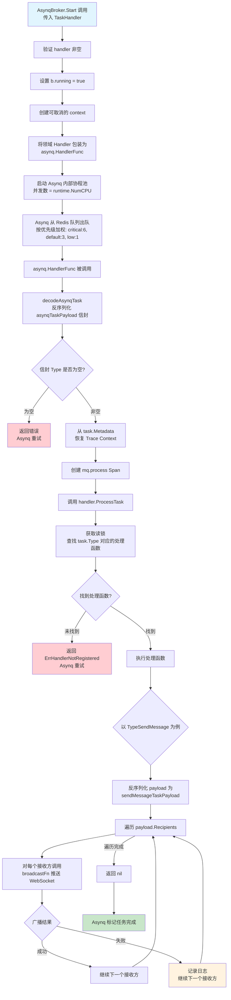
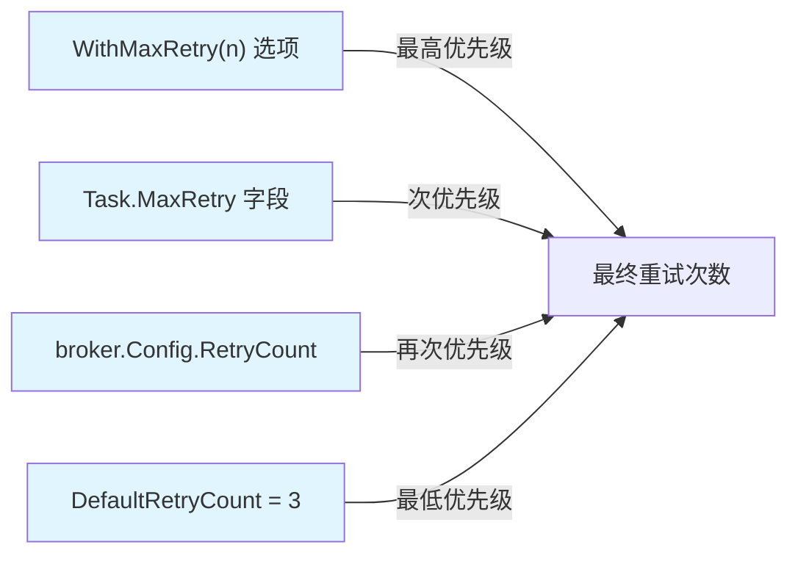
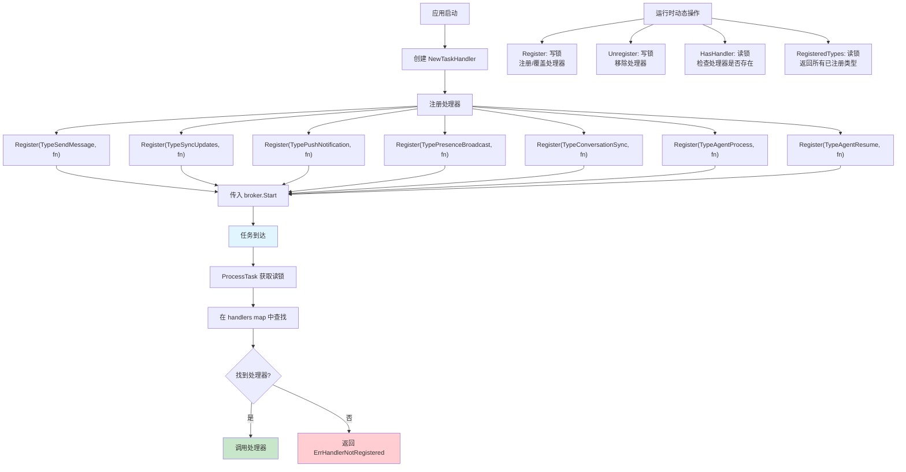
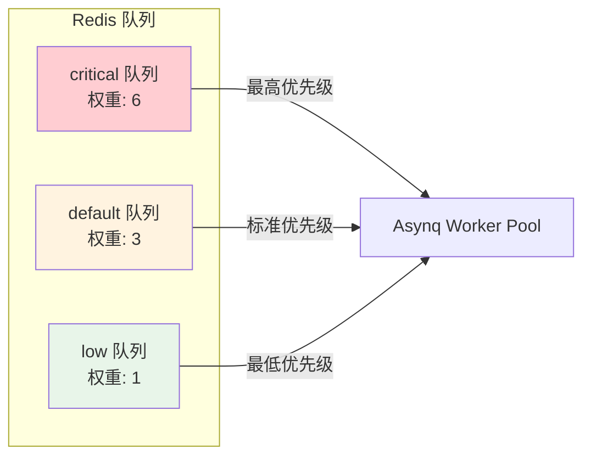

# 消息队列业务流程详解

本文档详细描述 Xyncra Server 消息队列子系统的**内部实现细节**，基于 Asynq（Redis）实现的异步任务队列，负责消息广播、Agent 执行等异步任务处理。

> **与 [mq-async.md](./mq-async.md) 的关系**：`mq-async.md` 从**业务场景**角度描述 MQ 的端到端流程（包括 Agent 任务处理、HITL 恢复、BroadcastHelper 等）。本文档聚焦于 MQ **子系统内部**的机制（入队流程、消费流程、重试机制、优雅关闭、任务路由）。两者互补而非重复。

## 目录

- [1. 消息入队流程](#1-消息入队流程)
- [2. 消息消费流程](#2-消息消费流程)
- [3. 重试机制](#3-重试机制)
- [4. 优雅关闭流程](#4-优雅关闭流程)
- [5. 任务路由机制](#5-任务路由机制)

---

## 1. 消息入队流程

### 流程概述

业务处理器先将数据持久化到数据库，然后将 MQ 任务入队用于向接收方广播实时更新。绝大多数处理器使用 **fire-and-forget** 模式——入队失败仅记录日志，不影响客户端响应。已知的生产者包括：

| 生产者 | 任务类型 | 入队模式 |
|--------|----------|----------|
| `send_message` | `mq:send_message` + `mq:agent_process`（当对方是 Agent 时） | fire-and-forget |
| `delete_message` | `mq:send_message`（复用 sendMessageTaskPayload） | fire-and-forget |
| `mark_as_read` | `mq:send_message`（仅广播给操作用户自己的其他设备） | fire-and-forget |
| `create_conversation` | `mq:send_message` | fire-and-forget |
| `delete_conversation` | `mq:send_message` | fire-and-forget |
| `restore_conversation` | `mq:send_message` | fire-and-forget |
| `agent_resume` | `mq:agent_resume` | **同步**（入队失败直接返回错误给客户端） |

### 流程图

```mermaid
flowchart TD
    A[业务处理器完成数据库事务] --> B[获取每用户更新记录<br/>seq, payload, created_at]
    B --> C[构建 sendMessageTaskPayload<br/>包含 sendMessageRecipient 列表]
    C --> D[将 payload 序列化为 json.RawMessage]
    D --> E[创建 mq.Task<br/>Type = mq.TypeSendMessage]
    E --> F[创建 OpenTelemetry handler.broker.enqueue Span]
    F --> G[调用 broker.Enqueue]
    G --> H{检查 broker 是否关闭}
    H -->|已关闭| I[返回 ErrQueueClosed]
    H -->|未关闭| J{验证 task 非空且有 Type}
    J -->|无效| K[返回 ErrInvalidTask]
    J -->|有效| L[解析选项优先级链:<br/>With... > Task field > 默认值]
    L --> M[注入 W3C Trace Context<br/>到 task.Metadata]
    M --> N[序列化 asynqTaskPayload 信封<br/>{type, payload, metadata}]
    N --> O[构建 asynq 选项:<br/>Queue, MaxRetry, Timeout 等]
    O --> P[调用 asynq client.EnqueueContext<br/>写入 Redis]
    P --> Q{入队结果}
    Q -->|成功| R[返回 Asynq 分配的 Task ID]
    Q -->|失败| S[记录日志<br/>不影响客户端响应]

    style A fill:#e1f5fe
    style R fill:#c8e6c9
    style S fill:#fff3e0
    style I fill:#ffcdd2
    style K fill:#ffcdd2
```

### 步骤详解

| 步骤 | 说明 |
|------|------|
| 1 | 业务处理器完成数据库事务（如 `store.SendMessage`），获取每用户的更新记录（seq, payload, created_at） |
| 2 | 构建 `sendMessageTaskPayload`，包含 `[]sendMessageRecipient` 列表，每个接收方有 UserID 和对应的 Updates |
| 3 | 将 payload 序列化为 `json.RawMessage` |
| 4 | 创建 `mq.Task`，设置 `Type = mq.TypeSendMessage` |
| 5 | （仅 `send_message`）调用 `startBrokerEnqueueSpan(ctx, taskType)` 创建 OpenTelemetry `handler.broker.enqueue` Span 用于分布式追踪。其他生产者（`delete_message`、`mark_as_read`、`create_conversation`、`delete_conversation`、`restore_conversation`、`agent_resume`）直接调用 `broker.Enqueue`，不创建此 Span |
| 6 | 调用 `broker.Enqueue(ctx, task)` 进入 `AsynqBroker.Enqueue`。注意：`delete_message`、`mark_as_read`、`delete_conversation`、`restore_conversation` 使用 `context.Background()` 而非请求 context，因此 W3C Trace Context 不会传播到这些入队操作；`send_message` 和 `create_conversation` 传播请求 context |
| 7 | Enqueue 检查 broker 未关闭（`b.closed`），验证 task 非空且有 Type |
| 8 | 通过优先级链解析选项：`With...` option > Task field > broker 级默认值（默认重试次数 `DefaultRetryCount = 3`）。实现上先设置 broker 默认值（`defaultEnqueueOptions`，`maxRetry = -1` 哨兵值），再由 `applyTaskDefaults` 仅在当前值仍为默认时覆盖 Task 字段，最后应用 `With...` 函数选项。由于 `With...` 选项在 `applyTaskDefaults` 之后执行，它们始终覆盖 Task 字段 |
| 9 | 通过 `tracing.InjectTraceContext(ctx)` 注入 W3C Trace Context 到 `task.Metadata` |
| 10 | 序列化 `asynqTaskPayload` 信封（`{type, payload, metadata}`）包裹领域任务 |
| 11 | 调用 `buildAsynqOptions` 将解析后的选项转换为 `asynq.Option`（Queue, MaxRetry, Timeout, TaskID, Retention, ProcessIn, Deadline, Unique/UniqueTTL） |
| 12 | 调用 `b.client.EnqueueContext(ctx, asynqTask, aOpts...)` 写入 Redis |
| 13 | 成功时返回 Asynq 分配的 Task ID；失败时由调用方记录日志，但不传播到客户端响应 |

### 队列使用说明

所有当前生产者均使用 `QueueDefault`（weight=3）。`QueueCritical` 和 `QueueLow` 已定义权重但尚未被生产者使用，留作未来扩展。`buildAsynqOptions` 会将 `enqueueOptions` 中的所有字段转换为 `asynq.Option`（Queue, MaxRetry, Timeout, TaskID, Retention, ProcessIn, Deadline, Unique/UniqueTTL）。注意 `Deadline` 字段仅在 `buildAsynqOptions` 中处理，不在 `applyTaskDefaults` 中从 Task 字段复制。

### 边缘场景

| 场景 | 处理方式 |
|------|----------|
| **Broker 已关闭** | 如果 `b.closed == true`，Enqueue 立即返回 `ErrQueueClosed`。调用方记录日志并继续执行 |
| **Nil Task** | 返回 `ErrInvalidTask` |
| **空 Task Type** | 返回 `ErrInvalidTask`，附带消息 `'type is required'` |
| **JSON 序列化失败** | 如果 `asynqTaskPayload` 信封序列化失败，返回包装错误。调用方记录日志但不使请求失败 |
| **Redis 不可用** | `b.client.EnqueueContext` 返回错误。由于是 fire-and-forget，调用方以 Info 级别记录日志，消息已持久化到数据库（下次 pull 时通过 `sync_updates` 投递） |
| **重复 TaskID** | 如果使用 `WithTaskID` 且同 ID 任务已存在（pending 状态），Asynq 会拒绝。`send_message` 通常不设置显式 TaskID |
| **Trace Context 注入失败** | 如果 context 中没有 Span，`InjectTraceContext` 返回空 map；代码通过设置 metadata 为 nil 来省略 JSON 字段 |
| **目标用户不存在** | `create_conversation` 不验证目标 `user_id` 是否存在于系统中——可以与不存在的用户创建会话。这是已知的简化设计（无 auth，内部部署），后续可通过用户注册表校验扩展 |
| **Agent 任务入队** | `send_message` 在检测到对方是已注册 Agent 时，额外入队 `TypeAgentProcess` 任务（`WithMaxRetry(20)`，fire-and-forget）。`agent_resume` 在所有 HITL 问题回答完毕后入队 `TypeAgentResume` 任务（默认重试次数，**同步入队**——失败直接返回错误给客户端）。详见 [mq-async.md](./mq-async.md) |

---

## 2. 消息消费流程

### 流程概述

Asynq 工作池从 Redis 队列中取出任务，解码 payload 信封，恢复 trace context，然后分发到已注册的对应任务类型处理器。`TaskHandler` 根据任务类型字符串路由到对应的处理函数。

### 流程图



### 步骤详解

| 步骤 | 说明 |
|------|------|
| 1 | `AsynqBroker.Start(ctx, handler)` 被调用，传入一个已注册各任务类型处理器的 `TaskHandler` |
| 2 | Start 验证 handler 非空，设置 `b.running = true`，创建从调用方 context 派生的可取消 context |
| 3 | 将领域 Handler 包装为 `asynq.HandlerFunc`，该包装器：(a) 调用 `decodeAsynqTask` 反序列化信封，(b) 通过 `tracing.ExtractTraceContext` 恢复 trace context，(c) 创建 `mq.process` Span，(d) 委托给 `handler.ProcessTask(ctx, task)` |
| 4 | 调用 `b.server.Start(asynqHandler)` 启动 Asynq 内部协程池（并发数来自配置，默认为 `runtime.NumCPU()`） |
| 5 | Asynq 按优先级加权从 Redis 队列出队：`critical:6`，`default:3`，`low:1` |
| 6 | `asynq.HandlerFunc` 被调用，`decodeAsynqTask` 验证信封的 Type 字段非空 |
| 7 | `TaskHandler.ProcessTask` 获取读锁，在 handlers map 中查找 `task.Type`，调用注册的函数 |
| 8 | 对于 `TypeSendMessage`，注册的处理器 `NewSendMessageTaskHandler`：(a) 反序列化 payload 为 `sendMessageTaskPayload`，(b) 遍历 `payload.Recipients`，(c) 对每个接收方调用 `broadcastFn(userID, updates)` 通过 WebSocket 推送，(d) 始终返回 nil（不触发 Asynq 重试——数据已持久化，离线用户通过 `sync_updates` 补偿）。注意：`TypeAgentProcess` 和 `TypeAgentResume` 的处理器会根据错误类型选择性返回 error 触发 Asynq 重试（详见 [mq-async.md](./mq-async.md)） |
| 9 | 成功时 Asynq 标记任务完成；处理器返回错误时 Asynq 应用重试策略 |

### 边缘场景

| 场景 | 处理方式 |
|------|----------|
| **未注册的处理器** | `TaskHandler.ProcessTask` 返回 `ErrHandlerNotRegistered`。Asynq 视为失败并重试（最多 MaxRetry 次），之后归档 |
| **格式错误的 payload 信封** | `decodeAsynqTask` 在 JSON 无效或 Type 为空时返回错误，传播到 Asynq 作为任务失败并触发重试。注意：这与"无效的 task payload JSON"（见下文）是不同的错误路径——信封解码错误由 Asynq 包装器返回 error，而 payload 反序列化错误由业务处理器内部处理 |
| **ProcessTask 中的 nil Task** | 返回 `ErrInvalidTask` |
| **单个接收方广播失败** | `send_message` 处理器记录错误并继续处理下一个接收方。返回 nil（不重试），因为数据已持久化，下次 pull 时通过 `sync_updates` 投递 |
| **无效的 task payload JSON** | `send_message` 处理器内部 `json.Unmarshal` 失败时记录错误并返回 nil（不触发 Asynq 重试），因为重试无法修复格式错误的 JSON。注意：这与信封解码错误不同——信封错误由 `decodeAsynqTask` 返回 error，会触发 Asynq 重试 |
| **空接收方列表** | 处理器遍历零次并返回 nil |
| **并发处理器注册** | `TaskHandler` 使用 `sync.RWMutex`；`Register` 获取写锁，`ProcessTask` 获取读锁。覆盖已有处理器时记录警告日志 |
| **多次调用 Start** | 如果 `b.running` 已为 true，返回错误 `'server is already running'` |
| **处理器 panic** | Asynq 从处理器 panic 中恢复，并将其视为任务失败进行重试 |

---

## 3. 重试机制

### 流程概述

系统存在多个独立的重试系统，横跨服务端和客户端：

1. **Asynq 内置任务重试**（服务端，`internal/mq`）— 用于 MQ 任务失败后的自动重试
2. **客户端 `ResponseRetryQueue`**（客户端，`pkg/client`）— 用于 WebSocket 投递失败的内存重试
3. **客户端 `QueueStore` / `retryManager`**（客户端，`pkg/client`）— 基于数据库的持久化重试，用于长生命周期的重试

### 流程图



```mermaid
flowchart TD
    subgraph "Asynq 任务重试（服务端）"
        A1[处理器返回非 nil 错误] --> A2[Asynq 递增重试计数]
        A2 --> A3{检查重试次数}
        A3 -->|未耗尽| A4[按指数退避等待]
        A4 --> A5[重新出队执行]
        A5 --> A6{执行结果}
        A6 -->|成功| A7[标记完成]
        A6 -->|失败| A1
        A3 -->|已耗尽| A8[任务状态变为 Archived]
        A8 --> A9[保留在 Redis 中供检查]
    end

    subgraph "WebSocket 投递重试（客户端）"
        B1[WebSocket 发送失败] --> B2[响应入队 ResponseRetryQueue]
        B2 --> B3[Drain: 取出 nextRetry <= now 的条目]
        B3 --> B4[通过 EnqueueWithBackoff 重新入队]
        B4 --> B5[指数退避:<br/>baseDelay * 2^attempts<br/>上限 16 秒]
        B5 --> B6{队列是否已满?}
        B6 -->|是| B7[丢弃最旧条目]
        B6 -->|否| B8[保留在队列中]
    end

    subgraph "数据库持久化重试（客户端）"
        C1[RetryTask 持久化<br/>status = pending] --> C2[ListPending 查询:<br/>status = pending<br/>AND next_retry <= now]
        C2 --> C3[按 next_retry 升序排列]
        C3 --> C4[处理任务]
        C4 --> C5{处理结果}
        C5 -->|成功| C6[更新完成]
        C5 -->|需要重试| C7[Update: 更新尝试次数<br/>和下次重试时间]
        C5 -->|永久失败| C8[MarkFailed:<br/>status = failed]
        C7 --> C2
    end

    style A7 fill:#c8e6c9
    style A8 fill:#ffcdd2
    style B7 fill:#fff3e0
    style C6 fill:#c8e6c9
    style C8 fill:#ffcdd2
```

### 重试优先级链

Asynq 任务的最大重试次数通过以下优先级链确定：



### 步骤详解

#### Asynq 任务重试（服务端）

| 步骤 | 说明 |
|------|------|
| 1 | 处理器返回非 nil 错误时，Asynq 递增任务的重试计数 |
| 2 | 最大重试次数由优先级链决定：`WithMaxRetry(n)` > `Task.MaxRetry` > `broker.Config.RetryCount` > `DefaultRetryCount = 3` |
| 3 | Asynq 使用内置的指数退避算法在重试之间等待 |
| 4 | 重试耗尽后，任务状态变为 `TaskStateArchived`，保留在 Redis 中供检查 |
| 5 | `GetTaskState(ctx, taskID)` 可通过扫描所有队列查询当前状态 |
| 6 | Agent 处理任务显式设置 `WithMaxRetry(20)`，提供更高的容错能力 |

#### WebSocket 投递重试（客户端）

| 步骤 | 说明 |
|------|------|
| 1 | WebSocket 发送失败时，响应入队到 `ResponseRetryQueue` |
| 2 | `Drain(now)` 返回所有 `nextRetry <= now` 且未超过 `maxRetry` 的条目 |
| 3 | 调用方（`client.go` 的重试循环）在调用 `EnqueueWithBackoff` 前检查 `entry.attempts < entry.maxRetry`，超过则丢弃 |
| 4 | 失败条目通过 `EnqueueWithBackoff` 重新入队，使用指数退避：`baseDelay * 2^attempts`（`baseDelay = 1 秒`），上限 16 秒（`maxBackoff`）。注意：此队列不使用随机抖动 |
| 5 | 队列满时（`maxSize`），最旧的条目被丢弃 |

#### 数据库持久化重试（客户端）

| 步骤 | 说明 |
|------|------|
| 1 | `RetryTask` 以 `status = 'pending'` 和 `NextRetry` 时间戳持久化 |
| 2 | `ListPending(ctx, limit)` 查询 `status = 'pending' AND next_retry <= now`，按最早重试时间排序 |
| 3 | 下次重试时间通过 `backoffDelay` 计算：`baseDelay * 2^(attempt-1)`，上限 16 秒，并附加 +/-25% 随机抖动以避免惊群效应 |
| 4 | 处理后，`Update` 保存新的尝试次数和下次重试时间，或 `MarkFailed` 设置 `status = 'failed'` |
| 5 | 提供持久化重试能力，可在进程重启后继续执行 |

### 边缘场景

| 场景 | 处理方式 |
|------|----------|
| **Asynq 默认重试次数覆盖** | Asynq 内置默认值为 25。Xyncra 在 broker 级别覆盖为 `DefaultRetryCount = 3`。单个任务可通过 `WithMaxRetry` 进一步覆盖 |
| **RetryUseBrokerDefault 哨兵值** | `maxRetry = -1`（哨兵值 `retryUseBrokerDefault`）表示使用 broker 配置的 `RetryCount`。仅当该值也未设置时才回退到 `DefaultRetryCount` |
| **WithMaxRetry(0)** | 完全禁用重试 -- 任务执行一次，失败后直接归档 |
| **归档任务检查** | 归档的任务保留在 Redis 中，可通过 `GetTaskState` 查询，但不会自动重新入队 |
| **QueueStore 过期任务** | 如果 worker 在 `ListPending` 和 `Update`/`MarkFailed` 之间崩溃，任务将在下一次轮询周期被重新拾取（至少一次投递） |
| **ResponseRetryQueue 溢出** | 队列超过 `maxSize` 时，最旧的条目被静默丢弃（Info 级别日志）。这是一个有损缓冲区 |
| **退避上限** | 客户端重试退避上限为 16 秒（`maxBackoff`）。Asynq 的退避由库内部管理 |
| **退避抖动** | 数据库持久化重试（`retryManager`）使用 `backoffDelay` 函数，附加 +/-25% 随机抖动以避免惊群效应。WebSocket 投递重试（`ResponseRetryQueue`）不使用抖动 |

---

## 4. 优雅关闭流程

### 流程概述

Broker 支持协调式优雅关闭，通过 `Stop`（`Broker` 接口方法）和 `Close`（`AsynqBroker` 实现方法）两个方法实现。`Stop` 通知 worker 排空正在处理的任务；`Close` 等待完成并释放所有资源。

### 流程图

```mermaid
flowchart TD
    A[调用 Stop] --> B[获取 cancelMu 锁]
    B --> C[调用 b.cancel()<br/>取消派生的 context]
    C --> D[Start 中 <-ctx.Done 解除阻塞]
    D --> E[调用 b.server.Shutdown]
    E --> F[Asynq 停止接受新任务<br/>等待正在处理的任务完成]
    F --> G[设置 b.running = false]
    G --> H[关闭 b.done channel]

    I[调用 Close] --> J[通过 sync.Once 确保仅执行一次]
    J --> K[设置 b.closed = true<br/>后续 Enqueue 立即返回 ErrQueueClosed]
    K --> L[获取 cancelMu 锁]
    L --> M[调用 b.cancel()<br/>幂等操作]
    M --> N{broker 是否在运行?}
    N -->|是| O[等待 <-done<br/>确保 Start 完全返回]
    N -->|否| P[跳过等待]
    O --> Q[调用 b.client.Close]
    P --> Q
    Q --> R[调用 b.inspector.Close<br/>释放 Redis 连接]
    R --> S[返回 error 或 nil]

    style A fill:#e1f5fe
    style I fill:#e1f5fe
    style S fill:#c8e6c9
```

### 步骤详解

| 步骤 | 说明 |
|------|------|
| 1 | `Stop()` 获取 `cancelMu` 锁，调用 `b.cancel()` 取消 Start 使用的派生 context |
| 2 | Start 中 `<-ctx.Done()` 解除阻塞，调用 `b.server.Shutdown()` 通知 Asynq 停止接受新任务并等待正在处理的任务完成 |
| 3 | Start 设置 `b.running = false`，关闭 `b.done` channel |
| 4 | `Close()` 通过 `closeOnce.Do` 确保多次调用安全 -- 仅第一次执行清理 |
| 5 | 首先设置 `b.closed = true`，后续 Enqueue/GetTaskState 立即返回 `ErrQueueClosed` |
| 6 | 获取 `cancelMu` 锁，调用 `b.cancel()`（如果 Stop 已调用则幂等） |
| 7 | 如果 broker 正在运行（`b.running && b.done != nil`），`Close` 等待 `<-done` 确保 Start 已完全返回 |
| 8 | `Close` 调用 `b.client.Close()` 和 `b.inspector.Close()` 释放 Redis 连接 |
| 9 | `Close` 返回 error（如果有关闭错误则通过 `errors.Join` 合并多个错误） |

### 边缘场景

| 场景 | 处理方式 |
|------|----------|
| **Start 前调用 Close** | Close 设置 `b.closed = true` 并取消 context（无 cancel func 则为空操作）。Client 和 inspector 被关闭。后续 Start 会失败，因为底层 Asynq 组件已关闭 |
| **重复 Close** | 由于 `sync.Once` 安全。仅第一次调用执行清理 |
| **关闭期间 Enqueue** | `Enqueue` 中 `b.mu` 锁仅保护 `b.closed` 检查，释放锁后到调用 `b.client.EnqueueContext` 之间存在竞态窗口。如果 Close 在此窗口内设置 `b.closed = true` 并关闭底层 client，入队可能返回连接错误。由于是 fire-and-forget，调用方仅记录日志 |
| **无 Stop/Close 的 Start** | Start 在 `<-ctx.Done()` 上永久阻塞。调用方必须取消 context 或调用 Stop/Close，否则 goroutine 泄漏 |
| **部分构造的资源泄漏** | `NewAsynqBroker` 文档说明：如果 client 成功但 server/inspector 构造失败，client 不会被关闭。这是可接受的，因为这些构造函数不执行网络 I/O |

---

## 5. 任务路由机制

### 流程概述

`TaskHandler` 作为调度器，将任务类型字符串（如 `mq:send_message`、`mq:agent_process`）映射到处理函数。支持运行时动态注册和注销。

### 流程图



### 任务类型注册表

| 任务类型 | 说明 | 处理器 | 状态 |
|---------|------|--------|------|
| `mq:send_message` | 广播实时 Updates 给接收方在线设备 | `NewSendMessageTaskHandler` | 已实现 |
| `mq:agent_process` | Agent AI 处理（LLM 调用 + 流式输出 + 持久化） | `NewAgentTaskHandler`（`internal/agent/task_handler.go`） | 已实现 |
| `mq:agent_resume` | HITL 恢复后继续 Agent 执行 | `NewAgentResumeHandler`（`internal/agent/resume_handler.go`） | 已实现 |
| `mq:sync_updates` | 更新 fan-out（预留） | — | 未注册 handler |
| `mq:push_notification` | 推送通知（预留） | — | 未注册 handler |
| `mq:presence_broadcast` | 在线状态广播（预留） | — | 未注册 handler |
| `mq:conversation_sync` | 会话同步（预留） | — | 未注册 handler |

> Agent 处理器的详细业务逻辑（锁获取、幂等检测、LLM 调用、HITL 中断等）详见 [mq-async.md](./mq-async.md) 场景 2 和场景 3。

### 步骤详解

| 步骤 | 说明 |
|------|------|
| 1 | 应用启动时创建 `NewTaskHandler()` |
| 2 | 通过 `th.Register(taskType, fn)` 为每种任务类型注册处理器 |
| 3 | 将 `TaskHandler` 传入 `broker.Start(ctx, th)` |
| 4 | 任务到达时，`ProcessTask` 获取读锁，按 `task.Type` 查找处理器并调用 |
| 5 | `HasHandler(taskType)` 允许在分发前检查处理器是否存在 |
| 6 | `RegisteredTypes()` 返回所有已注册的任务类型用于内省 |

### 边缘场景

| 场景 | 处理方式 |
|------|----------|
| **重复注册** | 覆盖已有处理器并记录警告日志。返回 false 表示发生了覆盖 |
| **注销不存在的处理器** | 空操作（静默） |
| **处理期间替换处理器** | 由于 `ProcessTask` 持有读锁而 `Register` 持有写锁，替换不会在分发过程中发生。下一次分发将使用新处理器 |
| **未知任务类型** | 返回 `ErrHandlerNotRegistered`，Asynq 视为可重试失败 |
| **零值 TaskHandler** | 不可用（nil map）。必须使用 `NewTaskHandler()` 创建 |

---

## 队列优先级配置



| 队列 | 权重 | 用途 |
|------|------|------|
| `critical` | 6 | 时间敏感任务（预留，当前未使用） |
| `default` | 3 | 标准优先级任务（所有当前业务任务均使用此队列） |
| `low` | 1 | 后台任务（预留，当前未使用） |

---

## 默认常量

| 常量 | 值 | 说明 |
|------|------|------|
| `DefaultRetryCount` | 3 | 未指定 MaxRetry 时的默认最大重试次数（覆盖 Asynq 内置默认值 25） |
| `DefaultUniqueTTL` | 5 分钟 | 使用 `WithUnique` 去重时的默认锁 TTL |
| `retryUseBrokerDefault` | -1 | 哨兵值，表示使用 broker 配置的 RetryCount |

---

## 相关文档

- [消息队列与异步任务处理](./mq-async.md) — MQ 业务场景端到端流程（Agent 任务、HITL 恢复、BroadcastHelper、Trace 传播等）
- [业务流程索引](./index.md)
- [系统架构概览](../architecture/system-architecture.md)
- [协议设计](../architecture/protocol-design.md)
- [数据流](../architecture/data-flow.md)
