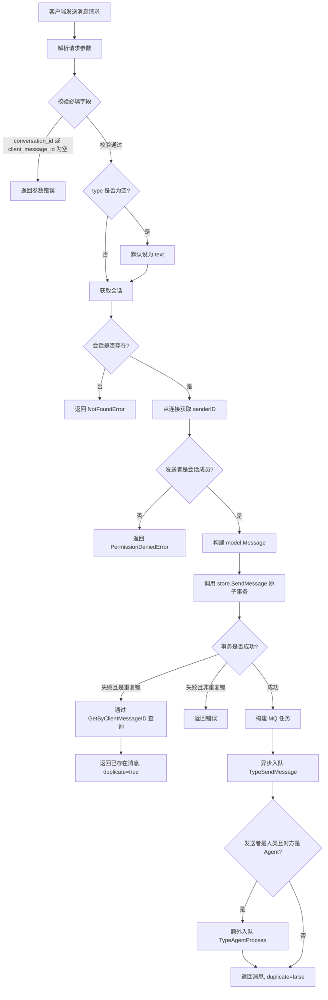
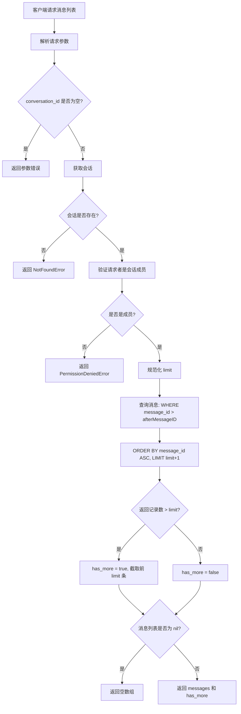
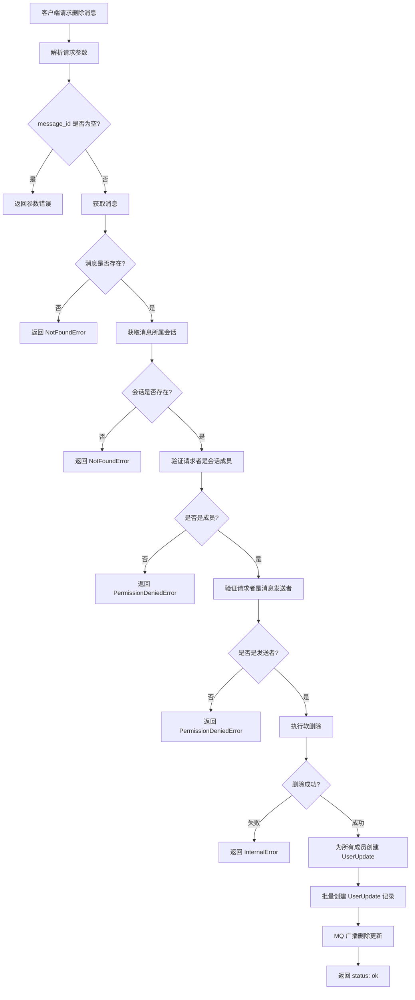
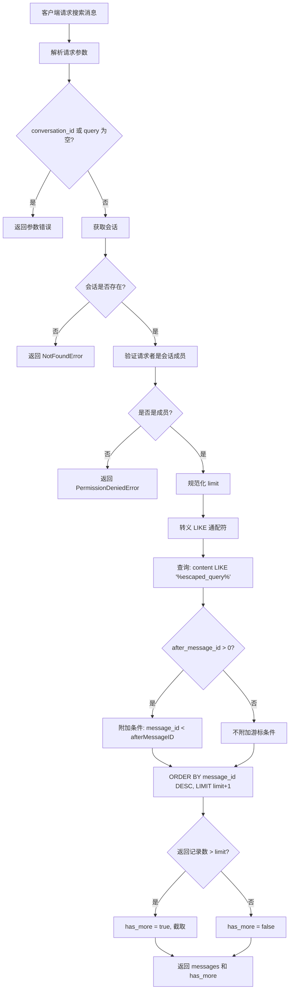
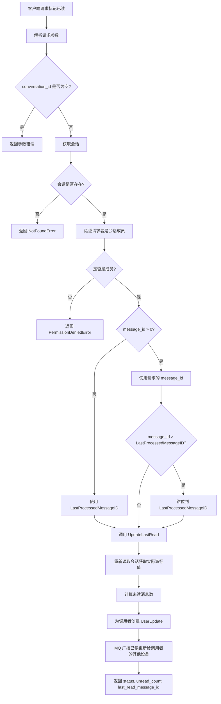
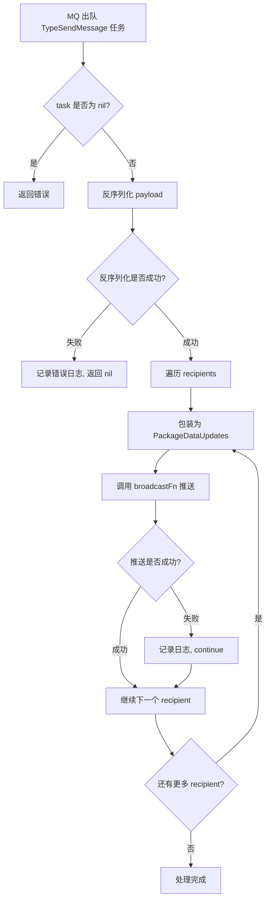
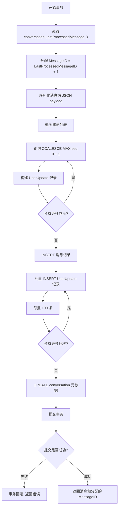
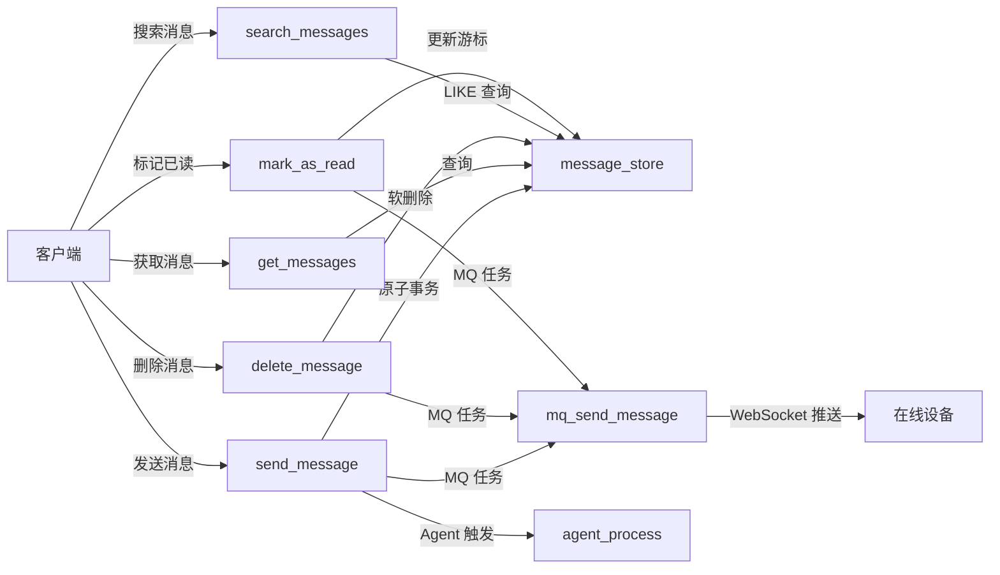

# 消息处理业务流程

本文档描述 Xyncra 消息模块的核心业务流程，包括消息发送、获取、删除、搜索、已读标记等操作的详细流程和边缘场景处理。

## 目录

- [发送消息 (send_message)](#发送消息-send_message)
- [获取消息列表 (get_messages)](#获取消息列表-get_messages)
- [删除消息 (delete_message)](#删除消息-delete_message)
- [搜索消息 (search_messages)](#搜索消息-search_messages)
- [标记已读 (mark_as_read)](#标记已读-mark_as_read)
- [MQ 消息推送 (mq_send_message)](#mq-消息推送-mq_send_message)
- [消息存储事务 (message_store_send_message_transaction)](#消息存储事务-message_store_send_message_transaction)

---

## 发送消息 (send_message)

### 概述

客户端发送一条消息到指定会话。Handler 验证参数和成员身份后，在单个数据库事务中原子地分配 MessageID、持久化消息、为每个会话成员创建 UserUpdate 扇出记录、更新会话元数据。随后通过 MQ 异步推送实时更新给所有成员的在线设备。若接收方是注册的 Agent，还会额外触发一个 agent_process MQ 任务。

### 流程图

### 详细步骤

1. **解析请求参数**：提取 `conversation_id`、`client_message_id`、`content`、`type`、`reply_to`（引用回复的目标消息 ID）
2. **校验必填字段**：`conversation_id` 和 `client_message_id` 不能为空，`content` 允许为空（D-091：空内容由 Agent 层返回用户友好错误）
3. **默认类型**：若 `type` 为空，默认设为 `text`
4. **获取会话**：验证会话存在性
5. **身份验证**：从 client 连接获取 `senderID`，验证发送者是会话成员
6. **构建消息对象**：`MessageID` 留空由事务内分配，`Status` 设为 `sent`，`ID` 由 handler 生成 UUID v4
7. **原子事务**：调用 `store.SendMessage`
   - 读取 `conversation.LastProcessedMessageID`
   - 分配 `MessageID = LastProcessedMessageID + 1`
   - 序列化消息作为 UserUpdate payload
   - 为每个成员分配 per-user seq (`COALESCE(MAX(seq), 0) + 1`)
   - 创建 UserUpdate 记录
   - INSERT 消息记录
   - 批量 INSERT UserUpdate 记录 (每批 100 条)
   - UPDATE conversation 的 `last_message_at` 和 `last_processed_message_id`
8. **MQ 推送**：构建 `TypeSendMessage` 任务，包含每个 recipient 的 seq 和 payload，异步入队
9. **Agent 触发**：若发送者是人类且对方是注册的 Agent，额外入队 `TypeAgentProcess` MQ 任务 (带 `MaxRetry=20`)。payload 包含 `message_id`、`conversation_id`、`agent_id`、`sender_id`、`device_id`（D-102：设备路由）
10. **返回结果**：返回消息和 `duplicate=false`

### 边缘场景

| 场景 | 处理方式 |
|------|----------|
| **幂等性** | `client_message_id + sender_id` 有唯一索引，重复插入触发 `ErrDuplicateKey`，handler 通过 `GetByClientMessageID` 查找已存在的消息并返回 `duplicate=true`，避免 TOCTOU 竞态 |
| **空 content** | 允许发送空内容消息，由 Agent 层返回用户友好的错误 |
| **会话不存在** | 返回 `NotFoundError` |
| **非成员发送** | 返回 `PermissionDeniedError` |
| **MQ 入队失败** | 日志记录但不影响主流程，消息已持久化，客户端可通过 `sync_updates` 拉取 |
| **Agent MQ 入队失败** | 同上，fire-and-forget 模式 |
| **Agent 触发仅限 1-on-1** | `peerUserID` 仅支持双人会话（`UserID1`/`UserID2`），群聊场景下 `peerID` 为空，不会触发 Agent |
| **成员数上限** | store 层限制最多 500 个成员 (`maxSendMessageUpdates`) |
| **并发发送** | 事务内读取 `LastProcessedMessageID` 保证 MessageID 分配原子性，消除 TOCTOU 竞态 |

---

## 获取消息列表 (get_messages)

### 概述

客户端按会话分页获取消息列表。使用基于 MessageID 的游标分页 (`after_message_id`)，消息按 MessageID 升序返回。采用 `limit+1` 探测技术判断是否还有更多数据。

### 流程图

### 详细步骤

1. **解析请求参数**：提取 `conversation_id`、`after_message_id`、`limit`
2. **校验必填字段**：`conversation_id` 不能为空
3. **获取会话**：验证存在性
4. **身份验证**：验证请求者是会话成员
5. **规范化 limit**：默认 50，上限 200
6. **查询消息**：`conversation_id = X AND message_id > afterMessageID`，按 `message_id ASC` 排序，`LIMIT limit+1`
7. **判断分页**：若返回记录数 > limit，`has_more = true`，截取前 limit 条
8. **返回结果**：返回 `{messages, has_more}`

### 边缘场景

| 场景 | 处理方式 |
|------|----------|
| **会话不存在** | 返回 `NotFoundError` |
| **非成员访问** | 返回 `PermissionDeniedError` |
| **limit 非法值** | <=0 或 >200 时重置为 50 |
| **after_message_id = 0** | 从第一条消息开始获取 |
| **无消息** | 返回空数组而非 null |
| **软删除消息** | GORM 软删除插件自动排除 `deleted_at` 非空的记录 |

---

## 删除消息 (delete_message)

### 概述

消息发送者软删除自己发送的一条消息。软删除后为所有会话成员创建 UserUpdate 记录 (`delete_message` 类型)，并通过 MQ 异步广播给所有成员的在线设备。

### 流程图

### 详细步骤

1. **解析请求参数**：提取 `message_id`
2. **校验必填字段**：`message_id` 不能为空
3. **获取消息**：通过 ID 获取消息并验证存在性
4. **获取会话**：验证消息所属会话存在性
5. **身份验证**：验证请求者是会话成员
6. **权限验证**：验证请求者是消息发送者 (只有发送者可删除)
7. **执行软删除**：调用 `MessageStore.Delete` 设置 `deleted_at`
8. **创建 UserUpdate**：为所有会话成员创建 `UpdateTypeDeleteMessage` 类型的 UserUpdate，payload 包含 `message_id`、`conversation_id`、`message_id_seq`
9. **批量持久化**：批量创建 UserUpdate 记录
10. **MQ 广播**：广播删除更新给所有成员 (fire-and-forget)
11. **返回结果**：返回 `{status: ok}`

### 边缘场景

| 场景 | 处理方式 |
|------|----------|
| **消息不存在** | 返回 `NotFoundError` |
| **会话不存在** | 返回 `NotFoundError` |
| **非成员操作** | 返回 `PermissionDeniedError` |
| **非发送者删除** | 返回 `PermissionDeniedError` (only the sender can delete this message) |
| **重复删除** | store 层 `RowsAffected=0` 返回 `ErrNotFound`，handler 将其包装为 `InternalError` 返回给客户端 |
| **UserUpdate 创建失败** | 日志记录但不影响主流程，消息已软删除 |
| **MQ 广播失败** | 日志记录但不影响数据完整性，客户端可通过 `sync_updates` 拉取 |
| **GetLatestSeq 失败** | 跳过该成员的 UserUpdate 创建，记录错误日志 |

---

## 搜索消息 (search_messages)

### 概述

在指定会话中按内容子串搜索消息。使用 SQL LIKE 进行模糊匹配，结果按 MessageID 降序返回 (最新优先)。支持基于 `after_message_id` 的游标分页。

### 流程图

### 详细步骤

1. **解析请求参数**：提取 `conversation_id`、`query`、`after_message_id`、`limit`
2. **校验必填字段**：`conversation_id` 和 `query` 不能为空
3. **获取会话**：验证存在性
4. **身份验证**：验证请求者是会话成员
5. **规范化 limit**：默认 50，上限 200
6. **执行搜索**：调用 `MessageStore.SearchByConversation`
   - 查询条件：`conversation_id = X AND content LIKE '%escaped_query%' ESCAPE '|'`
   - 使用 `escapeLikePattern` 对用户输入中的 `%`、`_`、`|` 字符进行转义
   - 若 `after_message_id > 0`，附加 `message_id < afterMessageID`
   - 按 `message_id DESC` 排序
   - `LIMIT limit+1`
7. **判断分页**：判断 `has_more`，截取结果
8. **返回结果**：返回 `{messages, has_more}`

### 边缘场景

| 场景 | 处理方式 |
|------|----------|
| **空 query** | store 层直接返回空数组，不执行查询 |
| **LIKE 通配符注入** | 使用 `escapeLikePattern` 对用户输入中的 `%`、`_`、pipe 字符进行转义，配合 SQL `ESCAPE` 子句 |
| **会话不存在** | 返回 `NotFoundError` |
| **非成员访问** | 返回 `PermissionDeniedError` |
| **limit 非法值** | handler 层 <=0 或 >200 时重置为 50；store 层独立校验 <=0 或 >201 时重置为 50（防御性编程） |
| **无匹配结果** | 返回空数组 |
| **after_message_id = 0** | 不附加游标条件，从最新消息开始 |
| **游标方向** | 降序分页，`after_message_id` 表示比此 ID 更旧的消息 |

---

## 标记已读 (mark_as_read)

### 概述

更新调用者在指定会话中的已读游标位置。采用 MAX 语义：已读游标只能前进，不能后退。操作完成后计算未读数并返回。同时为调用者的其他设备创建 UserUpdate 同步已读状态。

### 流程图

### 详细步骤

1. **解析请求参数**：提取 `conversation_id`、`message_id`
2. **校验必填字段**：`conversation_id` 不能为空
3. **获取会话**：验证存在性
4. **身份验证**：验证请求者是会话成员
5. **确定目标 messageID**：
   - 若 `params.MessageID > 0`，使用该值
   - 若为 0，使用 `conversation.LastProcessedMessageID` (标记全部已读)
6. **钳位处理**：若 `messageID > LastProcessedMessageID`，设为 `LastProcessedMessageID`
7. **更新已读游标**：调用 `ConversationStore.UpdateLastRead`，MAX 语义由 store 层 SQL `CASE WHEN` 表达式保证（`CASE WHEN 当前值 > 新值 THEN 当前值 ELSE 新值 END`，兼容 SQLite/PostgreSQL/MySQL）
8. **重新读取会话**：获取实际游标值 (可能与请求值不同，因 MAX 语义)
9. **计算未读数**：通过实际游标计算未读消息数 (`CountUnread`)
10. **创建 UserUpdate**：为调用者创建 `UpdateTypeMarkRead` 类型的 UserUpdate
11. **MQ 广播**：广播已读更新给调用者的其他设备 (fire-and-forget)
12. **返回结果**：返回 `{status, unread_count, last_read_message_id}`

### 边缘场景

| 场景 | 处理方式 |
|------|----------|
| **会话不存在** | 返回 `NotFoundError` |
| **非成员操作** | 返回 `PermissionDeniedError` |
| **message_id = 0** | 等价于全部标记已读，使用 `LastProcessedMessageID` |
| **message_id > LastProcessedMessageID** | 被钳位到 `LastProcessedMessageID` |
| **后退请求** | store 层 MAX 语义保证游标不会后退，实际游标值可能大于请求值 |
| **UserUpdate 创建失败** | 日志记录但不影响主流程，游标已持久化 |
| **MQ 广播失败** | 日志记录，客户端可通过 `sync_updates` 拉取 |
| **已读游标仅同步给操作者自己的设备** | 不暴露给对方用户 |
| **GetLatestSeq 失败** | 跳过 UserUpdate 创建，记录错误日志 |
| **仅同步给操作者** | mark_read 的 UserUpdate 只创建给调用者本人，不像 delete_message 扇出给所有成员 |

---

## MQ 消息推送 (mq_send_message)

### 概述

MQ 消费端任务处理器。当 broker 出队一个 `TypeSendMessage` 任务时，将实时更新推送给每个目标用户的活跃 WebSocket 连接。这是消息发送、删除、已读标记等操作的实时推送通道。

### 流程图

### 详细步骤

1. **校验任务**：检查 task 非 nil
2. **反序列化**：将 payload 反序列化为 `sendMessageTaskPayload` (包含 recipients 数组)
3. **遍历推送**：遍历每个 recipient
   - 将 updates 包装为 `PackageDataUpdates`
   - 调用 `broadcastFn` (即 `WebSocketServer.BroadcastUpdates`) 推送给该用户
4. **错误处理**：若推送失败，记录日志并 continue (不中断其他 recipient)；用户无在线连接时 `broadcastFn` 不返回错误

### 边缘场景

| 场景 | 处理方式 |
|------|----------|
| **nil task** | 返回 error（非 nil），broker 可能重试；正常流程不应出现此情况 |
| **反序列化失败** | 记录错误日志，返回 nil (不重试，数据已持久化) |
| **单个用户推送失败** | 记录日志，继续处理其他用户，不影响数据一致性 |
| **用户不在线** | `broadcastFn` 不返回错误（本地无连接则跳过，跨节点通过 Redis Pub/Sub 投递），已持久化的数据会在用户下次 `sync_updates` 时拉取 |

---

## 消息存储事务 (message_store_send_message_transaction)

### 概述

消息存储层的 `SendMessage` 原子事务。在单个数据库事务中完成消息持久化、MessageID 分配、UserUpdate 扇出记录创建和会话元数据更新。

### 流程图

### 详细步骤

1. **开始事务**
2. **读取会话**：获取 `LastProcessedMessageID`
3. **分配 MessageID**：`MessageID = LastProcessedMessageID + 1`
4. **序列化消息**：将消息转为 JSON payload
5. **分配 seq**：为每个成员查询 `COALESCE(MAX(seq), 0) + 1`
6. **构建 UserUpdate**：为每个成员构建 UserUpdate 记录
7. **持久化消息**：INSERT 消息记录
8. **批量持久化 UserUpdate**：每批 100 条记录
9. **更新会话元数据**：UPDATE `last_message_at` 和 `last_processed_message_id`
10. **提交事务**

### 边缘场景

| 场景 | 处理方式 |
|------|----------|
| **成员数超限** | `len(memberIDs) > 500` 返回错误 |
| **事务回滚** | 任何步骤失败，整个事务回滚 |
| **并发 MessageID 分配** | 事务内 SELECT conversation 获取 `LastProcessedMessageID` 再分配，事务隔离级别保证原子性；handler 层通过 `client_message_id + sender_id` 唯一索引捕获重复键实现幂等 |
| **软删除查询** | GORM DeletedAt 插件自动在 WHERE 中排除已删除记录 |
| **Restore 操作** | `Unscoped()` 查询 + 设置 `deleted_at = nil` |
| **CountUnread 负数防御** | 结果 < 0 时强制归零 |

---

## 数据流关系图

## 关键设计决策

### 1. 原子性保证

所有写操作 (发送、删除、标记已读) 都在单个数据库事务中完成，确保数据一致性。MessageID 的分配在事务内完成，避免并发竞态。

### 2. 最终一致性

MQ 推送采用 fire-and-forget 模式，推送失败不影响主流程。客户端可通过 `sync_updates` 接口拉取最新状态，保证最终一致性。

### 3. 幂等性设计

发送消息通过 `client_message_id + sender_id` 唯一索引保证幂等性，重复请求返回已存在的消息。

### 4. 分页策略

- **消息列表**：基于 `message_id` 的游标分页，升序返回
- **搜索结果**：基于 `message_id` 的游标分页，降序返回 (最新优先)
- **分页探测**：采用 `limit+1` 技术判断是否还有更多数据

### 5. 权限控制

- 发送消息：需要是会话成员
- 删除消息：需要是消息发送者
- 标记已读：需要是会话成员
- 已读状态：仅同步给操作者自己的设备，不暴露给其他用户

---

## 相关文档

- [消息存储层接口定义](../architecture/message-store.md)
- [WebSocket 实时推送架构](../architecture/websocket.md)
- [MQ 任务处理机制](../architecture/mq.md)
- [UserUpdate 同步机制](../architecture/user-update.md)
