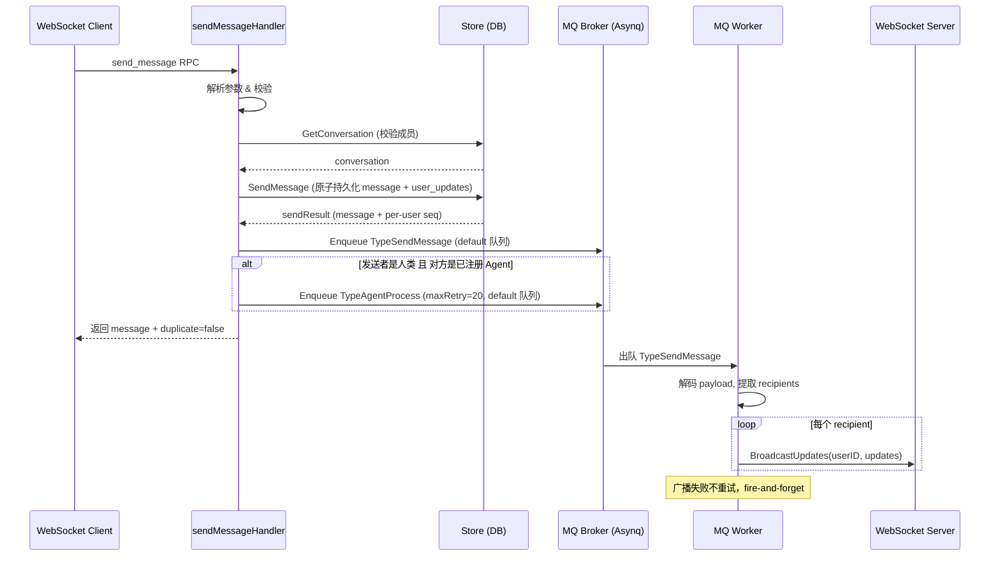
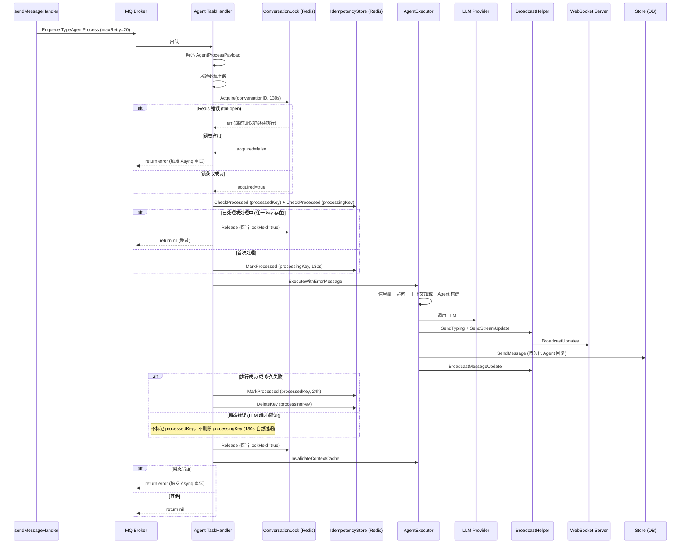
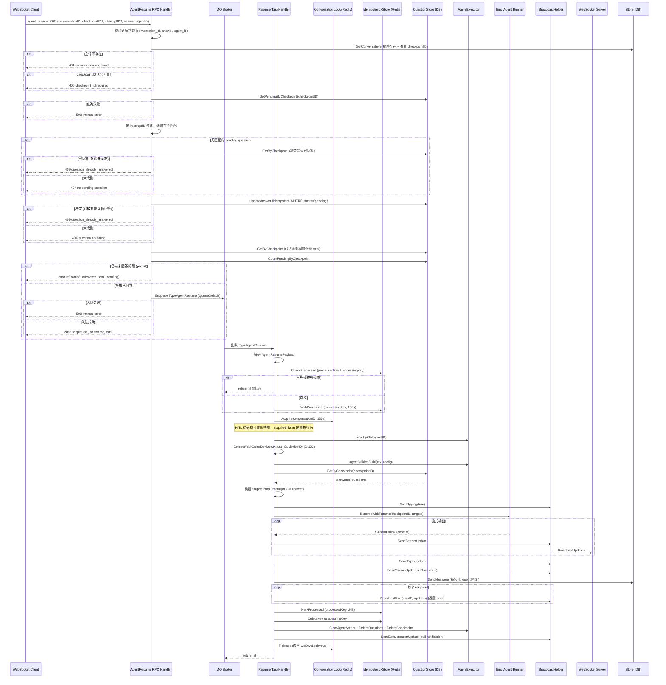
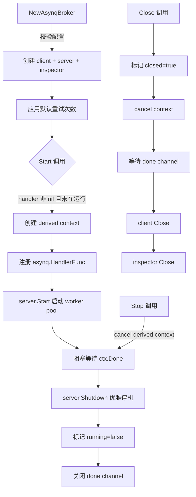
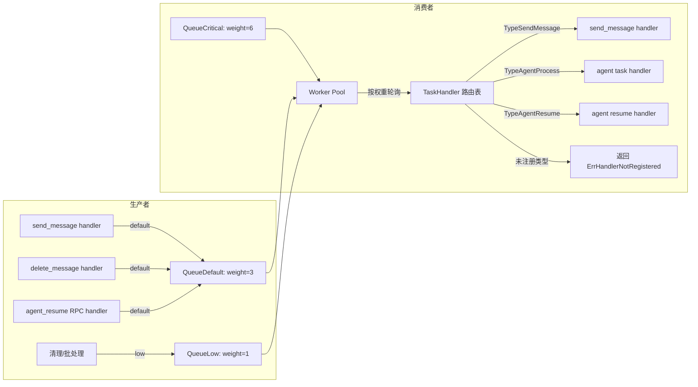
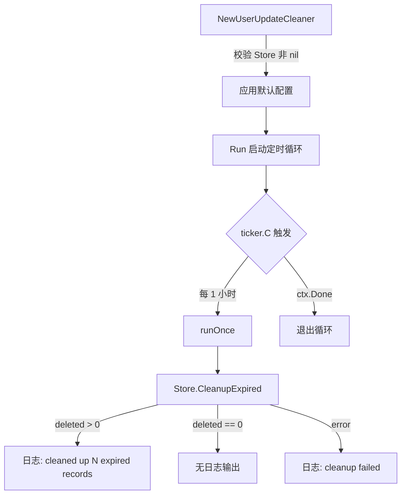
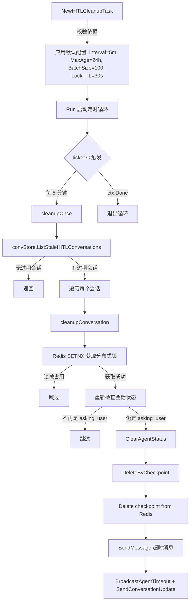
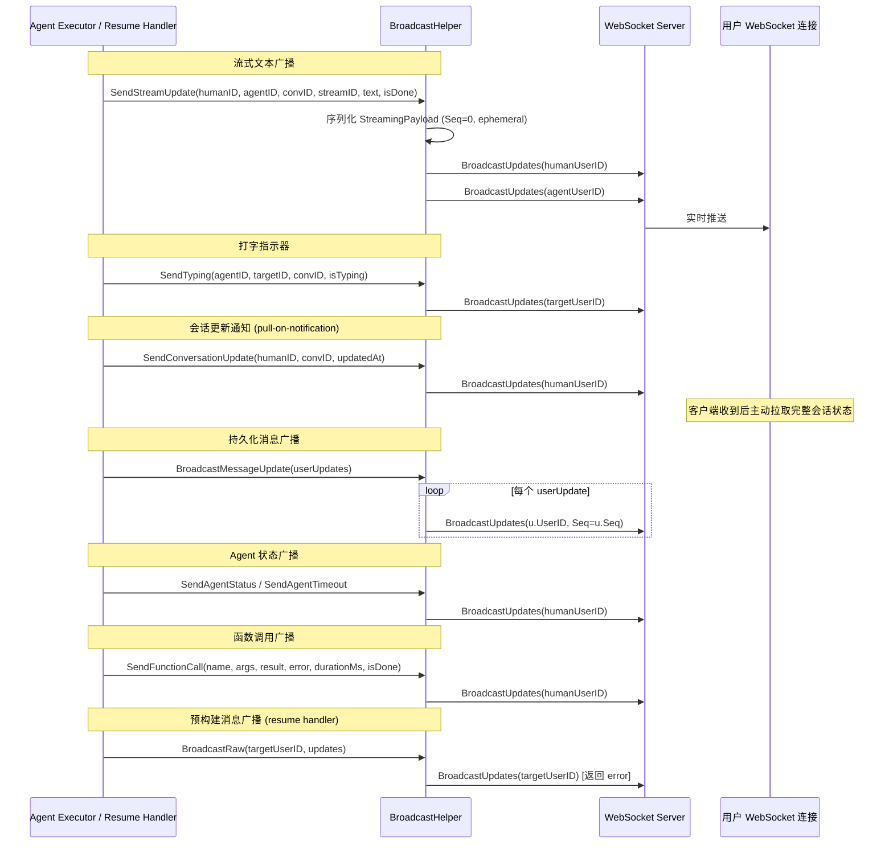

# 消息队列与异步任务处理

> 基于 Asynq (Redis) 的异步任务系统：消息广播、Agent 任务执行、HITL 恢复、清理任务。

## 场景 1: 消息发送与实时广播

### 主流程

### 边缘场景

#### 1. 幂等重复发送 (client_message_id 冲突)

- 触发条件: 客户端使用相同的 client_message_id 重复调用 send_message
- 处理逻辑: Store.SendMessage 抛出 ErrDuplicateKey，handler 捕获后查询已有消息并返回 duplicate=true
- 最终结果: 返回已存在的消息，不重复入队 MQ

#### 2. MQ 广播失败 (WebSocket 不可达)

- 触发条件: BroadcastUpdates 对某个 userID 返回 error（用户离线或连接断开）
- 处理逻辑: 记录日志，continue 处理下一个 recipient，不重试
- 最终结果: 消息已持久化，用户下次 sync_updates 时会拉取到

#### 3. MQ Enqueue 失败

- 触发条件: Redis 不可用或 Broker 已关闭
- 处理逻辑: 记录日志，不影响 RPC 返回结果，消息已持久化成功
- 最终结果: 客户端收到成功响应，但实时广播缺失，依赖后续 sync_updates 补偿

#### 4. Payload 解码失败

- 触发条件: MQ 消息体被损坏或格式不匹配
- 处理逻辑: worker 返回 nil（不重试），因为数据已持久化
- 最终结果: 该任务静默丢弃，用户通过 sync_updates 获取消息

### 其他 TypeSendMessage 生产者

除 `send_message` 外，以下 RPC handler 也通过相同的 `sendMessageTaskPayload` 结构和 `TypeSendMessage` 任务类型入队广播任务（均为 fire-and-forget 模式）。详细流程见各自文档：

| 生产者 | 广播函数 | 广播内容 |
| --- | --- | --- |
| `delete_message` | `broadcastDeleteMessageUpdates` | 消息删除更新 |
| `mark_as_read` | `broadcastMarkReadUpdate` | 已读状态更新（仅广播给操作用户自己的其他设备） |
| `create_conversation` | `broadcastCreateConversationUpdates` | 新会话创建通知 |
| `delete_conversation` | `broadcastDeleteConversationUpdates` | 会话删除通知 |
| `restore_conversation` | `broadcastRestoreConversationUpdates` | 会话恢复通知 |

以下详细描述 `delete_message` 流程作为代表示例：

#### delete_message 流程

1. 解析参数，校验 `message_id` 必填
2. 获取消息并校验存在
3. 获取会话并校验存在
4. 校验调用者是会话成员（C-3）
5. 校验调用者是消息发送者（D-014：只有发送者可删除）
6. 软删除消息（`MessageStore.Delete`）
7. 为每个会话成员创建 UserUpdate：
   - 调用 `UserUpdateStore.GetLatestSeq` 获取当前最大 seq
   - 新 seq = latestSeq + 1
   - Payload 包含 `{message_id, conversation_id, message_id_seq}`
   - 调用 `UserUpdateStore.Create` 批量创建（失败不回滚主流程）
8. 通过 `broadcastDeleteMessageUpdates` 入队 TypeSendMessage（fire-and-forget）

#### delete_message 边缘场景

- **消息不存在**: 返回 404
- **会话不存在**: 返回 404
- **非会话成员**: 返回 PermissionDenied
- **非消息发送者**: 返回 PermissionDenied（D-014）
- **UserUpdate 创建失败**: 记录日志，不回滚软删除（消息已删除，用户通过 sync_updates 可感知）
- **GetLatestSeq 失败**: 跳过该成员的 UserUpdate，记录日志，继续处理其他成员

### 涉及文件

- `internal/handler/send_message.go`: 消息持久化 + 入队 TypeSendMessage 和 TypeAgentProcess 任务
- `internal/handler/delete_message.go`: 消息软删除 + 入队 TypeSendMessage 广播删除更新
- `internal/handler/mark_as_read.go`: 已读状态更新 + 入队 TypeSendMessage
- `internal/handler/create_conversation.go`: 创建会话 + 入队 TypeSendMessage
- `internal/handler/delete_conversation.go`: 删除会话 + 入队 TypeSendMessage
- `internal/handler/restore_conversation.go`: 恢复会话 + 入队 TypeSendMessage
- `internal/handler/mq_send_message.go`: TypeSendMessage 消费者，广播给各 recipient
- `internal/mq/mq.go`: Broker 接口定义、队列常量、Task 类型
- `internal/mq/asynq.go`: AsynqBroker 实现
- `internal/mq/options.go`: Enqueue 选项
- `internal/mq/handler.go`: TaskHandler 路由注册表

---

## 场景 2: Agent 消息处理 (TypeAgentProcess)

### 主流程

### 边缘场景

#### 1. 会话锁已被持有 (并发冲突)

- 触发条件: 同一对话的另一个 agent 任务正在执行中
- 处理逻辑: 返回 error，Asynq 以指数退避重试
- 最终结果: 任务自动重新入队，等待锁释放后执行

#### 2. 会话锁获取 Redis 错误 (Fail-Open)

- 触发条件: Redis SETNX 调用失败（网络抖动、Redis 不可用）
- 处理逻辑: 记录错误日志，跳过锁保护，继续执行（fail-open 模式 D-072）
- 最终结果: 任务跳过锁保护继续执行，可能有短暂的并发风险（同一对话的两个任务可能同时执行）

#### 3. 幂等检测 — 重复消息

- 触发条件: 消息已被处理过（`agent:processed:{messageID}` 存在）或正在处理中（`agent:processing:{messageID}` 存在）
- 处理逻辑: 释放锁（仅当 lockHeld=true），返回 nil，跳过执行
- 最终结果: 避免重复处理，任务静默完成

#### 4. LLM 超时/限流 (瞬态错误)

- 触发条件: LLM 请求超时 (`ErrLLMTimeout`) 或被限流 (`ErrLLMRateLimited`)
- 处理逻辑: 不标记 `agent:processed:{messageID}`，不删除 `agent:processing:{messageID}`（130s 后自然过期），return error 给 Asynq 触发重试
- 最终结果: Asynq 指数退避重试，最多 20 次。区分依据：`isTransientError()` 仅匹配 `ErrLLMTimeout` 和 `ErrLLMRateLimited`

#### 5. Agent 执行永久失败

- 触发条件: agent 不存在、配置错误、payload 反序列化失败等非瞬态错误
- 处理逻辑: 错误消息已通过 sendErrorMessage 持久化为用户可见消息，标记 `agent:processed:{messageID}`（24h），删除 `agent:processing:{messageID}`，释放锁（仅当 lockHeld=true），return nil
- 最终结果: 用户看到错误提示，任务不再重试（永久错误不触发 Asynq 重试）

#### 6. HITL 中断 (人机交互暂停)

- 触发条件: Agent 执行返回 ErrHITLInterrupted
- 处理逻辑: 不释放会话锁（D-084：有意持有锁，防止并发 agent 任务干扰暂停状态），不标记 processedKey（允许 resume 流程使用），不删除 processingKey（130s 后自然过期），return nil
- 最终结果: Agent 暂停等待用户回答，后续由 resume 流程接管。锁的 130s TTL 是安全网——如果 resume 在 TTL 内到达，锁仍被持有（expected）；如果 TTL 过期，resume handler 会重新获取锁

### 涉及文件

- `internal/handler/send_message.go`: 入队 TypeAgentProcess 任务
- `internal/agent/task_handler.go`: Agent 任务消费者
- `internal/agent/conversation_lock.go`: Redis 分布式会话锁
- `internal/agent/errors.go`: 错误哨兵定义
- `internal/agent/executor.go`: Agent 执行器

---

## 场景 3: Agent 恢复执行 (TypeAgentResume / HITL 恢复)

### 主流程

### 边缘场景

#### 1. Checkpoint 过期或不存在

- 触发条件: ResumeWithParams 返回 `ErrCheckpointNotFound` 或 "not found" 错误
- 处理逻辑: 仅在此分支内执行 `cleanupAfterResumeFailure`（清理会话状态、删除问题、删除 checkpoint）+ 发送错误消息 + 标记 `agent:resume:{checkpointID}`（24h）+ 删除 `agent:resume:processing:{checkpointID}` + 释放锁（仅当 weOwnLock=true）
- 最终结果: 用户看到"等待时间过长，请重新发送消息"，checkpoint 标记为已处理防止重复重试

#### 2. 多轮 HITL (Resume 后再次中断)

- 触发条件: Agent resume 后又返回新的 interrupt
- 处理逻辑: 更新会话状态为 asking_user，持久化新 Question 到 DB，广播 conversation update（pull notification），广播 agent status（"asking_user"），不释放锁（D-084），删除 `agent:resume:processing:{checkpointID}` 允许后续 resume
- 最终结果: Agent 再次暂停等待用户回答，可循环多轮

##### UpdateAgentStatus 失败

- 触发条件: `ConversationStore.UpdateAgentStatus` 返回 error（DB 连接断开等）
- 处理逻辑: 释放锁（仅当 weOwnLock=true），return error 给 Asynq 触发重试（与其他 resume 错误路径不同，此处返回 error 而非 nil）
- 最终结果: Asynq 指数退避重试，等待 DB 恢复后重新执行

##### QuestionStore.Create 失败

- 触发条件: 持久化新 Question 到 DB 失败
- 处理逻辑: 释放锁（仅当 weOwnLock=true），return error 给 Asynq 触发重试
- 最终结果: Asynq 指数退避重试

#### 3. Resume 期间 LLM 瞬态错误

- 触发条件: ResumeWithParams 或流式输出中出现 `ErrLLMTimeout` / `ErrLLMRateLimited`
- 处理逻辑: 不自动重试（与 task_handler 不同，HITL resume 不返回 error 给 Asynq），直接通过 `sendErrorMessage` 通知用户 "服务暂时不可用"，删除 `agent:resume:processing:{checkpointID}` 允许用户手动重新触发 resume
- 最终结果: 用户看到"服务暂时不可用，请稍后重试"。设计原因：用户已投入交互成本，应由用户决定是否重试

#### 4. Agent 配置不存在

- 触发条件: `registry.Get(agentID)` 返回 not found
- 处理逻辑: `cleanupAfterResumeFailure` 清理状态 + 发送错误消息 + 标记 `agent:resume:{checkpointID}`（24h）+ 删除 `agent:resume:processing:{checkpointID}` + 释放锁（仅当 weOwnLock=true）
- 最终结果: 用户看到"Agent 配置不存在，请重新发送消息"

#### 5. Agent 构建失败 (Build error)

- 触发条件: `agentBuilder.Build` 返回 error
- 处理逻辑: 与"Agent 配置不存在"相同——清理状态、发送错误消息、标记 `agent:resume:{checkpointID}`（24h）、释放锁
- 最终结果: 用户看到"恢复执行失败，请重新发送消息"

#### 6. QuestionStore 为 nil

- 触发条件: `executor.questionStore` 为 nil（配置缺失或未注入）
- 处理逻辑: 记录错误日志，释放锁（仅当 weOwnLock=true），return nil 跳过执行
- 最终结果: 任务静默完成，Agent 不会恢复执行。由于 questionStore 为 nil 意味着 HITL 功能不完整，这是一个防御性检查

#### 7. Question 查询失败 (GetByCheckpoint)

- 触发条件: `executor.questionStore.GetByCheckpoint` 返回 error（DB 连接断开等）
- 处理逻辑: `cleanupAfterResumeFailure` 清理状态 + 发送错误消息 + 标记 `agent:resume:{checkpointID}`（24h）+ 删除 `agent:resume:processing:{checkpointID}` + 释放锁
- 最终结果: 用户看到"恢复执行失败，请重新发送消息"

#### 8. 无已回答的 Question (空 targets map)

- 触发条件: GetByCheckpoint 返回的 questions 中没有 status=answered 且 interruptID 非空的记录
- 处理逻辑: 记录 info 日志（"no answered questions found for checkpoint"），继续执行 ResumeWithParams（targets 为空 map）
- 最终结果: Agent 以空 targets 恢复执行，行为取决于 Eino 框架对空 targets 的处理

#### 9. RPC Handler: 部分回答 (Partial Response)

- 触发条件: `agent_resume` RPC 调用时，checkpoint 下仍有未回答的 Question
- 处理逻辑: Handler 返回 `{status:"partial", answered, total, pending}`，不入队 TypeAgentResume
- 最终结果: 客户端收到 partial 状态，需等待所有问题回答完毕后才触发 agent 恢复

#### 10. RPC Handler: 问题已回答 (409 冲突)

- 触发条件: 问题已被其他设备回答（UpdateAnswer 返回 ErrConflict），或 GetPendingByCheckpoint 无匹配但 GetByCheckpoint 发现已回答的同 interruptID 问题
- 处理逻辑: 返回 409 `question_already_answered` 错误
- 最终结果: 客户端收到冲突错误，可选择刷新状态

#### 11. cleanupAfterResumeFailure 详细步骤

`cleanupAfterResumeFailure` 在多个永久失败分支中被调用，执行以下非致命清理步骤（D-122）：

1. `ClearAgentStatus` — 重置会话状态为 idle
2. `DeleteByCheckpoint` — 软删除该 checkpoint 下的所有 Question
3. `cleanupAfterResume` — 从 Redis 删除 checkpoint 数据（D-112）

所有步骤的错误均被记录日志但不传播。

### 涉及文件

- `internal/handler/agent_resume.go`: agent_resume RPC handler，部分回答逻辑 + 409 冲突处理 + 入队 TypeAgentResume 任务
- `internal/agent/resume_handler.go`: TypeAgentResume 消费者
- `internal/agent/task_handler.go`: 共享锁和幂等模式
- `internal/agent/conversation_lock.go`: 分布式锁
- `internal/agent/broadcast.go`: 流式广播
- `internal/agent/executor.go`: Agent 执行器（cleanupAfterResume、sendErrorMessage）
- `internal/agent/errors.go`: 哨兵错误定义（ErrCheckpointNotFound, ErrLLMTimeout 等）
- `internal/mq/mq.go`: TypeAgentResume 任务类型

---

## 场景 4: Broker 生命周期管理 (启动/关闭/优雅停机)

### 主流程

### 边缘场景

#### 1. 重复调用 Start

- 触发条件: 在 broker 已处于 running 状态时再次调用 Start
- 处理逻辑: 检查 running 标志，返回错误 "server is already running"
- 最终结果: 第二次调用失败，不影响已运行的 server

#### 2. Close 幂等性

- 触发条件: 多次调用 Close
- 处理逻辑: closeOnce.Do 保证清理逻辑只执行一次
- 最终结果: 安全的多次调用

#### 3. Enqueue 在 Close 之后

- 触发条件: broker 已关闭后调用 Enqueue
- 处理逻辑: 检查 closed 标志，返回 ErrQueueClosed
- 最终结果: 调用方得到明确的错误信号

#### 4. 优雅停机中的 in-flight 任务

- 触发条件: Stop 被调用时仍有任务在处理中
- 处理逻辑: asynq.Server.Shutdown 等待所有 in-flight 任务完成
- 最终结果: 不丢失正在执行的任务

### Broker 接口方法

| 方法 | 说明 |
| --- | --- |
| Enqueue(ctx, task, opts...) | 入队任务，返回 taskID |
| Start(ctx, handler) | 启动 worker pool，阻塞至 ctx 取消 |
| Stop() | 优雅停机，等待 in-flight 任务完成 |
| GetTaskState(ctx, taskID) | 查询任务状态（pending/active/completed/retry/archived/scheduled） |

### 涉及文件

- `internal/mq/asynq.go`: AsynqBroker 完整生命周期管理
- `internal/mq/mq.go`: Broker 接口、TaskState 常量、ErrQueueClosed
- `internal/mq/options.go`: 默认配置

---

## 场景 5: 消息队列任务路由与优先级调度

### 主流程

> 注意: 当前所有业务任务均使用 QueueDefault。QueueCritical 和 QueueLow 已定义权重但尚未被生产者使用，留作未来扩展。

### 边缘场景

#### 1. 未注册的 Task Type

- 触发条件: Broker 出队一个 TaskHandler 中没有注册处理函数的 task type
- 处理逻辑: TaskHandler.ProcessTask 返回 ErrHandlerNotRegistered
- 最终结果: Asynq 将该任务视为失败并按重试策略处理

#### 2. Handler 被覆盖

- 触发条件: 对同一 taskType 重复调用 Register
- 处理逻辑: 新 handler 替换旧 handler，记录 warn 日志
- 最终结果: 最后注册的 handler 生效

> TaskHandler 还提供 `Unregister(taskType)` 和 `HasHandler(taskType)` 方法，分别用于移除已注册的 handler 和检查 handler 是否存在。`RegisteredTypes()` 返回所有已注册的 task type 列表。

#### 3. 延迟任务 (ProcessIn)

- 触发条件: Enqueue 时指定 WithProcessIn(duration)
- 处理逻辑: Asynq 将任务放入 scheduled 队列，到期后移入 pending 队列
- 最终结果: 任务在指定延迟后才被消费

#### 4. 任务去重 (Unique)

- 触发条件: Enqueue 时指定 WithUnique() 或 WithUniqueTTL(ttl)
- 处理逻辑: Asynq 检查是否有相同类型和 payload 的 pending 任务，有则拒绝入队。WithUnique 使用默认 TTL（DefaultUniqueTTL=5min），WithUniqueTTL 允许自定义 TTL
- 最终结果: 防止短时间内重复入队相同任务

#### 5. 绝对截止时间 (Deadline)

- 触发条件: Enqueue 时指定 WithDeadline(time)
- 处理逻辑: Asynq 在截止时间过后将任务标记为失败，即使尚未开始处理
- 最终结果: 过期任务不会被消费，适用于有时效性的任务

### Task 类型常量

`internal/mq/mq.go` 定义了 7 个 Task 类型常量，其中 3 个已注册 handler，4 个已定义但尚未实现消费者：

| 常量 | 值 | 状态 |
| --- | --- | --- |
| TypeSendMessage | `mq:send_message` | 已注册 handler |
| TypeAgentProcess | `mq:agent_process` | 已注册 handler |
| TypeAgentResume | `mq:agent_resume` | 已注册 handler |
| TypeSyncUpdates | `mq:sync_updates` | 已定义，未注册 handler |
| TypePushNotification | `mq:push_notification` | 已定义，未注册 handler |
| TypePresenceBroadcast | `mq:presence_broadcast` | 已定义，未注册 handler |
| TypeConversationSync | `mq:conversation_sync` | 已定义，未注册 handler |

### 涉及文件

- `internal/mq/mq.go`: 队列常量、优先级权重、Task 类型
- `internal/mq/handler.go`: TaskHandler 路由注册表
- `internal/mq/options.go`: Enqueue 选项
- `internal/mq/asynq.go`: buildAsynqOptions 转换层

---

## 场景 6: 后台清理任务

### 6a. UserUpdate 过期清理

#### 主流程

#### 边缘场景

##### 1. 清理执行 panic

- 触发条件: Store.CleanupExpired 内部发生 panic
- 处理逻辑: defer recover 捕获 panic，记录日志，不中断循环
- 最终结果: 下一个 tick 继续尝试清理

##### 2. 清理执行失败

- 触发条件: 数据库连接断开等导致 CleanupExpired 返回 error
- 处理逻辑: 记录错误日志，不中断循环
- 最终结果: 下一个 tick 重试

---

### 6b. HITL 超时清理 (D-123)

> 后台定期扫描卡在 `asking_user` 状态的会话，清理超过最大存活时间（默认 24h）的 HITL 会话。

#### 主流程

#### 清理步骤详情

每个过期会话执行以下非致命清理步骤（D-122）：

1. **获取分布式锁** — `hitl:cleanup:{conversationID}`，TTL=30s，防止多节点重复清理
2. **重新检查会话状态** — 可能已被用户或 resume 流程解决
3. **ClearAgentStatus** — 重置会话状态为 idle
4. **DeleteByCheckpoint** — 软删除该 checkpoint 下的所有 Question
5. **Delete checkpoint** — 从 Redis 删除 checkpoint 数据（D-112）
6. **SendMessage** — 持久化超时消息："抱歉，等待时间过长，会话已超时。请重新发送消息。"
7. **BroadcastAgentTimeout** — 广播 `agent_timeout` 临时通知（D-087）
8. **SendConversationUpdate** — 广播会话更新通知（D-124），触发客户端拉取最新状态

#### 边缘场景

##### 1. 多节点竞态清理

- 触发条件: 多个服务器节点同时检测到同一过期会话
- 处理逻辑: Redis SETNX 分布式锁保证只有一个节点执行清理
- 最终结果: 其他节点跳过该会话

##### 2. 会话已被解决

- 触发条件: 用户已回答问题或 resume 流程已处理
- 处理逻辑: 重新检查会话状态，发现不再是 `asking_user` 则跳过
- 最终结果: 不干扰已解决的会话

##### 3. 单会话 panic

- 触发条件: 清理某个会话时发生 panic
- 处理逻辑: defer recover 捕获，记录日志，继续处理下一个会话
- 最终结果: 其他会话不受影响

### 涉及文件

- `internal/cleanup/cleanup.go`: UserUpdateCleaner 定时清理循环
- `internal/agent/hitl_cleanup.go`: HITLCleanupTask 超时清理
- `internal/agent/checkpoint_store.go`: RedisCheckPointStore（checkpoint 删除）

---

## 场景 7: 实时广播基础设施 (BroadcastHelper)

### 主流程

### 边缘场景

#### 1. 广播失败 (用户离线)

- 触发条件: BroadcastUpdates 返回 error
- 处理逻辑: 绝大多数广播方法（Send*系列）均为 fire-and-forget，记录错误日志但不返回 error。例外：`BroadcastRaw` 直接返回 error 给调用方（resume handler 用于持久化消息投递，调用方自行处理错误）
- 最终结果: 离线用户不会收到实时推送，依赖下次 sync_updates 补偿

#### 2. AgentRegistry 为 nil

- 触发条件: BroadcastHelper 未设置 AgentRegistry
- 处理逻辑: isAgent() 返回 false，所有 payload 中 IsAgent 字段为 false
- 最终结果: 功能降级但不崩溃

#### 3. FunctionCall 双次调用

- 触发条件: 每次函数调用 SendFunctionCall 被调用两次
- 处理逻辑: 第一次 `IsDone=false`（携带 name 和 args），第二次 `IsDone=true`（携带 result 或 error 和 durationMs）
- 最终结果: 客户端可展示函数调用的开始和完成状态

### 涉及文件

- `internal/agent/broadcast.go`: BroadcastHelper 全部广播方法
- `internal/agent/task_handler.go`: 调用 BroadcastHelper
- `internal/agent/resume_handler.go`: 调用 BroadcastHelper
- `internal/handler/mq_send_message.go`: TypeSendMessage 的 BroadcastUpdates

---

## 场景 8: Trace Context 跨进程传播

### 主流程

### 边缘场景

#### 1. Metadata 为空

- 触发条件: 入队时 context 中无 trace 信息
- 处理逻辑: InjectTraceContext 返回空 map，序列化时 metadata 设为 nil
- 最终结果: worker 侧不创建 process span，功能正常

#### 2. Trace Context 损坏

- 触发条件: Metadata 中的 trace 值被篡改
- 处理逻辑: ExtractTraceContext 返回新 context（可能丢失父 span），不影响业务逻辑
- 最终结果: 链路追踪断裂但业务不受影响

### 涉及文件

- `internal/mq/asynq.go`: Enqueue 中注入 metadata，Start 中恢复 trace context
- `internal/tracing`: InjectTraceContext / ExtractTraceContext

---

## 附录: Redis Key 模式参考

本文档涉及的 Redis key 模式汇总：

| Key 模式 | 用途 | TTL | 来源 |
| --- | --- | --- | --- |
| `agent:lock:{conversationID}` | 分布式会话锁（SETNX + Lua DEL） | 130s | `conversation_lock.go` |
| `agent:processed:{messageID}` | Agent 任务幂等标记（已完成） | 24h | `task_handler.go` |
| `agent:processing:{messageID}` | Agent 任务幂等标记（进行中） | 130s | `task_handler.go` |
| `agent:resume:{checkpointID}` | Resume 任务幂等标记（已完成） | 24h | `resume_handler.go` |
| `agent:resume:processing:{checkpointID}` | Resume 任务幂等标记（进行中） | 130s | `resume_handler.go` |
| `agent:checkpoint:{checkpointID}` | Eino HITL checkpoint 数据 | 24h | `checkpoint_store.go` |
| `hitl:cleanup:{conversationID}` | HITL 清理任务分布式锁 | 30s | `hitl_cleanup.go` |
