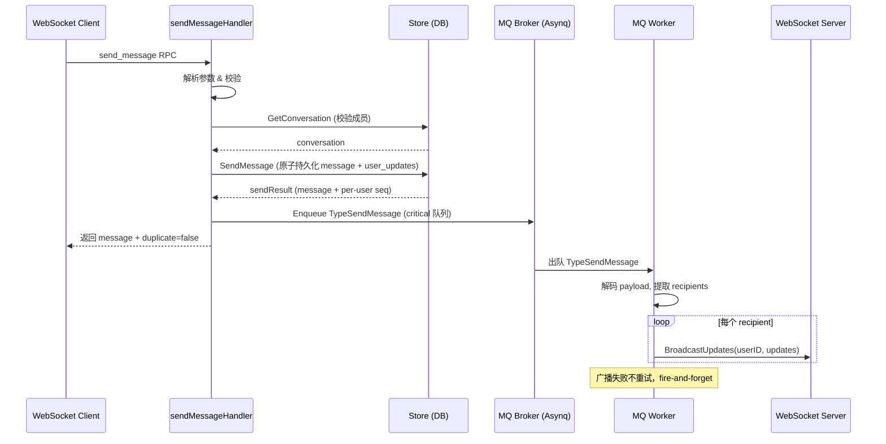
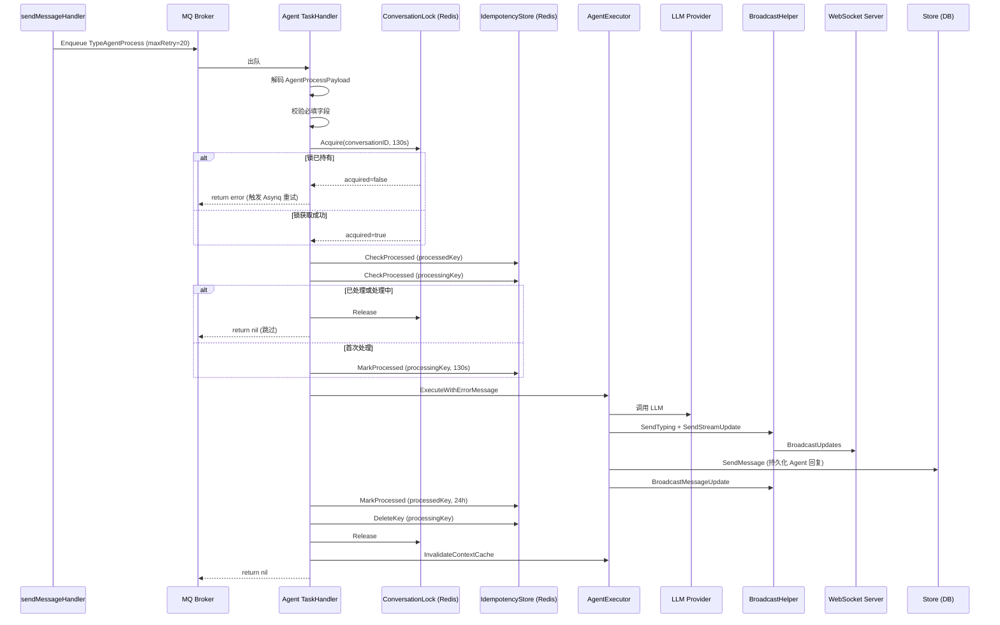
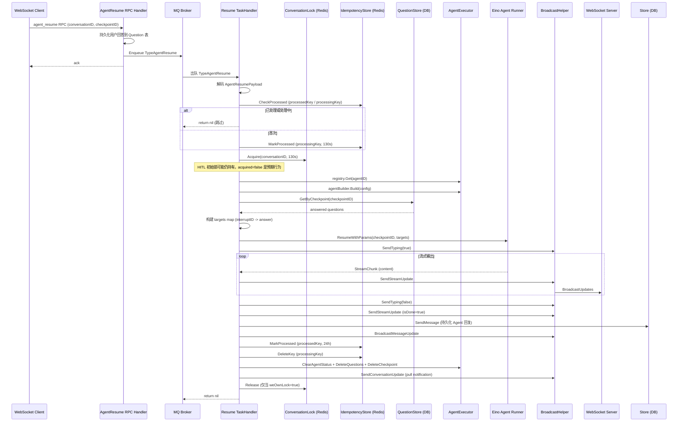
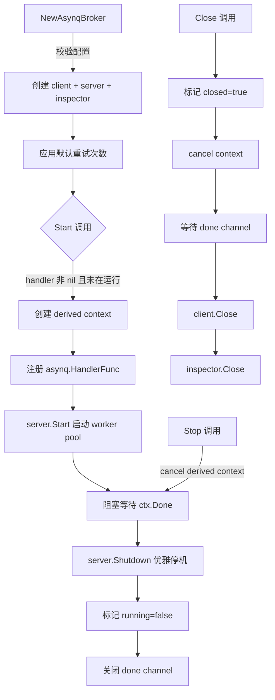
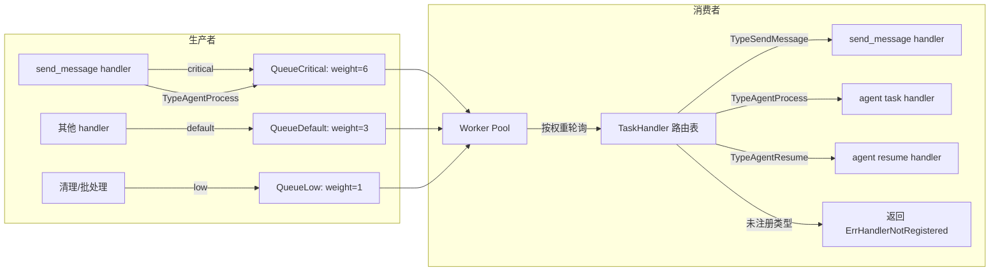
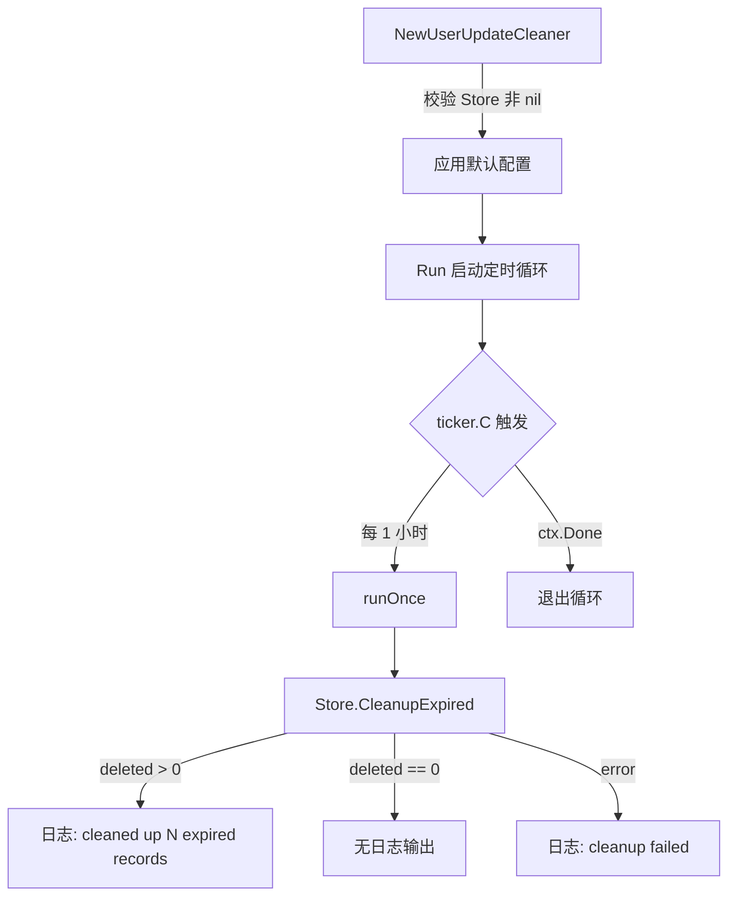
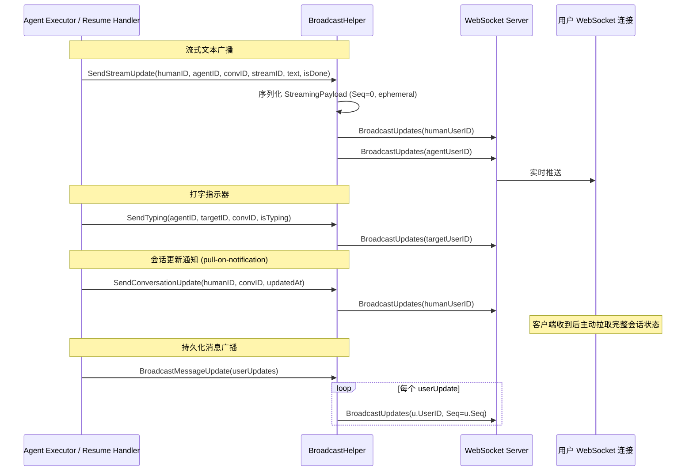

# 消息队列与异步任务处理

> 基于 Asynq (Redis) 的异步任务系统：消息广播、Agent 任务执行、HITL 恢复、清理任务。

## 场景 1: 消息发送与实时广播

### 主流程

### 边缘场景

#### 1. 幂等重复发送 (client_message_id 冲突)

- 触发条件: 客户端使用相同的 client_message_id 重复调用 send_message
- 处理逻辑: Store.SendMessage 抛出 ErrDuplicateKey，handler 捕获后查询已有消息并返回 duplicate=true
- 最终结果: 返回已存在的消息，不重复入队 MQ

#### 2. MQ 广播失败 (WebSocket 不可达)

- 触发条件: BroadcastUpdates 对某个 userID 返回 error（用户离线或连接断开）
- 处理逻辑: 记录日志，continue 处理下一个 recipient，不重试
- 最终结果: 消息已持久化，用户下次 sync_updates 时会拉取到

#### 3. MQ Enqueue 失败

- 触发条件: Redis 不可用或 Broker 已关闭
- 处理逻辑: 记录日志，不影响 RPC 返回结果，消息已持久化成功
- 最终结果: 客户端收到成功响应，但实时广播缺失，依赖后续 sync_updates 补偿

#### 4. Payload 解码失败

- 触发条件: MQ 消息体被损坏或格式不匹配
- 处理逻辑: worker 返回 nil（不重试），因为数据已持久化
- 最终结果: 该任务静默丢弃，用户通过 sync_updates 获取消息

### 涉及文件

- `internal/handler/send_message.go`: 消息持久化 + 入队 TypeSendMessage 任务
- `internal/handler/mq_send_message.go`: TypeSendMessage 消费者，广播给各 recipient
- `internal/mq/mq.go`: Broker 接口定义、队列常量、Task 类型
- `internal/mq/asynq.go`: AsynqBroker 实现
- `internal/mq/options.go`: Enqueue 选项
- `internal/mq/handler.go`: TaskHandler 路由注册表

---

## 场景 2: Agent 消息处理 (TypeAgentProcess)

### 主流程

### 边缘场景

#### 1. 会话锁已被持有 (并发冲突)

- 触发条件: 同一对话的另一个 agent 任务正在执行中
- 处理逻辑: 返回 error，Asynq 以指数退避重试
- 最终结果: 任务自动重新入队，等待锁释放后执行

#### 2. 会话锁获取 Redis 错误 (Fail-Open)

- 触发条件: Redis SETNX 调用失败（网络抖动、Redis 不可用）
- 处理逻辑: 记录错误日志，跳过锁保护，继续执行（fail-open 模式）
- 最终结果: 任务正常执行，可能有短暂的并发风险

#### 3. 幂等检测 — 重复消息

- 触发条件: 消息已被处理过（processedKey 存在）或正在处理中（processingKey 存在）
- 处理逻辑: 释放锁，返回 nil，跳过执行
- 最终结果: 避免重复处理，任务静默完成

#### 4. LLM 超时 (瞬态错误)

- 触发条件: LLM 请求超时，executor 返回 ErrLLMTimeout
- 处理逻辑: 不标记 processedKey，不删除 processingKey（130s 后自然过期），return error 给 Asynq 触发重试
- 最终结果: Asynq 指数退避重试，最多 20 次

#### 5. Agent 执行永久失败

- 触发条件: agent 不存在、配置错误等非瞬态错误
- 处理逻辑: 错误消息已通过 sendErrorMessage 持久化为用户可见消息，标记 processedKey（24h），释放锁，return nil
- 最终结果: 用户看到错误提示，任务不再重试

#### 6. HITL 中断 (人机交互暂停)

- 触发条件: Agent 执行返回 ErrHITLInterrupted
- 处理逻辑: 不释放会话锁（让锁自然过期），不标记 processedKey，return nil
- 最终结果: Agent 暂停等待用户回答，后续由 resume 流程接管

### 涉及文件

- `internal/handler/send_message.go`: 入队 TypeAgentProcess 任务
- `internal/agent/task_handler.go`: Agent 任务消费者
- `internal/agent/conversation_lock.go`: Redis 分布式会话锁
- `internal/agent/errors.go`: 错误哨兵定义
- `internal/agent/executor.go`: Agent 执行器

---

## 场景 3: Agent 恢复执行 (TypeAgentResume / HITL 恢复)

### 主流程

### 边缘场景

#### 1. Checkpoint 过期或不存在

- 触发条件: ResumeWithParams 返回 "not found" 错误
- 处理逻辑: 清理会话状态、删除问题、删除 checkpoint、发送错误消息给用户、标记 processedKey、释放锁
- 最终结果: 用户看到"等待时间过长，请重新发送消息"

#### 2. 多轮 HITL (Resume 后再次中断)

- 触发条件: Agent resume 后又返回新的 interrupt
- 处理逻辑: 更新会话状态为 asking_user，持久化新 Question 到 DB，广播 conversation update，不释放锁
- 最终结果: Agent 再次暂停等待用户回答，可循环多轮

#### 3. Resume 期间 LLM 瞬态错误

- 触发条件: ResumeWithParams 或流式输出中出现 ErrLLMTimeout / ErrLLMRateLimited
- 处理逻辑: 不自动重试，直接通知用户 "服务暂时不可用"，删除 processingKey 允许手动重试
- 最终结果: 用户看到"服务暂时不可用，请稍后重试"

#### 4. Agent 配置不存在

- 触发条件: registry.Get(agentID) 返回 not found
- 处理逻辑: 清理状态、发送错误消息、标记 processedKey、释放锁
- 最终结果: 用户看到"Agent 配置不存在，请重新发送消息"

### 涉及文件

- `internal/agent/resume_handler.go`: TypeAgentResume 消费者
- `internal/agent/task_handler.go`: 共享锁和幂等模式
- `internal/agent/conversation_lock.go`: 分布式锁
- `internal/agent/broadcast.go`: 流式广播
- `internal/mq/mq.go`: TypeAgentResume 任务类型

---

## 场景 4: Broker 生命周期管理 (启动/关闭/优雅停机)

### 主流程

### 边缘场景

#### 1. 重复调用 Start

- 触发条件: 在 broker 已处于 running 状态时再次调用 Start
- 处理逻辑: 检查 running 标志，返回错误 "server is already running"
- 最终结果: 第二次调用失败，不影响已运行的 server

#### 2. Close 幂等性

- 触发条件: 多次调用 Close
- 处理逻辑: closeOnce.Do 保证清理逻辑只执行一次
- 最终结果: 安全的多次调用

#### 3. Enqueue 在 Close 之后

- 触发条件: broker 已关闭后调用 Enqueue
- 处理逻辑: 检查 closed 标志，返回 ErrQueueClosed
- 最终结果: 调用方得到明确的错误信号

#### 4. 优雅停机中的 in-flight 任务

- 触发条件: Stop 被调用时仍有任务在处理中
- 处理逻辑: asynq.Server.Shutdown 等待所有 in-flight 任务完成
- 最终结果: 不丢失正在执行的任务

### 涉及文件

- `internal/mq/asynq.go`: AsynqBroker 完整生命周期管理
- `internal/mq/mq.go`: Broker 接口、ErrQueueClosed
- `internal/mq/options.go`: 默认配置

---

## 场景 5: 消息队列任务路由与优先级调度

### 主流程

### 边缘场景

#### 1. 未注册的 Task Type

- 触发条件: Broker 出队一个 TaskHandler 中没有注册处理函数的 task type
- 处理逻辑: TaskHandler.ProcessTask 返回 ErrHandlerNotRegistered
- 最终结果: Asynq 将该任务视为失败并按重试策略处理

#### 2. Handler 被覆盖

- 触发条件: 对同一 taskType 重复调用 Register
- 处理逻辑: 新 handler 替换旧 handler，记录 warn 日志
- 最终结果: 最后注册的 handler 生效

#### 3. 延迟任务 (ProcessIn)

- 触发条件: Enqueue 时指定 WithProcessIn(duration)
- 处理逻辑: Asynq 将任务放入 scheduled 队列，到期后移入 pending 队列
- 最终结果: 任务在指定延迟后才被消费

#### 4. 任务去重 (Unique)

- 触发条件: Enqueue 时指定 WithUnique()
- 处理逻辑: Asynq 检查是否有相同类型和 payload 的 pending 任务，有则拒绝入队
- 最终结果: 防止短时间内重复入队相同任务

### 涉及文件

- `internal/mq/mq.go`: 队列常量、优先级权重、Task 类型
- `internal/mq/handler.go`: TaskHandler 路由注册表
- `internal/mq/options.go`: Enqueue 选项
- `internal/mq/asynq.go`: buildAsynqOptions 转换层

---

## 场景 6: 后台清理任务 (UserUpdate 过期清理)

### 主流程

### 边缘场景

#### 1. 清理执行 panic

- 触发条件: Store.CleanupExpired 内部发生 panic
- 处理逻辑: defer recover 捕获 panic，记录日志，不中断循环
- 最终结果: 下一个 tick 继续尝试清理

#### 2. 清理执行失败

- 触发条件: 数据库连接断开等导致 CleanupExpired 返回 error
- 处理逻辑: 记录错误日志，不中断循环
- 最终结果: 下一个 tick 重试

### 涉及文件

- `internal/cleanup/cleanup.go`: UserUpdateCleaner 定时清理循环

---

## 场景 7: 实时广播基础设施 (BroadcastHelper)

### 主流程

### 边缘场景

#### 1. 广播失败 (用户离线)

- 触发条件: BroadcastUpdates 返回 error
- 处理逻辑: 所有广播方法均为 fire-and-forget，记录错误日志但不返回 error
- 最终结果: 离线用户不会收到实时推送，依赖下次 sync_updates 补偿

#### 2. AgentRegistry 为 nil

- 触发条件: BroadcastHelper 未设置 AgentRegistry
- 处理逻辑: isAgent() 返回 false，所有 payload 中 IsAgent 字段为 false
- 最终结果: 功能降级但不崩溃

### 涉及文件

- `internal/agent/broadcast.go`: BroadcastHelper 全部广播方法
- `internal/agent/task_handler.go`: 调用 BroadcastHelper
- `internal/agent/resume_handler.go`: 调用 BroadcastHelper
- `internal/handler/mq_send_message.go`: TypeSendMessage 的 BroadcastUpdates

---

## 场景 8: Trace Context 跨进程传播

### 主流程

### 边缘场景

#### 1. Metadata 为空

- 触发条件: 入队时 context 中无 trace 信息
- 处理逻辑: InjectTraceContext 返回空 map，序列化时 metadata 设为 nil
- 最终结果: worker 侧不创建 process span，功能正常

#### 2. Trace Context 损坏

- 触发条件: Metadata 中的 trace 值被篡改
- 处理逻辑: ExtractTraceContext 返回新 context（可能丢失父 span），不影响业务逻辑
- 最终结果: 链路追踪断裂但业务不受影响

### 涉及文件

- `internal/mq/asynq.go`: Enqueue 中注入 metadata，Start 中恢复 trace context
- `internal/tracing`: InjectTraceContext / ExtractTraceContext
