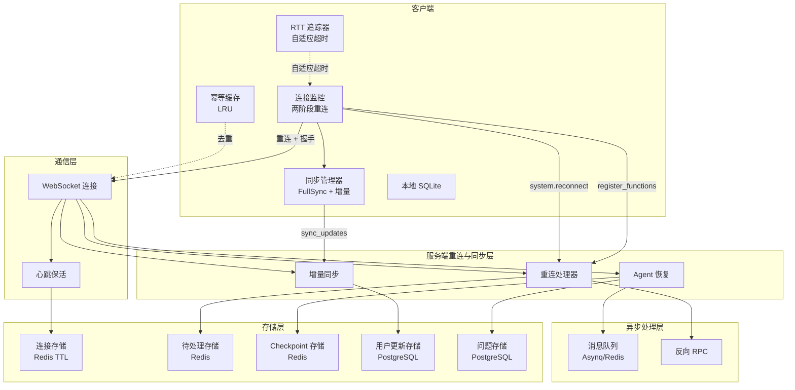
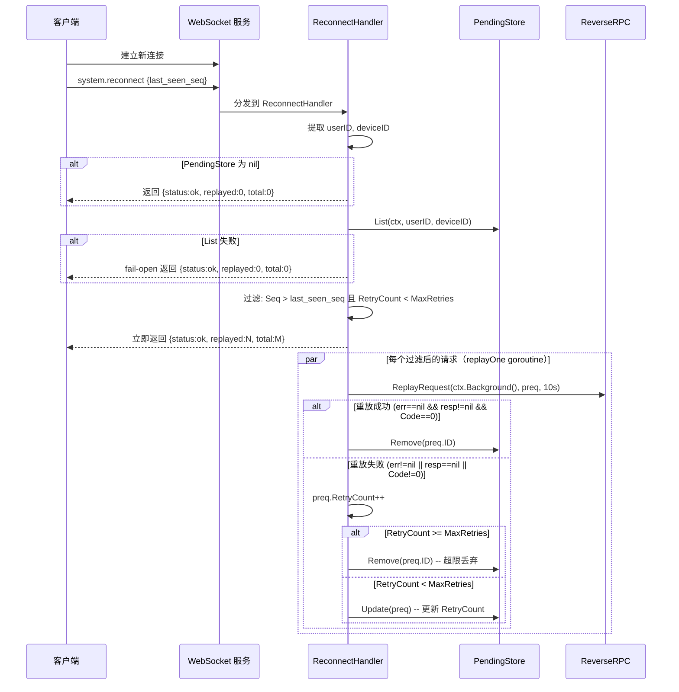
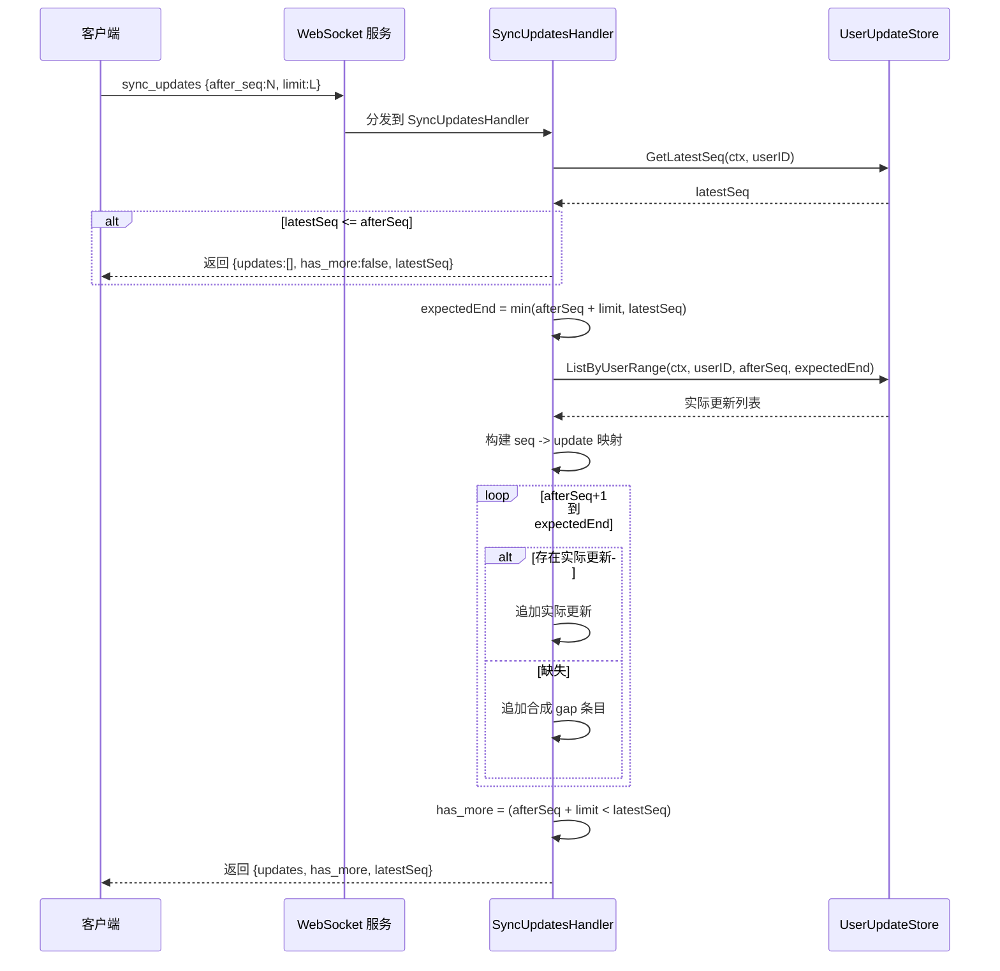
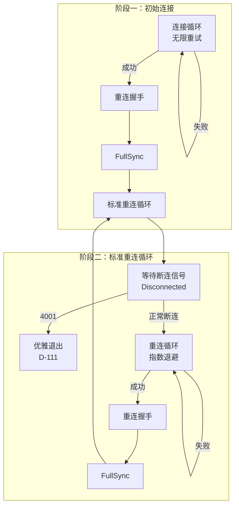
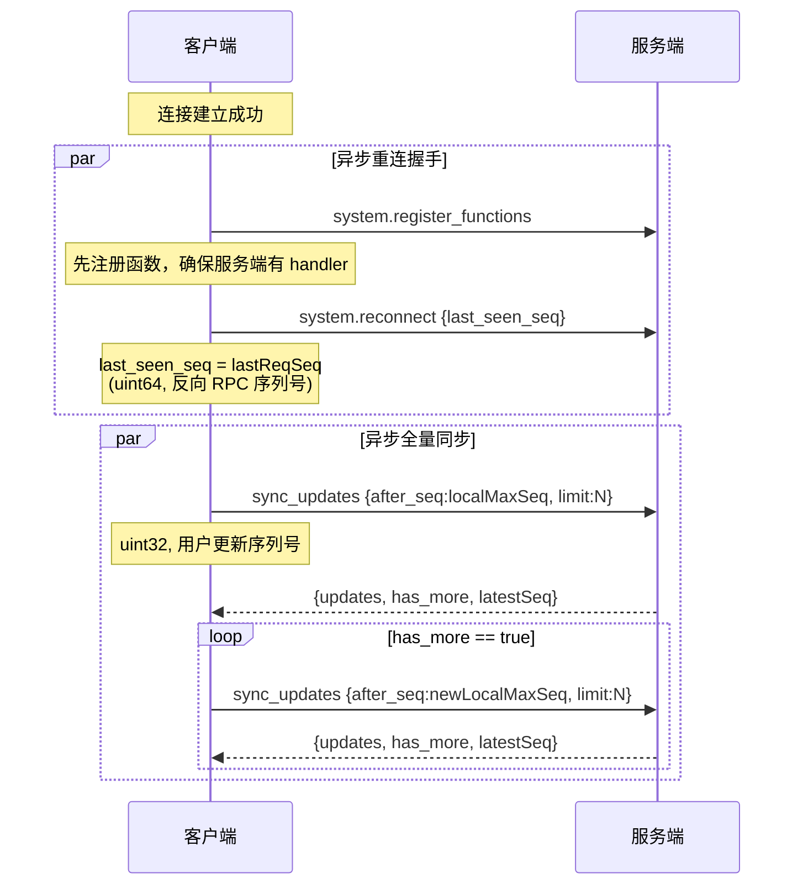
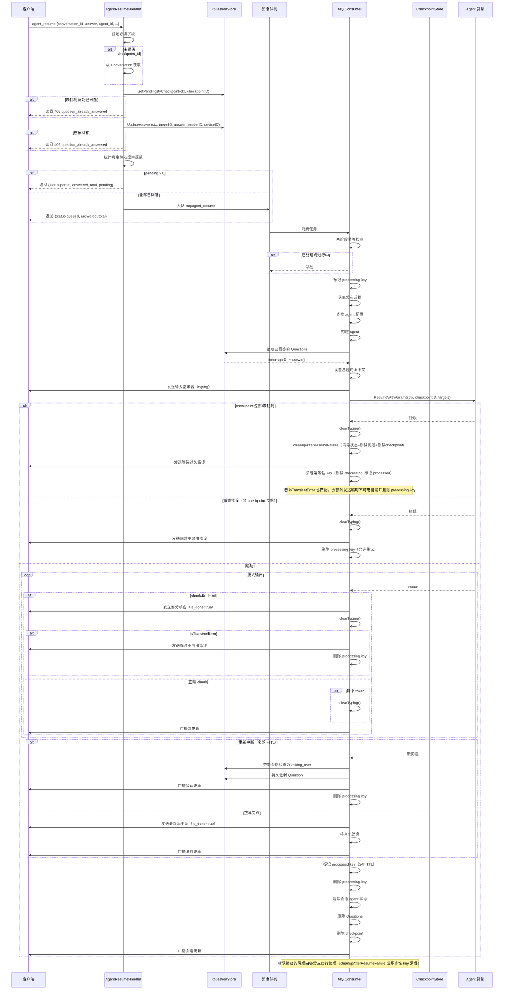
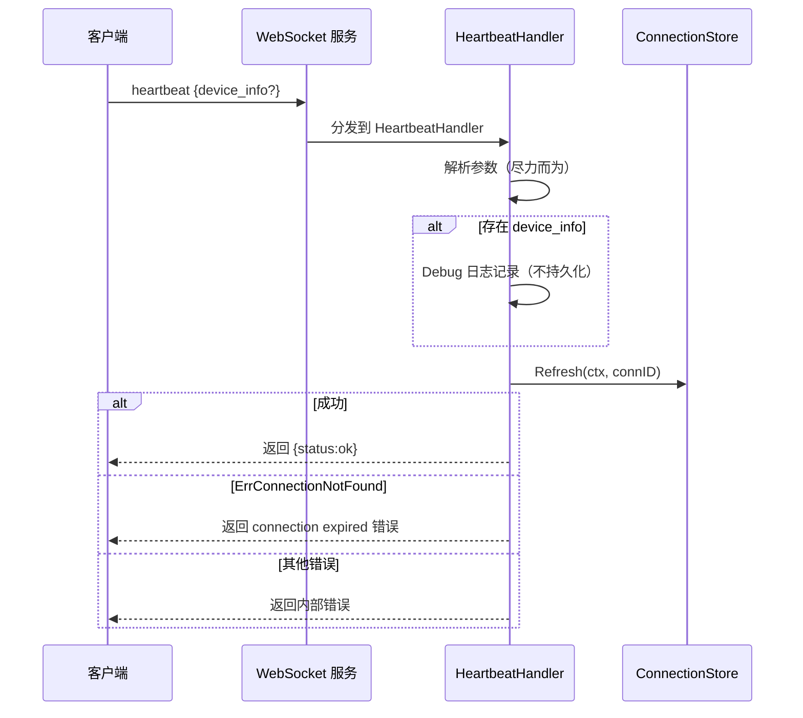
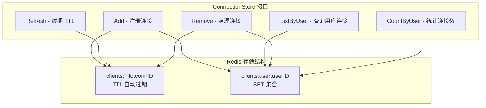

# 断线重连与同步

本文档详细描述 Xyncra Server 的断线重连与同步机制，包括客户端重连、请求重放、增量同步、Agent 恢复、心跳保活等核心流程。

## 目录

- [整体架构](#整体架构)
- [1. 重连流程 (reconnect)](#1-重连流程-reconnect)
- [2. 增量同步流程 (sync_updates)](#2-增量同步流程-sync_updates)
- [3. 客户端重连协调](#3-客户端重连协调)
- [4. Agent 恢复流程 (agent_resume)](#4-agent-恢复流程-agent_resume)
- [5. 心跳保活流程 (heartbeat)](#5-心跳保活流程-heartbeat)
- [6. Checkpoint 存储 (checkpoint_store)](#6-checkpoint-存储-checkpoint_store)
- [7. 连接存储 (connection_store)](#7-连接存储-connection_store)
- [设计原则](#设计原则)

---

## 整体架构



---

## 1. 重连流程 (reconnect)

### 概述

客户端检测到网络中断并重新建立连接后，执行三步重连协调（详见 [第 3 节](#3-客户端重连协调)）：(1) 重新注册设备函数（`system.register_functions`），(2) 发送 `system.reconnect` 请求触发服务端重放，(3) 执行 `FullSync` 拉取增量更新。本节仅描述服务端 `system.reconnect` handler 的处理逻辑。

服务端查询 PendingStore 中该设备超时的反向 RPC 请求，按序列号和重试次数过滤后异步重放给刚重连的客户端。

**双序列号空间**：`system.reconnect` 的 `last_seen_seq` 是 uint64 类型，跟踪的是服务端发起的反向 RPC 请求的序列号（`ReverseRPC.nextSeq`），与 `sync_updates` 的 uint32 类型用户更新序列号（`UserUpdateStore`）是完全独立的两个空间。客户端通过 `lastReqSeq` 字段跟踪收到的最高反向 RPC 序列号。

### 流程图



### 详细步骤

1. **客户端发送重连请求**
   - 客户端发送 `system.reconnect`，携带 `last_seen_seq`（默认 0）
   - `last_seen_seq` 表示客户端最后处理的序列号

2. **提取身份信息**
   - Handler 从已认证的客户端连接中提取 `userID` 和 `deviceID`

3. **检查 PendingStore**
   - Handler 从 ReverseRPC 获取 PendingStore
   - 若为 nil，直接返回 `{status:ok, replayed:0, total:0}`

4. **获取待处理请求**
   - 调用 `PendingStore.List(ctx, userID, deviceID)` 获取该设备所有待处理请求
   - 失败时 fail-open 返回零计数

5. **过滤请求**
   - 仅保留 `Seq > last_seen_seq` 且 `RetryCount < MaxRetries` 的条目

6. **立即返回响应**
   - 返回 `{status:ok, replayed:N, total:M}`
   - `replayed` 为正在异步重放的请求数，`total` 为 PendingStore 中该设备的全部待处理请求数
   - 重放计数不代表完成确认

7. **异步重放请求**
   - 为每个过滤后的请求启动 goroutine 调用 `replayOne(preq)`
   - 调用 `ReverseRPC.ReplayRequest()` 以新 reqID（`s-replay-{uuid}`）发送请求
   - 保留原始 IdempotencyKey 用于客户端去重

8. **处理重放结果**
   - **重放成功**（收到 code=0 响应）：从 PendingStore 移除该请求
   - **重放失败**（超时、发送错误、非成功响应）：
     - 递增 RetryCount
     - 若 RetryCount >= MaxRetries 则丢弃
     - 否则更新 PendingStore 中的 RetryCount

### 边缘场景

| 场景 | 处理方式 | 影响 |
|------|----------|------|
| **PendingStore 不可用（nil）** | Handler 优雅降级，返回零计数，不尝试重放 | 客户端无法收到错过的反向 RPC 请求 |
| **PendingStore List 错误** | fail-open，返回零计数并记录日志，跳过整个重放 | 同上 |
| **快速重连/断连** | 每个重放在独立 goroutine 中执行，超时 10 秒。客户端再次断连时 goroutine 超时并递增 RetryCount | 重放可能失败，但会在下次重连时重试 |
| **客户端已处理过该消息** | 重放请求保留原始 IdempotencyKey，客户端必须使用该 key 去重 | 客户端需要实现幂等性检查 |
| **超过 MaxRetries（默认 3）** | 请求从 PendingStore 永久丢弃 | 客户端永远不会收到该反向 RPC 调用 |
| **前一次连接的延迟响应** | DispatchResponse 静默忽略未知 reqID（响应通道已被清理） | 无影响 |
| **并发重连 + 正常反向 RPC** | 重放使用新 reqID（`s-replay-*`）避免与进行中的正常请求冲突 | 无冲突 |
| **重放后 PendingStore Remove/Update 错误** | 记录日志但非致命，下次重连时可能再次重放 | 最终一致 |
| **PendingStore 请求 TTL 过期** | `RedisPendingStore` 为每个设备列表设置 `RequestTTL`（Redis Expire）。设备长时间离线时，PendingStore 中的请求可能在重连前被 Redis 自动过期清理 | 客户端永远不会收到已过期的反向 RPC 请求，但可通过 `sync_updates` 最终同步数据 |
| **PendingStore 超出 MaxPendingPerDevice** | `RedisPendingStore.Save` 使用 `RPush` + `LTrim` 限制每个设备的列表长度（`MaxPendingPerDevice`），超出时最旧的条目被丢弃 | 最旧的反向 RPC 请求可能丢失，客户端需依赖 `sync_updates` 补偿 |
| **RedisPendingStore 非原子 Remove/Update** | Remove 和 Update 均采用读-过滤-重写管道（LRange + Del + RPush），非事务性，Del 和 RPush 之间的崩溃可能丢失条目 | 按 fail-open 语义记录为可接受 |
| **RedisPendingStore 非原子 Save** | Save 使用 RPush + LTrim + Expire 管道，非事务性，但单个命令各自原子，丢失风险较低 | 按 fail-open 语义记录为可接受 |
| **设备替换（4001 Close Frame）** | 服务端对同一设备的新连接发送 4001 关闭帧，客户端设置 `replaced=true` 并取消上下文，不尝试重连，daemon 优雅退出（D-111） | 被替换的设备实例终止 |
| **reconnect 与 FullSync 的顺序** | 客户端在 reconnect handshake 完成后总是执行 FullSync，即使 reconnect 失败也会执行；两者运行在异步 goroutine 中，不阻塞彼此 | 确保数据最终一致 |
| **函数注册先于重放** | 客户端先发送 `system.register_functions` 再发送 `system.reconnect`，确保服务端在重放请求前已有对应的 handler | 避免重放请求因无 handler 而失败 |

---

## 2. 增量同步流程 (sync_updates)

> **详细流程**：完整的 `sync_updates` 业务流程（参数校验、gap filling、分页、边缘场景等）详见 [sync-updates.md](sync-updates.md)。本节仅概述与重连场景相关的要点。

### 概述

客户端使用 `sync_updates` 在重连后或长轮询中增量拉取事件流（消息、输入指示器、会话更新等）。服务端返回连续序列的更新，当实际数据缺失时用合成占位条目填充间隙。

### 流程图



### 详细步骤

1. **客户端发送同步请求**
   - 携带 `{after_seq:N, limit:L}`
   - `after_seq=0` 表示从头开始
   - `limit` 默认 100，上限 500

2. **获取最新序列号**
   - 调用 `UserUpdateStore.GetLatestSeq(ctx, userID)` 获取该用户的最高 seq

3. **检查是否需要同步**
   - 若 `latestSeq <= afterSeq`，返回空：`{updates:[], has_more:false, latestSeq}`

4. **计算同步范围**
   - `expectedEnd = min(afterSeq + limit, latestSeq)`

5. **获取实际更新**
   - 调用 `UserUpdateStore.ListByUserRange(ctx, userID, afterSeq, expectedEnd)`
   - 获取 `(afterSeq, expectedEnd]` 范围内的实际更新

6. **构建查找映射**
   - 构建 seq 到 update 的映射

7. **填充连续序列**
   - 从 `afterSeq+1` 迭代到 `expectedEnd`
   - 若存在实际更新则追加
   - 若缺失则追加合成 `{seq:N, type:gap, payload:null, createdAt:now()}` 条目

8. **设置分页标志**
   - `has_more = (afterSeq + limit < latestSeq)`

9. **返回结果**
   - 返回 `{updates, has_more, latestSeq}`

### 边缘场景

| 场景 | 处理方式 | 影响 |
|------|----------|------|
| **范围内所有更新都是 gap** | 客户端收到整页 `type:gap` 条目 | 表明数据丢失或 DB 清理（30 天保留期 DefaultCleanupRetention） |
| **GetLatestSeq 数据库查询错误** | 返回内部错误给客户端 | 客户端应重试 |
| **ListByUserRange 数据库查询错误** | 返回内部错误给客户端 | 客户端应重试 |
| **Seq 回绕** | AfterSeq 为 uint32，在约 43 亿处回绕，`latestSeq <= afterSeq` 比较会不正确。但 pending store 使用 uint64 seq（`reverse_rpc.go` 的 `nextSeq`），不会回绕 | 30 天清理窗口下实际不太可能发生 |
| **超大间隙** | 客户端落后数千个 seq 且 limit=500 时，收到 500 条混合条目（真实+gap） | `has_more=true` 信号客户端继续分页 |
| **同步期间并发写入** | GetLatestSeq 之后 ListByUserRange 之前可能有新 update 写入请求范围内的 seq | 该 update 会被包含在本次或下次同步中，属于良性情况 |
| **空用户（从未有更新）** | GetLatestSeq 返回 0，afterSeq=0 时触发提前退出返回空 | 无影响 |

---

## 3. 客户端重连协调

### 概述

客户端（`XyncraClient`）在连接断开后自动执行重连协调流程。该流程包括连接监控（两阶段重连）、重连握手（函数注册 + reconnect）、以及全量同步（FullSync）。本节描述客户端视角的完整重连生命周期。

### 连接监控架构



### 重连握手流程



### 详细步骤

1. **检测断连**
   - 连接监控 goroutine 通过 `Disconnected()` channel 检测意外断连
   - 若为 4001 设备替换，取消上下文并优雅退出（D-111），不尝试重连
   - 否则进入重连循环

2. **指数退避重连**
   - 退避算法：`base * 2^(attempt-1)`，上限 max，指数上限 30，+/-25% 随机抖动（C3）
   - 每次重连尝试前等待退避延迟，支持 AbortSignal 取消
   - 重连成功后 `attempt` 计数器重置为 0

3. **重连握手**（异步执行，不阻塞 FullSync）
   - **Step 1**：发送 `system.register_functions` 注册设备提供的函数
     - 必须先于 reconnect，确保服务端在重放 PendingStore 请求前有对应的 handler
     - 修复了 PendingStore 重放先于函数注册到达的竞态条件
     - 有独立的 10 秒超时（从父上下文派生），防止注册阻塞 FullSync
   - **Step 2**：发送 `system.reconnect` 携带 `last_seen_seq`
     - `last_seen_seq` 来自 `lastReqSeq`（uint64），跟踪收到的最高反向 RPC 序列号
     - 通过 `handleIncomingRequest` 在每次收到服务端请求且 `req.Seq > 0` 时更新
   - 错误记录日志但不阻止 FullSync（优雅降级，D-072）

4. **全量同步**（FullSync）
   - 在 reconnect handshake 启动后立即执行（不等待 handshake 完成）
   - 从本地 `localMaxSeq` 开始分页拉取 `sync_updates`
   - 服务端返回连续序列的更新（含 gap 填充），客户端逐条应用
   - 应用更新时通过 NotificationLog 去重，通过事务保证原子性
   - `has_more=true` 时继续拉取下一页

### 客户端序列号跟踪

| 序列号 | 类型 | 跟踪对象 | 更新时机 | 用途 |
|--------|------|----------|----------|------|
| `lastReqSeq` | uint64 | 服务端反向 RPC 请求 | `handleIncomingRequest` 收到请求且 `req.Seq > 0` 时 | `system.reconnect` 的 `last_seen_seq` |
| `localMaxSeq` | uint32 | 用户更新（消息、会话等） | `ApplyUpdate` 成功应用后 | `sync_updates` 的 `after_seq` |

### 客户端幂等性与超时

| 机制 | 说明 |
|------|------|
| **IdempotencyCache** | 客户端维护 LRU 缓存（默认大小可配置），收到服务端请求时检查 `IdempotencyKey`，已处理则跳过，处理成功后写入缓存。防止重放请求被重复处理 |
| **RTTTracker** | 维护滑动窗口的 RTT 样本，计算修剪均值 SRTT（去除最高/最低 10%），低于 5 个样本时返回默认超时。`AdaptiveTimeout = SRTT * 1.5`，夹紧到 `[min, max]` |
| **ResponseRetryQueue** | 缓存发送失败的服务端响应（服务端发起的请求的响应），由后台 `responseRetryLoop` 定期重试发送 |

### 边缘场景

| 场景 | 处理方式 | 影响 |
|------|----------|------|
| **4001 设备替换** | 客户端设置 `replaced=true`，取消上下文，daemon 优雅退出（D-111），不尝试重连 | 旧设备实例终止 |
| **重连握手失败** | 错误记录日志，FullSync 继续执行 | PendingStore 请求可能未被重放，但数据通过 FullSync 同步 |
| **FullSync 失败** | 错误记录日志，连接监控继续等待下一次断连 | 数据可能不完整，下次重连时重试 |
| **函数注册与重放竞态** | 函数注册在 reconnect 之前顺序执行（同一 goroutine 内，注册有 10 秒超时），但整个握手在异步 goroutine 中运行，与 FullSync 并行；服务端 reconnect handler 的重放 goroutine 可能在客户端注册完成前到达 | 极端情况下重放可能因无 handler 失败，下次重连时重试 |
| **上下文取消期间的重连** | 重连循环和退避等待均检查 `ctx.Err()`，上下文取消时立即退出 | 优雅关闭 |
| **重连期间收到新更新** | FullSync 从当前 `localMaxSeq` 开始，自动包含重连期间到达的新更新 | 无数据丢失 |
| **RTT 样本不足（冷启动）** | 低于 5 个样本时 `AdaptiveTimeout` 返回默认超时值 | 使用保守的默认超时 |

---

## 4. Agent 恢复流程 (agent_resume)

### 概述

AI Agent 在 HITL（人机协作）状态下暂停等待用户输入时，用户回答通过两阶段流程处理：
1. RPC handler 持久化回答并决定是否触发恢复
2. MQ consumer 实际从 checkpoint 恢复 agent 执行

### 流程图



### 详细步骤

#### 阶段一：RPC Handler（持久化回答）

1. **接收请求**
   - 客户端发送 `agent_resume`，携带 `{conversation_id, answer, agent_id, checkpoint_id?, interrupt_id?}`

2. **验证必填字段**
   - 验证 `conversation_id`、`answer`、`agent_id`

3. **推断 checkpoint_id**
   - 若未提供，从 `conv.CheckpointID` 获取
   - 若 `conv.CheckpointID` 也为空，返回 ValidationError 给客户端

4. **查询待处理问题**
   - 调用 `QuestionStore.GetPendingByCheckpoint(ctx, checkpointID)`
   - 若提供了 `interrupt_id` 则过滤，选取第一个匹配项

5. **检查问题状态**
   - 若未找到待处理问题：检查是否已被回答（多设备冲突），返回 409 `question_already_answered`

6. **更新答案**
   - 调用 `QuestionStore.UpdateAnswer(ctx, targetID, answer, senderID, deviceID)`
   - 通过 `WHERE status=pending` 实现幂等，已回答则返回 409

7. **统计剩余问题**
   - 统计该 checkpoint 剩余待处理问题数

8. **决定下一步**
   - 若 `pending > 0`：返回 `{status:partial, answered, total, pending}`（多问题 HITL，等待更多回答）
   - 若全部已回答：入队 `mq.Task{Type:TypeAgentResume}`，返回 `{status:queued, answered, total}`

#### 阶段二：MQ Consumer（恢复执行）

9. **反序列化任务**
   - 反序列化任务 payload，验证必填字段

10. **两阶段幂等检查**
    - 检查 `agent:resume:<checkpointID>`（已处理）
    - 检查 `agent:resume:processing:<checkpointID>`（进行中）
    - 任一存在则跳过，Redis 错误时 fail-open

11. **标记处理中**
    - 设置 `processing` key，TTL 130 秒

12. **启动追踪**
    - 启动 OpenTelemetry span 用于追踪

13. **获取分布式锁**
    - 获取 per-conversation 分布式锁（Redis SETNX，130 秒 TTL）
    - 若锁由初始 HITL 执行持有（预期情况）则不持有锁继续（`weOwnLock=false`）
    - 若锁过期/未持有则获取新锁（`weOwnLock=true`）
    - Redis 错误时 fail-open 无锁继续

14. **查找 agent 配置**
    - 从 registry 查找 agent 配置
    - 失败则清理、发送错误消息给用户、标记 processed、释放锁

15. **注入上下文**
    - 注入调用者设备上下文供 DynamicToolProvider 使用

16. **构建 agent**
    - 通过 `executor.agentBuilder.Build(ctx, config)` 构建 agent
    - 失败则清理并发送错误消息

17. **准备执行**
    - 设置总超时上下文（`executor.totalTimeout`）
    - 发送输入指示器（`SendTyping(true)`），使用 `sync.Once` 包装清除函数确保只清除一次
    - 首个 token 到达或错误发生时清除输入指示器（`SendTyping(false)`）

18. **读取已回答问题**
    - 从 DB 读取已回答的 Questions 构建 targets 映射：`{interruptID -> answer}`
    - 答案在 DB 中而非 MQ payload（D-116 模式）

19. **恢复执行**
    - 调用 `builtAgent.Runner.ResumeWithParams(ctx, checkpointID, &adk.ResumeParams{Targets: targets})`

20. **处理执行结果**
    - **checkpoint 过期/未找到**：调用 `cleanupAfterResumeFailure`（清除 agent 状态、删除 Questions、删除 checkpoint），发送等待过久错误给用户，清理幂等性 key（删除 processing、标记 processed 24h）。注意：若该错误同时被 `isTransientError` 匹配，会再执行瞬态错误分支
    - **瞬态错误（非 checkpoint 过期）**：发送临时不可用错误给用户，删除 processing key 允许用户手动重试（不自动重试，因为用户已投入交互成本）
    - **桥接流**：消费 agent 迭代器的 chunk，广播流更新给用户，首个 token 时清除输入指示器。若 chunk 包含错误：发送部分响应（`is_done=true`），清除输入指示器，若为瞬态错误则发送错误消息并删除 processing key

21. **检查是否重新中断**
    - 若 agent 再次暂停并产生新问题：
      - 更新会话状态为 `asking_user`
      - 持久化新 Question 到 DB
      - 广播会话更新和 agent 状态
      - 不释放锁
      - 删除 processing key

22. **正常完成**
    - 发送最终流更新
    - 持久化消息到 DB
    - 广播消息更新给接收者

23. **清理**（正常完成路径，全部非致命）
    - 标记 processed key（24 小时 TTL）
    - 删除 processing key
    - 清除会话 agent 状态（重置为 idle）
    - 删除该 checkpoint 的 Questions
    - 删除 Redis 中的 checkpoint
    - 广播会话更新通知客户端
    - **错误路径清理**：checkpoint 过期和 agent 配置/构建失败时调用 `cleanupAfterResumeFailure`，执行相同的状态清除、问题删除和 checkpoint 删除操作；瞬态错误路径仅删除 processing key 允许用户重试，不执行完整清理

### 边缘场景

| 场景 | 处理方式 | 影响 |
|------|----------|------|
| **重复 agent_resume 调用** | 两阶段幂等（processed + processing key）防止双重恢复，processing key 的 130 秒 TTL 作为执行期间的短期守卫 | 无重复执行 |
| **多设备冲突** | 两个设备回答同一问题，`UpdateAnswer` 使用 `WHERE status=pending`，先写入者胜出，后写入者收到 409 | 后写入者需重新确认 |
| **Checkpoint 过期（Redis TTL 24 小时）** | `ResumeWithParams` 失败返回 not found，Handler 调用 `cleanupAfterResumeFailure`（清除 agent 状态、删除 Questions、删除 checkpoint）并发送等待过久错误，清理幂等性 key | 用户需重新发起对话 |
| **Checkpoint 过期 + isTransientError** | 代码中两个 `if` 分支非互斥，理论上若 checkpoint not found 错误同时被 `isTransientError` 匹配会发送两条错误消息。但实际中 `isTransientError` 仅匹配 `ErrLLMTimeout` 和 `ErrLLMRateLimited`，不会匹配 `ErrCheckpointNotFound`，因此该场景在正常情况下不会发生 | 理论上的代码路径问题，实际不影响 |
| **暂停与恢复之间 agent 配置被删除** | Handler 发送 "Agent config does not exist" 错误，清理 Questions 和 checkpoint | 用户需等待配置恢复 |
| **锁竞争** | 初始 HITL 执行的锁仍被持有时（预期情况），恢复不持有锁继续执行；锁 TTL 过期则获取新锁；130 秒锁 TTL 故意长于执行超时以防止过早释放 | 无锁冲突 |
| **多轮 HITL（重新中断）** | agent 恢复后可能再次暂停产生新问题，不释放锁（D-084），删除 processing key 允许后续恢复，持久化新 Question | 支持多轮交互 |
| **流式响应中途出错** | chunk 包含错误时，发送已累积的部分文本作为 `is_done=true` 的流更新，清除输入指示器。若为瞬态错误则额外发送错误消息并删除 processing key 允许用户手动重试。与 task_handler 返回错误供 Asynq 自动重试不同，HITL 恢复通知用户让用户决定是否重试 | 用户看到部分结果，可手动重试 |
| **CheckpointID 推断失败** | 客户端未提供 `checkpoint_id` 且 `conv.CheckpointID` 为空时，Handler 返回 ValidationError("checkpoint_id is required and cannot be inferred from conversation") | 客户端收到错误响应 |
| **QuestionStore 为 nil** | Handler 返回 InternalError 给客户端，不尝试恢复 | 功能降级 |
| **锁获取失败（Redis 错误）** | fail-open 无锁继续，存在并发执行风险但通过幂等性缓解 | 风险可控 |
| **清理失败** | 正常完成路径和 `cleanupAfterResumeFailure` 的所有清理操作（标记 processed、删除 processing、清除状态、删除问题、删除 checkpoint）均为非致命，错误记录日志但不影响返回值（始终返回 nil 给 MQ，D-073） | 无影响 |

---

## 5. 心跳保活流程 (heartbeat)

### 概述

客户端定期发送心跳请求以保持 WebSocket 连接存活。服务端采用被动续期策略（D-010）：每次心跳重置连接在 ConnectionStore 中的 TTL，防止自动驱逐。

### 流程图



### 详细步骤

1. **接收心跳请求**
   - 客户端发送 `heartbeat`，可选携带 `{device_info:{os, version, battery, ...}}`

2. **解析参数**
   - 尽力而为，畸形参数不影响心跳

3. **记录设备信息**
   - 若存在 `device_info`，以 Debug 级别记录日志用于可观测性
   - 不持久化

4. **续期连接 TTL**
   - 调用 `ConnectionStore.Refresh(ctx, connID)` 重置连接 TTL
   - `RedisConnectionStore.Refresh` 采用两阶段模式：(1) GET infoKey 读取连接 JSON 获取 UserID 和 TTL 配置，若 key 不存在返回 `ErrConnectionNotFound`；(2) 通过原子 Lua 脚本（`luaRefresh`）同时重置 info key 和 user SET 的 TTL（D-010 MAX 语义）。GET 与 Lua 之间存在短暂竞态窗口（key 可能在 GET 后过期），Lua 脚本的 EXISTS 检查可捕获此情况
   - 默认连接 TTL 为 30 分钟（`defaultConnectionTTL`）

5. **返回结果**
   - 成功则返回 `{status:ok}`
   - `ErrConnectionNotFound` 则返回 `connection expired` 错误，信号客户端需要重连
   - 其他错误返回内部错误

### 边缘场景

| 场景 | 处理方式 | 影响 |
|------|----------|------|
| **连接已过期/被驱逐** | 返回 `connection expired`（NotFound），heartbeatLoop 仅记录日志，不主动重连；连接断开后由 connectionMonitor 检测并触发重连（详见 [heartbeat 流程](heartbeat.md)） | connectionMonitor 负责重连 |
| **畸形参数** | 故意忽略，心跳不能因坏参数失败，其唯一目的是 TTL 续期 | 无影响 |
| **心跳间隔大于连接 TTL** | 客户端心跳间隔超过服务端连接 TTL 时，连接会在心跳之间过期，客户端下次心跳收到 `connection expired` 后 heartbeatLoop 仅记录日志；连接断开后由 connectionMonitor 检测并重连。客户端默认心跳间隔 30 秒（`defaultHeartbeatInterval`），建议间隔 < TTL/2 | 需合理配置间隔 |
| **ConnectionStore.Refresh 与 TTL 过期的竞态** | 连接在 Refresh 调用前刚好过期时，Refresh 返回 `ErrConnectionNotFound`，heartbeatLoop 记录日志，connectionMonitor 负责重连 | connectionMonitor 负责重连 |
| **高频心跳** | 每次调用都是 Redis 操作（Refresh），过度心跳产生 Redis 负载，该 Handler 中未见服务端限流 | 需客户端合理控制频率 |
| **同一用户的多连接** | 心跳基于 connID 而非 userID，每个连接独立拥有自己的 TTL | 无影响 |

---

## 6. Checkpoint 存储 (checkpoint_store)

### 概述

RedisCheckPointStore 实现 Eino 的 `compose.CheckpointStore` 接口，将 agent 执行状态持久化到 Redis，使 HITL 暂停的 agent 可以稍后恢复。采用 fail-closed 策略（D-083），所有 Redis 错误传播给调用者以便执行器中止。

### 操作流程

```mermaid
graph LR
    subgraph "Get 操作"
        G1[Get(key)] --> G2{Redis 查询}
        G2 -->|找到| G3[返回 checkpoint bytes]
        G2 -->|redis.Nil| G4[返回 nil, false, nil]
        G2 -->|其他错误| G5[传播错误]
    end

    subgraph "Set 操作"
        S1[Set(key, value)] --> S2[Redis SET + TTL]
        S2 -->|成功| S3[返回 nil]
        S2 -->|失败| S4[返回 ErrCheckpointStoreSet]
    end

    subgraph "Delete 操作"
        D1[Delete(key)] --> D2[Redis DEL]
        D2 -->|成功| D3[返回 nil]
        D2 -->|失败| D4[传播错误]
    end
```

### 操作说明

| 操作 | 说明 |
|------|------|
| **Get(key)** | 从 Redis 的 `agent:checkpoint:<key>` 检索 checkpoint 字节，`redis.Nil` 时返回 `(nil, false, nil)`（key 未找到），其他 Redis 错误传播 |
| **Set(key, value)** | 以配置的 TTL（默认 24 小时）存储 checkpoint 字节，错误包装为 `ErrCheckpointStoreSet` |
| **Delete(key)** | 移除 checkpoint，幂等操作（key 不存在不报错），Redis 错误传播 |

### 边缘场景

| 场景 | 处理方式 | 影响 |
|------|----------|------|
| **Checkpoint TTL 过期（默认 24 小时）** | 用户超过 24 小时才回答 HITL 问题时 checkpoint 过期，Get 返回 `(nil, false, nil)`，恢复 Handler 检测为 checkpoint not found 并发送等待过久错误 | 用户需重新发起对话 |
| **Redis 连接故障** | fail-closed，错误传播，HITL 流程中止。这是故意的（D-083），因为 HITL 不支持 fail-open，丢失 checkpoint 意味着丢失 agent 状态 | 流程中止 |
| **大型 checkpoint 数据** | 此层未强制大小限制，过大的 agent 状态可能触及 Redis 内存限制或拖慢 GET/SET 操作 | 性能风险 |
| **Key 冲突** | key 前缀 `agent:checkpoint:` + checkpoint ID（UUID）使冲突实际上不可能发生 | 无影响 |
| **Delete 与恢复的竞态** | 清理期间调用 Delete 时 checkpoint 消失，若恢复先通过 Eino 内部 Get 读取 checkpoint 则正常，若清理先于恢复读取执行则恢复失败返回 not found | 恢复可能失败 |

---

## 7. 连接存储 (connection_store)

### 概述

ConnectionStore 是心跳和重连的基础设施。通过 TTL 过期跟踪活跃 WebSocket 连接，支持 per-user 索引和通过 Refresh 的被动续期。

### 核心接口



### 核心操作

| 操作 | 说明 |
|------|------|
| **Add** | 注册新连接，设置 TTL，添加到 per-user 集合 |
| **Refresh(ctx, connID)** | 重置连接 TTL（info key + user SET），使用原子 Lua 脚本（`luaRefresh`），即心跳调用的接口 |
| **ListByUser(ctx, userID, limit)** | 使服务端能查找用户的所有连接用于消息路由 |
| **Remove** | 清理连接信息和 per-user 集合条目 |
| **CountByUser** | 为近似值（Redis SCARD 可能包含已过期但未清理的条目） |

### 边缘场景

| 场景 | 处理方式 | 影响 |
|------|----------|------|
| **孤立的 user-set 条目** | 连接的 info key 在 Redis 中过期但 user-set 条目未清理时，`CountByUser` 返回膨胀的计数，`ListByUser` 通过检查每个条目的活跃性处理此问题 | 统计可能不准确 |
| **并发 Update/Patch 调用** | `Update` 使用原子 Lua 脚本写入 Redis，但 `Patch` 在 Go 层执行读-修改-写，并发调用者的元数据更改可能被静默覆盖 | 数据可能丢失 |
| **默认连接 TTL** | `RedisConnectionStore` 默认 TTL 为 30 分钟（`defaultConnectionTTL`），连接在最后一次 Refresh 后 30 分钟无心跳即过期驱逐 | 需确保心跳间隔 < 15 分钟 |
| **超过 MaxConnectionsPerUser** | Add 返回 `ErrMaxConnectionsExceeded`，客户端在释放一个连接前无法建立新连接 | 需客户端管理连接数 |

---

## 设计原则

### 1. Fail-Open 与 Fail-Closed 策略

| 组件 | 策略 | 原因 |
|------|------|------|
| PendingStore（重连重放） | Fail-Open | 重放失败不应阻塞重连，客户端可通过 sync_updates 最终同步 |
| CheckpointStore（Agent 恢复） | Fail-Closed | 丢失 checkpoint 意味着丢失 agent 状态，必须中止 |
| ConnectionStore（心跳续期） | Fail-Closed | 连接状态不一致会导致消息路由错误 |

### 2. 幂等性保证

- **重连重放**：保留原始 IdempotencyKey，客户端通过 IdempotencyCache（LRU）去重
- **客户端请求去重**：客户端收到服务端请求时检查 IdempotencyKey，已处理则跳过，处理成功后写入缓存
- **Agent 恢复**：两阶段幂等（processed + processing key）
- **问题回答**：`WHERE status=pending` 实现幂等更新

### 3. 最终一致性

- **重连重放**：重放失败时递增 RetryCount，下次重连时重试
- **连接存储**：孤立条目通过 ListByUser 检查活跃性处理
- **同步更新**：gap 条目确保连续序列，客户端可完整同步

### 4. 超时与重试

| 机制 | 超时 | 重试 |
|------|------|------|
| 重连重放 | 10 秒/请求 | MaxRetries=3 |
| 客户端 RPC 超时 | 自适应（RTTTracker: SRTT * 1.5，夹紧到 [min, max]），冷启动使用默认值 | 由 RetryManager 入队重试（连接错误、超时均触发） |
| 客户端重连退避 | base * 2^(attempt-1)，上限 max，+/-25% 抖动 | 无限重试直到连接成功或上下文取消 |
| Agent 恢复锁 | 130 秒 TTL | 无自动重试 |
| Checkpoint 保留 | 24 小时 TTL | 无 |
| 连接 TTL | 30 分钟（默认，可配置） | 心跳续期（Refresh 重置 info key + user SET TTL） |

---

## 相关文档

- [业务流程索引](./index.md)
- [系统架构概览](../architecture/system-architecture.md)
- [协议设计](../architecture/protocol-design.md)
- [架构决策记录](../architecture/design-decisions.md)
