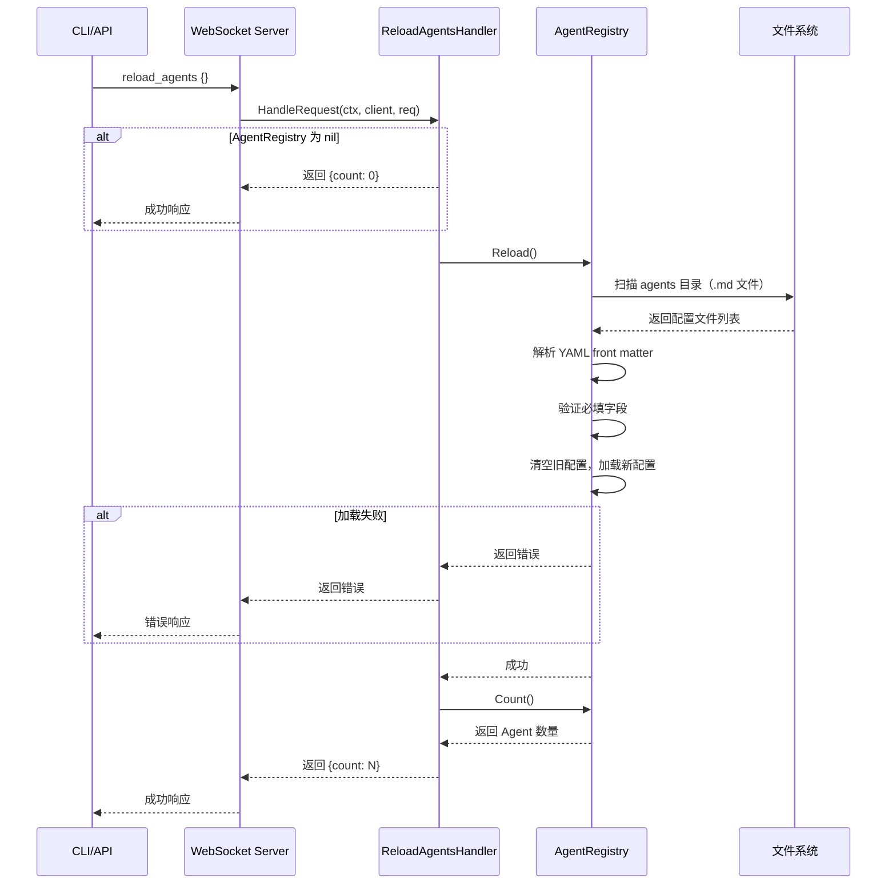
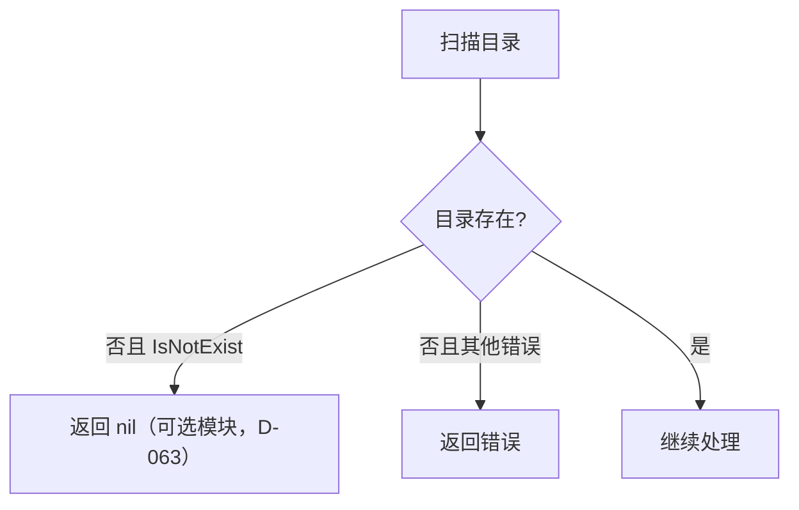
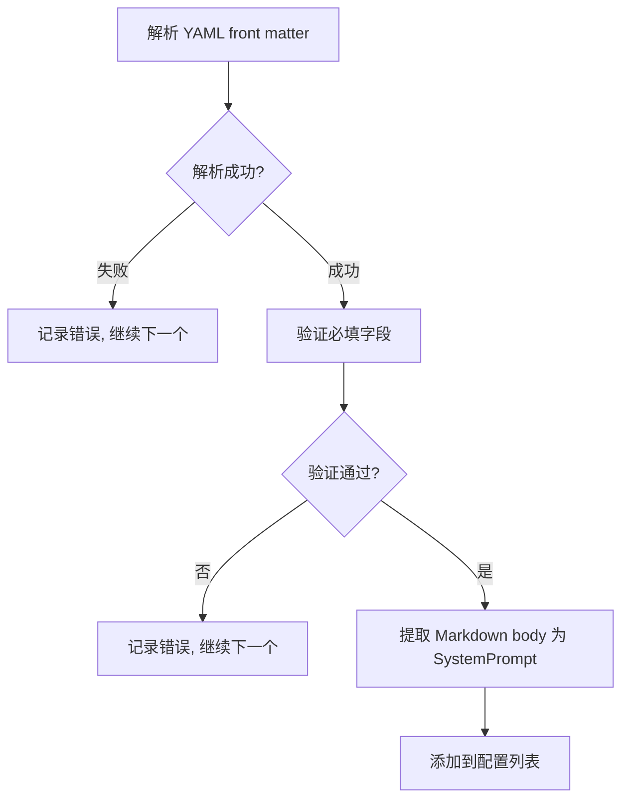
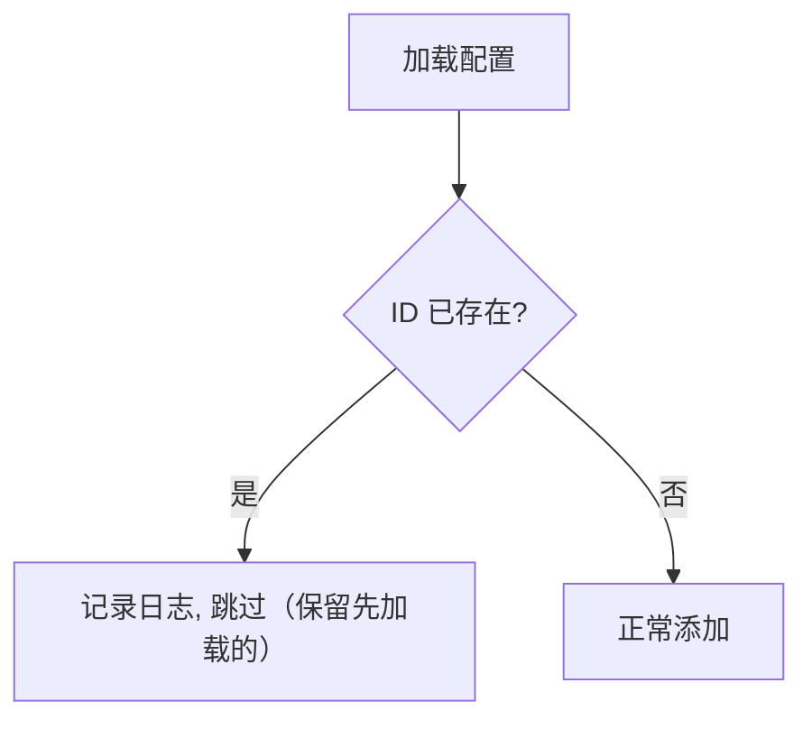
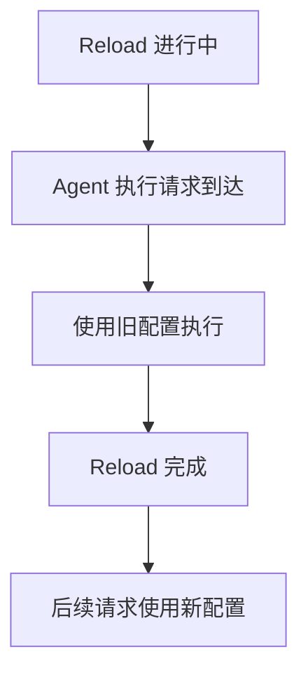

# Reload Agents 业务流程

本文档描述 `reload_agents` RPC 方法的完整业务流程，包括主流程、边缘场景和依赖关系。

---

## 目录

- [概述](#概述)
- [主流程](#主流程)
- [边缘场景](#边缘场景)
- [依赖关系](#依赖关系)
- [关键设计决策](#关键设计决策)

---

## 概述

`reload_agents` 是一个运维 RPC 方法，用于在运行时热重载 Agent 配置。它会重新扫描磁盘上的 agents 目录，加载所有 Agent 配置文件，更新 AgentRegistry。

### 触发条件

- 运维人员修改了 Agent 配置文件后，需要热更新
- CLI 调用 `reload-agents` 命令
- API 调用 `reload_agents` RPC 方法

### 关键特性

- **Hot reload**：无需重启服务器
- **Full replacement**：完全替换现有配置（清空后重新加载）
- **Nil-safe**：AgentRegistry 为 nil 时返回 count=0，不报错
- **Error propagation**：加载失败时返回错误（含目录路径信息）

---

## 主流程



### 详细步骤

1. **检查 AgentRegistry**：如果为 nil，直接返回 `{count: 0}`
2. **调用 Reload()**：读取上次加载的目录路径，调用 `Load(dir)`
3. **扫描目录**：遍历 agents 目录下的所有 `.md` 文件（跳过子目录和非 `.md` 文件）
4. **解析配置**：解析每个 `.md` 文件的 YAML front matter 为 AgentConfig（Markdown body 作为 SystemPrompt）
5. **验证配置**：检查必填字段（`id`、`name`、`model`、`api_key_env`）
6. **替换配置**：清空现有配置后加载新配置（完全替换）
7. **获取数量**：调用 `Count()` 获取已注册的 agent 数量
8. **返回结果**：返回 `{count: N}`

---

## 边缘场景

### 1. AgentRegistry 为 nil

```mermaid
flowchart TD
    A[检查 AgentRegistry] --> B{为 nil?}
    B -->|是| C[返回 {count: 0}]
    B -->|否| D[继续处理]
```

| 场景 | 处理方式 |
|------|----------|
| AgentRegistry 未初始化 | 返回 `{count: 0}`，不报错 |

**设计原因**：Agent 是可选功能，nil 表示禁用。

### 2. 目录不存在



| 场景 | 处理方式 |
|------|----------|
| agents 目录不存在 | 返回 nil（可选模块，agent 功能禁用时允许） |
| 目录无读取权限 | 返回错误 |

### 3. 配置文件解析失败



| 场景 | 处理方式 |
|------|----------|
| 无 front matter（缺少 `---` 分隔符） | 跳过该文件，记录错误日志 |
| YAML 格式错误 | 跳过该文件，记录错误日志 |
| 必填字段缺失（id/name/model/api_key_env） | 跳过该配置，记录错误日志 |
| 文件读取失败 | 跳过该文件，记录错误日志 |

### 4. 配置冲突



| 场景 | 处理方式 |
|------|----------|
| 多个文件定义同名 Agent ID | 先加载的保留，后加载的被跳过并记录日志 |
| Agent ID 来源 | 配置 front matter 中的 `id` 字段（非文件名） |

### 5. 并发访问



| 场景 | 处理方式 |
|------|----------|
| Reload 期间有 Agent 执行 | 使用旧配置执行，不影响正在进行的任务 |
| 多个 Reload 并发 | AgentRegistry 内部使用互斥锁保护 |

---

## 依赖关系

### 内部依赖

| 组件 | 用途 |
|------|------|
| `agent.AgentRegistry` | 管理 Agent 配置 |

### 外部依赖

| 组件 | 用途 |
|------|------|
| 文件系统 | 读取 Agent 配置文件 |

### 文件系统操作

| 操作 | 路径 | 说明 |
|------|------|------|
| READDIR | agents/ | 扫描目录 |
| READ | agents/*.md | 读取配置文件（YAML front matter + Markdown body） |

---

## 关键设计决策

### 1. Full Replacement

完全替换而非增量更新：
- **优点**：实现简单，无需处理删除逻辑
- **优点**：保证配置一致性
- **缺点**：重载期间可能有短暂的不一致
- **权衡**：在实际场景中，重载是低频操作，短暂不一致可接受

### 2. Nil-safe

AgentRegistry 为 nil 时返回 count=0：
- **原因**：Agent 是可选功能
- **行为**：不报错，返回空结果
- **适用场景**：未配置 Agent 功能的部署

### 3. Error Propagation

加载失败时返回错误：
- **原因**：让调用者知道重载失败
- **行为**：返回具体错误信息
- **客户端处理**：显示错误消息，检查配置文件

### 4. Hot Reload

无需重启服务器：
- **原因**：提高运维效率
- **实现**：`Reload()` 先用 `RLock` 读取目录路径，再调用 `Load()` 用 `Lock` 清空并重新加载配置
- **副作用**：正在进行的 Agent 执行使用旧配置（Build 时已拷贝 config）

---

## 配置文件格式

配置文件使用 `.md` 格式，包含 YAML front matter 和 Markdown body。

### 示例配置

```markdown
---
id: my-agent
name: My Agent
model: gpt-4
api_key_env: OPENAI_API_KEY
parameters:
  temperature: 0.7
  max_tokens: 2048
tools:
  - get_weather
  - get_current_time
---

你是一个 helpful assistant.
```

### 必填字段（Validate 检查）

| 字段 | 类型 | 说明 |
|------|------|------|
| `id` | string | Agent 唯一标识（front matter 中） |
| `name` | string | Agent 显示名称 |
| `model` | string | LLM 模型名称（用于自动检测 provider） |
| `api_key_env` | string | API Key 对应的环境变量名 |

### 可选字段

| 字段 | 类型 | 说明 |
|------|------|------|
| `description` | string | Agent 描述 |
| `base_url` | string | 自定义 LLM API 端点 |
| `parameters.temperature` | float | 生成温度 |
| `parameters.max_tokens` | int | 最大 token 数 |
| `tools` | list | 工具名称列表（从 tool registry 解析） |
| `dynamic_tools` | list | 运行时动态解析的工具名称 |
| `tool_config` | map | 每个工具的独立配置 |
| `sub_agents` | list | 子 Agent ID 列表 |
| `mcp_servers` | list | MCP 服务器连接配置 |
| Markdown body | string | 作为 SystemPrompt（非 YAML 字段） |

---

## 相关文档

- [Agent 执行流程](agent-execution.md)
- [Agent 配置](../architecture/agent-config.md)
- [CLI 命令](cli-ipc.md)
