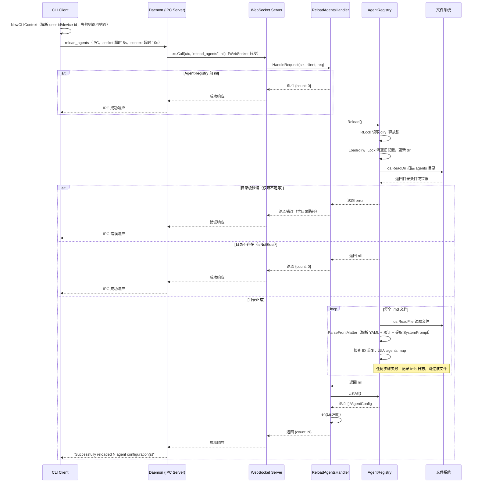
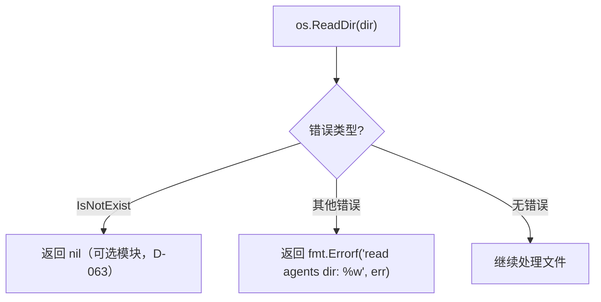
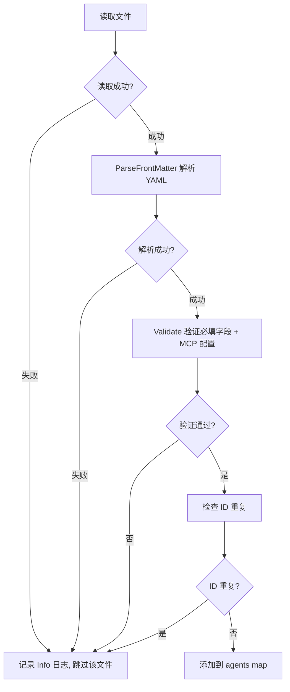
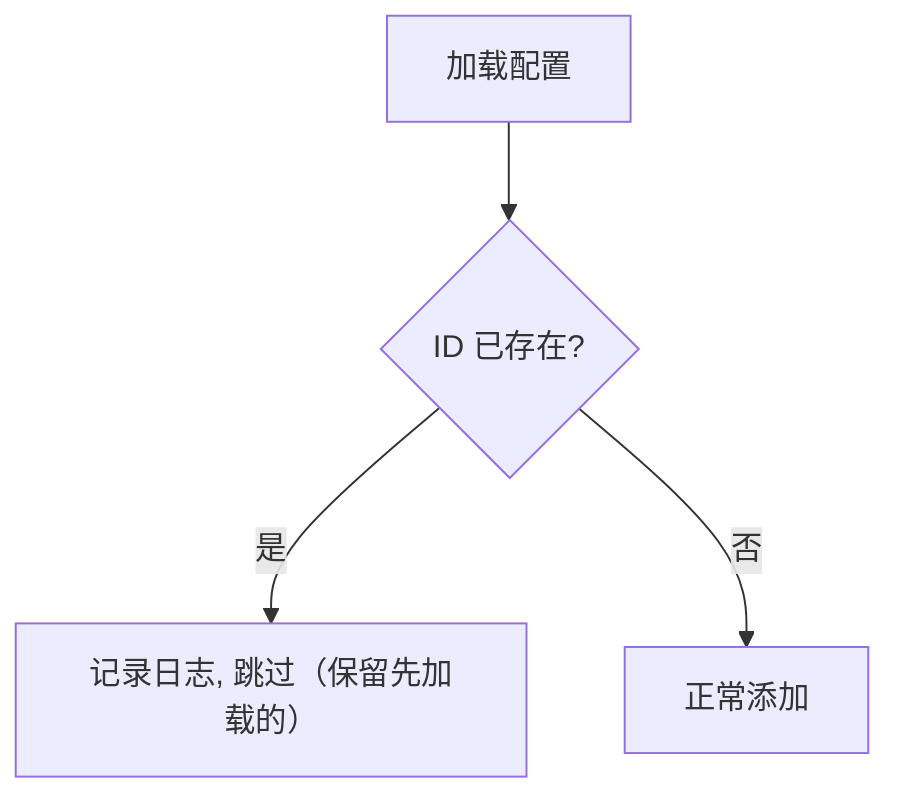
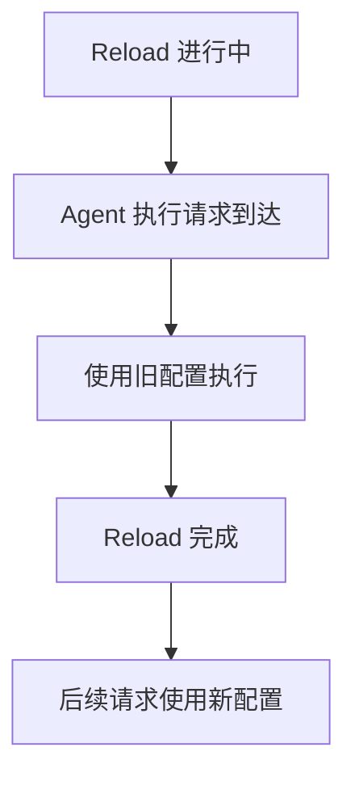

# Reload Agents 业务流程

本文档描述 `reload_agents` RPC 方法的完整业务流程，包括主流程、边缘场景和依赖关系。

---

## 目录

- [概述](#概述)
- [主流程](#主流程)
- [边缘场景](#边缘场景)
- [依赖关系](#依赖关系)
- [关键设计决策](#关键设计决策)

---

## 概述

`reload_agents` 是一个运维 RPC 方法，用于在运行时热重载 Agent 配置。它会重新扫描磁盘上的 agents 目录，加载所有 Agent 配置文件，更新 AgentRegistry。

### 触发条件

- 运维人员修改了 Agent 配置文件后，需要热更新
- CLI 调用 `reload-agents` 命令（IPC → Daemon → WebSocket 转发到服务端）
- WebSocket 客户端直接调用 `reload_agents` RPC 方法（handler 注册在 `DefaultMessageHandler` 上）

### 关键特性

- **Hot reload**：无需重启服务器
- **Full replacement**：完全替换现有配置（清空后重新加载）
- **Nil-safe**：AgentRegistry 为 nil 时返回 count=0，不报错
- **Error propagation**：加载失败时返回错误（含目录路径信息）

---

## 主流程

`reload_agents` 是守护进程专属命令（D-036/D-076），CLI 通过 IPC（Unix 域套接字）调用守护进程，守护进程再通过 WebSocket 转发到服务端执行。不支持 standalone WebSocket 降级。



### 详细步骤

**CLI 侧（IPC 调用）**：

- **CLI 入口**：`runReloadAgents()` 先调用 `NewCLIContext(cmd)` 解析 user-id/device-id（flag > env var > default），然后创建 `IPCClient`（socket 超时 5s），设置 context 超时 10s，通过 Unix 域套接字发送 `reload_agents` IPC 请求
  - 上下文解析失败（缺少 user-id 或 device-id）：返回 `reload-agents: context: {field} is required (set via --{field} flag or XYNCRA_{FIELD} env var)`
  - 用户目录创建失败（`ensureUserDir` 错误，如 `os.UserHomeDir` 或 `os.MkdirAll` 失败）：返回 `reload-agents: context: ensureUserDir: {error}`
  - 守护进程未运行：IPC 连接失败，输出 `Error: daemon not running.` 到 stderr，提示启动命令，`os.Exit(2)`（D-036/D-042）
  - 服务端返回错误：`resp.Error` 非 nil，返回 `reload-agents: {message}`
  - 结果反序列化失败：返回 `reload-agents: unmarshal result: {error}`
  - 成功：输出 `Successfully reloaded N agent configuration(s)` 到 stdout

**Daemon 侧（IPC → WebSocket 转发）**：

- **IPC Handler**：`registerIPCHandlers()` 中注册的 `reload_agents` handler 调用 `xc.Call(ctx, "reload_agents", nil)`，通过 WebSocket 转发到服务端
  - WebSocket 调用失败：返回 IPC 错误响应（code -300 或 `*client.ClientError` 的 code/message）
  - 结果反序列化失败：返回 IPC 错误响应（code -300）

**服务端侧（Handler + Registry）**：

1. **检查 AgentRegistry**：如果为 nil，直接返回 `{count: 0}`（json.Marshal 序列化），**不调用 Reload()**
2. **调用 Reload()**：用 `RLock` 读取 `dir` 字段，释放锁后调用 `Load(dir)`。释放 RLock 后到获取 Lock 之间有短暂窗口，但安全——`dir` 仅在 `Load()` 内部（持有 Lock 时）被修改，不存在并发写入风险
3. **Load() 加写锁**：`Lock()` 保护整个加载过程
4. **清空旧配置**：`r.agents = make(map[string]*AgentConfig)`，同时更新 `r.dir`
5. **扫描目录**：`os.ReadDir(dir)` 遍历目录
   - 目录不存在（`IsNotExist`）：返回 nil（视为可选模块禁用）
   - 其他目录级错误（如权限不足）：返回 error（由 handler 包装后返回给客户端）
6. **逐文件处理**：跳过子目录和非 `.md` 文件，对每个 `.md` 文件执行：
   - `os.ReadFile` 读取文件内容
   - `ParseFrontMatter` 解析 YAML front matter 并验证（内含 `Validate()` 检查必填字段和 MCP 配置）
   - 提取 Markdown body 为 `SystemPrompt`
   - 检查 ID 重复
   - **以上任何步骤失败**（读取失败、缺少 `---` 分隔符 `ErrNoFrontMatter`、YAML 解析失败 `ErrInvalidFrontMatter`、必填字段缺失 `ErrMissing*`、MCP 配置错误 `ErrMCP*`、ID 重复）：记录 Info 级日志，**跳过该文件，继续处理下一个**。这些错误不会传播给调用者。
7. **返回结果**：`Load()` 成功后（即使所有文件都被跳过），handler 调用 `len(h.registry.ListAll())` 获取数量
8. **错误包装**：仅目录级错误导致 `Load()` 返回 error，handler 用 `fmt.Errorf("reload agents from %q: %w", h.registry.Dir(), err)` 包装错误
9. **返回响应**：成功返回 `{count: N}`

---

## 边缘场景

### 1. AgentRegistry 为 nil

```mermaid
flowchart TD
    A[检查 AgentRegistry] --> B{为 nil?}
    B -->|是| C[返回 {count: 0}]
    B -->|否| D[继续处理]
```

| 场景 | 处理方式 |
|------|----------|
| AgentRegistry 未初始化 | 返回 `{count: 0}`，不报错 |

**设计原因**：Agent 是可选功能，nil 表示禁用。

### 2. 目录不存在



| 场景 | 处理方式 | 结果 |
|------|----------|------|
| agents 目录不存在 | `Load()` 内部 `os.ReadDir` 返回 `IsNotExist`，`Load()` 返回 nil | handler 报告 `{count: 0}`，不报错 |
| 目录无读取权限 | `Load()` 返回 `fmt.Errorf("read agents dir: %w", err)` | handler 包装为 `reload agents from "dir": read agents dir: ...` |

### 3. 配置文件解析失败



**关键行为**：`Load()` 对所有单个文件级错误采取 **skip + Info 日志 + 继续** 策略。这些错误不会传播给调用者。只有目录级错误（如权限不足）才会使 `Load()` 返回 error。

| 场景 | 处理方式 | 传播给调用者? |
| ---- | ---- | ---- |
| 文件读取失败 | 跳过该文件，记录 Info 级日志 | 否 |
| 无 front matter（缺少 `---` 分隔符） | 跳过该文件（`ErrNoFrontMatter`） | 否 |
| YAML 格式错误 | 跳过该文件（`ErrInvalidFrontMatter`，wrap 原始错误） | 否 |
| 必填字段缺失（id/name/model/api_key_env） | 跳过该文件（`ErrMissing*`） | 否 |
| MCP server 缺少 name | 跳过该文件（`ErrMCPMissingName`） | 否 |
| MCP server name 重复 | 跳过该文件（`ErrMCPDuplicateName`） | 否 |
| MCP transport 非 "sse"/"stdio" | 跳过该文件（`ErrInvalidMCPTransport`） | 否 |
| MCP sse 缺少 url | 跳过该文件（`ErrMCPMissingURL`） | 否 |
| MCP stdio 缺少 command | 跳过该文件（`ErrMCPMissingCommand`） | 否 |
| 目录权限不足等目录级错误 | `Load()` 返回 error | **是** |

### 4. 配置冲突



| 场景 | 处理方式 |
|------|----------|
| 多个文件定义同名 Agent ID | 先加载的保留，后加载的被跳过并记录日志 |
| Agent ID 来源 | 配置 front matter 中的 `id` 字段（非文件名） |

### 5. 并发访问



| 场景 | 处理方式 |
| ---- | ---- |
| Reload 期间有 Agent 执行 | 使用旧配置执行，不影响正在进行的任务 |
| 多个 Reload 并发 | AgentRegistry 内部使用 RWMutex 保护；`Reload()` 先用 RLock 读 dir，再用 Lock 调 `Load()` |

### 6. 目录在首次加载后被删除

| 场景 | 处理方式 |
| ---- | ---- |
| agents 目录在 `Load()` 成功后被删除 | 下次 `Reload()` 调用 `Load(dir)` 时 `os.ReadDir` 返回 `IsNotExist` 错误，`Load()` 返回 nil（视为模块禁用） |
| 结果 | 返回 `{count: 0}`，不报错 |

**行为说明**：这与首次加载时目录不存在的行为一致（D-063）。

**部分加载失败**：`Load()` 对所有单个文件级错误（读取失败、解析失败、验证失败、ID 重复）采取 skip + Info 日志 + 继续策略，不影响其他文件。只有目录级错误（如权限不足）才会使 `Load()` 返回 error。如果所有文件都被跳过，`Load()` 仍返回 nil，handler 报告 `{count: 0}`。

### 7. Reload 在 Load 之前调用（dir 为空）

| 场景 | 处理方式 |
| ---- | ---- |
| `NewRegistry()` 后直接调用 `Reload()` | `dir` 为空字符串，`Load("")` 尝试读取空路径，`os.ReadDir("")` 返回 `IsNotExist` 错误 |
| 结果 | `Load()` 返回 nil（与目录不存在行为一致），handler 报告 `{count: 0}`，不报错 |

**注意**：通过 handler 调用时，nil registry 检查仅拦截 registry 指针本身为 nil 的情况（即 `NewReloadAgentsHandler(nil)`）。若 registry 非 nil 但 `dir` 为空（如 `NewRegistry()` 后直接调用 `Reload()`），nil 检查不会拦截，仍会到达 `Reload()` 并走上述 `os.ReadDir("")` → `IsNotExist` 路径。

### 8. CLI 侧错误处理

| 场景 | 处理方式 |
| ---- | ---- |
| 缺少 user-id 或 device-id | 返回 `reload-agents: context: {field} is required (set via --{field} flag or XYNCRA_{FIELD} env var)` |
| 用户目录创建失败（`os.UserHomeDir` 或 `os.MkdirAll` 失败） | 返回 `reload-agents: context: ensureUserDir: {error}` |
| 守护进程未运行（IPC 连接失败） | 输出 `Error: daemon not running.` 到 stderr，提示启动命令，`os.Exit(2)` |
| IPC socket 连接超时（5s） | 返回 `ipc client dial: ...` 错误 |
| context 超时（10s） | 请求被取消，返回 context deadline exceeded |
| 服务端返回业务错误 | 返回 `reload-agents: {resp.Error.Message}` |
| 结果反序列化失败 | 返回 `reload-agents: unmarshal result: {error}` |

---

## 依赖关系

### 内部依赖

| 组件 | 用途 |
|------|------|
| `agent.AgentRegistry` | 管理 Agent 配置 |
| `cli.IPCClient` | CLI 通过 Unix 域套接字调用守护进程 |
| `cli.IPCServer` | 守护进程 IPC 服务端，分发请求到 handler |

### 外部依赖

| 组件 | 用途 |
|------|------|
| 文件系统 | 读取 Agent 配置文件 |
| Unix 域套接字 | IPC 通信（`~/.xyncra/{user_id}/{device_id}/xyncra.sock`） |

### 文件系统操作

| 操作 | 路径 | 说明 |
|------|------|------|
| READDIR | agents/ | 扫描目录 |
| READ | agents/*.md | 读取配置文件（YAML front matter + Markdown body） |

---

## 关键设计决策

### 1. Full Replacement

完全替换而非增量更新：
- **优点**：实现简单，无需处理删除逻辑
- **优点**：保证配置一致性
- **缺点**：重载期间可能有短暂的不一致
- **权衡**：在实际场景中，重载是低频操作，短暂不一致可接受

### 2. Nil-safe

AgentRegistry 为 nil 时返回 count=0：
- **原因**：Agent 是可选功能
- **行为**：不报错，返回空结果
- **适用场景**：未配置 Agent 功能的部署

### 3. Error Propagation

仅目录级错误（如权限不足、路径无效）传播给调用者：

- **原因**：目录级错误表示 Agent 功能无法工作，调用者需要知道
- **行为**：handler 用 `fmt.Errorf("reload agents from %q: %w", h.registry.Dir(), err)` 包装错误
- **客户端处理**：显示错误消息，检查目录路径和权限

单个文件级错误（解析失败、验证失败、ID 重复等）**不传播**：

- **原因**：部分文件失败不应阻止其他有效配置的加载
- **行为**：记录 Info 级日志，跳过该文件，继续处理下一个
- **结果**：如果所有文件都被跳过，返回 `{count: 0}` 而非错误

### 4. Hot Reload

无需重启服务器：
- **原因**：提高运维效率
- **实现**：`Reload()` 先用 `RLock` 读取目录路径，再调用 `Load()` 用 `Lock` 清空并重新加载配置
- **副作用**：正在进行的 Agent 执行使用旧配置（Build 时已拷贝 config）

---

## 配置文件格式

配置文件使用 `.md` 格式，包含 YAML front matter 和 Markdown body。

### 示例配置

```markdown
---
id: my-agent
name: My Agent
model: gpt-4
api_key_env: OPENAI_API_KEY
parameters:
  temperature: 0.7
  max_tokens: 2048
tools:
  - get_weather
  - get_current_time
---

你是一个 helpful assistant.
```

### 必填字段（Validate 检查）

| 字段 | 类型 | 说明 |
| ---- | ---- | ---- |
| `id` | string | Agent 唯一标识（front matter 中） |
| `name` | string | Agent 显示名称 |
| `model` | string | LLM 模型名称（用于自动检测 provider） |
| `api_key_env` | string | API Key 对应的环境变量名 |

### 可选字段

| 字段 | 类型 | 说明 |
| ---- | ---- | ---- |
| `description` | string | Agent 描述 |
| `base_url` | string | 自定义 LLM API 端点 |
| `parameters.temperature` | float | 生成温度 |
| `parameters.max_tokens` | int | 最大 token 数 |
| `parameters.top_p` | float | nucleus sampling 参数 |
| `context.max_tokens` | int | 上下文窗口最大 token 数 |
| `context.max_messages` | int | 上下文最大消息数 |
| `tools` | list | 工具名称列表（从 tool registry 解析） |
| `dynamic_tools` | list | 运行时动态解析的工具名称 |
| `tool_config` | map | 每个工具的独立配置（key 为工具名） |
| `middleware` | object | Eino 中间件开关（见下表） |
| `sub_agents` | list | 子 Agent ID 列表 |
| `mcp_servers` | list | MCP 服务器连接配置（见下表） |
| Markdown body | string | 作为 SystemPrompt（非 YAML 字段） |

### middleware 子字段

| 字段 | 类型 | 默认值 | 说明 |
| ---- | ---- | ------ | ---- |
| `enable_summarization` | bool | false | 启用上下文摘要中间件 |
| `summarization_tokens` | int | 160000 | 触发摘要的 token 阈值 |
| `enable_tool_reduction` | bool | false | 启用工具缩减中间件 |
| `tool_reduction_max_chars` | int | 50000 | 工具描述最大字符数 |
| `enable_patch_tool_calls` | bool | false | 启用工具调用修补 |
| `enable_client_tools` | bool | false | 启用客户端设备函数注入为 Agent 工具 |
| `client_tools` | object | - | 客户端工具配置（function_tags, excluded_functions, call_timeout） |

### mcp_servers 子字段

| 字段 | 类型 | 说明 |
| ---- | ---- | ---- |
| `name` | string | **必填**，服务器名称（不可重复） |
| `transport` | string | **必填**，传输方式：`"sse"` 或 `"stdio"` |
| `url` | string | SSE 端点地址（transport=sse 时必填） |
| `command` | string | stdio 命令（transport=stdio 时必填） |
| `args` | list | stdio 命令参数 |
| `env` | list | stdio 环境变量 |
| `tools` | list | 过滤特定工具（空 = 全部） |

---

## 相关文档

- [Agent 注册与加载](agent.md) — `AgentRegistry` 的 `Load()`、`Reload()`、`Get()`、`ListAll()` 等方法的详细行为
- [CLI 命令](cli-ipc.md) — `reload-agents` CLI 命令的 IPC 调用流程（第 16 节）
- [Agent 执行流程](agent-execution.md)
- [设计决策](../architecture/design-decisions.md)
