# Remote Calling 机制设计

本文档描述 Xyncra 的统一远程函数调用机制（Remote Calling）。该机制统一了 HITL（用户输入）和客户端函数调用，Agent 不关心函数在哪里执行，只负责调用并等待结果。

## 相关文档

| 文档 | 说明 |
|------|------|
| [function-registry.md](function-registry.md) | 函数注册与动态工具注入 |
| [client-registration.md](client-registration.md) | 客户端连接与函数管理 |
| [sync-updates.md](sync-updates.md) | 同步更新机制 |

---

## 核心概念

### 统一模型

所有需要等待外部结果的操作都是 **Remote Calling**：

| 场景 | 方法名 | 说明 |
|------|--------|------|
| 用户输入 | `ask_user` | 弹窗让用户输入 |
| 用户选择 | `ask_user_choice` | 弹窗让用户选择 |
| 客户端函数 | `pg_chatai_sendMessage` | 调用客户端操作 UI |
| 外部服务 | `get_weather` | 调用外部 API |

**没有类型区分**，方法名本身就说明了函数的语义。

### 设计原则

1. **全走 Update 机制**: 无论 DeviceID 是否为空，都通过 Update 同步到客户端
2. **拉取模型**: 客户端检测 Conversation 变更 → 主动拉取 RemoteCallings
3. **客户端过滤**: 拉取全部 RemoteCallings，本地按 DeviceID 过滤
4. **与 Question 机制一致**: 只是扩展了 DeviceID 字段

---

## 数据模型

### RemoteCalling

```go
type RemoteCalling struct {
    ID             string     `json:"id"`              // 唯一标识 (UUID)
    ConversationID string     `json:"conversation_id"` // 所属会话
    CheckpointID   string     `json:"checkpoint_id"`   // 关联的 checkpoint
    AgentID        string     `json:"agent_id"`        // 执行的 Agent

    // 函数信息
    Method         string     `json:"method"`          // 函数名
    Params         string     `json:"params"`          // 函数参数 (JSON)

    // 设备路由 (客户端过滤用)
    DeviceID       string     `json:"device_id"`       // 空 = 任意设备, 非空 = 指定设备

    // 状态
    Status         string     `json:"status"`          // "pending" | "resolved" | "cancelled" | "expired"
    Result         string     `json:"result"`          // 函数返回值 (成功时)
    ErrorMessage   string     `json:"error_message"`   // 错误信息 (失败时)
    Success        bool       `json:"success"`         // 是否成功

    // 时间
    CreatedAt      time.Time  `json:"created_at"`
    ResolvedAt     *time.Time `json:"resolved_at"`
    ExpiresAt      *time.Time `json:"expires_at"`

    // 取消
    CancelledAt    *time.Time `json:"cancelled_at"`
    CancelledBy    string     `json:"cancelled_by"`
    CancelReason   string     `json:"cancel_reason"`
}
```

### 状态流转

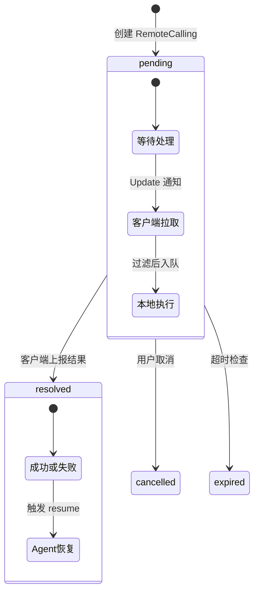

### 状态触发说明

| 状态 | 触发条件 | 触发方 | 说明 |
| --- | --- | --- | --- |
| **pending** | Agent 调用函数 | 服务端 | 创建 RemoteCalling 记录，更新 Conversation |
| **resolved** | 客户端上报结果 | 客户端 | 调用 agent_resume RPC，携带 success/result/error |
| **cancelled** | 用户取消 | 客户端 | 取消该 checkpoint 下所有 pending 调用 |
| **expired** | 超时检查 | 服务端 | 后台任务检查 expires_at，过期自动标记 |

### 详细触发流程

#### pending -> resolved

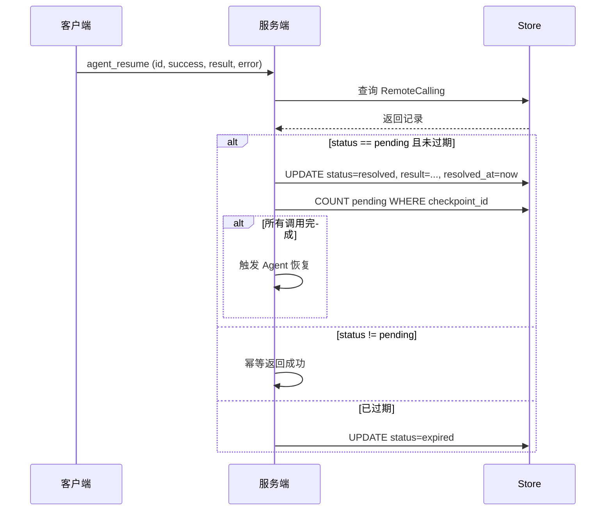

#### pending -> cancelled

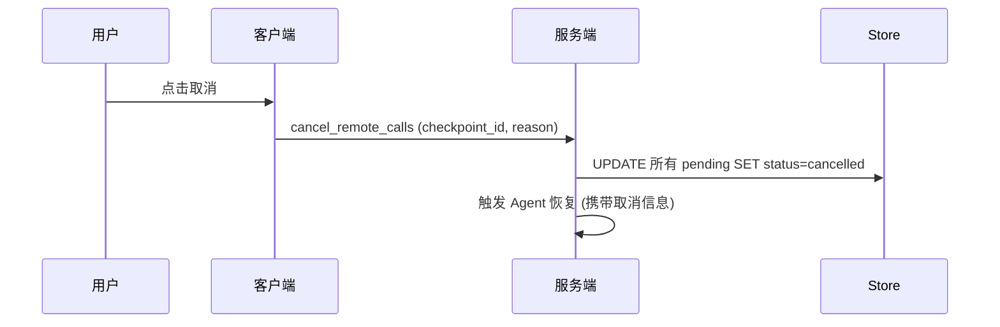

#### pending -> expired

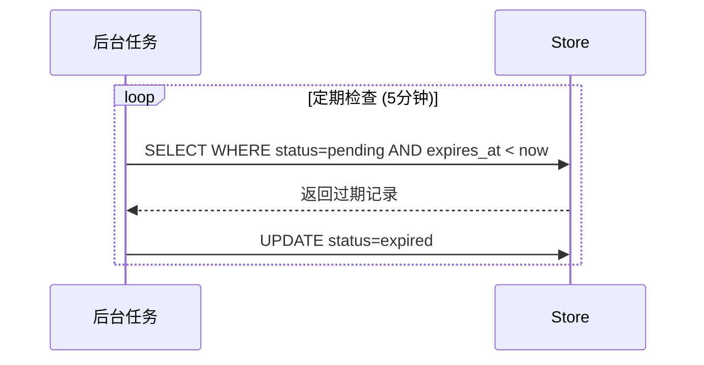

---

## 函数注册与发现

### 设计决策

1. **客户端动态注册**: 函数在客户端运行时注册，不是静态配置
2. **必须支持的函数**: 客户端必须实现 `list_function` 和 `ask_user_question`
3. **页面级注册**: 函数按页面/上下文注册，不是一次性注册全部
4. **客户端定义元数据**: 名称、描述、参数 Schema 由客户端定义

### 注册流程

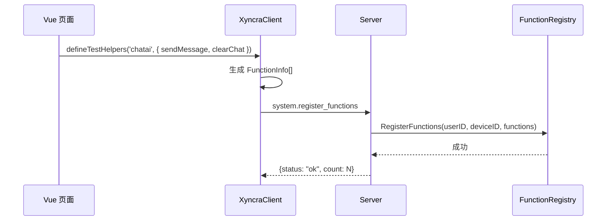

### 函数命名规则

```text
格式: pg_{pageKey}_{functionName}
示例: pg_chatai_sendMessage, pg_dashboard_refreshCharts
```

### 必须实现的函数

| 函数名 | 说明 |
| --- | --- |
| `list_function` | 列出设备支持的所有函数 |
| `ask_user_question` | 弹窗让用户输入 |

---

## 执行流程

### 完整时序图

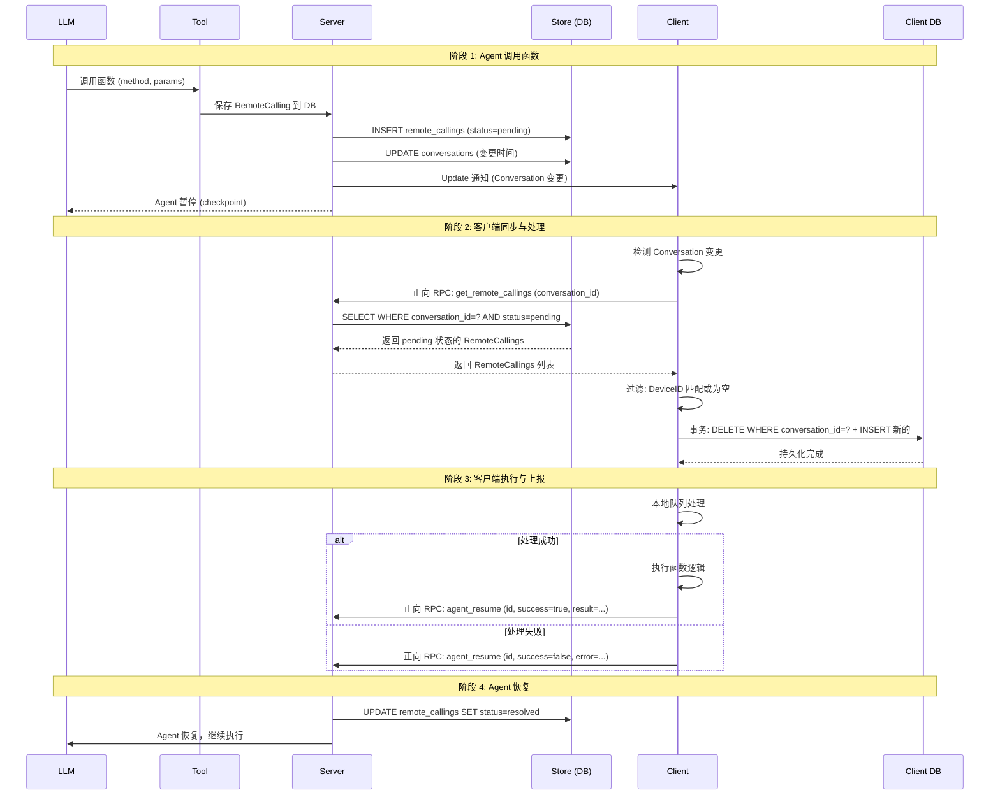

### 客户端处理流程

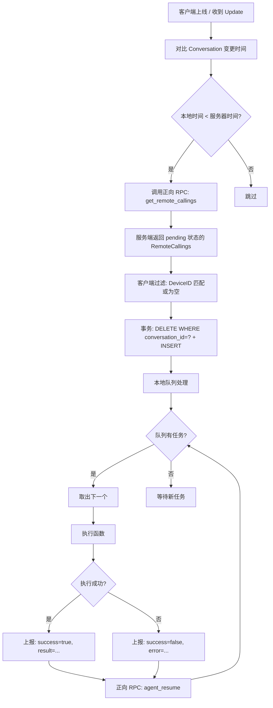

### 超时配置

| 级别 | 配置方式 | 说明 |
|------|----------|------|
| 全局超时 | 服务端配置 | 所有 RemoteCalling 的默认超时 |
| 函数级超时 | LLM 决定 | 覆盖全局超时 |

```go
// LLM 调用工具时可指定超时
tool_call := ToolCall{
    Method: "pg_chatai_sendMessage",
    Params: `{"content": "Hello"}`,
    Timeout: 30000, // 30秒，覆盖全局默认
}
```

---

## 结果上报

### 上报协议

客户端通过正向 RPC 调用恢复接口，传递执行结果：

```go
type RemoteCallResultRequest struct {
    ID           string `json:"id"`             // RemoteCalling ID
    Success      bool   `json:"success"`        // 是否成功
    Result       string `json:"result"`         // 成功时的结果 (JSON string)
    ErrorMessage string `json:"error_message"`  // 失败时的错误信息
}
```

### 服务端处理

```go
// 获取 RemoteCallings (客户端拉取)
func (h *Handler) HandleGetRemoteCallings(ctx context.Context, client *Client, req *GetRemoteCallingsRequest) {
    // 只返回 pending 状态的，按 conversation_id 过滤
    callings, _ := h.store.ListPendingByConversation(ctx, req.ConversationID)
    return callings
}

// 上报结果 (客户端恢复)
func (h *Handler) HandleAgentResume(ctx context.Context, client *Client, req *AgentResumeRequest) {
    // 1. 获取 RemoteCalling
    rc, _ := h.store.Get(ctx, req.ID)
    if rc == nil {
        return // 不存在
    }

    // 2. 幂等检查
    if rc.Status != "pending" {
        return // 已处理
    }

    // 3. 过期检查
    if rc.ExpiresAt != nil && time.Now().After(*rc.ExpiresAt) {
        h.store.UpdateStatus(ctx, req.ID, "expired")
        return // 已过期
    }

    // 4. 更新结果
    h.store.UpdateResult(ctx, req.ID, req.Success, req.Result, req.ErrorMessage)

    // 5. 检查是否所有调用完成 (按 conversation_id 过滤)
    pending, _ := h.store.CountPendingByConversation(ctx, rc.ConversationID)
    if pending == 0 {
        // 触发 agent_resume
        h.triggerAgentResume(ctx, rc.ConversationID)
    }
}
```

---

## 边缘场景

### 已过期

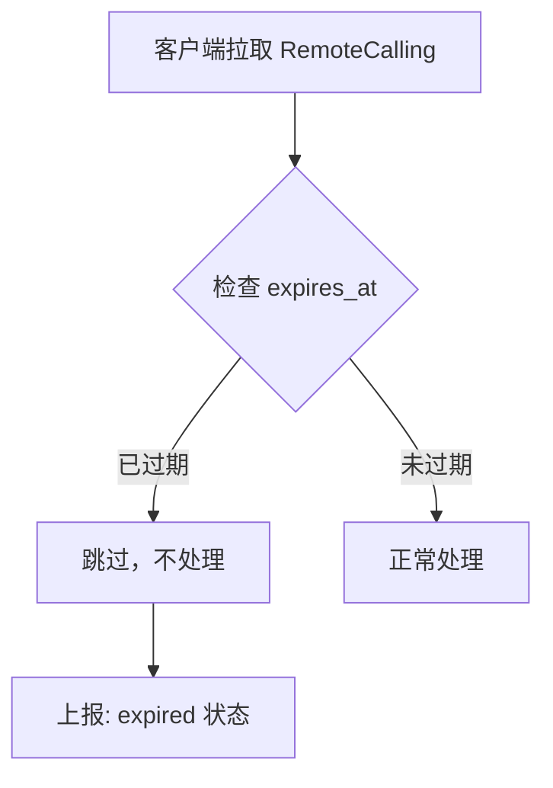

### 已被处理（幂等）

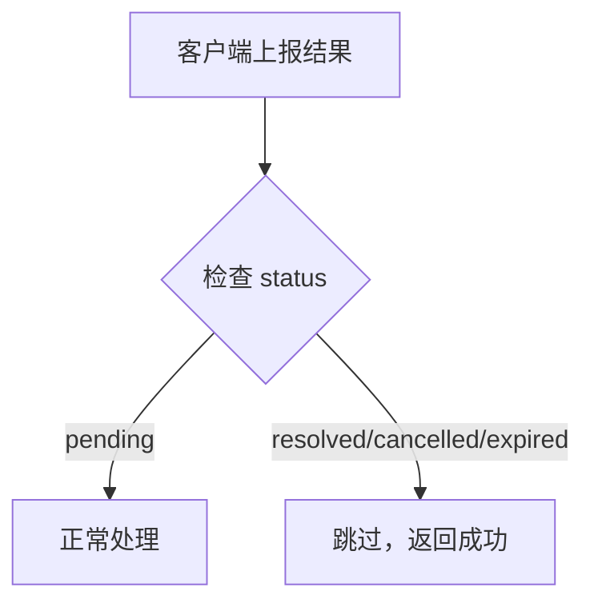

### 服务端重启

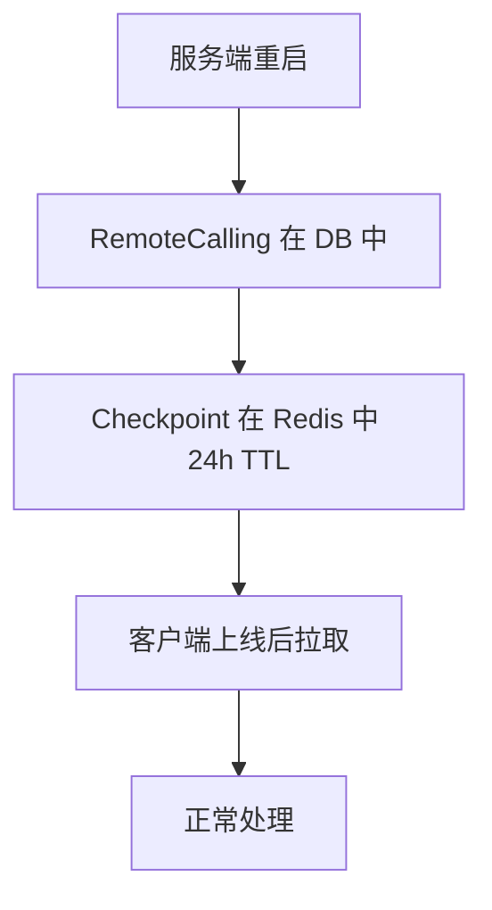

### 上报失败重试

客户端调用 `agent_resume` 上报结果时，如果服务端返回错误（服务端问题），客户端必须无限重试，直到服务端返回成功。

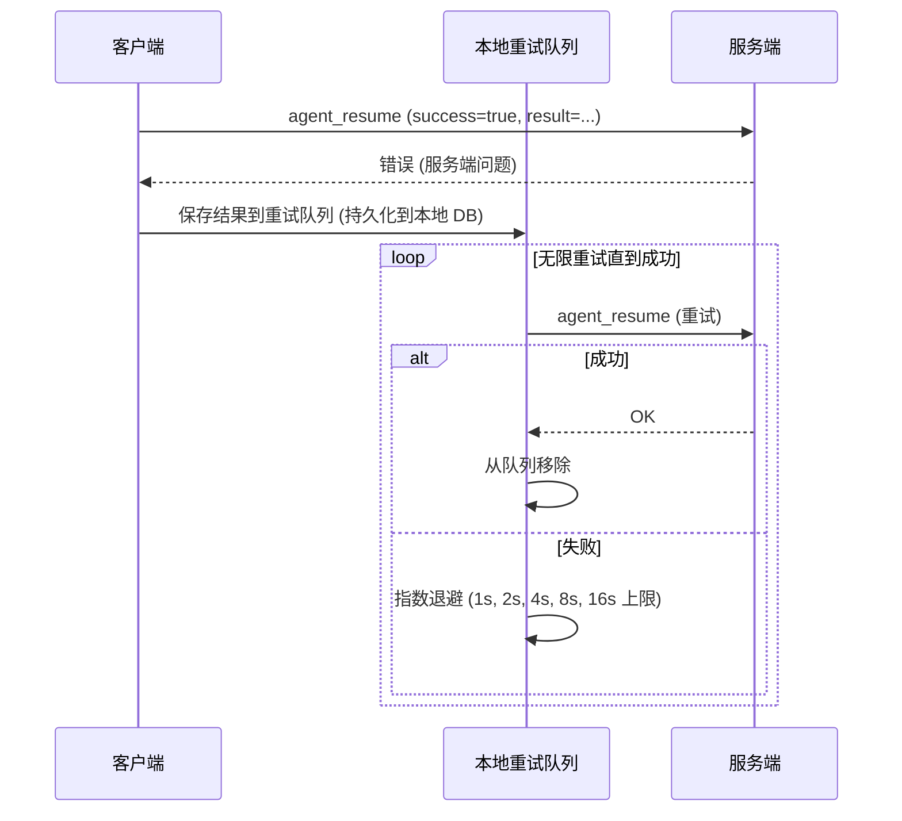

**设计原则**：客户端已执行函数，结果不能丢失。必须无限重试直到服务端确认。

**退避策略**：指数退避，上限 16 秒。

| 重试次数 | 等待时间 |
| --- | --- |
| 1 | 1s |
| 2 | 2s |
| 3 | 4s |
| 4 | 8s |
| 5+ | 16s (上限) |

**持久化**：重试队列必须持久化到本地 DB，客户端重启后继续重试。

---

## 与现有机制的关系

### 对比

| 维度 | 现有 HITL | Remote Calling |
|------|-----------|----------------|
| 模型 | Question | RemoteCalling |
| 路由 | 用户级 (Update) | 用户级 (Update)，客户端按 DeviceID 过滤 |
| 触发 | 用户手动回答 | 客户端自动处理 |
| 存储 | DB (questions 表) | DB (remote_callings 表) |
| 恢复 | agent_resume RPC | agent_resume RPC (扩展) |

### 迁移路径

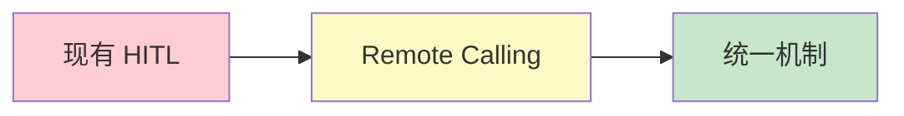

1. **Phase 1**: 实现 Remote Calling 基础框架
2. **Phase 2**: 将 HITL 迁移到 Remote Calling
3. **Phase 3**: 移除旧的 Question 机制

---

## 待讨论

| 问题 | 状态 |
|------|------|
| 取消机制 | 待讨论 |
| 并行执行策略 | 客户端决定 |
| 超时默认值 | 待定 |
| 函数发现 API | 待定 |
