# Remote Calling 机制设计

本文档描述 Xyncra 的统一远程函数调用机制（Remote Calling）。该机制统一了 HITL（用户输入）和客户端函数调用，Agent 不关心函数在哪里执行，只负责调用并等待结果。

## 相关文档

| 文档 | 说明 |
|------|------|
| [function-registry.md](function-registry.md) | 函数注册与动态工具注入 |
| [client-registration.md](client-registration.md) | 客户端连接与函数管理 |
| [sync-updates.md](sync-updates.md) | 同步更新机制 |

---

## 核心概念

### 统一模型

所有需要等待外部结果的操作都是 **Remote Calling**：

| 场景 | 方法名 | 说明 |
|------|--------|------|
| 用户输入 | `ask_user` | 弹窗让用户输入 |
| 用户选择 | `ask_user_choice` | 弹窗让用户选择 |
| 客户端函数 | `pg_chatai_sendMessage` | 调用客户端操作 UI |
| 外部服务 | `get_weather` | 调用外部 API |

**没有类型区分**，方法名本身就说明了函数的语义。

### 设计原则

1. **全走 Update 机制**: 无论 DeviceID 是否为空，都通过 Update 同步到客户端
2. **拉取模型**: 客户端检测 Conversation 变更 → 主动拉取 RemoteCallings
3. **客户端过滤**: 拉取全部 RemoteCallings，本地按 DeviceID 过滤
4. **与 Question 机制一致**: 只是扩展了 DeviceID 字段

---

## 完整链路流程图

以下流程图展示 Remote Calling 从创建到完成的完整生命周期，包含多设备同步场景。

### 全链路时序图

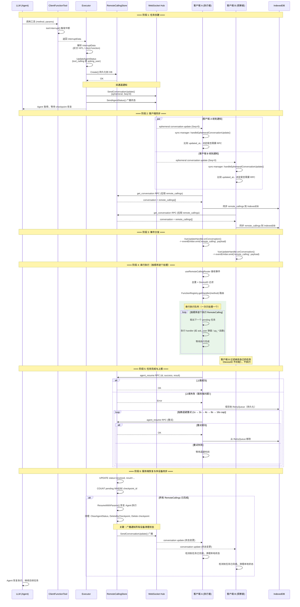
```mermaid
sequenceDiagram
    participant LLM as LLM (Agent)
    participant Tool as ClientFunctionTool
    participant Executor as Executor
    participant Store as RemoteCallingStore
    participant WS as WebSocket Hub
    participant ClientA as 客户端 A (执行者)
    participant ClientB as 客户端 B (观察者)
    participant ClientDB as IndexedDB

    Note over LLM, ClientDB: ═══ 阶段 1: 任务创建 ═══

    LLM->>Tool: 调用工具 (method, params)
    Tool->>Tool: tool.Interrupt() 触发中断
    Tool-->>Executor: 返回 interruptData

    Executor->>Executor: 解析 interruptData<br/>(区分 HITL / client function)
    Executor->>Executor: UpdateAgentStatus<br/>(tool_calling 或 asking_user)

    Executor->>Store: Create() 持久化到 DB
    Store-->>Executor: OK

    Note over Executor, WS: 双通道通知
    Executor->>WS: SendConversationUpdate()<br/>(ephemeral, Seq=0)
    Executor->>WS: SendAgentStatus() 广播状态
    Executor-->>LLM: Agent 暂停，等待 checkpoint 恢复

    Note over LLM, ClientDB: ═══ 阶段 2: 客户端同步 ═══

    par 客户端 A 收到通知
        WS-->>ClientA: ephemeral conversation update (Seq=0)
        ClientA->>ClientA: sync-manager: handleEphemeralConversationUpdate()
        ClientA->>ClientA: 比较 updated_at，决定是否需要 RPC
    and 客户端 B 收到通知
        WS-->>ClientB: ephemeral conversation update (Seq=0)
        ClientB->>ClientB: sync-manager: handleEphemeralConversationUpdate()
        ClientB->>ClientB: 比较 updated_at，决定是否需要 RPC
    end

    ClientA->>Store: get_conversation RPC (拉取 remote_callings)
    Store-->>ClientA: conversation + remote_callings[]

    ClientA->>ClientDB: 同步 remote_callings 到 IndexedDB

    ClientB->>Store: get_conversation RPC (拉取 remote_callings)
    Store-->>ClientB: conversation + remote_callings[]

    ClientB->>ClientDB: 同步 remote_callings 到 IndexedDB

    Note over LLM, ClientDB: ═══ 阶段 3: 事件分发 ═══

    ClientA->>ClientA: VueUpdateHandler.onConversation()<br/>-> eventEmitter.emit('remote_calling', payload)
    ClientB->>ClientB: VueUpdateHandler.onConversation()<br/>-> eventEmitter.emit('remote_calling', payload)

    Note over LLM, ClientDB: ═══ 阶段 4: 串行执行（按顺序逐个处理）═══

    ClientA->>ClientA: useRemoteCallingRouter 接收事件
    ClientA->>ClientA: 去重 + DeviceID 过滤
    ClientA->>ClientA: FunctionRegistry.getHandler(method) 路由

    rect rgb(232, 245, 233)
        Note over ClientA: 串行执行队列（一次只处理一个）
        loop 按顺序逐个执行 RemoteCalling
            ClientA->>ClientA: 取出下一个 pending 任务
            ClientA->>ClientA: 执行 handler (如 ask_user 弹窗 / pg_* 函数)
            ClientA->>ClientA: 等待执行完成
        end
    end

    Note over ClientB: 客户端 B 过滤掉非自己的任务<br/>（DeviceID 不匹配），不执行

    Note over LLM, ClientDB: ═══ 阶段 5: 任务完成与上报 ═══

    ClientA->>Store: agent_resume RPC (id, success, result)

    alt 上报成功
        Store-->>ClientA: OK
    else 上报失败（服务端问题）
        Store-->>ClientA: Error
        ClientA->>ClientDB: 保存到 RetryQueue（持久化）
        loop 指数退避重试 (1s → 2s → 4s → 8s → 16s cap)
            ClientA->>Store: agent_resume RPC (重试)
            alt 重试成功
                Store-->>ClientA: OK
                ClientA->>ClientDB: 从 RetryQueue 移除
            else 重试失败
                ClientA->>ClientA: 等待退避时间
            end
        end
    end

    Note over LLM, ClientDB: ═══ 阶段 6: 服务端恢复与多设备同步 ═══

    Store->>Store: UPDATE status=resolved, result=...
    Store->>Store: COUNT pending WHERE checkpoint_id

    alt 所有 RemoteCallings 已完成
        Store->>Store: ResumeWithParams() 恢复 Agent 执行
        Store->>Store: 清理: ClearAgentStatus, DeleteByCheckpoint, Delete checkpoint

        Note over Store, WS: 关键：广播通知所有设备清理状态
        Store->>WS: SendConversationUpdate() 广播
        WS-->>ClientA: conversation update (状态变更)
        WS-->>ClientB: conversation update (状态变更)

        ClientA->>ClientA: 检测到任务已完成，清理本地状态
        ClientB->>ClientB: 检测到任务已完成，清理本地状态
    end

    LLM->>LLM: Agent 恢复执行，继续后续任务
```

### 流程要点说明

| 阶段 | 关键行为 | 说明 |
|------|----------|------|
| 任务创建 | `tool.Interrupt()` 触发中断 | Agent 暂停，等待 checkpoint 恢复 |
| 客户端同步 | ephemeral update (Seq=0) 触发 RPC 拉取 | 拉取模型，客户端主动同步 |
| 事件分发 | `eventEmitter.emit('remote_calling')` | 统一事件总线分发 |
| 串行执行 | 按顺序逐个处理队列中的任务 | **所有 RemoteCallings 必须串行执行** |
| 任务完成 | `agent_resume` RPC + 指数退避重试 | 结果不能丢失，无限重试直到成功 |
| 服务端恢复 | ResumeWithParams + WebSocket 广播 | **正向 RPC 响应 + WebSocket 推送双通道** |

### 双通道状态同步机制

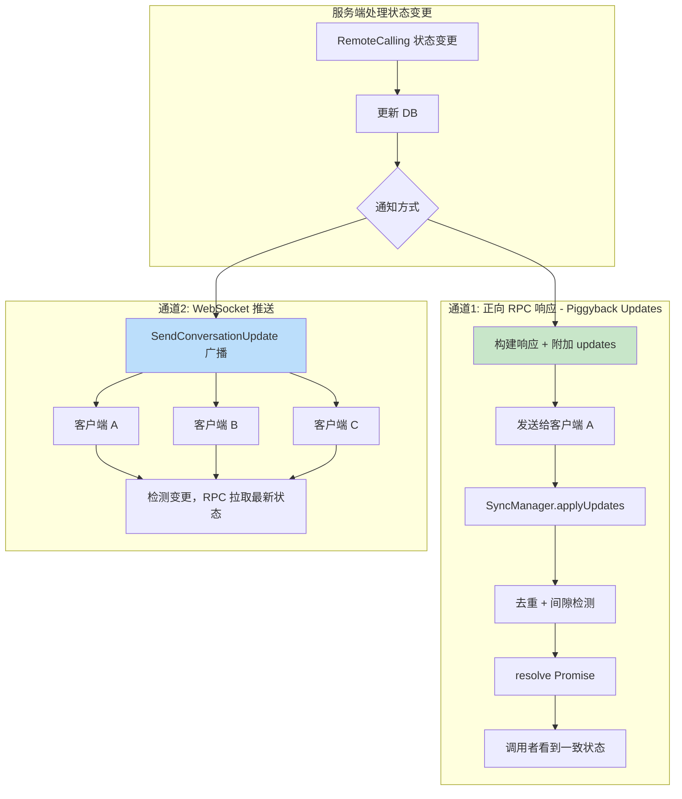
```mermaid
flowchart TD
    subgraph 服务端处理状态变更
        A[RemoteCalling 状态变更] --> B[更新 DB]
        B --> C{通知方式}
    end

    subgraph 通道1: 正向 RPC 响应 - Piggyback Updates
        C --> D[构建响应 + 附加 updates]
        D --> E[发送给客户端 A]
        E --> F[SyncManager.applyUpdates]
        F --> G[去重 + 间隙检测]
        G --> H[resolve Promise]
        H --> I[调用者看到一致状态]
    end

    subgraph 通道2: WebSocket 推送
        C --> J[SendConversationUpdate 广播]
        J --> K[客户端 A]
        J --> L[客户端 B]
        J --> M[客户端 C]
        K --> N[检测变更，RPC 拉取最新状态]
        L --> N
        M --> N
    end

    style D fill:#c8e6c9
    style J fill:#bbdefb
```

**设计要点**：
1. **正向 RPC 响应**：发起请求的客户端通过 RPC 响应直接获得更新，延迟最低
2. **WebSocket 推送**：同一账号的所有设备（包括未发起请求的设备）都能收到状态变更通知
3. **两者并行**：服务端处理完状态变更后，同时走两个通道，确保所有设备同步

### 响应携带 Updates 处理流程 (Piggyback Updates)

当服务端处理 RPC 请求时，如果产生了状态变更（如 RemoteCalling 状态更新），可以将相关的 Updates 直接附加在 RPC 响应中返回给客户端。这种方式称为 **Piggyback Updates**，相比独立的 WebSocket 推送通道，延迟更低且保证了因果顺序。

#### 协议格式

```typescript
// PackageDataResponse — 服务端回复 RPC 调用
interface PackageDataResponse {
  id: string;       // 关联原始请求
  code: number;     // 0 = 成功, 负数 = 错误
  msg: string;      // 人类可读状态
  data: unknown;    // 响应数据
  updates?: PackageDataUpdate[];  // 可选：piggyback updates
}

// PackageDataUpdate — 单个增量变更
interface PackageDataUpdate {
  seq: number;        // 排序序列 (0 = ephemeral)
  type: string;       // "message", "conversation", "agent_status", 等
  payload: unknown;   // 实际数据
  created_at?: string;
}
```

#### 客户端处理时序图

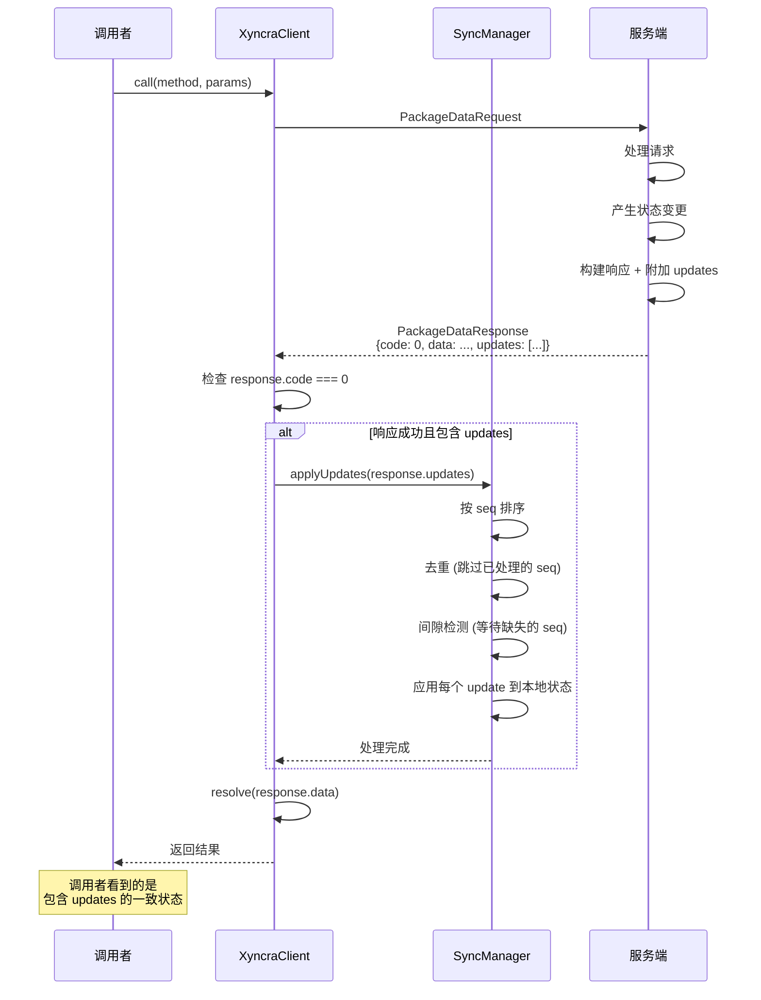
```mermaid
sequenceDiagram
    participant Caller as 调用者
    participant Client as XyncraClient
    participant SM as SyncManager
    participant Server as 服务端

    Caller->>Client: call(method, params)
    Client->>Server: PackageDataRequest

    Server->>Server: 处理请求
    Server->>Server: 产生状态变更
    Server->>Server: 构建响应 + 附加 updates

    Server-->>Client: PackageDataResponse<br/>{code: 0, data: ..., updates: [...]}

    Client->>Client: 检查 response.code === 0

    alt 响应成功且包含 updates
        Client->>SM: applyUpdates(response.updates)
        SM->>SM: 按 seq 排序
        SM->>SM: 去重 (跳过已处理的 seq)
        SM->>SM: 间隙检测 (等待缺失的 seq)
        SM->>SM: 应用每个 update 到本地状态
        SM-->>Client: 处理完成
    end

    Client->>Client: resolve(response.data)
    Client-->>Caller: 返回结果

    Note over Caller: 调用者看到的是<br/>包含 updates 的一致状态
```

#### 关键设计要点

| 要点 | 说明 |
|------|------|
| **顺序保证** | Piggyback updates 在响应 Promise resolve **之前**处理，确保调用者看到一致的状态 |
| **幂等安全** | `SyncManager.applyUpdate()` 基于 seq 去重，通过 piggyback 和 WebSocket 重复到达的 updates 不会产生副作用 |
| **间隙检测** | 如果 piggyback updates 中存在 seq 间隙，客户端会等待 WebSocket 通道补齐缺失的 updates |
| **降级兼容** | `updates` 字段可选，服务端不附加时客户端行为不变 |
| **双通道并行** | 服务端同时通过 piggyback 和 WebSocket 两个通道推送 updates，确保所有设备同步 |

---

## 数据模型

### RemoteCalling

```go
type RemoteCalling struct {
    ID             string     `json:"id"`              // 唯一标识 (UUID)
    ConversationID string     `json:"conversation_id"` // 所属会话
    CheckpointID   string     `json:"checkpoint_id"`   // 关联的 checkpoint
    AgentID        string     `json:"agent_id"`        // 执行的 Agent

    // 函数信息
    Method         string     `json:"method"`          // 函数名
    Params         string     `json:"params"`          // 函数参数 (JSON)

    // 设备路由 (客户端过滤用)
    InterruptID    string     `json:"interrupt_id"`    // Eino interrupt ID (ask_user 专用)
    DeviceID       string     `json:"device_id"`       // 空 = 任意设备, 非空 = 指定设备

    // 状态
    Status         string     `json:"status"`          // "pending" | "resolved" | "cancelled" | "expired"
    Result         string     `json:"result"`          // 函数返回值 (成功时)
    ErrorMessage   string     `json:"error_message"`   // 错误信息 (失败时)
    Success        bool       `json:"success"`         // 是否成功

    // 时间
    CreatedAt      time.Time  `json:"created_at"`
    ResolvedAt     *time.Time `json:"resolved_at"`
    ExpiresAt      *time.Time `json:"expires_at"`

    // 取消
    CancelledAt    *time.Time `json:"cancelled_at"`
    CancelledBy    string     `json:"cancelled_by"`
    CancelReason   string     `json:"cancel_reason"`
}
```

### 状态流转

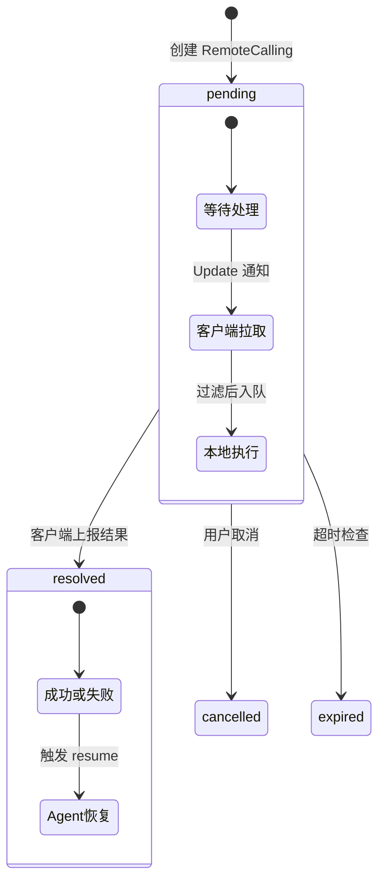
```mermaid
stateDiagram-v2
    [*] --> pending: 创建 RemoteCalling
    pending --> resolved: 客户端上报结果
    pending --> cancelled: 用户取消
    pending --> expired: 超时检查

    state pending {
        [*] --> 等待处理
        等待处理 --> 客户端拉取: Update 通知
        客户端拉取 --> 本地执行: 过滤后入队
    }

    state resolved {
        [*] --> 成功或失败
        成功或失败 --> Agent恢复: 触发 resume
    }
```

### 状态触发说明

| 状态 | 触发条件 | 触发方 | 说明 |
| --- | --- | --- | --- |
| **pending** | Agent 调用函数 | 服务端 | 创建 RemoteCalling 记录，更新 Conversation |
| **resolved** | 客户端上报结果 | 客户端 | 调用 agent_resume RPC，携带 success/result/error |
| **cancelled** | 用户取消 | 客户端 | 取消该 checkpoint 下所有 pending 调用 |
| **expired** | 超时检查 | 服务端 | 后台任务检查 expires_at，过期自动标记 |

### 详细触发流程

#### pending -> resolved

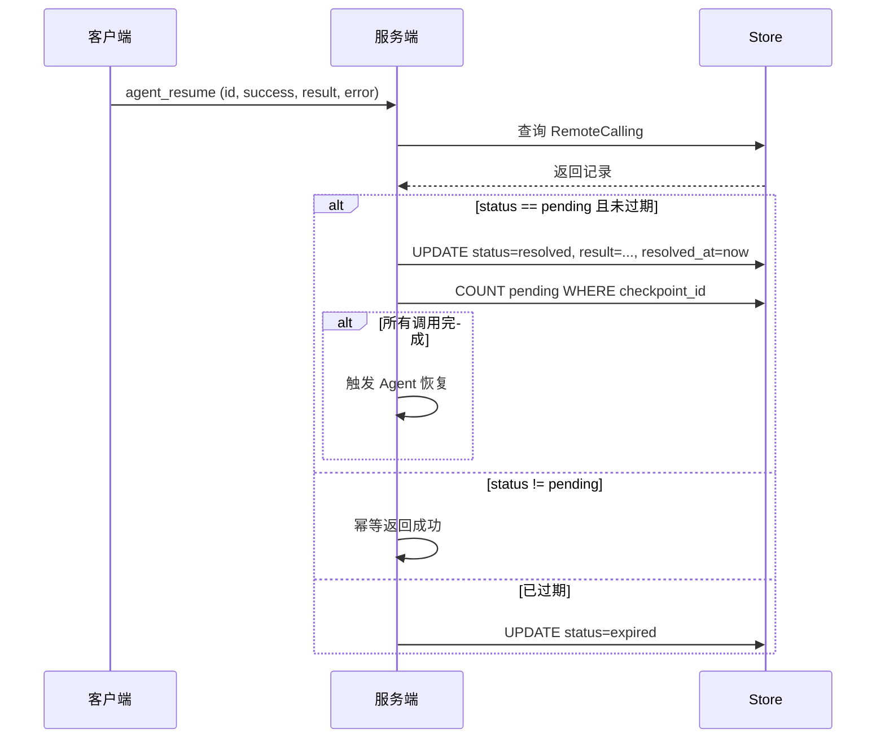
```mermaid
sequenceDiagram
    participant Client as 客户端
    participant Server as 服务端
    participant Store as Store

    Client->>Server: agent_resume (id, success, result, error)
    Server->>Store: 查询 RemoteCalling
    Store-->>Server: 返回记录

    alt status == pending 且未过期
        Server->>Store: UPDATE status=resolved, result=..., resolved_at=now
        Server->>Store: COUNT pending WHERE checkpoint_id
        alt 所有调用完成
            Server->>Server: 触发 Agent 恢复
        end
    else status != pending
        Server->>Server: 幂等返回成功
    else 已过期
        Server->>Store: UPDATE status=expired
    end
```

#### pending -> cancelled

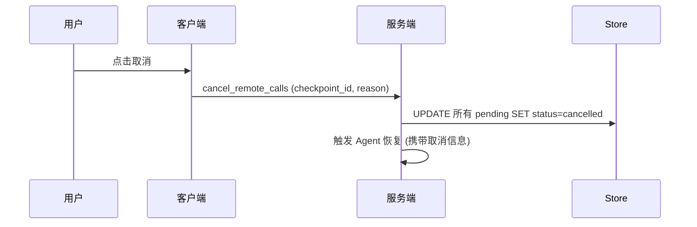
```mermaid
sequenceDiagram
    participant User as 用户
    participant Client as 客户端
    participant Server as 服务端
    participant Store as Store

    User->>Client: 点击取消
    Client->>Server: cancel_remote_calls (checkpoint_id, reason)
    Server->>Store: UPDATE 所有 pending SET status=cancelled
    Server->>Server: 触发 Agent 恢复 (携带取消信息)
```

#### pending -> expired

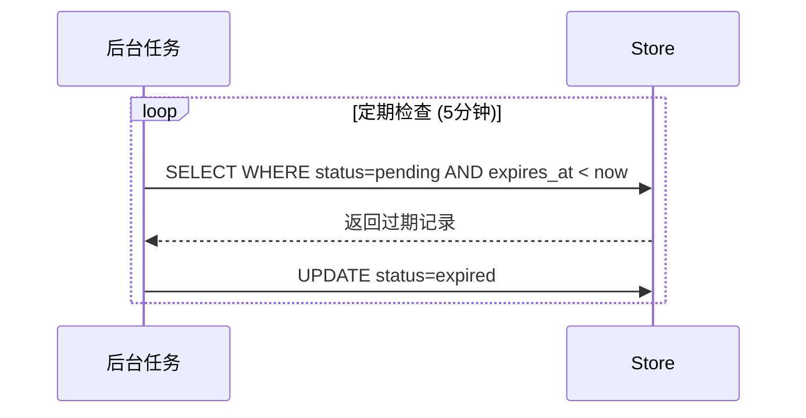
```mermaid
sequenceDiagram
    participant Task as 后台任务
    participant Store as Store

    loop 定期检查 (5分钟)
        Task->>Store: SELECT WHERE status=pending AND expires_at < now
        Store-->>Task: 返回过期记录
        Task->>Store: UPDATE status=expired
    end
```

---

## 函数注册与发现

### 设计决策

1. **客户端动态注册**: 函数在客户端运行时注册，不是静态配置
2. **必须支持的函数**: 客户端必须实现 `list_functions` 和 `ask_user_question`
3. **页面级注册**: 函数按页面/上下文注册，不是一次性注册全部
4. **客户端定义元数据**: 名称、描述、参数 Schema 由客户端定义

### 注册流程

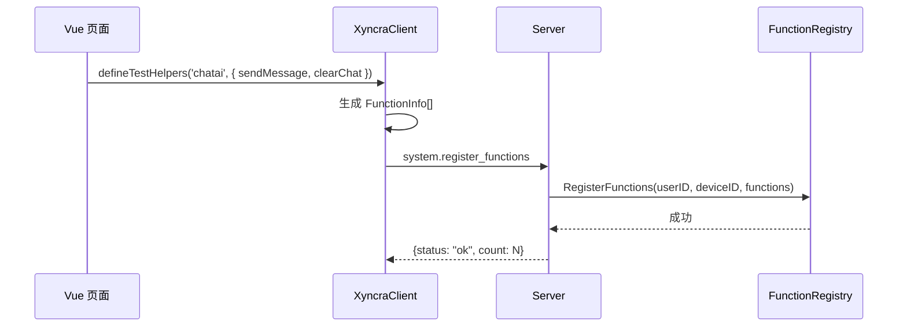
```mermaid
sequenceDiagram
    participant Page as Vue 页面
    participant Client as XyncraClient
    participant Server as Server
    participant FR as FunctionRegistry

    Page->>Client: defineTestHelpers('chatai', { sendMessage, clearChat })
    Client->>Client: 生成 FunctionInfo[]
    Client->>Server: system.register_functions
    Server->>FR: RegisterFunctions(userID, deviceID, functions)
    FR-->>Server: 成功
    Server-->>Client: {status: "ok", count: N}
```

### 函数命名规则

```text
格式: pg_{pageKey}_{functionName}
示例: pg_chatai_sendMessage, pg_dashboard_refreshCharts
```

### 必须实现的函数

| 函数名 | 说明 |
| --- | --- |
| `list_functions` | 列出设备支持的所有函数 |
| `ask_user_question` | 弹窗让用户输入 |

---

## 执行流程

### 完整时序图

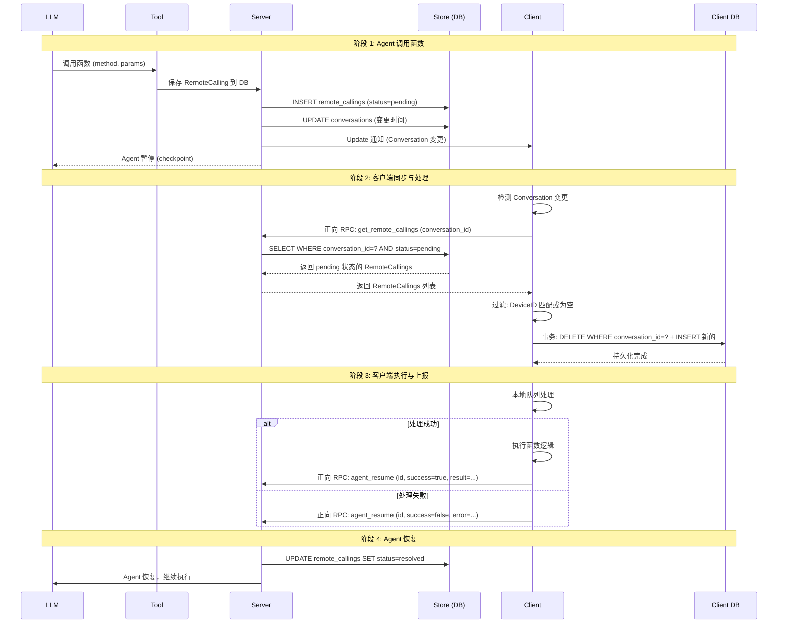
```mermaid
sequenceDiagram
    participant LLM as LLM
    participant Tool as Tool
    participant Server as Server
    participant Store as Store (DB)
    participant Client as Client
    participant ClientDB as Client DB

    Note over LLM,ClientDB: 阶段 1: Agent 调用函数
    LLM->>Tool: 调用函数 (method, params)
    Tool->>Server: 保存 RemoteCalling 到 DB
    Server->>Store: INSERT remote_callings (status=pending)
    Server->>Store: UPDATE conversations (变更时间)
    Server->>Client: Update 通知 (Conversation 变更)
    Server-->>LLM: Agent 暂停 (checkpoint)

    Note over LLM,ClientDB: 阶段 2: 客户端同步与处理
    Client->>Client: 检测 Conversation 变更
    Client->>Server: 正向 RPC: get_remote_callings (conversation_id)
    Server->>Store: SELECT WHERE conversation_id=? AND status=pending
    Store-->>Server: 返回 pending 状态的 RemoteCallings
    Server-->>Client: 返回 RemoteCallings 列表
    Client->>Client: 过滤: DeviceID 匹配或为空
    Client->>ClientDB: 事务: DELETE WHERE conversation_id=? + INSERT 新的
    ClientDB-->>Client: 持久化完成

    Note over LLM,ClientDB: 阶段 3: 客户端执行与上报
    Client->>Client: 本地队列处理

    alt 处理成功
        Client->>Client: 执行函数逻辑
        Client->>Server: 正向 RPC: agent_resume (id, success=true, result=...)
    else 处理失败
        Client->>Server: 正向 RPC: agent_resume (id, success=false, error=...)
    end

    Note over LLM,ClientDB: 阶段 4: Agent 恢复
    Server->>Store: UPDATE remote_callings SET status=resolved
    Server->>LLM: Agent 恢复，继续执行
```

### 客户端处理流程

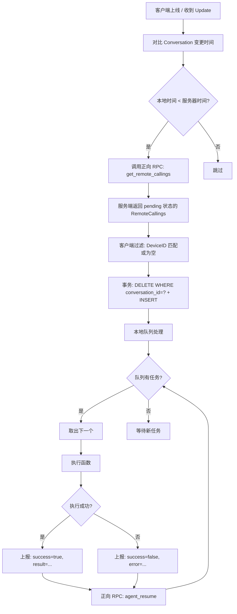
```mermaid
flowchart TD
    A[客户端上线 / 收到 Update] --> B[对比 Conversation 变更时间]
    B --> C{本地时间 < 服务器时间?}
    C -->|是| D[调用正向 RPC: get_remote_callings]
    C -->|否| E[跳过]

    D --> F[服务端返回 pending 状态的 RemoteCallings]
    F --> G[客户端过滤: DeviceID 匹配或为空]
    G --> H[事务: DELETE WHERE conversation_id=? + INSERT]
    H --> I[本地队列处理]

    I --> J{队列有任务?}
    J -->|是| K[取出下一个]
    K --> L[执行函数]
    L --> M{执行成功?}
    M -->|是| N[上报: success=true, result=...]
    M -->|否| O[上报: success=false, error=...]
    N --> P[正向 RPC: agent_resume]
    O --> P
    P --> J

    J -->|否| Q[等待新任务]
```

### 客户端函数路由机制

所有 Remote Calling 必须通过客户端的函数路由机制（FunctionRegistry）分发处理，不区分类型。

#### 路由规则

1. **统一路由**：所有 Remote Calling 通过 `FunctionRegistry.getHandler(method)` 查找对应的函数处理器
2. **有处理器**：自动调用处理器，执行完成后自动上报结果（静默执行）
3. **无处理器**：走 Not Found 处理，自动上报错误
4. **执行状态**：正在执行的函数显示状态指示器，支持取消

#### 函数注册

所有函数（包括 `ask_user`）都注册在 FunctionRegistry 中：

| 函数类型 | 示例 | 注册方式 |
|----------|------|----------|
| 内置函数 | `ask_user` | 插件初始化时注册 |
| 通用函数 | `get_current_page`, `navigate_to` | 插件初始化时注册 |
| 页面函数 | `pg_chatai_sendMessage` | 页面挂载时注册 |

#### 路由流程

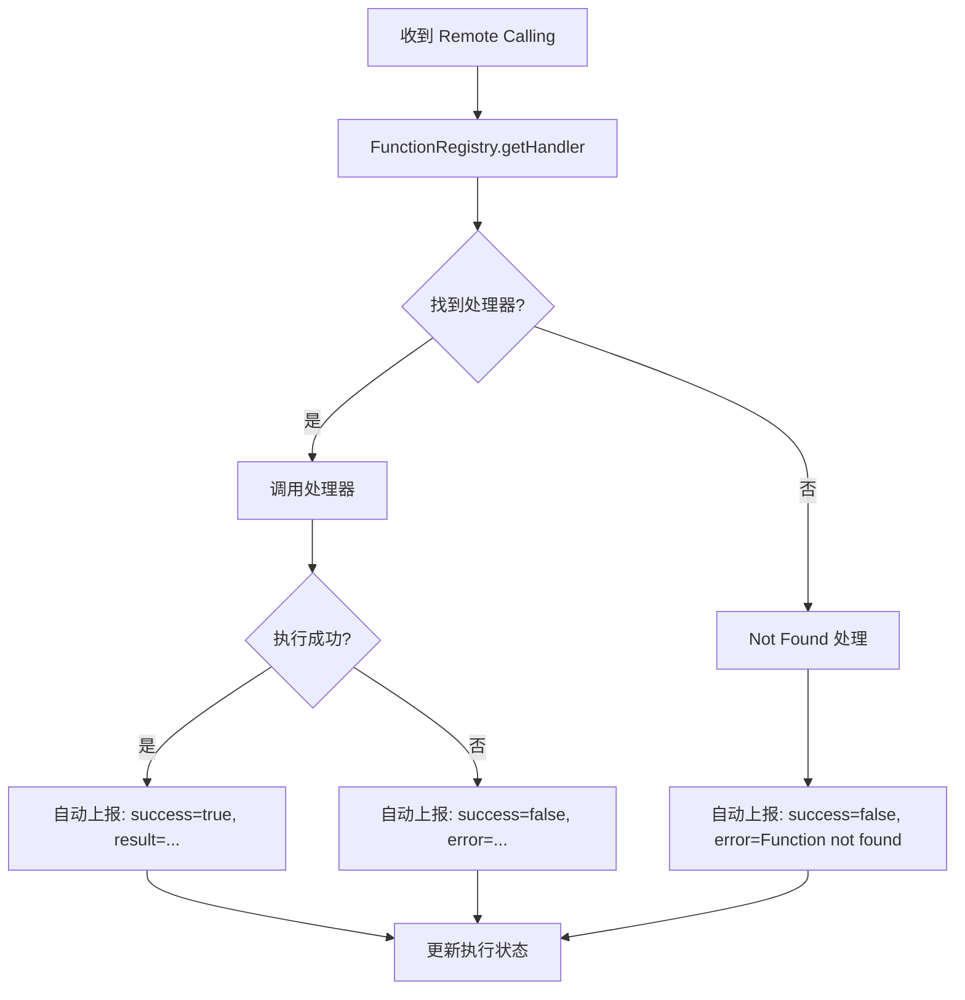
```mermaid
flowchart TD
    A[收到 Remote Calling] --> B[FunctionRegistry.getHandler]
    B --> C{找到处理器?}
    C -->|是| D[调用处理器]
    D --> E{执行成功?}
    E -->|是| F[自动上报: success=true, result=...]
    E -->|否| G[自动上报: success=false, error=...]
    C -->|否| H[Not Found 处理]
    H --> I[自动上报: success=false, error=Function not found]

    F --> J[更新执行状态]
    G --> J
    I --> J
```

#### ask_user 处理

`ask_user` 作为普通函数注册，其处理器负责：
1. 打开用户输入弹窗
2. 等待用户输入
3. 返回用户回答

#### Not Found 处理

当 `FunctionRegistry.getHandler(method)` 返回空时：
- 自动上报错误：`success=false, error_message="Function not found: {method}"`
- 记录警告日志
- 不显示任何 UI

#### 执行状态指示

- 正在执行的函数显示状态指示器
- 显示函数名和执行时长
- 支持取消操作
- 取消后自动上报：`success=false, error_message="Cancelled by user"`

### 超时配置

| 级别 | 配置方式 | 说明 |
|------|----------|------|
| 全局超时 | 服务端配置 | 所有 RemoteCalling 的默认超时 |
| 函数级超时 | LLM 决定 | 覆盖全局超时 |

```go
// LLM 调用工具时可指定超时
tool_call := ToolCall{
    Method: "pg_chatai_sendMessage",
    Params: `{"content": "Hello"}`,
    Timeout: 30000, // 30秒，覆盖全局默认
}
```

---

## 结果上报

### 上报协议

客户端通过正向 RPC 调用恢复接口，传递执行结果：

```go
type RemoteCallResultRequest struct {
    ID           string `json:"id"`             // RemoteCalling ID
    Success      bool   `json:"success"`        // 是否成功
    Result       string `json:"result"`         // 成功时的结果 (JSON string)
    ErrorMessage string `json:"error_message"`  // 失败时的错误信息
}
```

### 服务端处理

```go
// 获取 RemoteCallings (客户端拉取)
func (h *Handler) HandleGetRemoteCallings(ctx context.Context, client *Client, req *GetRemoteCallingsRequest) {
    // 只返回 pending 状态的，按 conversation_id 过滤
    callings, _ := h.store.ListPendingByConversation(ctx, req.ConversationID)
    return callings
}

// 上报结果 (客户端恢复)
func (h *Handler) HandleAgentResume(ctx context.Context, client *Client, req *AgentResumeRequest) {
    // 1. 获取 RemoteCalling
    rc, _ := h.store.Get(ctx, req.ID)
    if rc == nil {
        return // 不存在
    }

    // 2. 幂等检查
    if rc.Status != "pending" {
        return // 已处理
    }

    // 3. 过期检查
    if rc.ExpiresAt != nil && time.Now().After(*rc.ExpiresAt) {
        h.store.UpdateStatus(ctx, req.ID, "expired")
        return // 已过期
    }

    // 4. 更新结果
    h.store.UpdateResult(ctx, req.ID, req.Success, req.Result, req.ErrorMessage)

    // 5. 检查是否所有调用完成 (按 conversation_id 过滤)
    pending, _ := h.store.CountPendingByConversation(ctx, rc.ConversationID)
    if pending == 0 {
        // 触发 agent_resume
        h.triggerAgentResume(ctx, rc.ConversationID)
    }
}
```

---

## 边缘场景

### 已过期

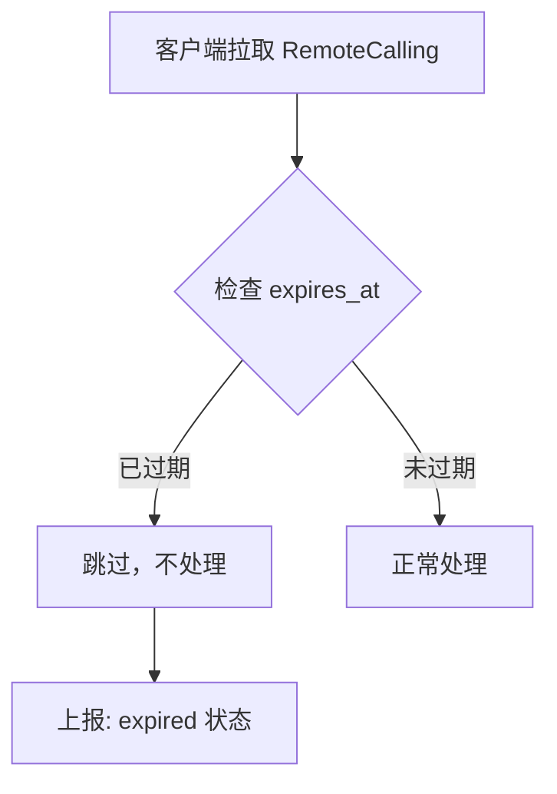
```mermaid
flowchart TD
    A[客户端拉取 RemoteCalling] --> B{检查 expires_at}
    B -->|已过期| C[跳过，不处理]
    B -->|未过期| D[正常处理]
    C --> E[上报: expired 状态]
```

### 已被处理（幂等）

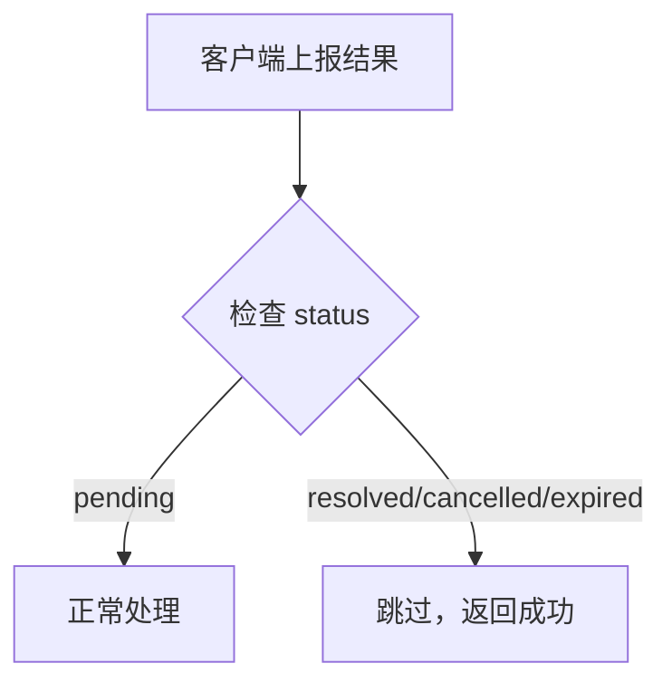
```mermaid
flowchart TD
    A[客户端上报结果] --> B{检查 status}
    B -->|pending| C[正常处理]
    B -->|resolved/cancelled/expired| D[跳过，返回成功]
```

### 服务端重启

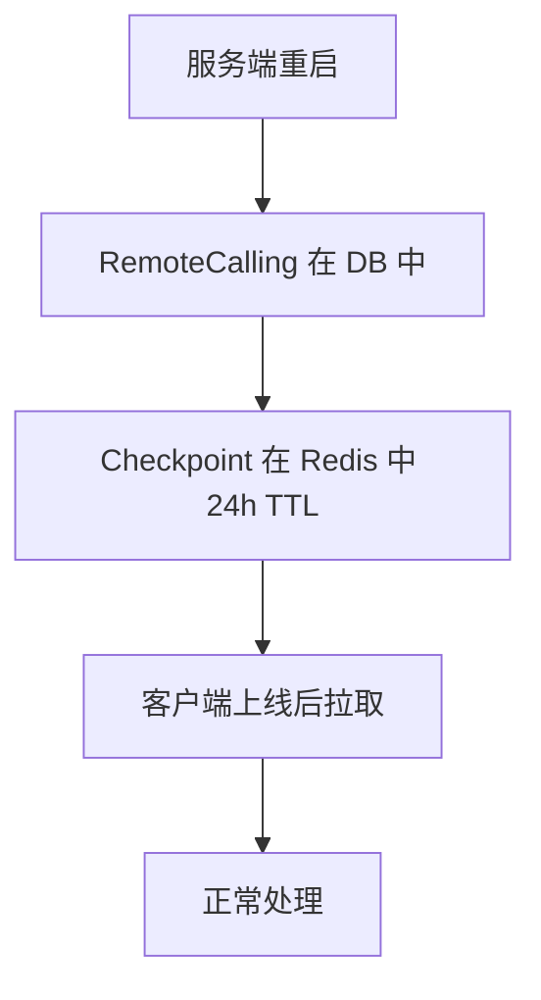
```mermaid
flowchart TD
    A[服务端重启] --> B[RemoteCalling 在 DB 中]
    B --> C[Checkpoint 在 Redis 中 24h TTL]
    C --> D[客户端上线后拉取]
    D --> E[正常处理]
```

### 上报失败重试

客户端调用 `agent_resume` 上报结果时，如果服务端返回错误（服务端问题），客户端必须无限重试，直到服务端返回成功。

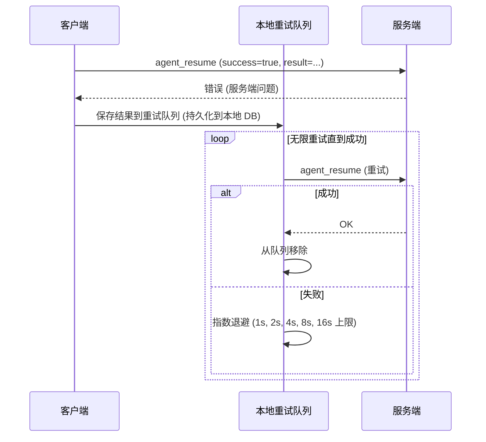
```mermaid
sequenceDiagram
    participant Client as 客户端
    participant Queue as 本地重试队列
    participant Server as 服务端

    Client->>Server: agent_resume (success=true, result=...)
    Server-->>Client: 错误 (服务端问题)

    Client->>Queue: 保存结果到重试队列 (持久化到本地 DB)

    loop 无限重试直到成功
        Queue->>Server: agent_resume (重试)
        alt 成功
            Server-->>Queue: OK
            Queue->>Queue: 从队列移除
        else 失败
            Queue->>Queue: 指数退避 (1s, 2s, 4s, 8s, 16s 上限)
        end
    end
```

**设计原则**：客户端已执行函数，结果不能丢失。必须无限重试直到服务端确认。

**退避策略**：指数退避，上限 16 秒。

| 重试次数 | 等待时间 |
| --- | --- |
| 1 | 1s |
| 2 | 2s |
| 3 | 4s |
| 4 | 8s |
| 5+ | 16s (上限) |

**持久化**：重试队列必须持久化到本地 DB，客户端重启后继续重试。

---

## 与现有机制的关系

### 对比

| 维度 | 现有 HITL | Remote Calling |
|------|-----------|----------------|
| 模型 | Question | RemoteCalling |
| 路由 | 用户级 (Update) | 用户级 (Update)，客户端按 DeviceID 过滤 |
| 触发 | 用户手动回答 | 客户端自动处理 |
| 存储 | DB (questions 表) | DB (remote_callings 表) |
| 恢复 | agent_resume RPC | agent_resume RPC (扩展) |

### 迁移路径

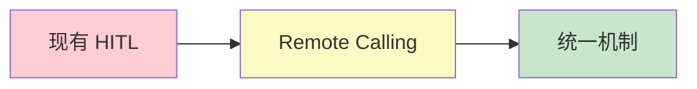
```mermaid
flowchart LR
    A[现有 HITL] --> B[Remote Calling]
    B --> C[统一机制]

    style A fill:#ffcdd2
    style B fill:#fff9c4
    style C fill:#c8e6c9
```

1. **Phase 1**: 实现 Remote Calling 基础框架
2. **Phase 2**: 将 HITL 迁移到 Remote Calling
3. **Phase 3**: 移除旧的 Question 机制

---

## Tool Calling 消息记录

### 问题

当前 Agent 调用工具时，tool calling 的输入参数和输出结果**没有持久化到 messages 表**。信息仅通过 ephemeral 广播（Seq=0）实时推送给在线用户，不进入 sync_updates 通道。导致：

- 前端刷新页面后看不到 tool calling 执行历史
- 离线用户上线后无法获取 tool calling 记录
- 新加入会话的成员看不到之前的 tool calling 历史

### Tool Calling 记录原则

1. **复用现有消息通道**：使用 `type="message"` UserUpdate 同步，不新增 UpdateType
2. **一条消息，可更新**：每次 tool calling 对应一条 Message，调用开始时创建，完成后更新 content
3. **客户端 upsert**：收到 `type="message"` 时，如果本地已有该消息则更新，没有则插入
4. **覆盖所有工具**：内置工具和 RemoteCalling 均记录

### Tool Calling 数据模型

#### Message.Type

新增 `"tool_calling"` 类型，与 `"text"` 并列。

#### Message.Content 结构

**调用开始时（executing）**：

```json
{
  "method": "pg_chatai_sendMessage",
  "params": {"content": "Hello"},
  "status": "executing",
  "started_at": "2026-07-23T10:00:00Z"
}
```

**调用完成时（completed / failed）**：

```json
{
  "method": "pg_chatai_sendMessage",
  "params": {"content": "Hello"},
  "result": {"sent": true},
  "error": "",
  "status": "completed",
  "started_at": "2026-07-23T10:00:00Z",
  "completed_at": "2026-07-23T10:00:02Z",
  "duration_ms": 2000
}
```

**失败时**：

```json
{
  "method": "pg_chatai_sendMessage",
  "params": {"content": "Hello"},
  "result": null,
  "error": "Function not found: pg_chatai_sendMessage",
  "status": "failed",
  "started_at": "2026-07-23T10:00:00Z",
  "completed_at": "2026-07-23T10:00:01Z",
  "duration_ms": 1000
}
```

### 记录流程

#### 完整时序图

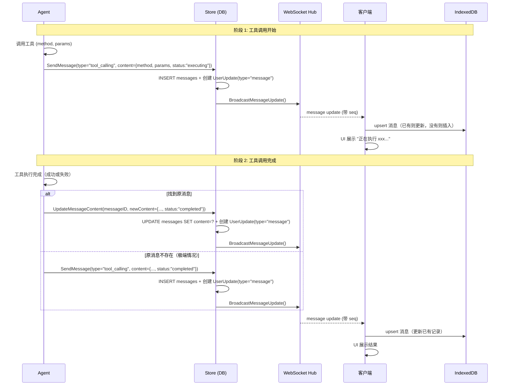
```mermaid
sequenceDiagram
    participant Agent as Agent
    participant Store as Store (DB)
    participant WS as WebSocket Hub
    participant Client as 客户端
    participant ClientDB as IndexedDB

    Note over Agent, ClientDB: 阶段 1: 工具调用开始

    Agent->>Agent: 调用工具 (method, params)
    Agent->>Store: SendMessage(type="tool_calling", content={method, params, status:"executing"})
    Store->>Store: INSERT messages + 创建 UserUpdate(type="message")
    Store->>WS: BroadcastMessageUpdate()
    WS-->>Client: message update (带 seq)
    Client->>ClientDB: upsert 消息（已有则更新，没有则插入）
    Client->>Client: UI 展示 "正在执行 xxx..."

    Note over Agent, ClientDB: 阶段 2: 工具调用完成

    Agent->>Agent: 工具执行完成（成功或失败）

    alt 找到原消息
        Agent->>Store: UpdateMessageContent(messageID, newContent={..., status:"completed"})
        Store->>Store: UPDATE messages SET content=? + 创建 UserUpdate(type="message")
        Store->>WS: BroadcastMessageUpdate()
    else 原消息不存在（极端情况）
        Agent->>Store: SendMessage(type="tool_calling", content={..., status:"completed"})
        Store->>Store: INSERT messages + 创建 UserUpdate(type="message")
        Store->>WS: BroadcastMessageUpdate()
    end

    WS-->>Client: message update (带 seq)
    Client->>ClientDB: upsert 消息（更新已有记录）
    Client->>Client: UI 展示结果
```

#### 服务端处理流程

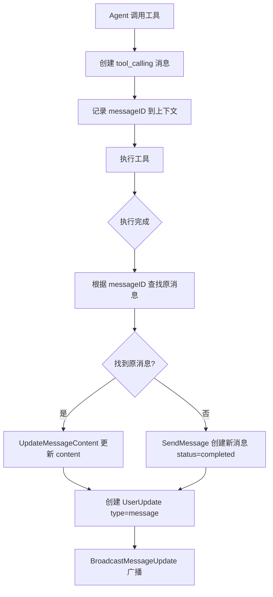
```mermaid
flowchart TD
    A[Agent 调用工具] --> B[创建 tool_calling 消息]
    B --> C[记录 messageID 到上下文]
    C --> D[执行工具]

    D --> E{执行完成}
    E --> F[根据 messageID 查找原消息]

    F --> G{找到原消息?}
    G -->|是| H[UpdateMessageContent 更新 content]
    G -->|否| I[SendMessage 创建新消息 status=completed]

    H --> J[创建 UserUpdate type=message]
    I --> J
    J --> K[BroadcastMessageUpdate 广播]
```

#### 客户端处理流程

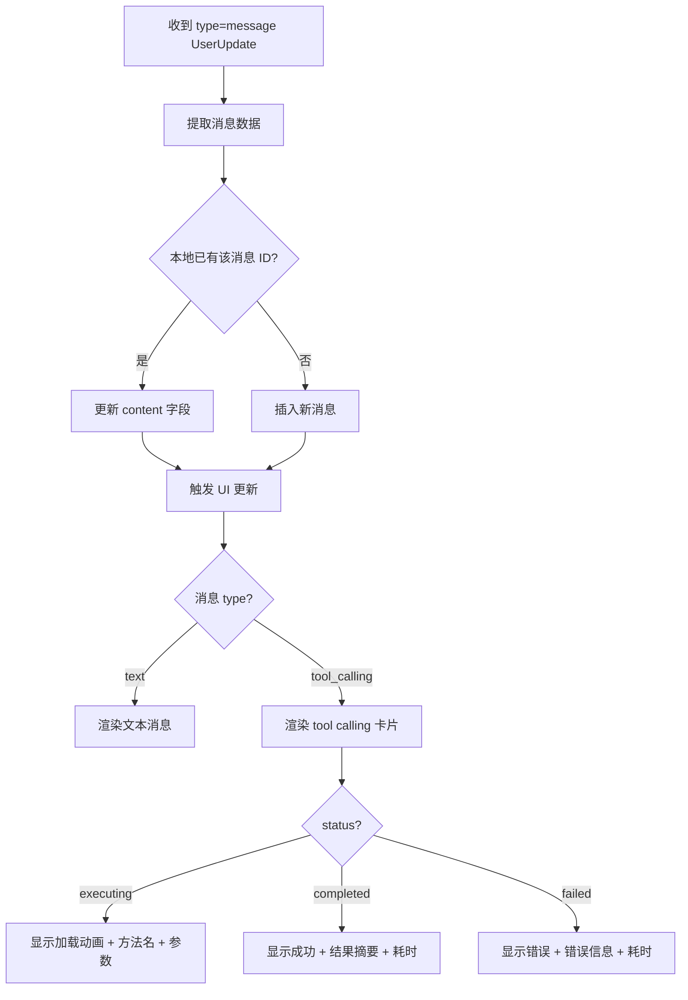
```mermaid
flowchart TD
    A[收到 type=message UserUpdate] --> B[提取消息数据]
    B --> C{本地已有该消息 ID?}
    C -->|是| D[更新 content 字段]
    C -->|否| E[插入新消息]
    D --> F[触发 UI 更新]
    E --> F

    F --> G{消息 type?}
    G -->|text| H[渲染文本消息]
    G -->|tool_calling| I[渲染 tool calling 卡片]
    I --> J{status?}
    J -->|executing| K[显示加载动画 + 方法名 + 参数]
    J -->|completed| L[显示成功 + 结果摘要 + 耗时]
    J -->|failed| M[显示错误 + 错误信息 + 耗时]
```

### 客户端 UI 设计

#### Tool Calling 消息卡片

**执行中**：

```text
┌─────────────────────────────────────────────┐
│ ⏳ pg_chatai_sendMessage                     │
│ 参数: {"content": "Hello"}                    │
│ 执行中...                                     │
└─────────────────────────────────────────────┘
```

**成功**：

```text
┌─────────────────────────────────────────────┐
│ ✅ pg_chatai_sendMessage                     │
│ 参数: {"content": "Hello"}                    │
│ 结果: {"sent": true}                          │
│ 耗时: 2s                                      │
└─────────────────────────────────────────────┘
```

**失败**：

```text
┌─────────────────────────────────────────────┐
│ ❌ pg_chatai_sendMessage                     │
│ 参数: {"content": "Hello"}                    │
│ 错误: Function not found                      │
│ 耗时: 1s                                      │
└─────────────────────────────────────────────┘
```

### Tool Calling 异常处理

#### 服务端在创建消息后、更新前崩溃

- 消息存在但 status 永远是 `"executing"`
- 客户端 UI 显示为"执行中"
- **恢复方式**：Agent resume 时检测到 conversation 状态为 `tool_calling` 但无 pending RemoteCalling，自动将该消息更新为 `"failed"` 状态

#### 原消息被软删除

- `UpdateMessageContent` 跳过已删除消息
- 创建新消息，status 直接为完成状态
- 客户端看到两条记录（一条已删除，一条完成）

#### 客户端离线后上线

- 通过 `sync_updates` 拉取遗漏的 UserUpdate
- 如果收到两条同 ID 的消息（先 create 后 update），upsert 机制自动合并为最终状态

---

## 测试

### 测试范围

使用 Playwright 进行 E2E 测试，覆盖所有注册的函数：

- **通用函数（14个）**：`navigate_to`, `get_current_page`, `get_page_description`, `get_page_structure`, `get_form_data`, `get_table_data`, `click_element`, `type_text`, `show_notification`, `highlight_element`, `scroll_to`, `wait_for_element`, `confirm_action`, `ask_user`
- **页面函数**：登录页、仪表盘等代表性页面函数
- **agent_resume Mock**：验证拦截和日志记录

### 测试策略

- 通过 `page.evaluate()` 直接调用 FunctionRegistry 中注册的函数
- Mock `agent_resume` RPC 调用，记录日志而不实际发送
- 在单个测试文件中完成所有函数测试

### 执行命令

```bash
cd demo/vue-pure-admin
npx playwright test e2e/functions.spec.ts
```

---

## DOM 操作移除计划

### 背景

当前 `xyncra-client-vue` 包中的通用内置函数（`general.ts`）大量使用 DOM 操作来读取页面数据和操作 UI。这导致：

1. **不可靠**：CSS 选择器依赖页面结构，页面改版就失效
2. **不安全**：Agent 可通过选择器操作页面上任意元素，存在越权风险
3. **不 Vue**：手动遍历 DOM 违背 Vue 的响应式设计理念
4. **hack 多**：`type_text` 需要用 `Object.getOwnPropertyDescriptor` hack 绕过合成事件

### 改造原则

**从"Agent 扫描和操作 DOM"转变为"页面主动声明能力和数据"**：

1. 页面组件主动注册可调用的函数（已有 `defineTestHelpers` 机制）
2. Agent 通过注册函数获取数据，不直接读 DOM
3. Agent 通过注册函数执行操作，不直接操作 DOM
4. 框架层只提供路由、通知等基础设施

### 函数处理策略

#### 删除（不需要替代）

| 函数 | 删除理由 |
|------|----------|
| `get_page_structure` | Agent 不应扫描页面结构，不可靠且不安全 |
| `get_page_description` | 应由页面组件主动声明，或从路由 meta 读取 |
| `get_current_page` | 应从路由状态读取，不需要 `document.title` |
| `wait_for_element` | 轮询 DOM 是反模式，Vue 的响应式机制已解决此问题 |

#### 用 Element Plus API 替换

| 函数 | 替换方案 |
|------|----------|
| `show_notification` | 直接调用 `ElNotification()` |
| `confirm_action` | 直接调用 `ElMessageBox.confirm()` |

#### 页面组件主动注册

| 函数 | 替换方案 |
|------|----------|
| `get_form_data` | 页面注册 `getFormData()` 函数，返回 reactive 表单数据 |
| `get_table_data` | 页面注册 `getTableData()` 函数，返回 reactive 表格数据 |
| `click_element` | 页面注册具体业务函数（如 `pg_login_submit_btn`），不暴露通用点击 |
| `type_text` | 页面注册具体业务函数（如 `pg_login_tab_account`），不暴露通用输入 |
| `highlight_element` | 页面通过 ref + 组件方法实现高亮 |
| `scroll_to` | 页面通过 ref + 组件方法实现滚动 |

#### Vue inject 注入

| 函数 | 替换方案 |
|------|----------|
| `navigate_to` | 通过 Vue `inject` 注入 router 实例，删除 `window.__vue_router` |

### 需要同步修改的部分

1. **删除 `dom/dom-engine.ts`**：`isHidden` 函数已无用途
2. **删除 `functions/route-integration.ts`** 中的 `window.__vue_router` 挂载
3. **删除 `defineTestHelpers.ts`** 中的 `window.XyncraTestHelpers` 全局挂载，改用 Vue provide/inject
4. **更新测试策略**：不再通过 `page.evaluate()` 调用 DOM 函数，改为测试注册的 Vue 函数

### 实现步骤


```mermaid
flowchart TD
    A[Phase 1: 基础设施] --> B[Phase 2: 删除函数]
    B --> C[Phase 3: 替换函数]
    C --> D[Phase 4: 清理]

    subgraph Phase 1: 基础设施
        A1[router inject 注入机制] --> A2[通知/确认 API 封装]
        A2 --> A3[页面数据注册协议]
    end

    subgraph Phase 2: 删除函数
        B1[删除 get_page_structure] --> B2[删除 get_page_description]
        B2 --> B3[删除 get_current_page]
        B3 --> B4[删除 wait_for_element]
    end

    subgraph Phase 3: 替换函数
        C1[show_notification → ElNotification] --> C2[confirm_action → ElMessageBox]
        C2 --> C3[navigate_to → inject router]
        C3 --> C4[get_form_data → 页面注册]
        C4 --> C5[get_table_data → 页面注册]
        C5 --> C6[click_element → 页面注册业务函数]
        C6 --> C7[type_text → 页面注册业务函数]
    end

    subgraph Phase 4: 清理
        D1[删除 dom-engine.ts] --> D2[删除 route-integration.ts 挂载]
        D2 --> D3[删除 window.XyncraTestHelpers]
        D3 --> D4[更新测试用例]
    end
```

---

## 待讨论

| 问题 | 状态 |
|------|------|
| 取消机制 | 待讨论 |
| 并行执行策略 | 客户端决定 |
| 超时默认值 | 待定 |
| 函数发现 API | 待定 |
