# 反向RPC 业务流程文档

## 目录

- [概述](#概述)
- [核心概念](#核心概念)
- [流程总览](#流程总览)
- [1. 基础往返流程 (ServerRequest_BasicRoundTrip)](#1-基础往返流程)
- [2. 超时与持久化流程 (ServerRequest_TimeoutWithPersistence)](#2-超时与持久化流程)
- [3. 响应路由流程 (DispatchResponse_Routing)](#3-响应路由流程)
- [4. 按设备取消流程 (CancelDevice_PerDevice)](#4-按设备取消流程)
- [5. 自定义原因取消流程 (CancelDeviceWithReason_CustomReason)](#5-自定义原因取消流程)
- [6. 全局取消流程 (CancelAll_Shutdown)](#6-全局取消流程)
- [7. 持久化重放流程 (ReplayRequest_PersistenceReplay)](#7-持久化重放流程)
- [8. 并发请求流程 (ConcurrentRequests_MultiGoroutine)](#8-并发请求流程)
- [9. 设备生命周期与 CancelDevice 时序](#9-设备生命周期与-canceldevice-时序)
- [10. 端到端测试流程 (E2E_BasicRoundTrip)](#10-端到端测试流程)

---

## 概述

反向RPC（Reverse RPC）是 Xyncra 的核心能力之一，允许**服务端主动调用客户端函数**。传统 RPC 模式中客户端向服务端发起调用，而反向RPC则反转了这一方向——服务端通过已建立的 WebSocket 连接向客户端发送函数调用请求，并阻塞等待客户端执行完毕后返回结果。

### 设计目标

- **请求-响应语义**：服务端发起请求，客户端处理并返回结果
- **超时控制**：每个请求独立超时，避免无限等待
- **设备隔离**：按 (userID, deviceID) 精确路由，支持多设备场景
- **持久化重试**：超时请求可持久化，在设备重连时自动重放
- **并发安全**：支持多个 goroutine 同时对同一设备发起请求

---

## 核心概念

| 概念 | 说明 |
|------|------|
| `reqID` | 全局唯一请求 ID，格式为 `s-{uuid-v4}`，用于请求-响应匹配 |
| `replayID` | 重放请求 ID，格式为 `s-replay-{uuid}`，用于持久化重放场景 |
| `seq` | 单调递增序列号，按 (userID, deviceID) 对分配，用于客户端排序 |
| `idempotencyKey` | 幂等键，客户端用于去重，重放时保留原始值 |
| `reverseRPCPending` | 等待中的请求记录，包含响应 channel、取消函数、请求元数据 |
| `respCh` | 容量为 1 的缓冲 channel，用于接收客户端响应 |
| `PendingStore` | 可选的持久化存储，用于超时请求的异步保存和重放 |
| `sendFunc` | 消息发送函数，通过 WebSocket 将请求包发送到客户端 |

### 数据结构

```
reverseRPCPending {
    respCh          chan *PackageDataResponse  // 响应 channel (cap=1)
    cancel          context.CancelFunc  // context 取消函数
    userID          string              // 用户 ID (CancelDevice 过滤)
    deviceID        string              // 设备 ID (CancelDevice 过滤)
    reqID          string              // 请求 ID
    method         string              // 调用方法名
    params         json.RawMessage     // 方法参数
    idempotencyKey string              // 幂等键 (等于 reqID)
    seq            uint64              // 每设备序列号
}
```

### PendingRequest 模型（持久化）

超时请求持久化到 Redis 时使用 `PendingRequest` 结构体：

```
PendingRequest {
    ID             string          `json:"id"`              // 原始 reqID
    UserID         string          `json:"user_id"`
    DeviceID       string          `json:"device_id"`
    Method         string          `json:"method"`
    Params         json.RawMessage `json:"params"`
    IdempotencyKey string          `json:"idempotency_key"` // 等于 reqID
    Seq            uint64          `json:"seq"`
    RetryCount     int             `json:"retry_count"`     // 已重放次数
    MaxRetries     int             `json:"max_retries"`     // 最大重放次数 (默认 3)
    CreatedAt      time.Time       `json:"created_at"`      // 首次持久化时间
}
```

### PendingStore 接口

`PendingStore` 是可选的持久化存储接口，用于超时请求的保存和重放。当前实现为 `RedisPendingStore`（基于 Redis List）。

```
PendingStore interface {
    Save(ctx, req *PendingRequest) error                             // 追加到设备列表，超限裁剪最旧
    List(ctx, userID, deviceID string) ([]*PendingRequest, error)    // 返回设备的所有 pending 请求
    Remove(ctx, userID, deviceID, requestID string) error            // 按 ID 删除单条
    RemoveByDevice(ctx, userID, deviceID string) error               // 删除设备的全部 pending
    Update(ctx, req *PendingRequest) error                           // 按 ID 替换（用于更新 RetryCount）
}
```

### PendingStoreConfig 配置

```
PendingStoreConfig {
    MaxPendingPerDevice int           // 每设备最大 pending 数，默认 50
    RequestTTL          time.Duration // Redis TTL，默认 24h
    MaxReplayRetries    int           // 最大重放次数，默认 3
}
```

### 包结构

```
Package {
    Version: 1                     // 协议版本号，当前固定为 1
    Type: PackageTypeRequest | PackageTypeResponse
    Data: PackageDataRequest | PackageDataResponse
}

PackageDataRequest {
    ID              string      // reqID
    Method          string      // 方法名
    Params          any         // 参数
    Seq             uint64      // 序列号
    IdempotencyKey  string      // 幂等键
}

PackageDataResponse {
    ID      string      // 对应的 reqID
    Code    int         // 状态码 (0=成功)
    Msg     string      // 消息
    Data    any         // 返回数据
}
```

### Redis 操作详情（RedisPendingStore）

RedisPendingStore 使用 Redis List 存储每个设备的 pending 请求。Key 格式为 `pending:{userID}\x00{deviceID}`。

| 操作 | Redis 命令 | 说明 |
|------|----------|------|
| Save | `RPUSH` + `LTRIM` + `EXPIRE` (pipeline) | 追加 JSON，LTRIM 裁剪到 MaxPendingPerDevice，刷新 TTL |
| List | `LRANGE 0 -1` | 返回全部条目，JSON 反序列化，跳过损坏条目 |
| Remove | `LRANGE` -> 过滤 -> `DEL` (+ `RPUSH` + `EXPIRE` 当有保留条目时) (pipeline) | 非原子读-改-写，跳过损坏条目；若过滤后为空则仅 `DEL` |
| Update | `LRANGE` -> 替换 -> `DEL` (+ `RPUSH` + `EXPIRE` 当有保留条目时) (pipeline) | 与 Remove 相同模式，用于更新 RetryCount；若过滤后为空则仅 `DEL` |
| RemoveByDevice | `DEL` | 直接删除整个 key |

> **注意**：Remove 和 Update 使用 Del+RPush pipeline 而非事务，进程崩溃可能丢失条目。这对 pending store 是可接受的（fail-open 语义）。
>
> **OpenTelemetry 追踪**：所有 RedisPendingStore 操作（Save、List、Remove、Update、RemoveByDevice）都会创建 OpenTelemetry span，span 名称格式为 `redis.pending.{operation}`，并附加 `user_id` 和 `device_id` 属性。这使得分布式追踪可以观测到 pending 请求的持久化和重放行为。

---

## 流程总览

```mermaid
graph TB
    subgraph 核心流程
        A[ServerRequest] -->|发送请求| B[等待响应]
        B -->|收到响应| C[返回结果]
        B -->|超时| D{配置了 PendingStore?}
        D -->|是| E[异步持久化]
        D -->|否| F[返回超时错误]
        E --> F
    end

    subgraph 取消流程
        G[CancelDevice] -->|按设备取消| H[返回合成响应]
        I[CancelAll] -->|全局取消| H
    end

    subgraph 重连流程
        J[设备重连] --> K[CancelDevice 旧连接]
        K --> L[WebSocket Upgrade]
        L --> M[注册新连接]
        M --> N[客户端发送 system.reconnect]
        N --> O{PendingStore 有记录?}
        O -->|是| P[异步 replayOne]
        O -->|否| Q[返回 replayed=0]
        P --> R{重放成功?<br/>err==nil && resp!=nil && Code==0}
        R -->|是| S[Remove from Redis]
        R -->|否| T{超过 MaxRetries?}
        T -->|是| S
        T -->|否| U[Update RetryCount]
    end

    subgraph 断开流程
        V[设备断开] --> W[removeClient]
        W --> X{有替代连接?}
        X -->|否| Y[CancelDeviceWithReason]
        X -->|是| Z[跳过取消]
    end
```

---

## 1. 基础往返流程

**流程名称**：ServerRequest_BasicRoundTrip

**描述**：服务端向指定用户的指定设备发送 RPC 请求并阻塞等待客户端响应。这是反向RPC的核心流程，实现了"服务端主动调用客户端函数"的能力。

### 流程图

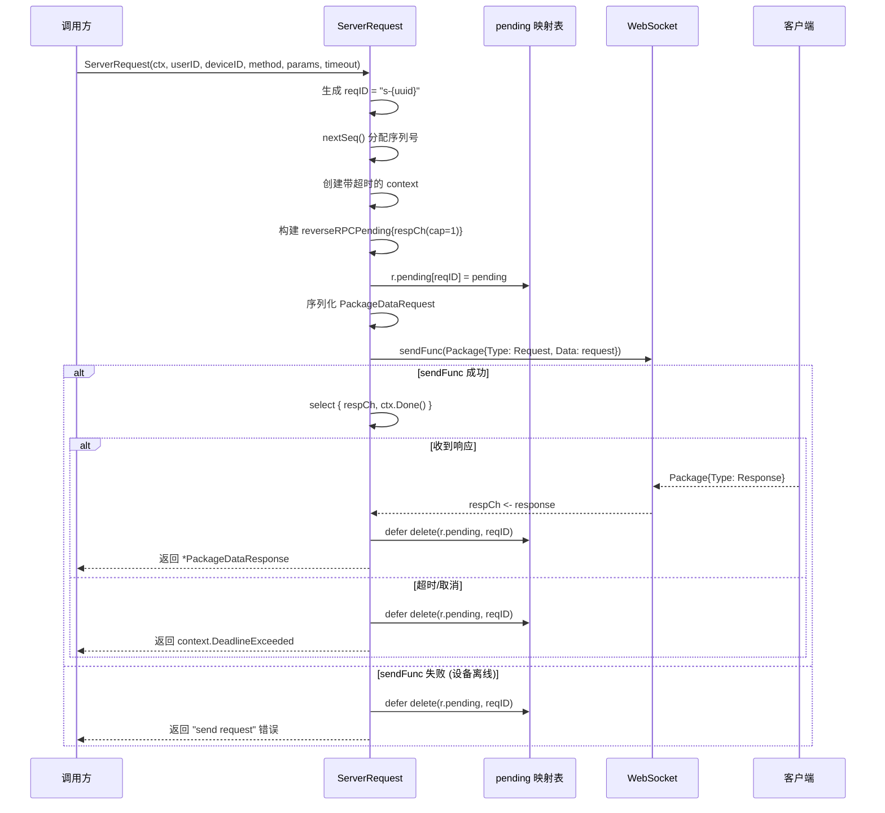

### 详细步骤

1. **生成请求 ID**：生成全局唯一请求 ID，格式为 `s-{uuid-v4}`
2. **分配序列号**：通过 `nextSeq()` 为该 (userID, deviceID) 对分配单调递增的序列号
3. **创建 context**：创建带超时的 context，构建 `reverseRPCPending` 结构体（含容量为 1 的缓冲 channel）
4. **注册 pending**：将 pending 记录注册到 `r.pending[reqID]` 映射表中
5. **序列化请求**：将 method/params/seq/idempotencyKey 序列化为 `PackageDataRequest`
6. **发送请求**：包装为 `Package{Version: 1, Type: PackageTypeRequest}` 并调用 `sendFunc` 发送到客户端
7. **等待响应**：`select` 阻塞等待两个分支：`respCh` 收到响应 或 `ctx.Done()` 超时/取消
8. **返回结果**：收到响应后，`defer` 清理 `r.pending` 中的记录，返回 `*PackageDataResponse`

### 边缘场景

| 场景 | 处理方式 |
|------|----------|
| `sendFunc` 返回错误（设备离线） | 直接返回 `send request` 错误，不进入 select 等待，但仍执行 defer 清理 pending 记录 |
| `json.Marshal` 请求失败 | 返回 `marshal request` 错误 |
| deviceID 为空 | sendFunc 走 `sendToUser` 广播到该用户的所有连接，而非指定设备 |
| 并发调用同一设备 | 每个请求有独立的 reqID 和独立的 respCh，互不干扰 |

---

## 2. 超时与持久化流程

**流程名称**：ServerRequest_TimeoutWithPersistence

**描述**：当客户端未在指定时间内响应时，请求超时。若配置了 PendingStore，超时的请求会被异步持久化以供后续重连时重放。

### 流程图

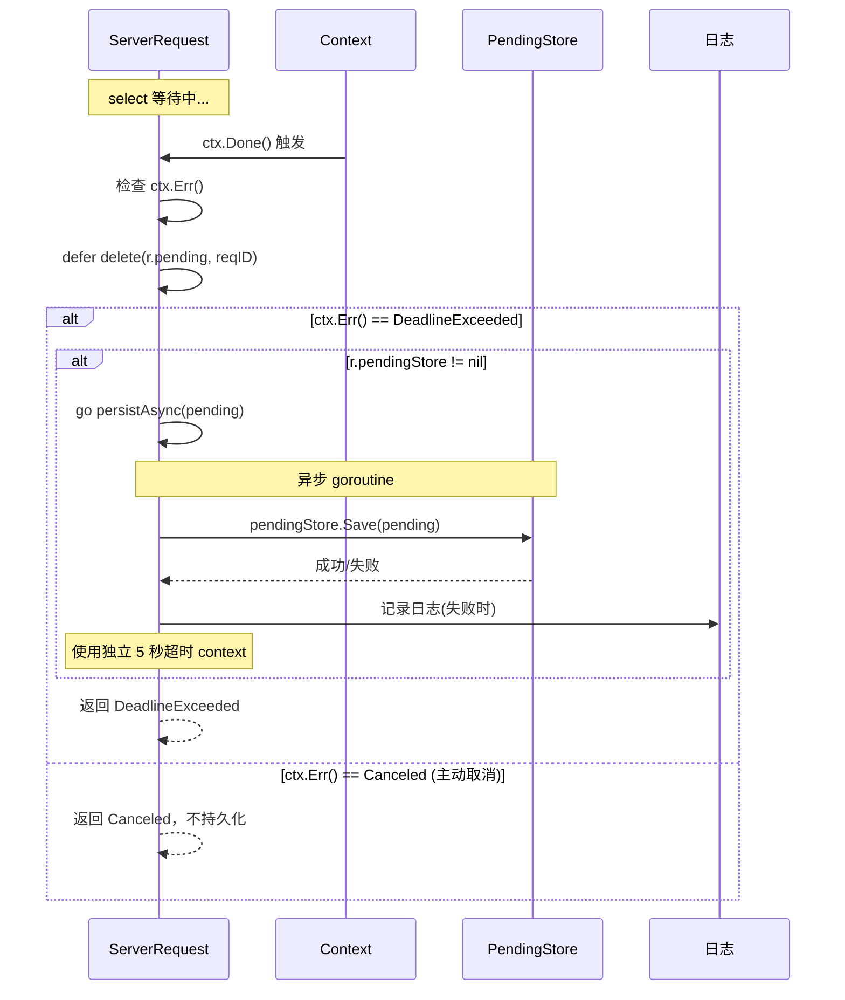

### 详细步骤

1. `select` 中 `ctx.Done()` 分支先于 `respCh` 触发
2. 检查 `ctx.Err()` 是否为 `context.DeadlineExceeded`（仅超时触发持久化，主动取消不触发）
3. 检查 `r.pendingStore` 是否非 nil
4. 调用 `persistAsync(pending)`，该方法启动一个 goroutine 执行异步保存
5. 异步 goroutine 使用独立的 5 秒超时 context 调用 `pendingStore.Save()`
6. 无论 Save 成功或失败，ServerRequest 都立即返回 `context.DeadlineExceeded` 错误（fail-open 设计）
7. defer 清理 pending 记录

### 边缘场景

| 场景 | 处理方式 |
|------|----------|
| PendingStore 为 nil | 超时后直接返回 DeadlineExceeded，不触发任何持久化，不会 panic（nil-safe） |
| PendingStore.Save() 返回错误 | 仅记录日志，不影响 ServerRequest 的返回值（fail-open） |
| PendingStore.Save() 执行缓慢 | ServerRequest 不被阻塞，因为持久化在独立 goroutine 中执行 |
| 父 context 被取消（`context.Canceled`） | 不触发持久化，仅 DeadlineExceeded 触发 |
| CancelDevice 先于超时触发 | 通过 respCh 分支返回，不经过 ctx.Done() 分支，因此不触发持久化 |

### 设计决策

**Fail-open 设计**：持久化失败不影响主流程返回。原因：
- 超时已经是异常情况，持久化是尽力而为的恢复机制
- 阻塞等待持久化会延长调用方的等待时间
- 即使丢失个别超时请求，用户仍可手动重试

---

## 3. 响应路由流程

**流程名称**：DispatchResponse_Routing

**描述**：当客户端通过 WebSocket 发回响应包时，DefaultMessageHandler 解析后调用 `DispatchResponse`，将响应路由到正在等待的 ServerRequest 调用方。

### 流程图

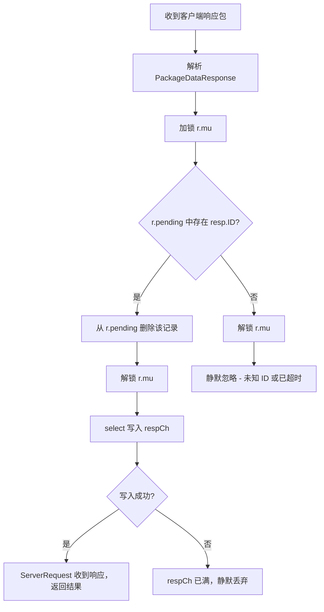

### 详细步骤

1. 加锁，在 `r.pending` 映射表中查找 `resp.ID` 对应的 pending 记录
2. 找到则从映射表中删除该记录（一次性消费）
3. 解锁
4. 若未找到（未知 ID），静默忽略（可能是已超时的迟到响应）
5. 通过 `select` 向 `pending.respCh` 写入响应（非阻塞）
6. ServerRequest 中的 `select` 收到响应，返回结果

### 边缘场景

| 场景 | 处理方式 |
|------|----------|
| 未知 reqID 的响应 | 静默忽略，不 panic，不报错（超时后的迟到响应场景） |
| 重复响应（同一 reqID 的第二个 DispatchResponse 调用） | 因为第一次已从 pending 中删除，第二次走未知 ID 分支，静默忽略 |
| respCh 已满 | 理论上不会发生（cap=1 且只写入一次），`default` 分支静默丢弃 |

### 为什么选择"一次性消费"语义

DispatchResponse 对 pending 记录采用"查找后立即删除"的一次性消费语义，而非"查找后保留"：

- **简化并发逻辑**：无需额外状态标记"已响应"
- **防止重复处理**：天然避免同一响应被多次路由
- **与超时协调**：超时已删除的记录不会被迟到响应重复触发

---

## 4. 按设备取消流程

**流程名称**：CancelDevice_PerDevice

**描述**：当设备重连或断开时，取消该设备所有正在等待的反向 RPC 请求，同时保证不影响其他设备和其他用户的请求。

### 流程图

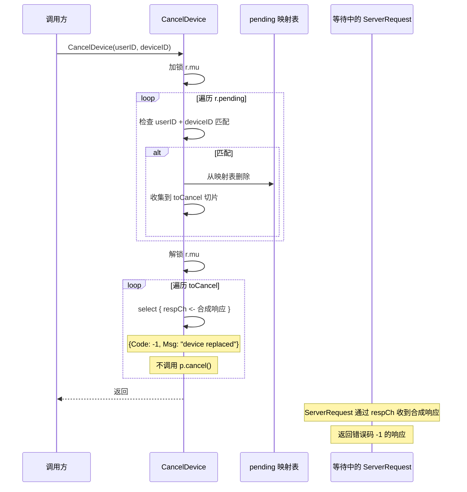

### 详细步骤

1. 加锁，遍历 `r.pending` 映射表
2. 筛选匹配 `userID + deviceID` 的所有 pending 记录
3. 从映射表中删除匹配的记录，收集到 `toCancel` 切片
4. 解锁
5. 遍历 `toCancel`，通过 `select` 向每个 `respCh` 写入合成响应 `{Code: -1, Msg: "device replaced"}`
6. **不调用** `p.cancel()`，避免与 ServerRequest 中 ctx.Done() 竞争

### 边缘场景

| 场景 | 处理方式 |
|------|----------|
| 无待处理请求 | 遍历为空，不 panic（幂等安全） |
| 多次调用 CancelDevice | 第一次删除所有 pending，后续调用遍历为空，幂等安全 |
| 跨用户隔离 | CancelDevice("user-A", "device-1") 不影响 user-B 的 device-1 请求，因为匹配条件同时检查 userID 和 deviceID |
| 同设备多个 pending 请求 | 一次性全部取消 |
| 与超时的竞态 | 若超时先触发，pending 已被删除，CancelDevice 找不到记录；若 CancelDevice 先触发，ServerRequest 通过 respCh 分支返回合成响应而非 ctx.Done() |

### 为什么不调用 p.cancel()

CancelDevice 向 respCh 写入合成响应后，**不调用** `p.cancel()`。原因：

- ServerRequest 的 `select` 有两个分支：`respCh` 和 `ctx.Done()`
- 如果同时触发两个，Go 的 `select` 会随机选择一个分支
- 调用 `p.cancel()` 会导致 `ctx.Done()` 触发，与 respCh 写入竞争
- 不调用 cancel() 保证 ServerRequest 一定通过 respCh 收到合成响应，返回有意义的错误信息

---

## 5. 自定义原因取消流程

**流程名称**：CancelDeviceWithReason_CustomReason

**描述**：CancelDevice 的泛化版本，允许传递自定义取消原因。用于区分"设备重连替换"和"设备正常断开"两种场景。

### 流程图

```mermaid
flowchart TD
    A[CancelDeviceWithReason userID, deviceID, reason] --> B[加锁 r.mu]
    B --> C[遍历 r.pending]
    C --> D{匹配 userID + deviceID?}
    D -->|是| E[从映射表删除，收集到 toCancel]
    D -->|否| F[跳过]
    E --> C
    F --> C
    C -->|遍历完成| G[解锁 r.mu]
    G --> H[遍历 toCancel]
    H --> I[respCh <- {Code: -1, Msg: reason}]
    I --> H
    H -->|完成| J[返回]
```

### 详细步骤

1. 与 CancelDevice 相同的加锁-遍历-删除-解锁流程
2. 向每个 respCh 写入 `{Code: -1, Msg: reason}` 合成响应

### 使用场景

| 场景 | reason 值 |
|------|-----------|
| 设备重连替换 | `"device replaced"` |
| 设备正常断开 | `"device disconnected"` |
| 自定义业务原因 | 任意字符串 |

### 边缘场景

| 场景 | 处理方式 |
|------|----------|
| reason 为空字符串 | 合法，Msg 字段为空 |
| 断开连接时调用 | reason 为 "device disconnected" |
| 设备重连时调用 | reason 为 "device replaced" |

---

## 6. 全局取消流程

**流程名称**：CancelAll_Shutdown

**描述**：服务关闭时取消所有正在等待的反向 RPC 请求。在 `WebSocketServer.closeAllClients()` 中被调用。

### 流程图

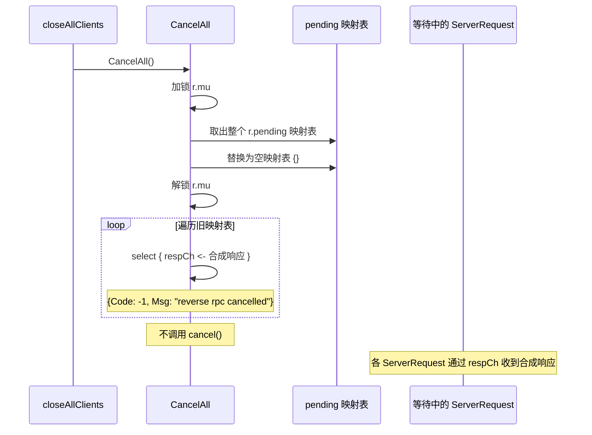

### 详细步骤

1. 加锁，将整个 `r.pending` 映射表取出，替换为空映射表
2. 解锁
3. 遍历旧映射表中所有 pending 记录
4. 向每个 respCh 写入 `{Code: -1, Msg: "reverse rpc cancelled"}`
5. 不调用 cancel()

### 边缘场景

| 场景 | 处理方式 |
|------|----------|
| 无 pending 请求 | 遍历为空，安全 |
| 并发的 ServerRequest 在 CancelAll 之后注册 | 不受影响，因为 CancelAll 只处理调用时刻的快照 |
| 与 ServerRequest 的 select 竞态 | respCh 写入先到则返回合成响应；ctx.Done() 先到则返回 context.Canceled（测试中有记录这种 rare race） |

### 快照语义

CancelAll 采用"快照语义"：在加锁瞬间取出当前所有 pending，解锁后遍历取消。这意味着：

- CancelAll 执行期间新注册的 pending 不会被取消（它们会在自己的超时后自然失败）
- 这是可接受的，因为 CancelAll 通常在服务关闭时调用，此时不会有新的 ServerRequest 注册

---

## 7. 持久化重放流程

> **相关文档**：完整的重连重放流程（包括客户端握手顺序、FullSync 协调、边缘场景等）详见 [reconnection.md](reconnection.md#1-重连流程-reconnect)。本节聚焦于 ReplayRequest 的内部机制和 PendingStore 操作细节。

**流程名称**：ReplayRequest_PersistenceReplay

**描述**：设备重连后，客户端发送 `system.reconnect` RPC 请求（携带 `last_seen_seq`），服务端从 PendingStore 取出之前超时持久化的请求，按 `last_seen_seq` 过滤后异步重放。重放使用新的 replayID 进行响应路由，但保留原始 IdempotencyKey 供客户端去重。重放结果（成功/失败/超限丢弃）会反馈到 PendingStore。

### 流程图

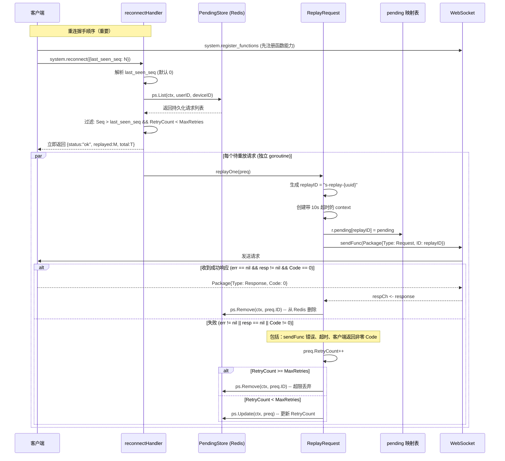

### 详细步骤

1. 客户端重连后，先发送 `system.register_functions` 注册函数能力，再发送 `system.reconnect` RPC（params 包含 `last_seen_seq`，默认 0）。顺序很重要：先注册函数确保服务端重放请求时客户端已有对应的 handler
2. reconnectHandler 查询 PendingStore.List 获取该设备的所有持久化请求
3. 过滤：仅保留 `Seq > last_seen_seq` 且 `RetryCount < MaxRetries` 的请求
4. 立即返回响应 `{status:"ok", replayed: N, total: M}` 给客户端（不等待重放完成）
5. 每个待重放请求启动独立 goroutine 执行 `replayOne`
6. `replayOne` 使用 `context.Background()` 调用 `ReplayRequest`（10 秒超时），确保客户端断连不会取消正在进行的重放；生成新 replayID，保留原始 IdempotencyKey 和 Seq
7. 重放成功（`err == nil && resp != nil && Code == 0`）：调用 `ps.Remove` 从 Redis 删除
8. 重放失败（`err != nil || resp == nil || Code != 0`，包括 sendFunc 错误、超时、客户端返回非零 Code）：递增 `RetryCount`，若未超限调用 `ps.Update` 更新计数，若超限调用 `ps.Remove` 丢弃

### ReplayRequest 详细步骤

1. 生成新的 replayID，格式为 `s-replay-{uuid}`
2. 创建带超时的 context（基于调用方传入的 context）和新的 reverseRPCPending 结构体
3. pending 中的 idempotencyKey 和 seq 保留原始值，reqID 使用新 replayID
4. 注册到 `r.pending[replayID]`
5. 序列化 PackageDataRequest，Version 固定为 1，ID 为 replayID，IdempotencyKey 为原始值
6. 调用 sendFunc 发送到原始 (userID, deviceID)
7. select 等待响应或超时
8. defer 清理 pending 记录
9. ReplayRequest 本身不处理持久化（由调用方 reconnectHandler 负责）

### PendingStore 在重放中的操作

| 时机 | 操作 | 说明 |
|------|------|------|
| reconnect 请求到达 | List | 查询设备的所有 pending 请求 |
| 重放成功 (err==nil && resp!=nil && Code==0) | Remove | 从 Redis 删除已完成的请求 |
| 重放失败 (err!=nil \|\| resp==nil \|\| Code!=0)，未超限 | Update | 更新 RetryCount 到 Redis |
| 重放失败，超过 MaxRetries | Remove | 从 Redis 删除超限请求 |

### 边缘场景

| 场景 | 处理方式 |
|------|----------|
| PendingStore 为 nil | reconnectHandler 返回 `{replayed:0, total:0}`，不做任何重放 |
| List 返回错误 | fail-open：记录日志，返回 `{replayed:0, total:0}` |
| 客户端利用 IdempotencyKey 去重 | 若客户端已执行过该请求（通过 IdempotencyKey 识别），直接返回缓存的结果 |
| 与 CancelDevice 交互 | ReplayRequest 的 pending 记录同样会被 CancelDevice 取消，因为 CancelDevice 匹配的是 userID+deviceID |
| sendFunc 错误 | ReplayRequest 返回 "send replay request" 错误，replayOne 递增 RetryCount（代码中日志标签为 "replay timeout"，实际涵盖所有失败类型） |
| 多次重放同一原始请求 | 每次生成不同的 replayID，互不干扰 |
| last_seen_seq 过滤 | 仅重放 Seq > last_seen_seq 的请求，客户端可通过此机制跳过已处理的请求 |
| Remove/Update 失败 | 仅记录日志，不影响主流程（fail-open） |
| 客户端响应发送失败 | 客户端将响应包入队到 ResponseRetryQueue，后台 goroutine 每秒重试，指数退避，超过 maxRetry 次数后丢弃 |

### 为什么使用新的 reqID

重放时使用新的 replayID 而非原始 reqID，原因：

- **响应路由隔离**：重放请求的响应通过新 replayID 路由，不会与可能的迟到原始响应冲突
- **幂等去重由客户端负责**：客户端通过 IdempotencyKey 判断是否已执行过，而非 reqID
- **简化实现**：无需在 DispatchResponse 中特殊处理重放响应

### 客户端响应重试机制 (ResponseRetryQueue)

当客户端处理完服务端请求后，需要将响应包发送回服务端。如果发送失败（网络抖动、连接中断等），响应会被入队到 ResponseRetryQueue 进行重试：

1. 客户端调用 `sendResponse` 发送响应包
2. 若 `sendPackage` 失败，响应被入队到 `ResponseRetryQueue`
3. 后台 `responseRetryLoop` 每秒检查队列，尝试重新发送
4. 使用指数退避策略：`nextRetry = now + 1s * 2^attempts`，上限 16 秒
5. 超过 `maxRetry` 次数后丢弃响应，记录错误日志
6. 队列满时（达到 `maxSize`），丢弃最旧的条目（FIFO 淘汰）

**参数说明**：

| 参数 | 默认值 | 说明 |
|------|--------|------|
| `maxSize` | 可配置 | 队列最大容量，满时丢弃最旧条目 |
| `maxRetry` | 可配置 | 每个条目的最大重试次数 |
| 基础延迟 | 1 秒 | 指数退避的基础间隔 |
| 最大退避 | 16 秒 | 指数退避的上限 |

**退避算法**：`delay = min(1s * 2^attempts, 16s)`。首次重试在 1 秒后，第 2 次 2 秒，第 3 次 4 秒，第 4 次 8 秒，第 5 次及以后均为 16 秒。

这确保了即使在短暂的网络中断期间，客户端的响应也不会丢失。服务端的 ReplayRequest 会因为超时而将请求标记为失败，下次重连时会再次重放。

### 客户端幂等去重机制 (IdempotencyCache)

重放请求保留原始 `IdempotencyKey`（等于原始 `reqID`），客户端通过 `IdempotencyCache`（LRU 缓存）进行去重，防止同一请求被重复处理。

**处理流程**：

1. 客户端收到服务端请求时，检查 `req.IdempotencyKey` 是否非空且已存在于 `IdempotencyCache` 中
2. **缓存命中**：直接返回缓存的响应（`Code: 0, Msg: "duplicate (idempotency cache hit)"`），不执行实际 handler
3. **缓存未命中**：执行正常 handler 处理，处理成功后将 `IdempotencyKey` 写入缓存
4. 若发送缓存的响应失败，响应被入队到 `ResponseRetryQueue` 进行重试

**关键保证**：

- 同一原始请求的多次重放（不同 `replayID`，相同 `IdempotencyKey`）只会被客户端实际执行一次
- 缓存命中时仍会返回成功响应（`Code: 0`），服务端会将其视为重放成功并从 PendingStore 删除
- 这是重放幂等性的客户端侧保障，与服务端的 `RetryCount` / `MaxRetries` 机制互补

**序列号跟踪**：客户端同时通过 `handleIncomingRequest` 跟踪收到的最高序列号（`lastReqSeq`），仅当 `req.Seq > 0` 且大于当前值时更新。该值在 `system.reconnect` 时作为 `last_seen_seq` 发送给服务端，用于过滤已处理的请求。

---

## 8. 并发请求流程

**流程名称**：ConcurrentRequests_MultiGoroutine

**描述**：多个 goroutine 同时对同一设备发起 ServerRequest，所有请求独立运作、独立响应、独立超时。

### 流程图

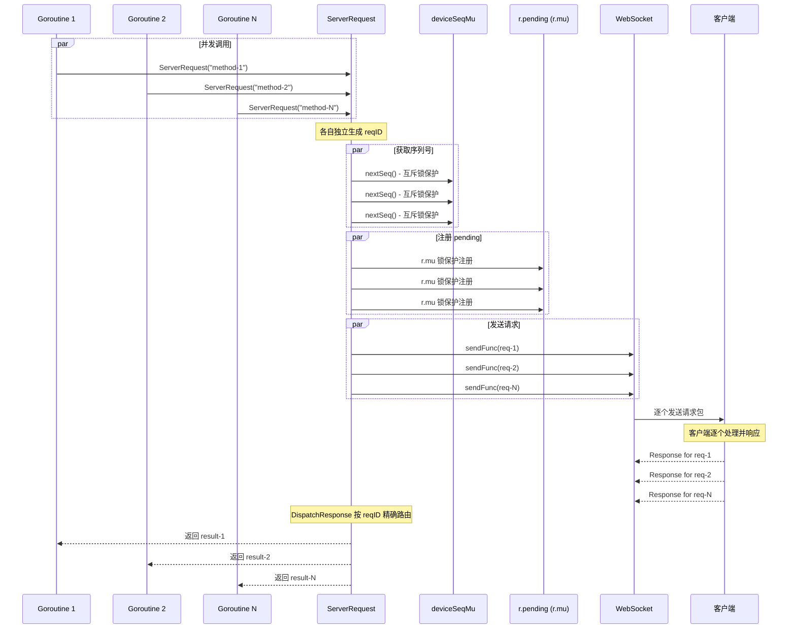

### 详细步骤

1. N 个 goroutine 并发调用 ServerRequest，各自生成独立的 reqID
2. 每个请求通过 nextSeq() 获取唯一递增序列号（deviceSeqMu 互斥锁保护）
3. 每个请求在 r.pending 中注册独立的 pending 记录（r.mu 互斥锁保护）
4. sendFunc 逐个发送请求包到客户端
5. 客户端逐个响应，DispatchResponse 按 reqID 精确路由到对应 goroutine
6. 所有 goroutine 独立收到响应并返回

### 边缘场景

| 场景 | 处理方式 |
|------|----------|
| 并发 persistAsync | 多个超时请求同时持久化，每个有唯一的 seq 值（测试 `TestServerRequest_ConcurrentPersist` 验证） |
| 并发 CancelDevice | 与 ServerRequest 的 pending 注册存在锁竞争，但通过 r.mu 保证原子性 |
| nextSeq 并发安全 | 单独的 deviceSeqMu 锁保证序列号不重复 |
| DispatchResponse 并发安全 | r.mu 锁保护 pending 映射表的读写 |

### 锁策略

系统使用两把独立的锁来降低竞争：

| 锁 | 保护对象 | 粒度 |
|----|----------|------|
| `r.mu` | `r.pending` 映射表 | 全局 |
| `deviceSeqMu` | 序列号计数器 | 按 (userID, deviceID) 对 |

这种设计允许不同设备的序列号分配完全并行，只有同一设备的请求才在序列号分配上串行化。

---

## 9. 设备生命周期与 CancelDevice 时序

> **相关文档**：完整的设备重连生命周期（包括客户端重连协调、FullSync、指数退避等）详见 [reconnection.md](reconnection.md)。本节仅聚焦于 CancelDevice 在设备生命周期中的调用时机和时序保证。

**流程名称**：DeviceReconnect_CancelDeviceTiming

**描述**：设备连接生命周期中有两个关键的 CancelDevice 调用时机：重连时（Upgrade 前）和正常断开时（removeClient 后）。两者都通过 `hasActiveConn` 检查避免误取消替代连接的请求。

### 9a. 设备重连流程

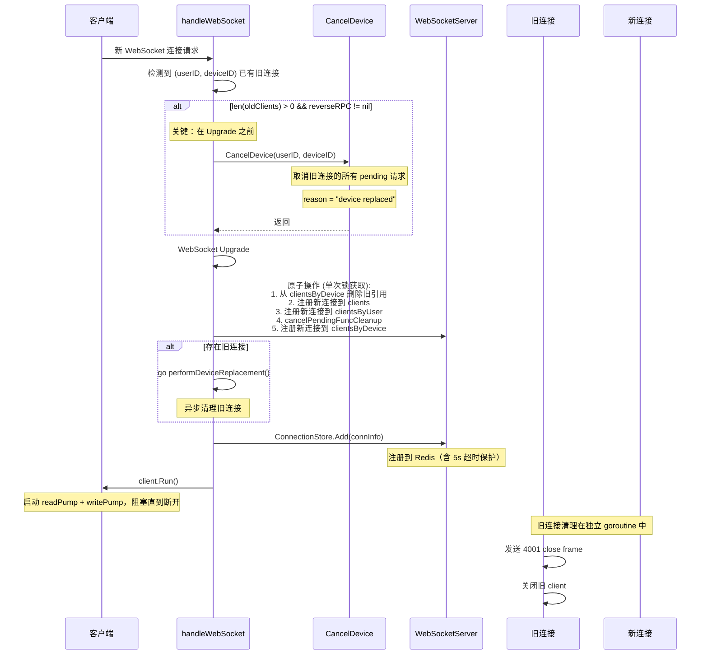

### 9b. 正常断开流程

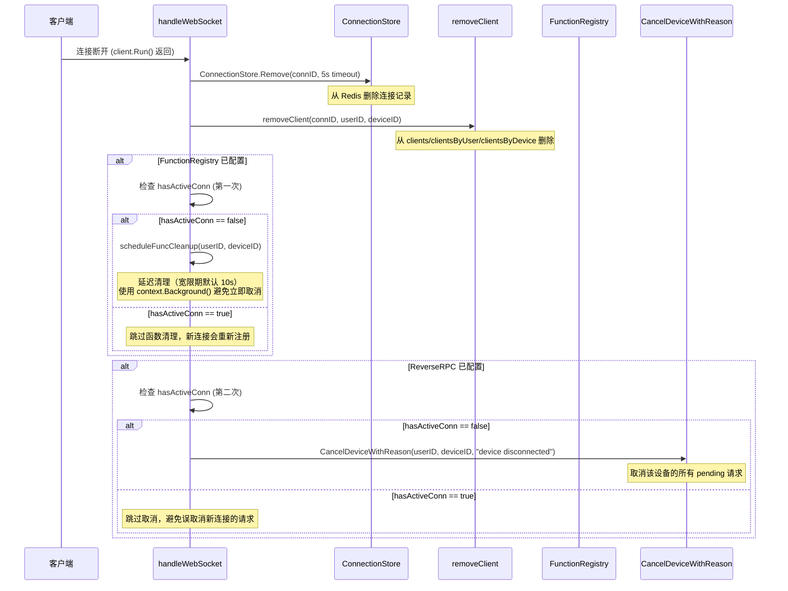

### 详细步骤

**重连路径**：
1. 客户端发起新的 WebSocket 连接请求
2. handleWebSocket 检测到该 (userID, deviceID) 已有旧连接
3. **在 Upgrade 之前**，若 `len(oldClients) > 0 && reverseRPC != nil`，调用 `reverseRPC.CancelDevice(userID, deviceID)`
4. 所有旧连接的 pending 请求收到 "device replaced" 合成响应
5. 执行 WebSocket Upgrade
6. 原子注册新连接（单次锁获取）：从 clientsByDevice 删除旧引用，注册到 clients/clientsByUser/clientsByDevice，同时调用 `cancelPendingFuncCleanup` 取消待执行的函数清理
7. 若存在旧连接，启动异步 goroutine 执行 `performDeviceReplacement`（发送 4001 close frame，关闭旧 client，removeClient）
8. 构建 ConnectionInfo 并调用 `ConnectionStore.Add(connInfo)` 注册到 Redis（含 5 秒超时保护）
9. 调用 `client.Run()` 启动 readPump + writePump，阻塞直到客户端断开
10. **ConnectionStore.Add 失败路径**：若 Add 失败，关闭已创建的 Client，调用 `removeClient` 从本地索引移除，直接返回

**正常断开路径**：

1. 客户端连接断开，`client.Run()` 返回
2. 从 ConnectionStore 删除连接记录（带 5 秒超时 context，避免 Redis 不可达时无限阻塞）
3. 调用 `removeClient` 从本地映射表删除
4. **第一次 hasActiveConn 检查**（函数注册清理）：若 FunctionRegistry 已配置且无替代连接，调用 `scheduleFuncCleanup` 启动延迟清理（宽限期默认 10 秒）；若有替代连接则跳过
5. **第二次 hasActiveConn 检查**（反向 RPC 取消）：若 ReverseRPC 已配置且无替代连接，调用 `CancelDeviceWithReason(userID, deviceID, "device disconnected")`；若有替代连接则跳过

### 边缘场景

| 场景 | 处理方式 |
|------|----------|
| 新连接的请求不会被误取消 | CancelDevice 在 Upgrade 前执行，此时新连接尚未注册，不会有属于新连接的 pending 请求 |
| 无旧连接时跳过 CancelDevice | 仅当 `len(oldClients) > 0 && reverseRPC != nil` 时才调用 CancelDevice |
| 正常断开后快速重连 | hasActiveConn 检查发现替代连接已注册，跳过 CancelDeviceWithReason 和 scheduleFuncCleanup |
| 旧连接清理是异步的 | performDeviceReplacement 在独立 goroutine 中执行，不阻塞新连接的注册 |
| removeClient 与 CancelDevice 顺序 | 正常断开时先 removeClient 再检查 hasActiveConn，确保检查的是最新状态 |
| 函数注册延迟清理 | 正常断开时若无替代连接，scheduleFuncCleanup 启动 10 秒宽限期；若设备在宽限期内重连，cancelPendingFuncCleanup 取消清理 |
| 两次 hasActiveConn 检查 | 正常断开路径有两次独立检查：第一次决定是否清理函数注册，第二次决定是否取消反向 RPC；两者独立，可能一个触发另一个不触发 |
| Upgrade 失败但 CancelDevice 已执行 | 若存在旧连接且 CancelDevice 已取消旧连接的待处理 RPC，但随后 Upgrade 失败，旧连接的 pending 请求被不必要地取消，但旧连接本身不受影响，客户端可重试 |
| ConnectionStore.Add 失败 | Redis 不可达或达到 MaxConnectionsPerUser 限制时，关闭已创建的 Client，从本地索引移除，直接返回 |

### 时序保证

```
重连时间线:
  T1: 检测到旧连接存在
  T2: CancelDevice(userID, deviceID)  ← 旧连接的 pending 被取消 ("device replaced")，仅当 oldClients 非空且 reverseRPC 已配置
  T3: WebSocket Upgrade               ← 新连接建立
  T4: 注册新连接 + 从 clientsByDevice 删除旧引用  ← 新连接可用于接收请求
  T5: cancelPendingFuncCleanup        ← 取消待执行的函数清理
  T6: 异步清理旧连接                  ← 不阻塞主流程

正常断开时间线:
  T1: client.Run() 返回
  T2: ConnectionStore.Remove(connID, 5s timeout)  ← 从 Redis 删除
  T3: removeClient(connID)            ← 从本地映射表删除
  T4: 第一次 hasActiveConn 检查       ← 决定是否 scheduleFuncCleanup
  T5: 第二次 hasActiveConn 检查       ← 决定是否 CancelDeviceWithReason ("device disconnected")
```

**关键保证**：
- 重连时 T2 发生在 T4 之前，确保 CancelDevice 只取消属于旧连接的 pending
- 正常断开时 T3 发生在 T4/T5 之前，hasActiveConn 检查基于最新状态
- 重连时 T5 在 T4 之后，确保新连接注册后才取消待执行的函数清理

---

## 10. 端到端测试流程

**流程名称**：E2E_BasicRoundTrip

**描述**：端到端测试验证完整链路：服务端通过 WebSocket 发送 Request -> 客户端收到并构造 Response -> 服务端收到响应。

### 流程图

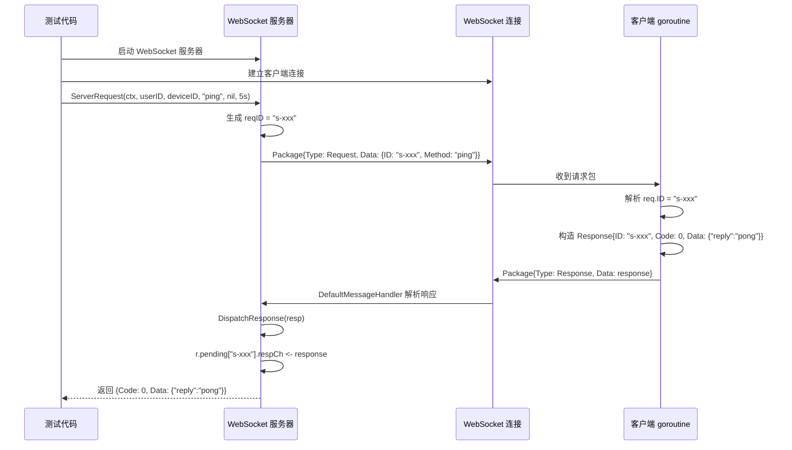

### 详细步骤

1. 启动 WebSocket 服务器，建立客户端连接
2. 服务端调用 `ServerRequest(ctx, userID, deviceID, "ping", nil, 5s)`
3. sendFunc 通过 WebSocket 发送 `Package{Type: Request, Data: PackageDataRequest{ID: "s-xxx", Method: "ping"}}`
4. 客户端 goroutine 读取消息，解析出 req.ID
5. 客户端构造 `PackageDataResponse{ID: req.ID, Code: 0, Data: {"reply":"pong"}}`
6. 客户端通过 WebSocket 发送 `Package{Type: Response, Data: response}`
7. 服务端 DefaultMessageHandler 解析响应包，调用 DispatchResponse
8. ServerRequest 的 respCh 收到响应，返回结果

### 测试覆盖的边缘场景

| 场景 | 测试用例 | 预期行为 |
|------|----------|----------|
| 客户端未连接 | RRPC-003 | sendFunc 返回 "offline" 错误码，ServerRequest 立即返回，不等待超时 |
| 客户端连接但不响应 | RRPC-002 | 超时后返回 DeadlineExceeded |
| 客户端响应的 req.ID 不匹配 | - | DispatchResponse 找不到对应 pending，静默忽略 |

---

## 附录：流程间交互矩阵

| 流程 A | 流程 B | 交互方式 |
|--------|--------|----------|
| ServerRequest | DispatchResponse | 通过 respCh 连接，reqID 匹配 |
| ServerRequest | CancelDevice | 通过 respCh 连接，userID+deviceID 匹配 |
| ServerRequest | 超时 | 通过 ctx.Done() 触发，仅 DeadlineExceeded 触发持久化 |
| CancelDevice | 超时 | 竞态关系，respCh 优先 |
| ReplayRequest | CancelDevice | ReplayRequest 的 pending 同样会被 CancelDevice 取消 |
| CancelAll | ServerRequest | 快照语义，CancelAll 不影响后续注册 |
| 持久化 | reconnectHandler | PendingStore 连接，超时保存 -> system.reconnect 触发重放 |
| reconnectHandler | ReplayRequest | reconnectHandler 过滤后调用 ReplayRequest，管理 RetryCount |
| 设备重连 | CancelDevice | Upgrade 前调用，reason="device replaced" |
| 设备断开 | CancelDeviceWithReason | removeClient 后调用，hasActiveConn 守卫，reason="device disconnected" |

## 附录：状态码约定

| Code | 含义 | 来源 |
|------|------|------|
| 0 | 成功 | 客户端正常响应 |
| -1 | 设备替换/断开 | CancelDevice / CancelDeviceWithReason |
| -1 | 全局取消 | CancelAll |
| 其他 | 业务错误 | 客户端自定义 |

## 附录：错误消息约定

| 错误消息 | 触发条件 |
|----------|----------|
| `send request` | sendFunc 发送请求失败（设备离线等） |
| `marshal request` | json.Marshal 请求体失败 |
| `send replay request` | ReplayRequest 的 sendFunc 失败 |
| `marshal replay request` | ReplayRequest 的 json.Marshal 失败 |
| `device replaced` | CancelDevice 合成响应 |
| `device disconnected` | CancelDeviceWithReason (断开场景) |
| `reverse rpc cancelled` | CancelAll 合成响应 |
| `context.DeadlineExceeded` | 请求超时 |
| `context.Canceled` | 父 context 被主动取消 |
