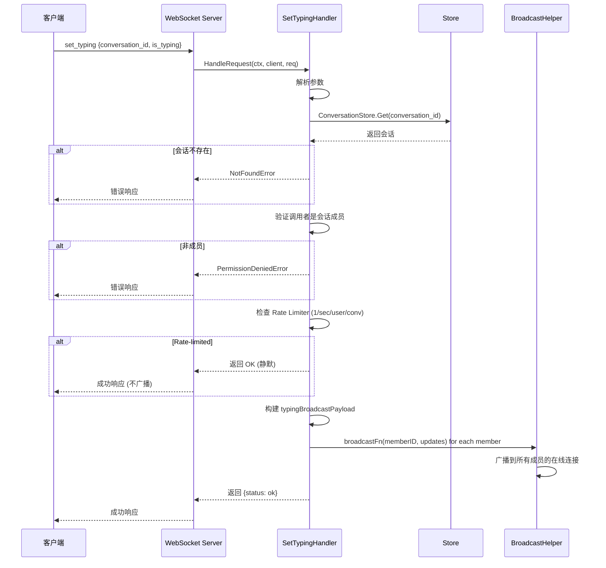
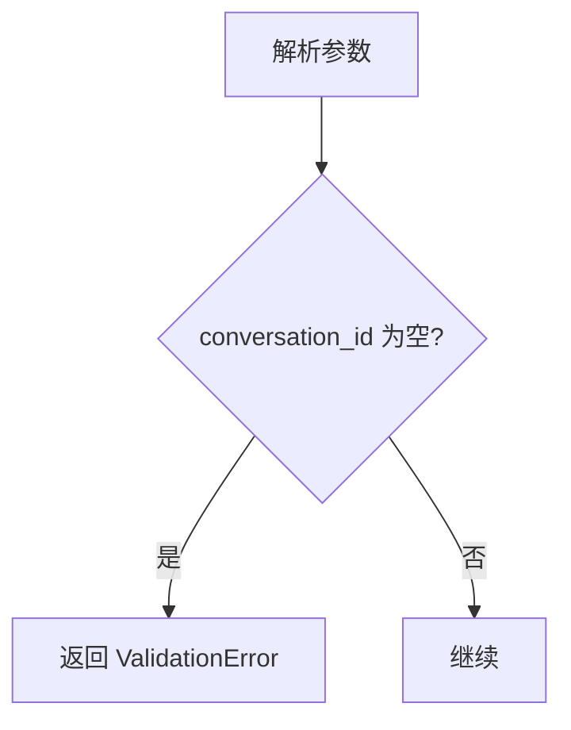
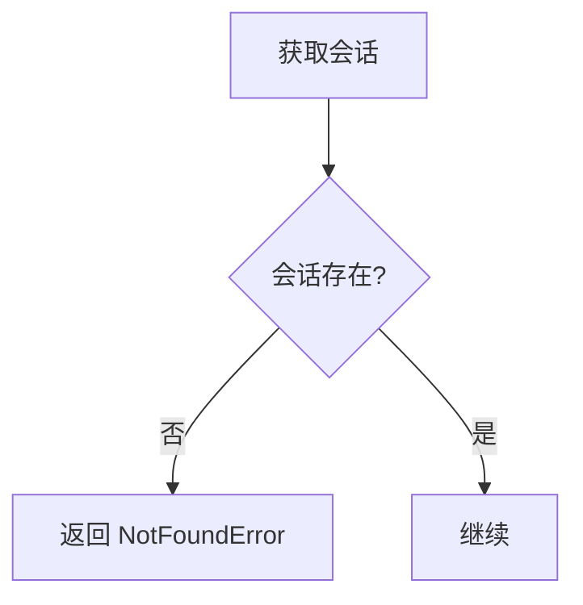
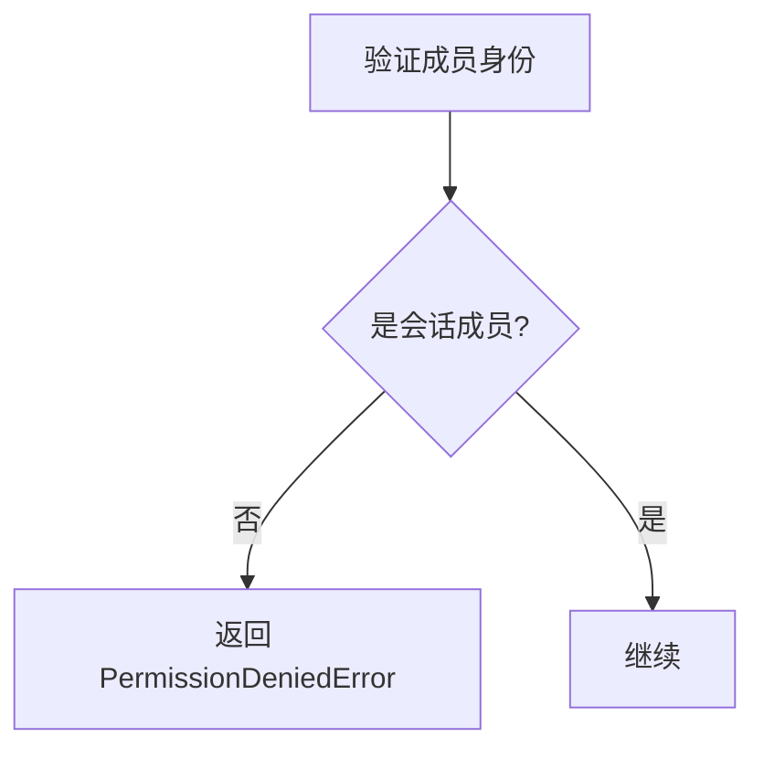
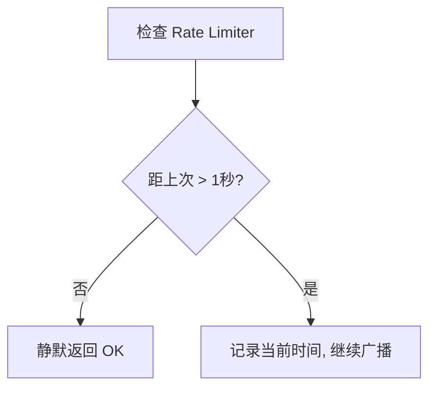
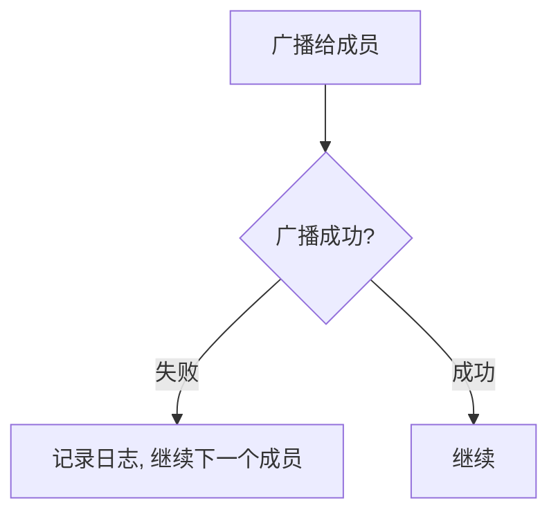

# Set Typing 业务流程

本文档描述 `set_typing` RPC 方法的完整业务流程，包括主流程、边缘场景和依赖关系。

---

## 目录

- [概述](#概述)
- [主流程](#主流程)
- [边缘场景](#边缘场景)
- [依赖关系](#依赖关系)
- [关键设计决策](#关键设计决策)

---

## 概述

`set_typing` 是一个 ephemeral（瞬时）RPC 方法，用于广播用户正在输入的状态指示器给会话中的所有成员。该方法不持久化任何数据（Seq=0），不通过 `sync_updates` 交付，对离线用户静默丢弃。

### 触发条件

- 用户在客户端开始输入时发送 `is_typing: true`
- 用户停止输入或离开对话时发送 `is_typing: false`
- 客户端应实现防抖逻辑，避免频繁发送

### 关键特性

- **Ephemeral**：Seq=0，不持久化到数据库
- **Rate-limited**：每个用户每个会话每秒最多 1 次
- **Broadcast to all**：广播给所有成员（包括发送者自己）
- **No MQ**：直接通过 WebSocket 广播，不经过消息队列

---

## 主流程

### 详细步骤

1. **解析参数**：提取 `conversation_id` 和 `is_typing`
2. **校验必填字段**：`conversation_id` 不能为空
3. **获取会话**：验证会话存在性
4. **身份验证**：验证调用者是会话成员
5. **Rate limiting**：检查每个用户每个会话的 rate limiter（1 秒 1 次）
   - Key 格式：`userID:conversationID`
   - 超限时静默返回 OK（不报错）
6. **构建 payload**：包含 `user_id`、`conversation_id`、`is_typing`、`is_agent`、`timestamp`
7. **广播**：遍历所有会话成员，调用 `broadcastFn` 广播
8. **返回成功**：返回 `{status: ok}`

---

## 边缘场景

### 1. 参数校验失败

| 场景 | 处理方式 |
|------|----------|
| `conversation_id` 为空 | 返回 `ValidationError('missing required field: conversation_id')` |
| JSON 解析失败 | 返回 `ValidationError('invalid params')` |

### 2. 会话不存在

| 场景 | 处理方式 |
|------|----------|
| 会话不存在 | 返回 `NotFoundError('conversation not found')` |
| 会话已被软删除 | GORM 自动过滤，等同于不存在 |

### 3. 非成员操作

| 场景 | 处理方式 |
|------|----------|
| 调用者非会话成员 | 返回 `PermissionDeniedError('user is not a member of the conversation')` |

### 4. Rate Limiting

| 场景 | 处理方式 |
|------|----------|
| 1 秒内重复发送 | 静默返回 OK，不广播（不是错误） |
| Rate limiter entry 过期 | 后台 cleanup goroutine 每 5 分钟清理 10 分钟未访问的条目 |

### 5. 广播失败

| 场景 | 处理方式 |
|------|----------|
| 单个成员广播失败 | 记录日志，继续处理其他成员 |
| 所有成员都离线 | 所有广播失败，但不影响返回值 |

---

## 依赖关系

### 内部依赖

| 组件 | 用途 |
|------|------|
| `store.StoreAPI` | 获取会话信息，验证成员身份 |
| `broadcastFn` | 广播 updates 给指定用户的所有在线连接 |

### 外部依赖

无。`set_typing` 不依赖消息队列或外部服务。

### 数据库操作

| 操作 | 表 | 说明 |
|------|-----|------|
| SELECT | conversations | 获取会话信息 |

---

## 关键设计决策

### 1. Ephemeral（Seq=0）

`set_typing` 使用 `Seq=0` 表示这是瞬时消息：
- 不持久化到 `user_updates` 表
- 不通过 `sync_updates` 交付
- 对离线用户静默丢弃
- 客户端不应将此类消息计入序列号

### 2. Rate Limiting

采用 per-user-per-conversation 的 token bucket rate limiter：
- **速率**：1 秒 1 次
- **Key**：`userID:conversationID`
- **超限行为**：静默返回 OK（不是错误）
- **清理**：后台 goroutine 每 5 分钟清理 10 分钟未访问的条目

### 3. Broadcast to All Members

广播给所有成员（包括发送者自己），原因：
- 发送者可能有多个设备，需要同步状态
- 简化实现，避免过滤逻辑

### 4. No Persistence

不持久化的原因：
- Typing 状态是瞬时的，过期后无意义
- 减少数据库写入压力
- 客户端应自行实现超时清除逻辑

---

## 相关文档

- [消息处理业务流程](message.md)
- [Stream Text 业务流程](stream-text.md)
- [WebSocket 连接管理](websocket-connection.md)
- [广播机制](broadcasting.md)
