# 存储层业务流程

本文档描述 Xyncra Server 存储层的完整业务流程，涵盖数据库初始化、Store 构建、各领域 CRUD 操作、事务管理、错误分类及可观测性集成。

---

## 目录

- [1. 数据库初始化](#1-数据库初始化)
- [2. Store 构建](#2-store-构建)
- [3. 会话 CRUD](#3-会话-crud)
- [4. 消息 CRUD](#4-消息-crud)
- [5. 问题 CRUD](#5-问题-crud)
- [6. 用户更新 CRUD](#6-用户更新-crud)
- [7. 发送消息事务](#7-发送消息事务)
- [8. 手动事务](#8-手动事务)
- [9. 错误分类](#9-错误分类)
- [10. 可观测性集成](#10-可观测性集成)
- [11. 数据模型](#11-数据模型)

---

## 1. 数据库初始化

从配置创建数据库连接、初始化连接池、构建 Store 聚合根、执行 schema 迁移的完整启动链。

### 流程图

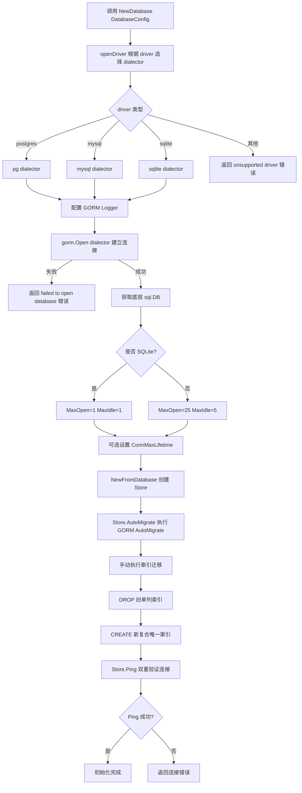

### 边缘场景

| 场景 | 说明 |
|------|------|
| 不支持的 driver 名称 | `openDriver` 返回 `fmt.Errorf("store: unsupported database driver: %s")` |
| 连接失败 | GORM Open 失败返回 `fmt.Errorf("store: failed to open database: %w")` |
| SQLite 并发限制 | MaxOpen 强制为 1，防止 shared-cache 死锁 |
| AutoMigrate 无法处理索引替换 | 单列索引替换为复合索引需手动 DROP/CREATE |
| Ping 双重检查 | 既检查底层连接存活，又验证查询路径可用（捕获 schema 损坏） |
| 连接池耗尽 | 超过 MaxOpenConns 的查询会阻塞等待，可能超时 |

---

## 2. Store 构建

Store 结构体作为顶层入口，聚合 4 个领域子 Store，实现 StoreAPI 接口用于依赖注入。

### 流程图

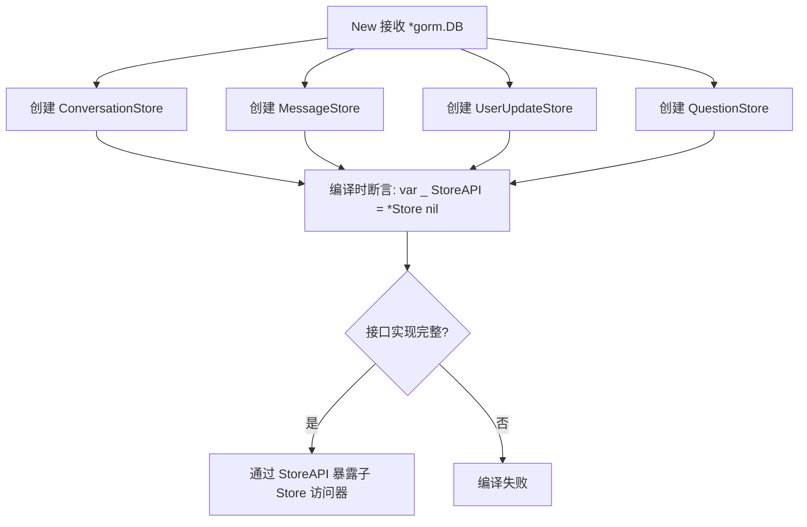

### 边缘场景

| 场景 | 说明 |
|------|------|
| db 为 nil | 子 Store 创建不会立即 panic，但后续操作会 nil pointer |
| 编译时接口检查 | 如果 StoreAPI 接口方法签名变更但 Store 未更新，编译失败 |

---

## 3. 会话 CRUD

会话的创建、查询、更新、软删除、恢复、搜索等完整生命周期操作。

### 流程图

```mermaid
flowchart TD
    subgraph Create
        C1[startSpan 创建 OTel span] --> C2[db.WithContext.Create conv]
        C2 --> C3{成功?}
        C3 -->|是| C4[返回 nil]
        C3 -->|否| C5[classifyError 翻译错误]
        C5 --> C6[finish 设置 span 状态]
    end

    subgraph Get
        G1[db.Where id=?.First] --> G2{找到?}
        G2 -->|是| G3[返回 Conversation]
        G2 -->|否| G4[ErrRecordNotFound -> ErrNotFound]
    end

    subgraph GetByUsers
        GU1[构建双向 OR 查询] --> GU2[user_id1=A AND user_id2=B OR 反向]
        GU2 --> GU3[返回第一个匹配记录]
    end

    subgraph GetByUser
        GB1[查询 user_id1 方向] --> GB3[内存合并去重 seen map]
        GB2[查询 user_id2 方向] --> GB3
        GB3 --> GB4[按 LastMessageAt DESC 排序]
        GB4 --> GB5[应用 offset/limit 分页]
        GB5 --> GB6[limit+1 探测 has_more]
    end

    subgraph Delete
        D1[db.Delete Conversation id] --> D2{RowsAffected == 0?}
        D2 -->|是| D3[ErrNotFound]
        D2 -->|否| D4[软删除完成 设置 deleted_at]
    end

    subgraph Restore
        R1[Unscoped 查询已软删除记录] --> R2[Update deleted_at = nil]
        R2 --> R3{找到已删除记录?}
        R3 -->|是| R4[恢复完成]
        R3 -->|否| R5[无操作]
    end

    subgraph UpdateLastRead
        UR1[Get 会话确定用户位置] --> UR2{UserID1 or UserID2?}
        UR2 -->|UserID1| UR3[选择 last_read_message_id_1]
        UR2 -->|UserID2| UR4[选择 last_read_message_id_2]
        UR3 --> UR5[CASE WHEN MAX 只前进不后退]
        UR4 --> UR5
    end

    subgraph SearchByTitle
        SB1[LIKE 查询] --> SB2[escapeLikePattern 转义特殊字符]
        SB2 --> SB3[limit 范围控制 0~101]
    end
```

### 边缘场景

| 场景 | 说明 |
|------|------|
| 并发创建相同 (user_id1, user_id2) 对 | uniqueIndex 触发 ErrDuplicateKey |
| 软删除后查询 | 默认查询自动排除 `deleted_at IS NOT NULL` 的记录 |
| GetByUser 分页精度 | 双向查询 + 合并可能导致边界处少量重复，小规模会话列表影响可忽略 |
| UpdateLastRead 用户非成员 | 返回 ErrNotFound |
| UpdateLastRead 并发回退 | CASE WHEN 保证只前进不后退 |
| SearchByTitle SQL 注入 | `escapeLikePattern` 转义 `%`, `_`, `|` |

---

## 4. 消息 CRUD

消息的创建、查询、列表、搜索、软删除、恢复、未读计数等操作。

### 流程图

```mermaid
flowchart TD
    subgraph Create
        MC1[db.WithContext.Create msg] --> MC2{唯一索引冲突?}
        MC2 -->|是| MC3[ErrDuplicateKey 幂等保护]
        MC2 -->|否| MC4[创建成功]
    end

    subgraph ListByConversation
        LC1[WHERE conv_id=? AND msg_id > ?] --> LC2[ORDER BY msg_id ASC]
        LC2 --> LC3[limit 范围 1~200 默认 50]
        LC3 --> LC4[返回消息列表]
    end

    subgraph SearchByConversation
        SC1[LIKE 查询] --> SC2{afterMessageID > 0?}
        SC2 -->|是| SC3[仅返回 msg_id < afterMessageID]
        SC2 -->|否| SC4[返回全部匹配]
        SC3 --> SC5[按 MessageID DESC 排序]
        SC4 --> SC5
        SC5 --> SC6[limit 范围 1~201]
    end

    subgraph ListRecentByConversation
        LR1[按 MessageID DESC] --> LR2[取最近 N 条]
        LR2 --> LR3[limit 范围 1~500]
        LR3 --> LR4[返回消息列表 用于 Agent 上下文]
    end

    subgraph CountUnread
        CU1[COUNT WHERE msg_id > ?] --> CU2{count < 0?}
        CU2 -->|是| CU3[返回 0 防御性检查]
        CU2 -->|否| CU4[返回 count]
    end

    subgraph Delete
        MD1[db.Delete msg id] --> MD2[软删除 设置 deleted_at]
    end

    subgraph Restore
        MR1[Unscoped 查询已删除记录] --> MR2[Update deleted_at = nil]
    end
```

### 边缘场景

| 场景 | 说明 |
|------|------|
| 幂等性 | `client_message_id + sender_id` 唯一索引防止重复插入，触发 ErrDuplicateKey |
| 并发 MessageID 分配 | 在 SendMessage 事务内原子分配，避免 TOCTOU 竞争 |
| 搜索空内容 | 直接返回空切片避免无意义 LIKE 查询 |
| CountUnread 负数防御 | 并发删除可能导致 count 异常，强制 >= 0 |
| 软删除排除 | GORM 自动在查询中添加 `deleted_at IS NULL` 条件 |

---

## 5. 问题 CRUD

人类在环 (HITL) 问题的持久化，支持创建、查询、回答、删除，以及幂等回答检查。

### 流程图

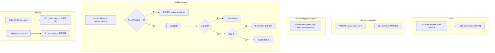

### 边缘场景

| 场景 | 说明 |
|------|------|
| 重复回答 | `WHERE status = 'pending'` 条件防止覆盖已回答的问题，返回 ErrConflict |
| 问题不存在 | 二次查询确认后返回 ErrNotFound |
| 事务性 | `DeleteByConversationTx` 支持在外部事务中执行 |
| 软删除 | Question 模型有 DeletedAt 字段，支持软删除 |

---

## 6. 用户更新 CRUD

用户更新事件的 fan-out 持久化，支持增量同步、范围查询、序列号管理和过期清理。

### 流程图

```mermaid
flowchart TD
    subgraph Create
        UC1{len updates == 0?}
        UC1 -->|是| UC2[直接返回 避免无意义 DB 调用]
        UC1 -->|否| UC3[CreateInBatches 分批插入]
        UC3 --> UC4[每批 100 条]
    end

    subgraph ListByUser 增量同步
        LU1[WHERE user_id=? AND seq > ?] --> LU2[ORDER BY seq ASC]
        LU2 --> LU3[limit 范围 1~1000 默认 100]
    end

    subgraph ListByUserRange gap-filling
        LR1[WHERE seq > ? AND seq <= ?] --> LR2{maxSeq <= afterSeq?}
        LR2 -->|是| LR3[返回 nil]
        LR2 -->|否| LR4[返回范围内的更新]
    end

    subgraph GetLatestSeq
        GL1[SELECT COALESCE MAX seq 0] --> GL2{有记录?}
        GL2 -->|是| GL3[返回最新 seq]
        GL2 -->|否| GL4[返回 0]
    end

    subgraph CleanupExpired
        CE1[Unscoped 硬删除] --> CE2[删除 30 天前的过期更新]
        CE3[CleanupExpiredBefore] --> CE4[按指定时间点删除]
    end
```

### 边缘场景

| 场景 | 说明 |
|------|------|
| 空批量插入 | `len(updates)==0` 直接返回，避免无意义 DB 调用 |
| 序列号空洞 | `ListByUserRange` 支持 gap-filling 补齐丢失事件 |
| 过期清理是硬删除 | `Unscoped()` 绕过软删除，永久移除 |
| 并发 seq 分配 | 在 SendMessage 事务内完成，避免竞争 |

---

## 7. 发送消息事务

原子性发送消息的完整事务流程，包括 MessageID 分配、消息持久化、fan-out UserUpdate、会话元数据更新。

### 流程图

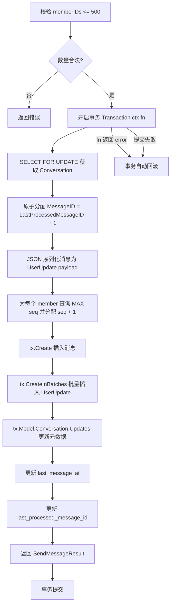

### 边缘场景

| 场景 | 说明 |
|------|------|
| TOCTOU 竞争消除 | MessageID 在事务内读取+分配，并发发送者不会分配到相同 ID |
| 会话不存在 | `ErrRecordNotFound` 映射为 `ErrNotFound` |
| 成员数超限 | >500 直接返回错误 |
| 事务回滚 | fn 返回任何 error 都触发回滚 |
| 上下文超时 | Transaction 入口检查 `ctx.Err()`，已过期直接返回 |
| 批量插入分片 | `CreateInBatches` 按 100 条分批，避免单次 INSERT 过大 |

---

## 8. 手动事务

提供 `BeginTx` 返回 `Tx` 句柄，由调用方手动 Commit/Rollback。

### 流程图

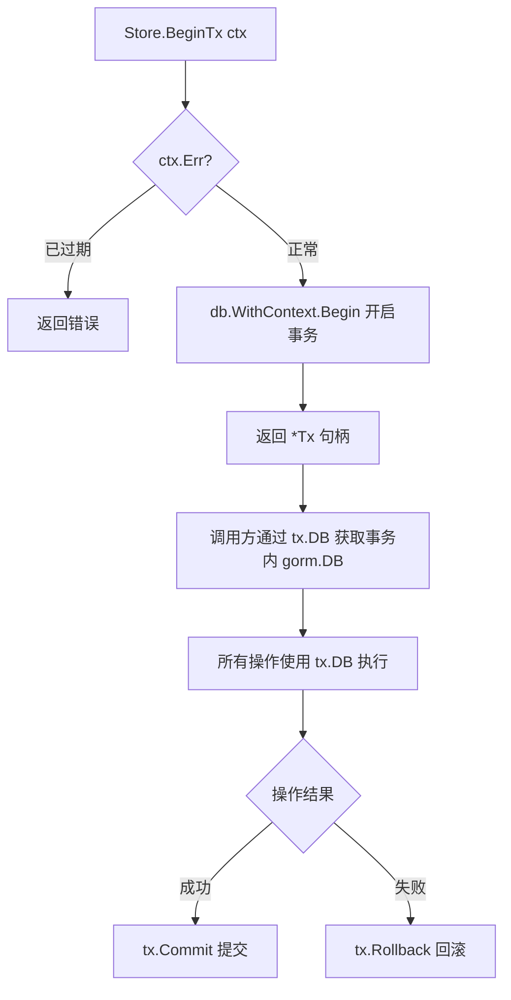

### 边缘场景

| 场景 | 说明 |
|------|------|
| 忘记 Commit/Rollback | 事务连接泄漏，最终被连接池回收但浪费资源 |
| ctx 已过期 | `BeginTx` 入口检查，直接返回错误 |
| Rollback 幂等 | GORM 的 Rollback 多次调用安全 |

---

## 9. 错误分类

`classifyError` 将 GORM/驱动层错误翻译为标准 store 层错误，支持 PostgreSQL/MySQL/SQLite 三种方言。

### 流程图

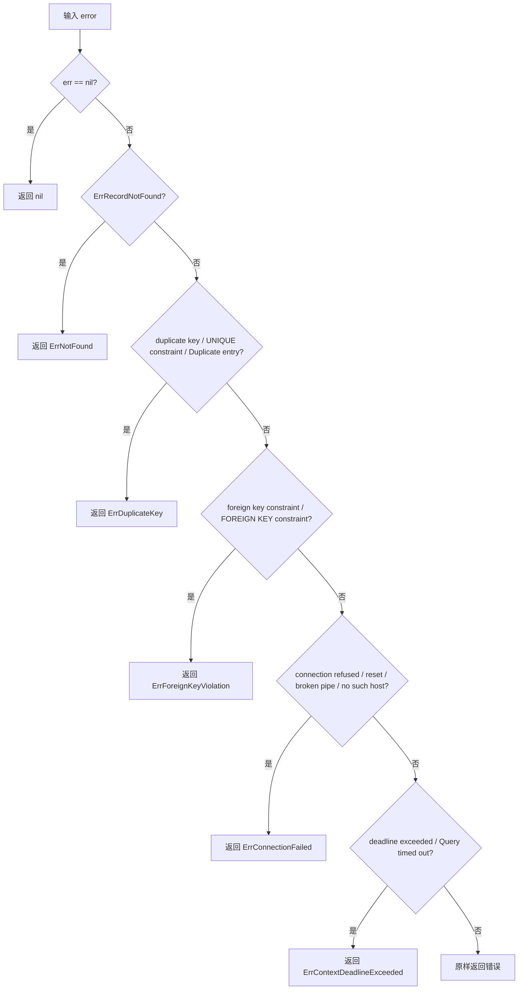

### 边缘场景

| 场景 | 说明 |
|------|------|
| 字符串匹配可能误判 | 错误消息中包含关键词但非实际错误类型（MySQL 数字错误码被故意省略以避免误判） |
| 跨方言差异 | PostgreSQL/MySQL/SQLite 同一错误的消息文本不同，需分别匹配 |
| 客户端版本额外错误 | `pkg/store/errors.go` 包含 `ErrDatabaseLocked`（SQLite 特有） |
| 服务端额外错误 | `internal/store/errors.go` 包含 `ErrConflict`（业务层冲突） |
| 无测试覆盖 | `classifyError` 有 73+ 调用者但无直接单元测试 |

---

## 10. 可观测性集成

每个 store 公开方法通过 `startSpan` 创建手动 span，与自动插桩 (otelgorm) 故意分离。

### 流程图

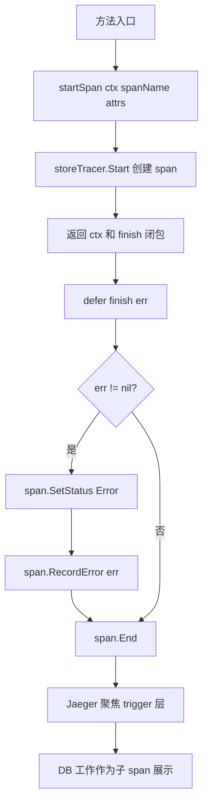

### 边缘场景

| 场景 | 说明 |
|------|------|
| tracing 未初始化 | no-op tracer，零开销 |
| span 未正确结束 | defer 保证 finish 始终被调用 |
| 错误状态传播 | finish 闭包捕获命名返回值 err |

---

## 11. 数据模型

4 个核心模型 + 1 个客户端模型，使用 GORM tag 定义索引、约束和默认值。

### 模型关系图

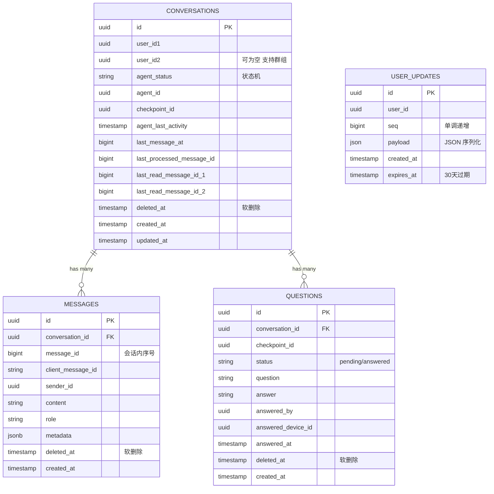

### 模型说明

| 模型 | 表名 | 主键 | 关键索引 | 软删除 | 说明 |
|------|------|------|----------|--------|------|
| Conversation | conversations | UUID | `uniqueIndex(user_id1, user_id2)` 复合软删除索引 | 是 | AgentStatus 状态机，LastReadMessageID1/2 |
| Message | messages | UUID | `uniqueIndex(client_message_id, sender_id)`，`composite(conv_id, msg_id, deleted_at)` | 是 | MessageID 为会话内序号（非主键） |
| UserUpdate | user_updates | UUID | `composite(user_id, seq)` | 否 | Seq 单调递增，过期后硬删除 |
| Question | questions | UUID | `index(conversation_id)`，`index(status)` | 是 | 状态机 pending/answered，外键关联 Conversation |

### 边缘场景

| 场景 | 说明 |
|------|------|
| Conversation.UserID2 可为空 | 支持群组/频道等非 1v1 场景 |
| Message.MessageID 是会话内序号 | 主键是 UUID，MessageID 仅用于会话内排序 |
| UserUpdate 无软删除 | 过期后硬删除，`Unscoped()` 绕过软删除机制 |
| Question 有外键 | Conversation 关系，级联删除需注意数据完整性 |
