# 存储层业务流程

本文档描述 Xyncra 存储层的完整业务流程，涵盖服务端（`internal/store`）和客户端（`pkg/store`）两个存储层：数据库初始化、Store 构建、各领域 CRUD 操作、事务管理、错误分类、可观测性集成，以及客户端专属模型和操作。

---

## 目录

- [1. 数据库初始化](#1-数据库初始化)
- [2. Store 构建](#2-store-构建)
- [3. 会话 CRUD](#3-会话-crud)
- [4. 消息 CRUD](#4-消息-crud)
- [5. 问题 CRUD](#5-问题-crud)
- [6. 用户更新 CRUD](#6-用户更新-crud)
- [7. 发送消息事务](#7-发送消息事务)
- [8. 手动事务](#8-手动事务)
- [9. 健康检查](#9-健康检查)
- [10. 错误分类](#10-错误分类)
- [11. 可观测性集成](#11-可观测性集成)
- [12. 数据模型（服务端）](#12-数据模型服务端)
- [13. 客户端存储架构](#13-客户端存储架构)
- [14. 客户端额外数据模型](#14-客户端额外数据模型)

---

## 1. 数据库初始化

从配置创建数据库连接、初始化连接池、构建 Store 聚合根、执行 schema 迁移的完整启动链。

### 流程图

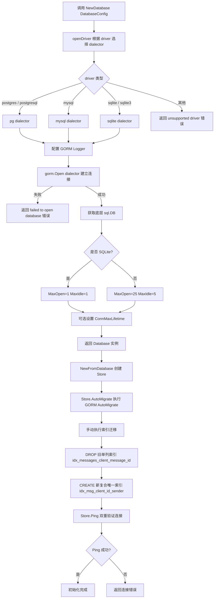

### 边缘场景

| 场景 | 说明 |
|------|------|
| 不支持的 driver 名称 | `openDriver` 返回 `fmt.Errorf("store: unsupported database driver: %s")` |
| driver 别名 | `postgresql` 等同 `postgres`，`sqlite3` 等同 `sqlite` |
| 连接失败 | GORM Open 失败返回 `fmt.Errorf("store: failed to open database: %w")` |
| SQLite 并发限制 | MaxOpen 强制为 1，防止 shared-cache 死锁 |
| SlowQueryThreshold | 默认 200ms，超过阈值的查询被记录为慢查询 |
| GORM Logger | IgnoreRecordNotFoundError=true，避免 NotFound 错误的噪声日志 |
| AutoMigrate 无法处理索引替换 | 单列索引替换为复合索引需手动 DROP/CREATE |
| Ping 双重检查 | 既检查底层连接存活，又验证查询路径可用（捕获 schema 损坏） |
| 连接池耗尽 | 超过 MaxOpenConns 的查询会阻塞等待，可能超时 |

---

## 2. Store 构建

Store 结构体作为顶层入口，聚合 4 个领域子 Store，实现 StoreAPI 接口用于依赖注入。

### 流程图

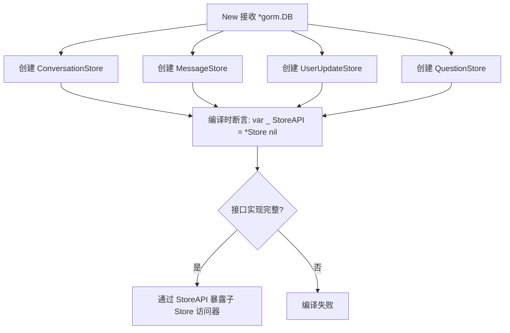

### 边缘场景

| 场景 | 说明 |
|------|------|
| db 为 nil | 子 Store 创建不会立即 panic，但后续操作会 nil pointer |
| 编译时接口检查 | 如果 StoreAPI 接口方法签名变更但 Store 未更新，编译失败 |

---

## 3. 会话 CRUD

会话的创建、查询、更新、软删除、恢复、搜索等完整生命周期操作。

### 流程图

```mermaid
flowchart TD
    subgraph Create
        C1[startSpan 创建 OTel span] --> C2[db.WithContext.Create conv]
        C2 --> C3{成功?}
        C3 -->|是| C4[返回 nil]
        C3 -->|否| C5[classifyError 翻译错误]
        C5 --> C6[finish 设置 span 状态]
    end

    subgraph Get
        G1[db.Where id=?.First] --> G2{找到?}
        G2 -->|是| G3[返回 Conversation]
        G2 -->|否| G4[ErrRecordNotFound -> ErrNotFound]
    end

    subgraph GetByUsers
        GU1[构建双向 OR 查询] --> GU2[user_id1=A AND user_id2=B OR 反向]
        GU2 --> GU3[返回第一个匹配记录]
    end

    subgraph GetByUser
        GB1[查询 user_id1 方向] --> GB3[内存合并去重 seen map]
        GB2[查询 user_id2 方向] --> GB3
        GB3 --> GB4[按 LastMessageAt DESC 排序]
        GB4 --> GB5[应用 offset/limit 分页]
        GB5 --> GB6[limit+1 探测 has_more]
    end

    subgraph GetUnscoped
        GU4[Unscoped 查询] --> GU5[包含已软删除记录]
        GU5 --> GU6{找到?}
        GU6 -->|是| GU7[返回 Conversation]
        GU6 -->|否| GU8[ErrNotFound]
    end

    subgraph Update
        U1[db.Save conv] --> U2{成功?}
        U2 -->|是| U3[返回 nil]
        U2 -->|否| U4[classifyError]
    end

    subgraph Delete
        D1[db.Delete Conversation id] --> D2{RowsAffected == 0?}
        D2 -->|是| D3[ErrNotFound]
        D2 -->|否| D4[软删除完成 设置 deleted_at]
    end

    subgraph Restore
        R1[Unscoped 查询已软删除记录] --> R2[Update deleted_at = nil]
        R2 --> R3{RowsAffected == 0?}
        R3 -->|否| R4[恢复完成]
        R3 -->|是| R5[返回 ErrNotFound]
    end

    subgraph UpdateLastMessage
        UL1[Model.Conversation.Updates] --> UL2[更新 last_message_at]
        UL2 --> UL3[更新 last_processed_message_id]
        UL3 --> UL4{RowsAffected == 0?}
        UL4 -->|是| UL5[ErrNotFound]
        UL4 -->|否| UL6[返回 nil]
    end

    subgraph UpdateLastRead
        UR1[Get 会话确定用户位置] --> UR2{UserID1 or UserID2?}
        UR2 -->|UserID1| UR3[选择 last_read_message_id_1]
        UR2 -->|UserID2| UR4[选择 last_read_message_id_2]
        UR3 --> UR5[CASE WHEN MAX 只前进不后退]
        UR4 --> UR5
    end

    subgraph UpdateAgentStatus
        AS1[Updates agent_status agent_id checkpoint_id] --> AS2[设置 agent_last_activity]
        AS2 --> AS3[设置 updated_at]
        AS3 --> AS4{RowsAffected == 0?}
        AS4 -->|是| AS5[ErrNotFound]
        AS4 -->|否| AS6[返回 timestamp]
    end

    subgraph ClearAgentStatus
        CS1[重置 agent_status=idle] --> CS2[清空 agent_id checkpoint_id]
        CS2 --> CS3[设置 agent_last_activity]
        CS3 --> CS4{RowsAffected == 0?}
        CS4 -->|是| CS5[ErrNotFound]
        CS4 -->|否| CS6[返回 timestamp]
    end

    subgraph ListStaleHITLConversations
        LH1[WHERE agent_status=asking_user] --> LH2[AND agent_last_activity < cutoff]
        LH2 --> LH3[ORDER BY agent_last_activity ASC]
        LH3 --> LH4[LIMIT count]
    end

    subgraph SearchByTitle
        SB1[LIKE 查询] --> SB2[escapeLikePattern 转义特殊字符]
        SB2 --> SB3[limit 范围控制 0~101]
    end
```

### 边缘场景

| 场景 | 说明 |
|------|------|
| 并发创建相同 (user_id1, user_id2) 对 | uniqueIndex 触发 ErrDuplicateKey |
| 软删除后查询 | 默认查询自动排除 `deleted_at IS NOT NULL` 的记录 |
| GetByUser 分页精度 | 双向查询 + 合并可能导致边界处少量重复，小规模会话列表影响可忽略 |
| GetUnscoped 查询 | 包含已软删除记录，不存在返回 ErrNotFound |
| Update 使用 Save | 保存所有字段到数据库，包括零值字段 |
| UpdateLastMessage 会话不存在 | RowsAffected == 0 返回 ErrNotFound |
| UpdateLastRead 用户非成员 | 返回 ErrNotFound |
| UpdateLastRead 并发回退 | CASE WHEN 保证只前进不后退 |
| UpdateAgentStatus 会话不存在 | RowsAffected == 0 返回 ErrNotFound |
| ClearAgentStatus 会话不存在 | RowsAffected == 0 返回 ErrNotFound |
| ListStaleHITLConversations | 查询 agent_status=asking_user 且 agent_last_activity 超过 maxAge 的会话 |
| SearchByTitle SQL 注入 | `escapeLikePattern` 转义 `%`, `_`, `|` |

---

## 4. 消息 CRUD

消息的创建、查询、列表、搜索、软删除、恢复、未读计数等操作。

### 流程图

```mermaid
flowchart TD
    subgraph Create
        MC1[db.WithContext.Create msg] --> MC2{唯一索引冲突?}
        MC2 -->|是| MC3[ErrDuplicateKey 幂等保护]
        MC2 -->|否| MC4[创建成功]
    end

    subgraph Get
        MG1[db.Where id=?.First] --> MG2{找到?}
        MG2 -->|是| MG3[返回 Message]
        MG2 -->|否| MG4[ErrNotFound]
    end

    subgraph GetByClientMessageID
        GC1[WHERE client_message_id=? AND sender_id=?] --> GC2{找到?}
        GC2 -->|是| GC3[返回 Message]
        GC2 -->|否| GC4[ErrNotFound]
    end

    subgraph ListByConversation
        LC1[WHERE conv_id=? AND msg_id > ?] --> LC2[ORDER BY msg_id ASC]
        LC2 --> LC3[limit 范围 1~200 默认 50]
        LC3 --> LC4[返回消息列表]
    end

    subgraph ListByTimeRange
        LT1[WHERE conv_id=? AND created_at >= ? AND <= ?] --> LT2[ORDER BY msg_id ASC]
        LT2 --> LT3[limit 范围 1~200 默认 50]
    end

    subgraph SearchByConversation
        SC1[LIKE 查询] --> SC2{afterMessageID > 0?}
        SC2 -->|是| SC3[仅返回 msg_id < afterMessageID]
        SC2 -->|否| SC4[返回全部匹配]
        SC3 --> SC5[按 MessageID DESC 排序]
        SC4 --> SC5
        SC5 --> SC6[limit 范围 1~201]
    end

    subgraph ListRecentByConversation
        LR1[按 MessageID DESC] --> LR2[取最近 N 条]
        LR2 --> LR3[limit 范围 1~500]
        LR3 --> LR4[返回消息列表 用于 Agent 上下文]
    end

    subgraph CountUnread
        CU1[COUNT WHERE msg_id > ?] --> CU2{count < 0?}
        CU2 -->|是| CU3[返回 0 防御性检查]
        CU2 -->|否| CU4[返回 count]
    end

    subgraph Delete
        MD1[db.Delete msg id] --> MD2{RowsAffected == 0?}
        MD2 -->|是| MD3[ErrNotFound]
        MD2 -->|否| MD4[软删除 设置 deleted_at]
    end

    subgraph DeleteByConversation
        DC1[WHERE conversation_id=?] --> DC2[批量软删除该会话所有消息]
    end

    subgraph Restore
        MR1[Unscoped 查询已删除记录] --> MR2{RowsAffected == 0?}
        MR2 -->|是| MR3[ErrNotFound]
        MR2 -->|否| MR4[Update deleted_at = nil]
    end

    subgraph RestoreByConversation
        RC1[Unscoped WHERE conv_id=?] --> RC2[AND deleted_at IS NOT NULL]
        RC2 --> RC3[Update deleted_at = nil]
        RC3 --> RC4[返回 restored count]
    end
```

### 边缘场景

| 场景 | 说明 |
|------|------|
| 幂等性 | `client_message_id + sender_id` 唯一索引防止重复插入，触发 ErrDuplicateKey |
| 并发 MessageID 分配 | 在 SendMessage 事务内原子分配，避免 TOCTOU 竞争 |
| GetByClientMessageID | 用于发送前幂等性检查，找不到返回 ErrNotFound |
| ListByTimeRange | 按 created_at 范围查询，limit 范围 1~200 默认 50 |
| 搜索空内容 | 直接返回空切片避免无意义 LIKE 查询 |
| Delete 不存在 | RowsAffected == 0 返回 ErrNotFound |
| DeleteByConversation | 批量软删除该会话所有消息，不影响其他会话 |
| Restore 不存在 | RowsAffected == 0 返回 ErrNotFound |
| RestoreByConversation | 恢复该会话所有已软删除消息，返回恢复数量 |
| CountUnread 负数防御 | 并发删除可能导致 count 异常，强制 >= 0 |
| 软删除排除 | GORM 自动在查询中添加 `deleted_at IS NULL` 条件 |

---

## 5. 问题 CRUD

人类在环 (HITL) 问题的持久化，支持创建、查询、回答、删除，以及幂等回答检查。

### 流程图

```mermaid
flowchart TD
    subgraph Create
        QC1[db.WithContext.Create question] --> QC2[关联 ConversationID 外键]
    end

    subgraph GetByConversation
        GC1[WHERE conversation_id=?] --> GC2[按 created_at ASC 排序]
    end

    subgraph GetPendingByCheckpoint
        GP1[WHERE checkpoint_id=? AND status=pending] --> GP2[按 created_at ASC 排序]
    end

    subgraph GetByCheckpoint
        GBC1[WHERE checkpoint_id=?] --> GBC2[返回 pending 和 answered]
        GBC2 --> GBC3[按 created_at ASC 排序]
    end

    subgraph UpdateAnswer
        UA1[WHERE id=? AND status=pending] --> UA2{RowsAffected == 0?}
        UA2 -->|否| UA3[更新成功 status=answered]
        UA2 -->|是| UA4[二次查询]
        UA4 --> UA5{记录存在?}
        UA5 -->|否| UA6[ErrNotFound]
        UA5 -->|是| UA7{已回答?}
        UA7 -->|是| UA8[ErrConflict 幂等保护]
        UA7 -->|否| UA9[返回原始错误]
    end

    subgraph CountPendingByCheckpoint
        CP1[WHERE checkpoint_id=? AND status=pending] --> CP2[COUNT 返回数量]
    end

    subgraph Delete
        QD1[DeleteByConversation] --> QD2[按 conversation_id 批量软删除]
        QD3[DeleteByCheckpoint] --> QD4[按 checkpoint_id 批量软删除]
    end
```

### 边缘场景

| 场景 | 说明 |
|------|------|
| 重复回答 | `WHERE status = 'pending'` 条件防止覆盖已回答的问题，返回 ErrConflict |
| 问题不存在 | 二次查询确认后返回 ErrNotFound |
| GetByCheckpoint | 返回该 checkpoint 的所有问题（pending + answered） |
| GetPendingByCheckpoint | 仅返回 status=pending 的问题 |
| CountPendingByCheckpoint | 返回 pending 状态问题数量，用于判断是否所有问题已回答 |
| 事务性 | 客户端 `pkg/store` 的 `DeleteByConversationTx` 支持在外部事务中执行 |
| 软删除 | Question 模型有 DeletedAt 字段，支持软删除 |
| InterruptID | 存储 Eino interrupt 地址 ID，用于 ResumeParams.Targets |

---

## 6. 用户更新 CRUD

用户更新事件的 fan-out 持久化，支持增量同步、范围查询、序列号管理和过期清理。

### 流程图

```mermaid
flowchart TD
    subgraph Create
        UC1{len updates == 0?}
        UC1 -->|是| UC2[直接返回 避免无意义 DB 调用]
        UC1 -->|否| UC3[CreateInBatches 分批插入]
        UC3 --> UC4[每批 100 条]
    end

    subgraph ListByUser 增量同步
        LU1[WHERE user_id=? AND seq > ?] --> LU2[ORDER BY seq ASC]
        LU2 --> LU3[limit 范围 1~1000 默认 100]
    end

    subgraph ListByUserRange gap-filling
        LR1[WHERE seq > ? AND seq <= ?] --> LR2{maxSeq <= afterSeq?}
        LR2 -->|是| LR3[返回 nil]
        LR2 -->|否| LR4[返回范围内的更新]
    end

    subgraph GetLatestSeq
        GL1[SELECT COALESCE MAX seq 0] --> GL2{有记录?}
        GL2 -->|是| GL3[返回最新 seq]
        GL2 -->|否| GL4[返回 0]
    end

    subgraph CleanupExpired
        CE1[Unscoped 硬删除] --> CE2[删除 30 天前的过期更新]
        CE3[CleanupExpiredBefore] --> CE4[按指定时间点删除]
    end
```

### 边缘场景

| 场景 | 说明 |
|------|------|
| 空批量插入 | `len(updates)==0` 直接返回，避免无意义 DB 调用 |
| 序列号空洞 | `ListByUserRange` 支持 gap-filling 补齐丢失事件 |
| 过期清理是硬删除 | `Unscoped()` 绕过软删除，永久移除 |
| 并发 seq 分配 | 在 SendMessage 事务内完成，避免竞争 |

---

## 7. 发送消息事务

原子性发送消息的完整事务流程，包括 MessageID 分配、消息持久化、fan-out UserUpdate、会话元数据更新。

### 流程图

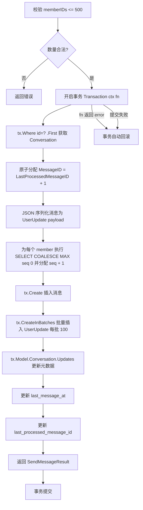

### 边缘场景

| 场景 | 说明 |
|------|------|
| TOCTOU 竞争 | MessageID 在事务内读取+分配。代码使用普通 SELECT（无 FOR UPDATE），依赖数据库默认事务隔离级别防止并发分配相同 ID。在默认 READ COMMITTED 下可能存在极小窗口的竞争风险 |
| 会话不存在 | `ErrRecordNotFound` 映射为 `ErrNotFound` |
| 成员数超限 | >500 直接返回错误 |
| 事务回滚 | fn 返回任何 error 都触发回滚 |
| 上下文超时 | Transaction 入口检查 `ctx.Err()`，已过期直接返回 |
| 批量插入分片 | `CreateInBatches` 按 100 条分批，避免单次 INSERT 过大 |
| seq 分配是 per-user | 每个 member 独立 SELECT MAX(seq) 并 +1，不同用户的 seq 独立递增 |

---

## 8. 手动事务

提供 `BeginTx` 返回 `Tx` 句柄，由调用方手动 Commit/Rollback。

### 流程图

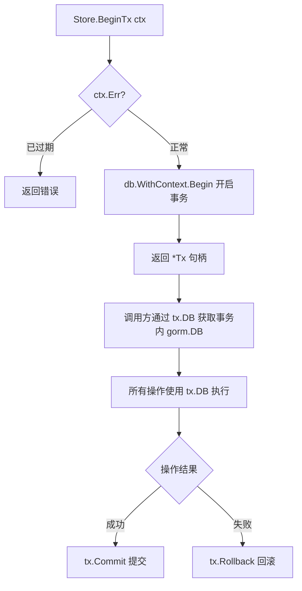

### 边缘场景

| 场景 | 说明 |
|------|------|
| 忘记 Commit/Rollback | 事务连接泄漏，最终被连接池回收但浪费资源 |
| ctx 已过期 | `BeginTx` 入口检查，直接返回错误 |
| Rollback 幂等 | GORM 的 Rollback 多次调用安全 |

---

## 9. 健康检查

`HealthCheck` 对数据库连接进行全面健康检查：先 Ping 底层连接，再执行 SELECT 1 验证查询路径可用。

### 流程图

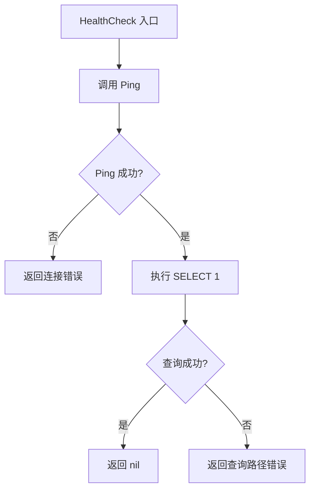

### 边缘场景

| 场景 | 说明 |
|------|------|
| 连接断开 | PingContext 失败，返回 classifyError 后的错误 |
| Schema 损坏 | Ping 成功但 SELECT 1 失败，捕获查询路径问题 |
| 与 Ping 的区别 | Ping 仅验证连接存活；HealthCheck 额外验证查询路径可用 |

---

## 10. 错误分类

`classifyError` 将 GORM/驱动层错误翻译为标准 store 层错误，支持 PostgreSQL/MySQL/SQLite 三种方言。

### 流程图

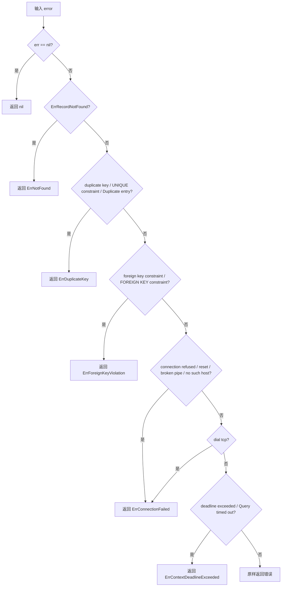

### 边缘场景

| 场景 | 说明 |
|------|------|
| 字符串匹配可能误判 | 错误消息中包含关键词但非实际错误类型（MySQL 数字错误码被故意省略以避免误判）；连接失败额外匹配 `dial tcp` 覆盖 TCP 拨号错误 |
| 跨方言差异 | PostgreSQL/MySQL/SQLite 同一错误的消息文本不同，需分别匹配 |
| 客户端版本额外错误 | `pkg/store/errors.go` 包含 `ErrDatabaseLocked`（SQLite 特有），`classifyError` 同时匹配 `UNIQUE constraint failed` 和 `duplicate key` |
| 服务端额外错误 | `internal/store/errors.go` 包含 `ErrConflict`（业务层冲突） |
| 无测试覆盖 | `classifyError` 有 73+ 调用者但无直接单元测试 |

---

## 11. 可观测性集成

每个 store 公开方法通过 `startSpan` 创建手动 span，与自动插桩 (otelgorm) 故意分离。

### 流程图

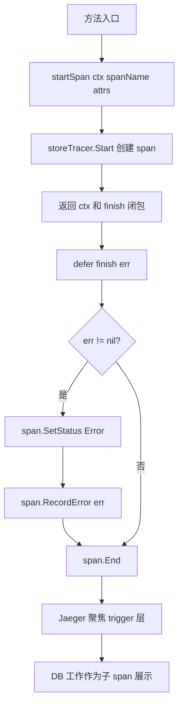

### 边缘场景

| 场景 | 说明 |
|------|------|
| tracing 未初始化 | no-op tracer，零开销 |
| span 未正确结束 | defer 保证 finish 始终被调用 |
| 错误状态传播 | finish 闭包捕获命名返回值 err |

---

## 12. 数据模型（服务端）

4 个核心模型，使用 GORM tag 定义索引、约束和默认值。客户端共享相同的核心模型结构（见 [14. 客户端额外数据模型](#14-客户端额外数据模型)）。

### 模型关系图

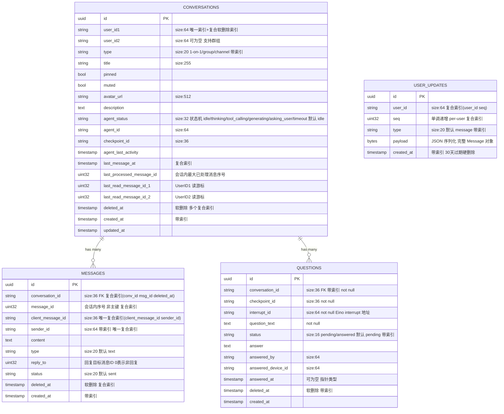

### 模型说明

| 模型 | 表名 | 主键 | 关键索引 | 软删除 | 说明 |
|------|------|------|----------|--------|------|
| Conversation | conversations | UUID | `uniqueIndex(user_id1, user_id2)` 复合软删除索引，`index(user_id1, deleted_at)`，`index(user_id2, deleted_at)`，`index(last_message_at, deleted_at)`，`index(type)`，`index(agent_status)`，`index(deleted_at)` | 是 | Type 区分 1-on-1/group/channel，AgentStatus 状态机，LastReadMessageID1/2 |
| Message | messages | UUID | `uniqueIndex(client_message_id, sender_id)`，`composite(conv_id, msg_id, deleted_at)`，`index(sender_id)`，`index(created_at)`，`index(deleted_at)` | 是 | MessageID 为会话内序号（非主键），Type 默认 text，Status 默认 sent |
| UserUpdate | user_updates | UUID | `composite(user_id, seq)`，`index(user_id)`，`index(type)`，`index(created_at)` | 否 | Seq 单调递增 per-user，Type 默认 message，过期后硬删除 |
| Question | questions | UUID | `index(conversation_id)`，`index(status)`，`index(deleted_at)` | 是 | 状态机 pending/answered，外键关联 Conversation，InterruptID 存储 Eino interrupt 地址 |

### 常量定义

| 常量 | 值 | 说明 |
|------|------|------|
| AgentStatusIdle | `"idle"` | Agent 空闲 |
| AgentStatusThinking | `"thinking"` | Agent 思考中 |
| AgentStatusToolCalling | `"tool_calling"` | Agent 调用工具 |
| AgentStatusGenerating | `"generating"` | Agent 生成回复 |
| AgentStatusAskingUser | `"asking_user"` | HITL 等待用户回答 |
| AgentStatusTimeout | `"timeout"` | Agent 超时 |
| QuestionStatusPending | `"pending"` | 问题待回答 |
| QuestionStatusAnswered | `"answered"` | 问题已回答 |
| DefaultCleanupRetention | `30 * 24h` | UserUpdate 过期清理保留期 |

### 边缘场景

| 场景 | 说明 |
|------|------|
| Conversation.UserID2 可为空 | 空字符串（非 NULL），支持群组/频道等非 1v1 场景 |
| Conversation.Type | 区分 1-on-1 / group / channel，带索引 |
| Conversation.Pinned/Muted | 布尔标记，支持客户端会话管理 |
| Message.MessageID 是会话内序号 | 主键是 UUID，MessageID 仅用于会话内排序，类型 uint32 |
| Message.Type | 消息类型，默认 text，支持扩展 |
| Message.ReplyTo | 回复目标消息 ID，0 表示非回复，类型 uint32 |
| Message.Status | 消息状态，默认 sent |
| UserUpdate 无软删除 | 过期后硬删除，`Unscoped()` 绕过软删除机制 |
| UserUpdate.Type | 更新类型，默认 message，支持扩展 |
| UserUpdate.Payload | JSON 序列化的完整 Message 对象（包含分配后的 MessageID） |
| Question.InterruptID | Eino interrupt 地址 ID，用于 ResumeParams.Targets |
| Question.AnsweredAt | 指针类型 `*time.Time`，未回答时为 nil |
| Question.Conversation 外键 | `foreignKey:ConversationID`，服务端使用软删除避免外键约束问题 |
| Question.TableName | 显式覆盖为 `"questions"`（GORM 默认复数规则可能不一致） |
| Question.Status 常量 | `QuestionStatusPending="pending"` / `QuestionStatusAnswered="answered"` |

---

## 13. 客户端存储架构

客户端存储层（`pkg/store`）使用 SQLite 单一数据库，聚合 9 个领域子 Store，通过 `ClientDB` 结构体暴露。与服务端的关键区别：仅支持 SQLite、共享核心模型但有客户端简化变体、额外支持 5 个客户端专属模型。

### 流程图

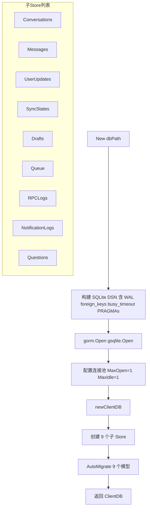

### 流程图（NewInMemory 测试路径）

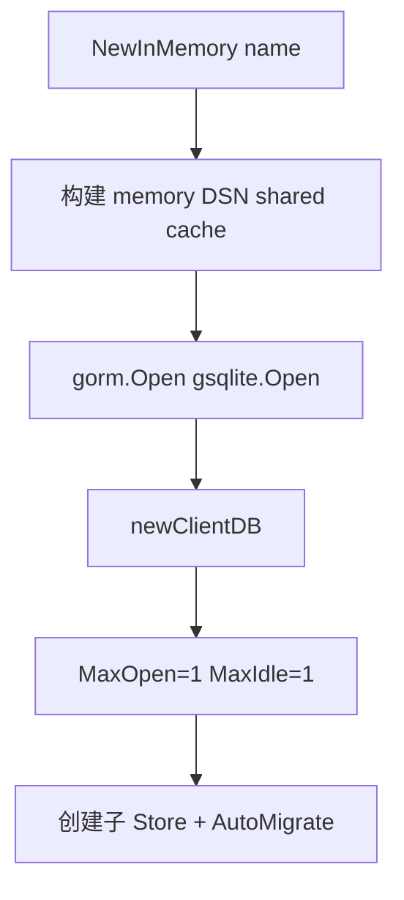

### 与服务端的差异

| 维度 | 服务端（internal/store） | 客户端（pkg/store） |
|------|--------------------------|---------------------|
| 数据库 | PostgreSQL / MySQL / SQLite | SQLite only |
| 模型数量 | 4（Conversation, Message, UserUpdate, Question） | 9（+Draft, NotificationLog, RetryTask, RPCLog, SyncState） |
| Store 数量 | 4 + SendMessage 事务 | 9 |
| 连接池 | MaxOpen=25, MaxIdle=5（非 SQLite） | MaxOpen=1, MaxIdle=1 |
| OTel tracing | 每个方法手动 span（startSpan） | 无 tracing |
| classifyError | 多方言匹配 + ErrConflict | SQLite 为主 + ErrDatabaseLocked，无 ErrConflict |
| Conversation.Delete | 仅软删除单条 | 事务内级联软删除（含消息） |
| Conversation.Restore | 仅恢复单条 | 事务内级联恢复（含消息） |
| Question 模型 | 完整（含 Answer, AnsweredBy, AnsweredAt 等） | 精简（仅展示字段，无回答相关字段） |
| QuestionStore 操作 | Create, UpdateAnswer, GetPendingByCheckpoint, CountPendingByCheckpoint, DeleteByCheckpoint | Upsert, GetByConversation, DeleteByConversation, DeleteByConversationTx |
| 额外操作 | 无 | Upsert, UpsertTx, SoftDeleteTx, RestoreTx, UpdateLastMessageTx, UpdateLastReadTx 等事务变体 |

### 客户端专属 Store 操作

#### DraftStore

| 操作 | 说明 |
|------|------|
| Save | UPSERT：按 ConversationID 唯一索引，存在则更新 content + updated_at |
| GetByConversation | 按 conversation_id 查询，不存在返回 ErrNotFound |
| Delete | 按主键删除 |
| DeleteByConversation | 按 conversation_id 删除 |
| List | 按 updated_at DESC 返回所有草稿 |

#### NotificationLogStore

| 操作 | 说明 |
|------|------|
| Save | 插入通知日志记录 |
| List | 按 StartTime/EndTime/Type 过滤，limit 1~1000 默认 100 |
| ListBySeqRange | 按 seq 范围查询 [startSeq, endSeq] |
| ExportCSV | 导出为 CSV 格式 |
| ExportJSON | 导出为 JSON 格式 |
| CleanupBefore | 硬删除指定时间前的记录 |
| CountBefore | 统计指定时间前的记录数（不删除） |
| GetLatestSeq | 返回最大 seq 值，空表返回 0 |
| SaveTx | 事务内插入 |

#### QueueStore（RetryTask）

| 操作 | 说明 |
|------|------|
| Save | 插入重试任务 |
| ListPending | 查询 status=pending 且 next_retry <= now，按 next_retry ASC |
| Update | 保存任务变更（attempt, next_retry, last_error 等） |
| MarkFailed | 设置 status=failed，不再出现在 ListPending 中 |
| Delete | 按主键删除 |
| Count | 按 status 统计数量 |

#### RPCLogStore

| 操作 | 说明 |
|------|------|
| Save | 插入 RPC 日志 |
| Update | 更新已有记录（如收到响应后） |
| List | 按 StartTime/EndTime/Method/StatusCode/ConversationID 过滤 |
| GetByRequestID | 按 request_id 查询，不存在返回 ErrNotFound |
| Aggregate | 按 method 聚合统计（count, success, error_count, avg_ms） |
| AggregateByInterval | 按时间间隔（1m/5m/15m/1h/1d）+ method 聚合 |
| ExportCSV / ExportJSON | 导出 |
| CleanupBefore / CleanupOlderThan | 硬删除过期记录 |
| CountBefore | 统计指定时间前的记录数 |

#### SyncStateStore

| 操作 | 说明 |
|------|------|
| Get | 按 key 查询，不存在返回 ErrNotFound |
| Set | UPSERT：按 key 唯一索引，存在则更新 value + updated_at |
| GetLocalMaxSeq / SetLocalMaxSeq | 便捷方法，操作 `local_max_seq` 键 |
| GetLatestSeq / SetLatestSeq | 便捷方法，操作 `latest_seq` 键 |
| SetLocalMaxSeqTx | 事务内设置 local_max_seq |

### 客户端 ConversationStore 与服务端差异

客户端 ConversationStore 除了共享的 Create/Get/GetByUsers 操作外，还有以下与服务端不同的实现：

| 方法 | 客户端实现 | 服务端差异 |
|------|-----------|-----------|
| GetByUser | 单条 `WHERE (user_id1 = ? OR user_id2 = ?) AND user_id2 != ''` 查询，使用 Offset/Limit 分页 | 服务端双查询 + 内存合并去重 + 手动排序 |
| GetUnscoped | 与服务端一致，`Unscoped()` 查询包含软删除记录 | 一致 |
| SearchByTitle | 与服务端一致，`LIKE` 查询 + `escapeLikePattern` 转义 | 一致 |
| Update | `Unscoped().Save(conv)` 可更新软删除记录（包括清除 deleted_at） | 服务端 `Save(conv)` 不使用 Unscoped |
| Upsert | SELECT + INSERT/UPDATE，捕获 `ErrDuplicateKey` 后重试为 UPDATE（TOCTOU 处理） | 服务端无 Upsert |
| Delete | 事务内级联软删除会话+消息（D-013） | 服务端仅软删除单条会话 |
| Restore | 事务内级联恢复会话+消息，幂等（已恢复的会话不报错）（D-015） | 服务端仅恢复单条会话，不存在返回 ErrNotFound |
| UpdateLastRead | 单条 UPDATE 语句，CASE WHEN 同时处理两个用户列 | 服务端先 GET 确定用户位置再 UPDATE |

### 客户端 MessageStore 额外操作

| 方法 | 说明 |
|------|------|
| Upsert | SELECT + INSERT/UPDATE，捕获 `ErrDuplicateKey` 后重试为 UPDATE（TOCTOU 处理），按 `(client_message_id, sender_id)` 唯一索引 |
| updateByCompositeKey | 按 `(client_message_id, sender_id)` 查找记录后通过主键 UPDATE，避免 GORM Save() 的 WHERE 忽略问题 |
| CreateTx | 事务内插入消息 |
| SoftDeleteTx | 事务内软删除消息 |

### 客户端特有事务操作

客户端 ConversationStore 和 MessageStore 提供 `*Tx` 变体，接受外部 `*gorm.DB` 事务句柄，支持在调用方控制的事务中执行：

| 方法 | 说明 |
|------|------|
| ConversationStore.UpsertTx | 事务内创建或更新会话（含 TOCTOU 重试） |
| ConversationStore.SoftDeleteTx | 事务内级联软删除会话+消息 |
| ConversationStore.RestoreTx | 事务内级联恢复会话+消息 |
| ConversationStore.UpdateLastMessageTx | 事务内更新 last_message_at |
| ConversationStore.UpdateLastReadTx | 事务内更新 read cursor（CASE WHEN MAX） |
| MessageStore.CreateTx | 事务内插入消息 |
| MessageStore.SoftDeleteTx | 事务内软删除消息 |
| QuestionStore.DeleteByConversationTx | 事务内按 conversation_id 删除问题 |

### 边缘场景

| 场景 | 说明 |
|------|------|
| SQLite WAL 模式 | DSN 含 `_pragma=journal_mode(WAL)` 支持并发读+单写 |
| SQLite busy_timeout | 5000ms，写冲突时等待而非立即失败 |
| SQLite foreign_keys=ON | 启用外键约束，级联删除需在事务内手动处理 |
| MaxOpen=1 强制串行写 | SQLite 文件级锁下多写连接无收益，单连接避免死锁 |
| Upsert TOCTOU 处理 | SELECT + INSERT 之间可能发生并发插入，捕获 ErrDuplicateKey 后重试为 UPDATE |
| 级联删除/恢复 | 事务内先操作 Conversation 再操作 Message，保证一致性 |
| Question 精简模型 | 客户端仅存储展示字段，回答相关字段仅在服务端存在 |
| ErrDatabaseLocked | SQLite 特有错误，`classifyError` 匹配 `database is locked` |

---

## 14. 客户端额外数据模型

客户端在服务端 4 个核心模型之外，额外使用 5 个模型用于本地状态管理、日志记录和重试队列。

### 模型关系图

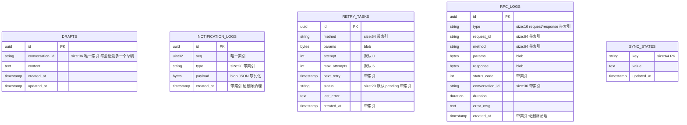

### 模型说明

| 模型 | 表名 | 主键 | 关键索引 | 软删除 | 说明 |
|------|------|------|----------|--------|------|
| Draft | drafts | UUID | `uniqueIndex(conversation_id)` | 否 | 每会话最多一个草稿，Save 使用 UPSERT |
| NotificationLog | notification_logs | UUID | `uniqueIndex(seq)`，`index(type)`，`index(created_at)` | 否 | 记录接收的推送通知用于去重和审计，Payload 为 JSON blob，过期后硬删除 |
| RetryTask | retry_tasks | UUID | `index(method)`，`index(next_retry)`，`index(status)`，`index(created_at)` | 否 | RPC 重试任务队列，指数退避，status=pending/failed |
| RPCLog | rpc_logs | UUID | `index(type)`，`index(request_id)`，`index(method)`，`index(status_code)`，`index(conversation_id)`，`index(created_at)` | 否 | RPC 调用日志用于可观测性，支持按时间间隔聚合统计 |
| SyncState | sync_states | String Key | PK(key) | 否 | 键值对存储客户端同步状态（local_max_seq, latest_seq） |

### 客户端 Question 模型差异

客户端 Question 模型是服务端的精简版本，仅包含展示所需字段：

| 字段 | 服务端 | 客户端 | 说明 |
|------|--------|--------|------|
| ID | 有 | 有 | 主键 |
| ConversationID | 有 | 有 | 外键 |
| CheckpointID | 有 | 有 | |
| InterruptID | 有 | 有 | |
| QuestionText | 有 | 有 | |
| Status | 有 | 有 | 默认 pending |
| Answer | 有 | 无 | 仅服务端 |
| AnsweredBy | 有 | 无 | 仅服务端 |
| AnsweredDeviceID | 有 | 无 | 仅服务端 |
| AnsweredAt | 有 | 无 | 仅服务端 |
| DeletedAt | 有 | 无 | 客户端无软删除 |
| Conversation FK | 有 | 无 | 客户端无外键约束 |

### 常量定义（客户端额外）

| 常量 | 值 | 说明 |
|------|------|------|
| syncKeyLocalMaxSeq | `"local_max_seq"` | SyncState 键：本地最大已处理 seq |
| syncKeyLatestSeq | `"latest_seq"` | SyncState 键：服务端报告的最新 seq |

### 边缘场景

| 场景 | 说明 |
|------|------|
| Draft 唯一约束 | ConversationID 唯一索引保证每会话最多一个草稿，Save 使用 clause.OnConflict UPSERT |
| NotificationLog seq 唯一 | seq 唯一索引防止重复记录同一条推送通知 |
| RetryTask 指数退避 | next_retry 字段控制下次重试时间，ListPending 仅返回 next_retry <= now 的任务 |
| RPCLog 聚合 | Aggregate 使用 SQL CASE WHEN 区分成功（status_code >= 0）和失败（status_code < 0） |
| RPCLog 时间桶 | AggregateByInterval 仅支持 SQLite 的 strftime 函数，不兼容 PostgreSQL/MySQL |
| SyncState UPSERT | Set 使用 clause.OnConflict 按 key 做 UPSERT |
| SyncState 值为字符串 | GetLocalMaxSeq/SetLocalMaxSeq 使用 strconv 做 uint32 <-> string 转换 |
| 客户端 Question 无回答字段 | 客户端 QuestionStore.Upsert 使用 Save（全字段覆盖），不支持部分更新 |
