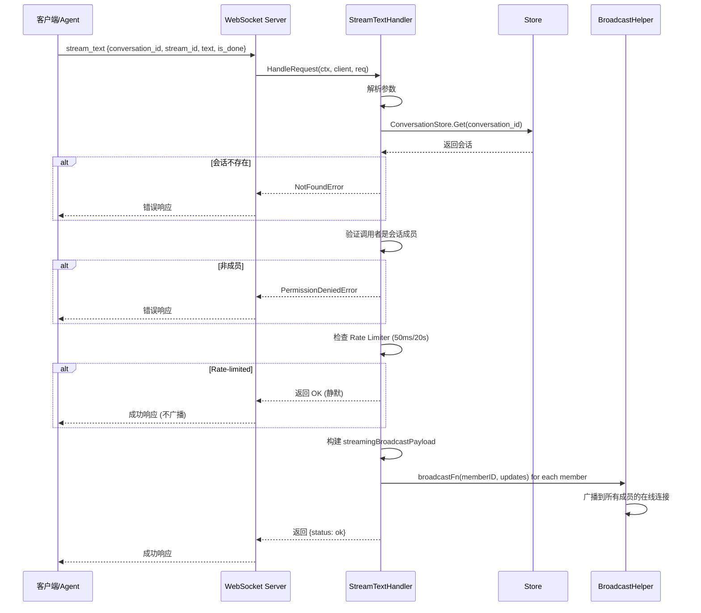
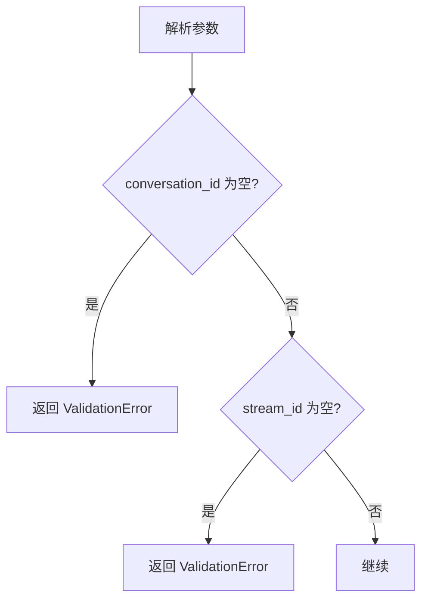
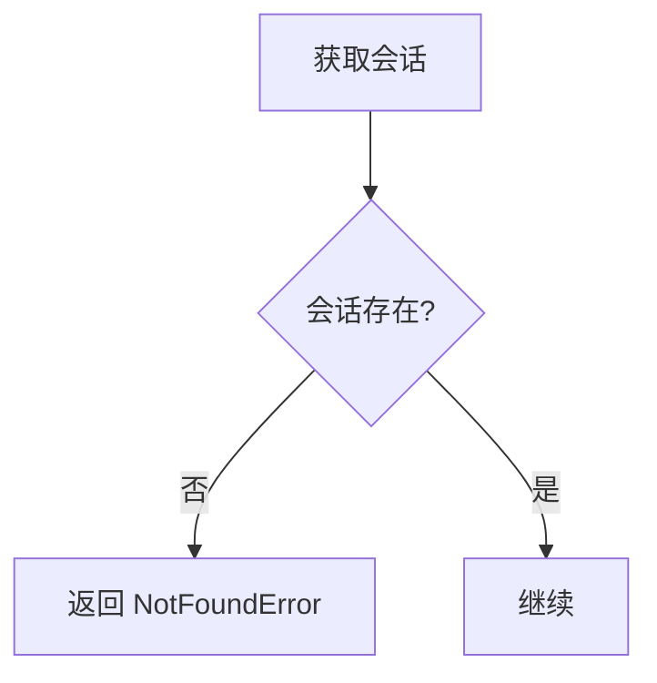
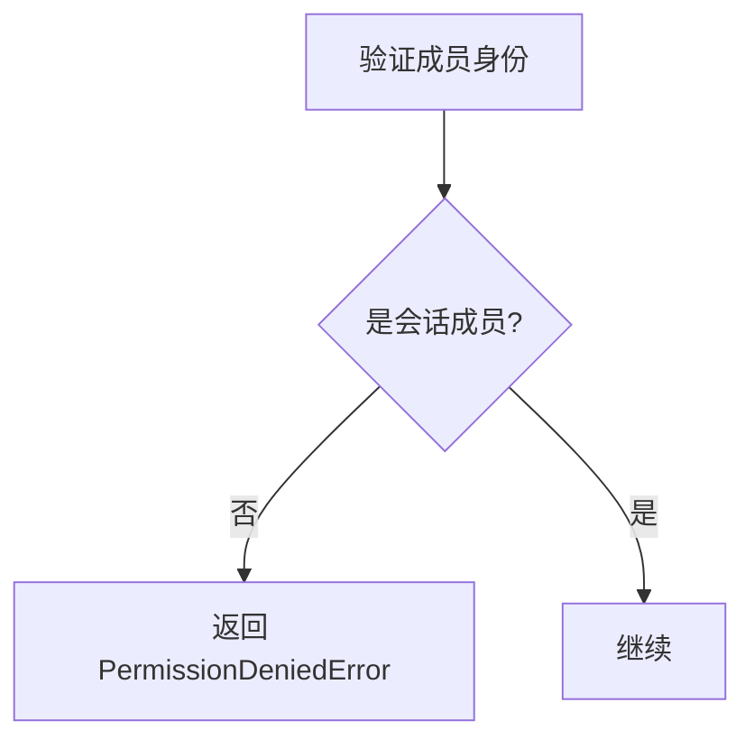
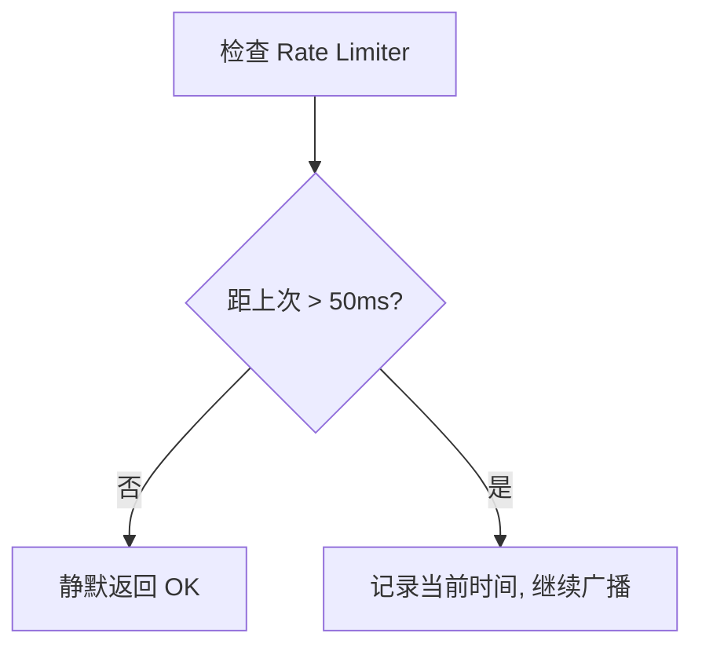
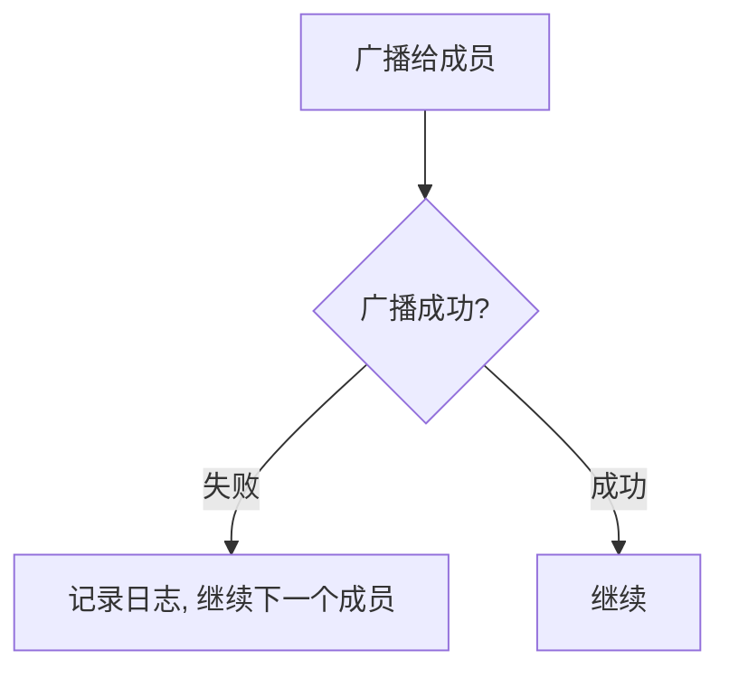
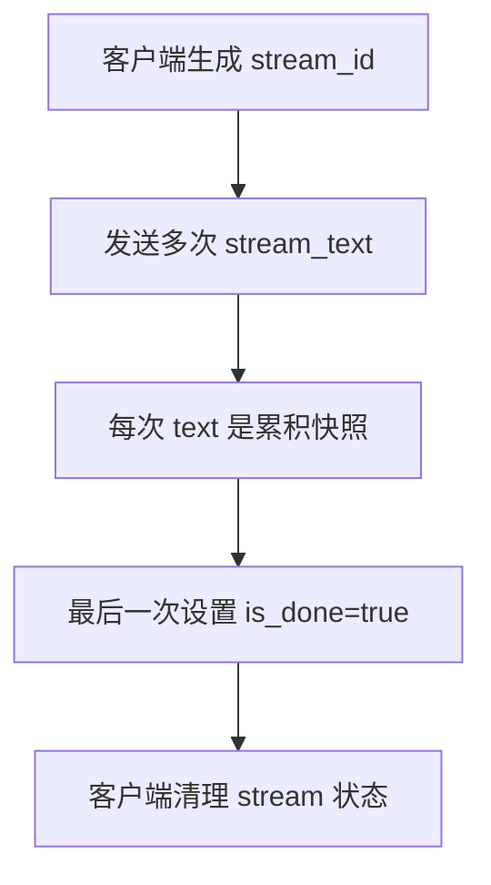
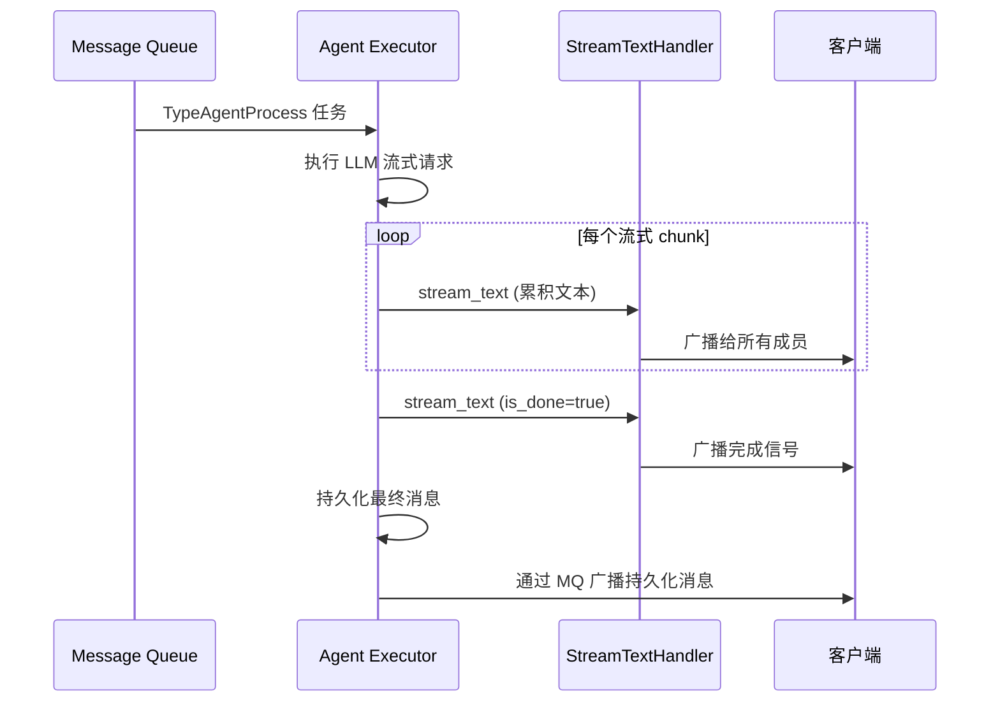

# Stream Text 业务流程

本文档描述 `stream_text` RPC 方法的完整业务流程，包括主流程、边缘场景和依赖关系。

---

## 目录

- [概述](#概述)
- [主流程](#主流程)
- [边缘场景](#边缘场景)
- [依赖关系](#依赖关系)
- [关键设计决策](#关键设计决策)

---

## 概述

`stream_text` 是一个 ephemeral（瞬时）RPC 方法，用于在会话中广播流式文本更新。它主要用于 Agent 执行过程中的实时文本流推送，让用户能够看到 Agent 逐步生成的回复。

### 触发条件

- Agent 执行过程中，每次收到 LLM 流式响应时调用
- 客户端也可以使用此方法实现自己的流式文本功能
- 最后一次调用应设置 `is_done: true`

### 关键特性

- **Ephemeral**：Seq=0，不持久化到数据库
- **Rate-limited**：每个用户每个会话每 50ms 最多 1 次（20/s）
- **Cumulative text**：每次发送的是累积文本快照，不是增量
- **Broadcast to all**：广播给所有成员（包括发送者自己）
- **No MQ**：直接通过 WebSocket 广播，不经过消息队列

---

## 主流程

### 详细步骤

1. **解析参数**：提取 `conversation_id`、`stream_id`、`text`、`is_done`
2. **校验必填字段**：`conversation_id` 和 `stream_id` 不能为空
3. **获取会话**：验证会话存在性
4. **身份验证**：验证调用者是会话成员
5. **Rate limiting**：检查每个用户每个会话的 rate limiter（50ms 1 次）
   - Key 格式：`userID:conversationID`
   - 超限时静默返回 OK（不报错）
6. **构建 payload**：包含 `stream_id`、`user_id`、`conversation_id`、`text`、`is_done`、`timestamp`
7. **广播**：遍历所有会话成员，调用 `broadcastFn` 广播
8. **返回成功**：返回 `{status: ok}`

---

## 边缘场景

### 1. 参数校验失败

| 场景 | 处理方式 |
|------|----------|
| `conversation_id` 为空 | 返回 `ValidationError('missing required field: conversation_id')` |
| `stream_id` 为空 | 返回 `ValidationError('missing required field: stream_id')` |
| JSON 解析失败 | 返回 `ValidationError('invalid params')` |

### 2. 会话不存在

| 场景 | 处理方式 |
|------|----------|
| 会话不存在 | 返回 `NotFoundError('conversation not found')` |
| 会话已被软删除 | GORM 自动过滤，等同于不存在 |

### 3. 非成员操作

| 场景 | 处理方式 |
|------|----------|
| 调用者非会话成员 | 返回 `PermissionDeniedError('user is not a member of the conversation')` |

### 4. Rate Limiting

| 场景 | 处理方式 |
|------|----------|
| 50ms 内重复发送 | 静默返回 OK，不广播（不是错误） |
| Rate limiter entry 过期 | 后台 cleanup goroutine 每 5 分钟清理 10 分钟未访问的条目 |

### 5. 广播失败

| 场景 | 处理方式 |
|------|----------|
| 单个成员广播失败 | 记录日志，继续处理其他成员 |
| 所有成员都离线 | 所有广播失败，但不影响返回值 |

### 6. Stream ID 管理

| 场景 | 处理方式 |
|------|----------|
| `stream_id` 重复使用 | 客户端应为每次流式会话生成新的 UUID |
| `is_done` 未发送 | 客户端应实现超时检测，自动清理未完成的 stream |
| `text` 为空 | 允许，表示清空当前流式文本 |

---

## 依赖关系

### 内部依赖

| 组件 | 用途 |
|------|------|
| `store.StoreAPI` | 获取会话信息，验证成员身份 |
| `broadcastFn` | 广播 updates 给指定用户的所有在线连接 |

### 外部依赖

无。`stream_text` 不依赖消息队列或外部服务。

### 数据库操作

| 操作 | 表 | 说明 |
|------|-----|------|
| SELECT | conversations | 获取会话信息 |

### Rate Limiter 清理

Handler 构造时启动后台 goroutine，每 5 分钟执行一次清理：

- 遍历 `limiters` sync.Map，检查每个条目的 `lastAccess` 时间
- 删除超过 10 分钟未访问的条目
- 防止长时间运行时 rate limiter 条目无限增长

---

## 关键设计决策

### 1. Cumulative Text vs Incremental

采用累积文本快照而非增量文本：
- **优点**：客户端无需维护拼接状态，每次收到的 `text` 就是完整内容
- **优点**：丢包后自动恢复，下次收到的就是最新状态
- **缺点**：每次传输的数据量随文本增长而增大
- **权衡**：在典型 Agent 回复场景中，文本长度有限，累积快照更简单可靠

### 2. Rate Limiting (50ms)

比 `set_typing`（1s）更宽松的 rate limit：
- **原因**：流式文本需要更频繁的更新以提供流畅的用户体验
- **速率**：50ms 1 次（20/s）
- **超限行为**：静默返回 OK（不是错误）

### 3. Ephemeral（Seq=0）

`stream_text` 使用 `Seq=0` 表示这是瞬时消息：
- 不持久化到 `user_updates` 表
- 不通过 `sync_updates` 交付
- 对离线用户静默丢弃
- 最终结果通过 `send_message` 持久化

### 4. Broadcast to All Members

广播给所有成员（包括发送者自己），原因：
- 发送者可能有多个设备，需要同步状态
- 简化实现，避免过滤逻辑

### 5. Stream ID

使用 `stream_id` 标识一次流式会话：
- 客户端可以同时接收多个 stream（例如多个 Agent 同时回复）
- `is_done=true` 标识流结束
- 客户端应为每次流式会话生成新的 UUID

---

## 与 Agent 执行的关系

`stream_text` 主要由 Agent 执行器使用：

---

## 相关文档

- [Set Typing 业务流程](set-typing.md)
- [Agent 执行流程](agent-execution.md)
- [消息处理业务流程](message.md)
- [WebSocket 连接管理](websocket-connection.md)
- [广播机制](broadcasting.md)
