# Sync Updates 业务流程

本文档描述 `sync_updates` RPC 方法的完整业务流程，包括主流程、边缘场景和依赖关系。

---

## 目录

- [概述](#概述)
- [主流程](#主流程)
- [边缘场景](#边缘场景)
- [依赖关系](#依赖关系)
- [关键设计决策](#关键设计决策)

---

## 概述

`sync_updates` 是客户端增量拉取事件流的核心方法。客户端发送 `after_seq`（最后看到的序列号）和 `limit`，服务端返回 `after_seq` 之后的更新列表，包含 `has_more` 标志和 `latest_seq` 用于检测间隙。

### 触发条件

- 客户端重连后同步错过的更新
- 客户端定期轮询获取新更新
- 客户端检测到序列号间隙时补全

### 关键特性

- **Cursor-based pagination**：基于 `after_seq` 的游标分页
- **Gap filling**：自动填充缺失的序列号位置
- **Sequence detection**：返回 `latest_seq` 供客户端检测间隙
- **Limit capping**：默认 100，上限 500

---

## 主流程

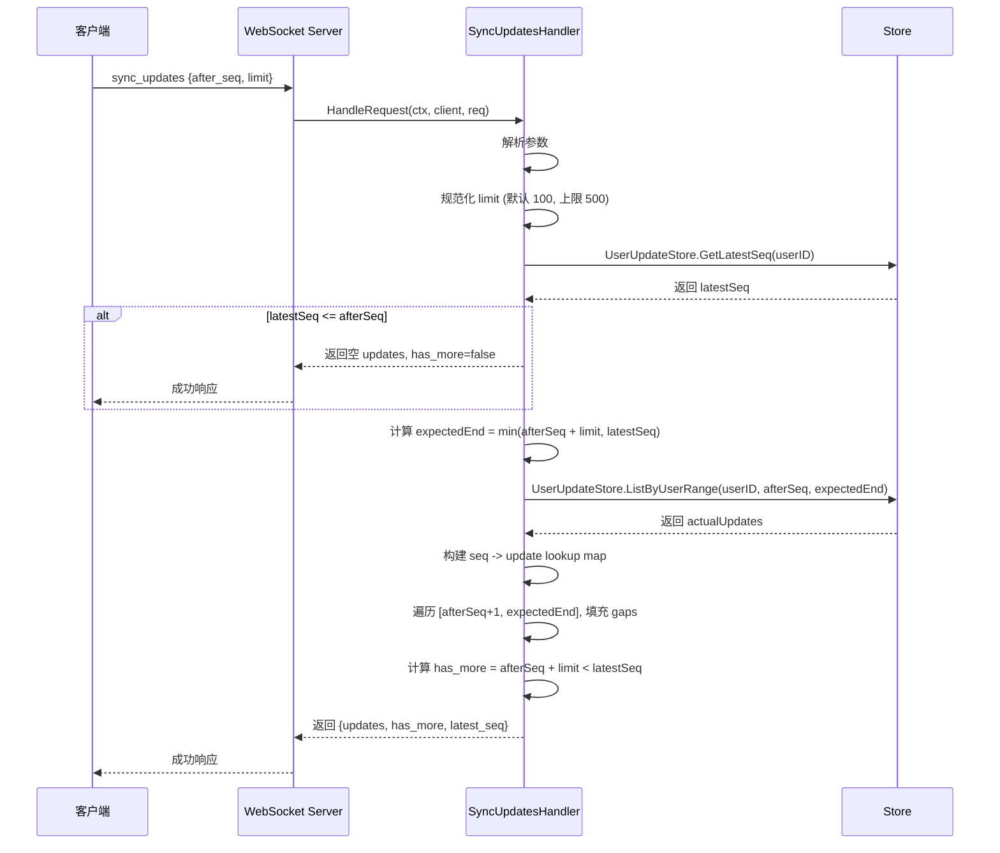

### 详细步骤

1. **解析参数**：提取 `after_seq` 和 `limit`
2. **规范化 limit**：
   - 默认值：100
   - 上限：500
   - 下限：1（<=0 时设为 100）
3. **获取 latestSeq**：查询用户的最新序列号
4. **早期返回**：如果没有新更新（`latestSeq <= afterSeq`），返回空结果
5. **计算范围**：`expectedEnd = min(afterSeq + limit, latestSeq)`
6. **查询实际更新**：获取 `(afterSeq, expectedEnd]` 范围内的更新
7. **构建 lookup map**：将实际更新按 seq 索引
8. **填充 gaps**：遍历 `[afterSeq+1, expectedEnd]`，缺失的位置用 `UpdateTypeGap` 填充
9. **计算 has_more**：`afterSeq + limit < latestSeq`
10. **返回结果**：返回 `{updates, has_more, latest_seq}`

---

## 边缘场景

### 1. 参数校验

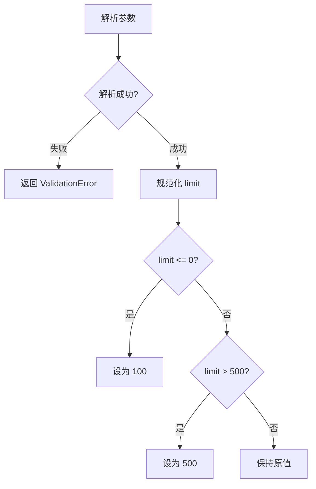

| 场景 | 处理方式 |
|------|----------|
| JSON 解析失败 | 返回 `ValidationError('invalid params')` |
| `limit <= 0` | 设为默认值 100 |
| `limit > 500` | 设为上限 500 |
| `after_seq = 0` | 从头开始拉取 |

### 2. 无新更新

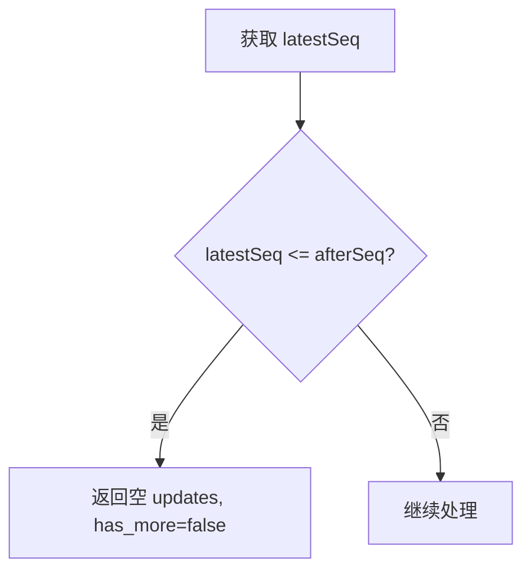

| 场景 | 处理方式 |
|------|----------|
| `latestSeq = 0` | 用户没有任何更新 |
| `afterSeq >= latestSeq` | 客户端已是最新状态 |

### 3. Gap Filling

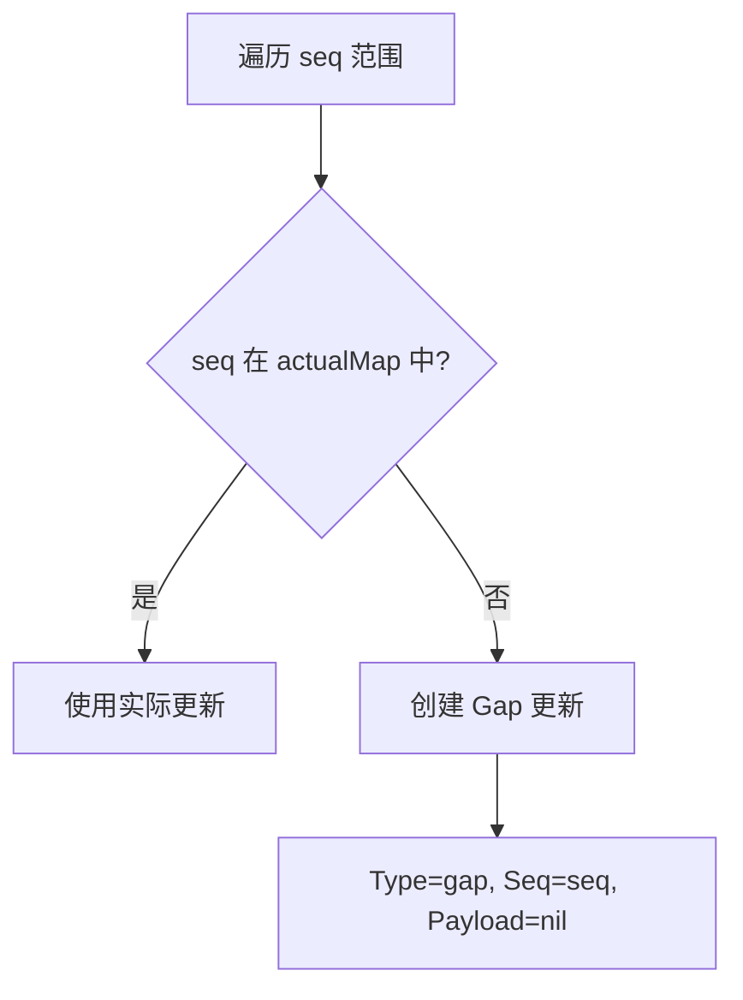

| 场景 | 处理方式 |
|------|----------|
| 序列号间隙 | 自动填充 `UpdateTypeGap` 占位符 |
| 间隙原因 | 并发写入、事务回滚、数据清理 |
| 客户端处理 | 收到 gap 更新后可决定是否补全 |

### 4. 分页

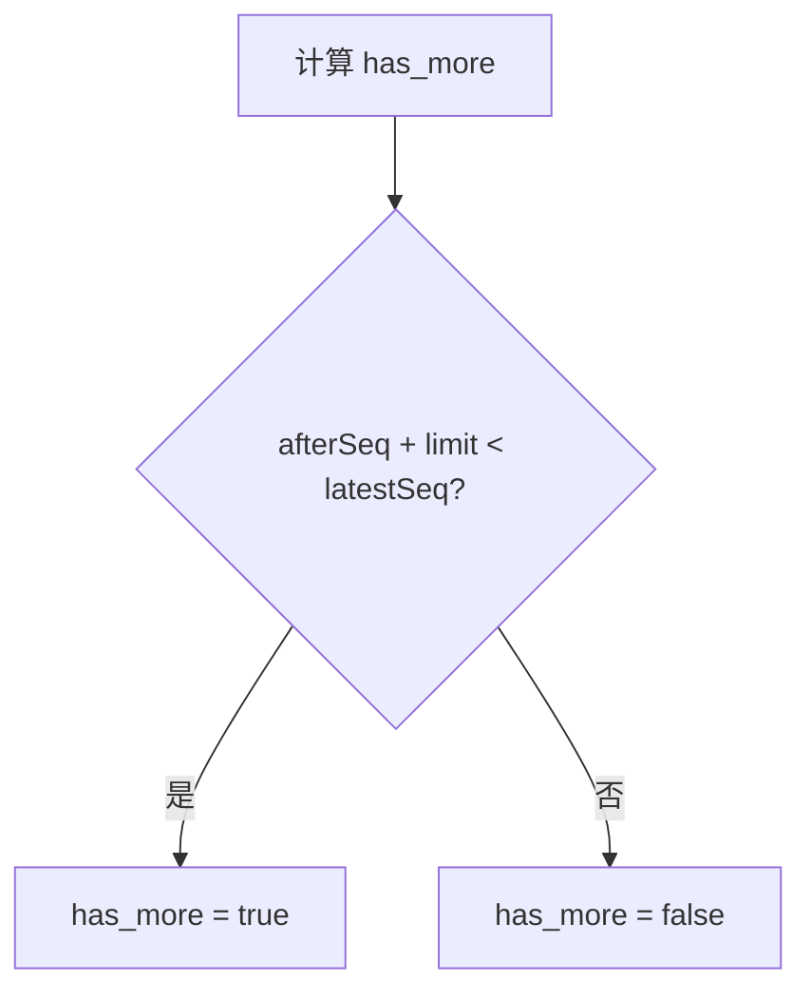

| 场景 | 处理方式 |
|------|----------|
| 还有更多数据 | `has_more = true`，客户端应继续拉取 |
| 已拉取完毕 | `has_more = false` |
| 刚好拉完 | `has_more = false` |

### 5. Store 错误

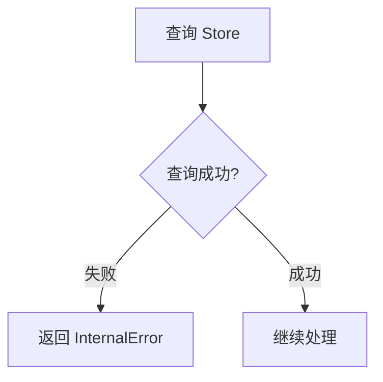

| 场景 | 处理方式 |
|------|----------|
| `GetLatestSeq` 失败 | 返回 `InternalError` |
| `ListByUserRange` 失败 | 返回 `InternalError` |

### 6. uint32 溢出

| 场景 | 处理方式 |
|------|----------|
| `afterSeq + limit` 溢出 uint32 上限 | `expectedEnd` 计算可能回绕，导致查询范围错误。在约 43 亿序列号后实际可能发生 |
| `latestSeq <= afterSeq` 在回绕后 | 当 `afterSeq` 接近 uint32 最大值而 `latestSeq` 已回绕时，比较结果不正确 |

---

## 依赖关系

### 内部依赖

| 组件 | 用途 |
|------|------|
| `store.StoreAPI` | 查询 UserUpdate 数据 |

### 外部依赖

| 组件 | 用途 |
|------|------|
| Database | UserUpdate 表 |

### 数据库操作

| 操作 | 表 | 说明 |
|------|-----|------|
| SELECT MAX(seq) | user_updates | 获取用户最新序列号 |
| SELECT | user_updates | 查询指定范围内的更新 |

---

## 关键设计决策

### 1. Cursor-based Pagination

使用 `after_seq` 作为游标：
- **优点**：客户端只需记住最后看到的 seq
- **优点**：支持断点续传
- **优点**：避免 offset-based 分页的数据偏移问题

### 2. Gap Filling

自动填充缺失的序列号：
- **原因**：客户端需要连续的序列号来检测间隙
- **实现**：使用 `UpdateTypeGap` 占位符
- **Payload**：nil，不携带实际数据

### 3. Limit Capping

限制单次拉取数量：
- **默认值**：100（平衡网络开销和响应时间）
- **上限**：500（防止过大的响应）
- **下限**：1（至少返回 1 条）

### 4. LatestSeq 返回

返回用户的最新序列号：
- **用途**：客户端可以检测是否还有未拉取的更新
- **实现**：在查询实际更新之前获取，用于早期返回判断

---

## 客户端实现建议

### 拉取策略

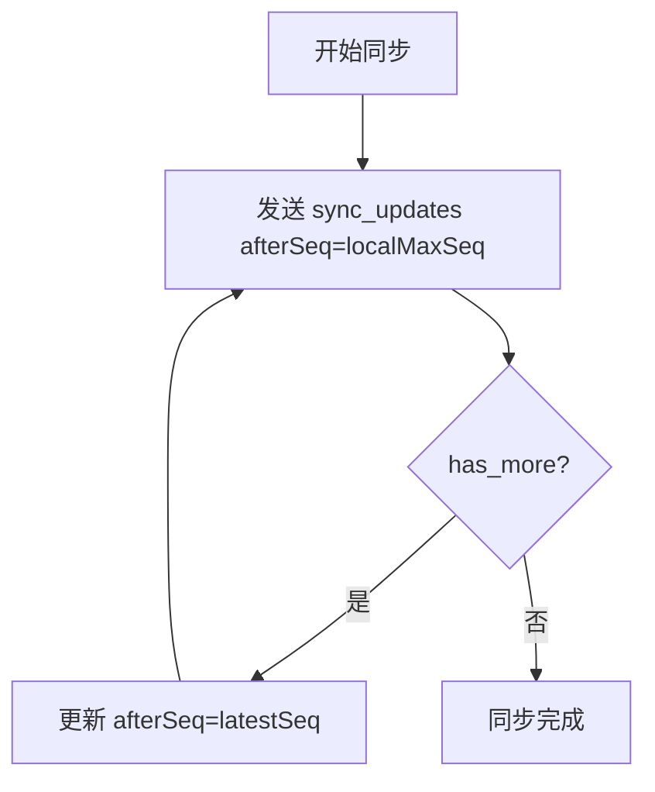

### 间隙检测

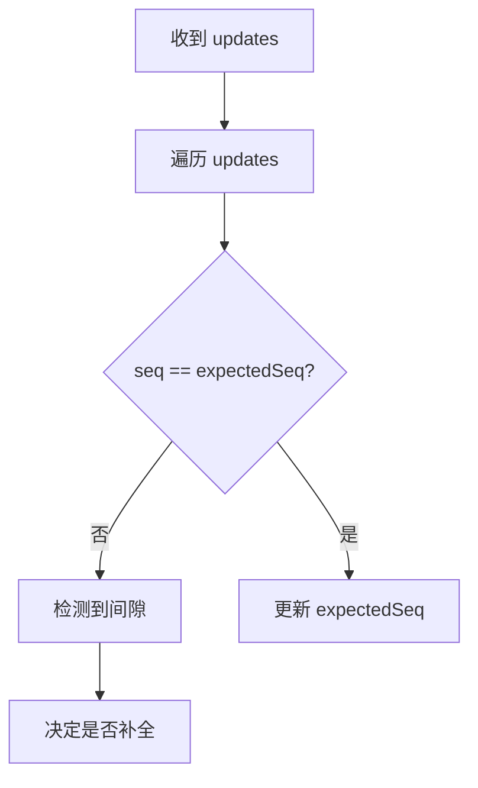

### 错误处理

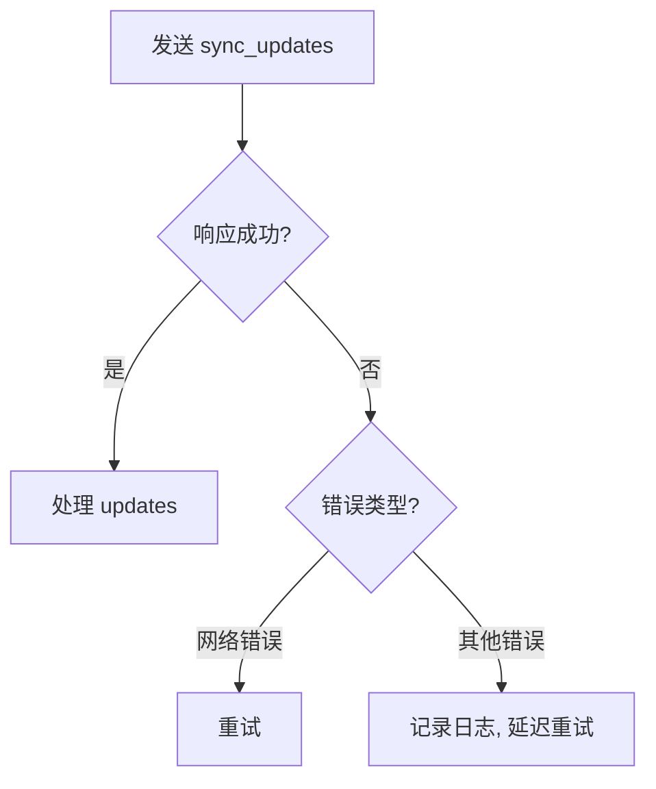

---

## 与其他流程的关系

### 重连后同步

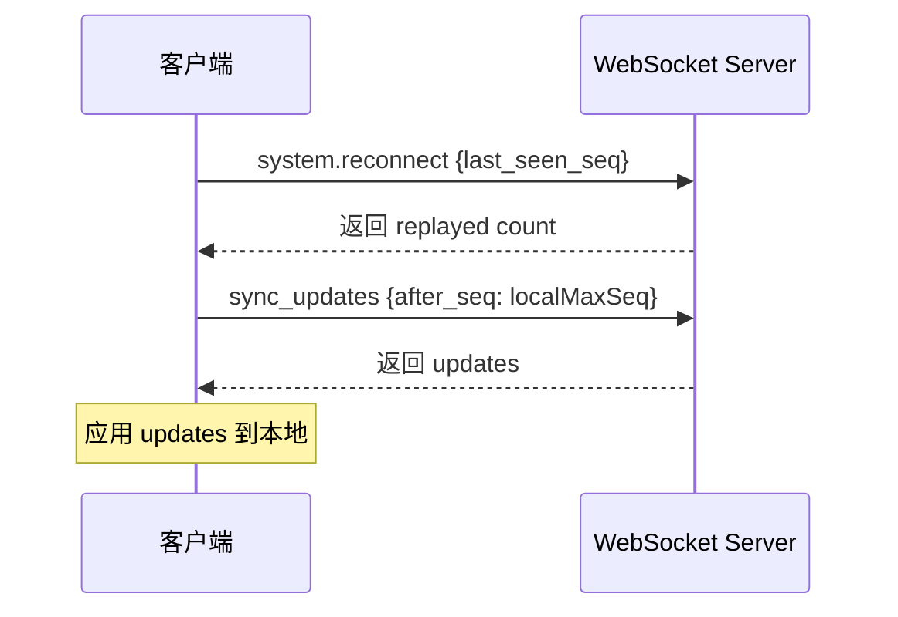

### 实时推送 + 增量拉取

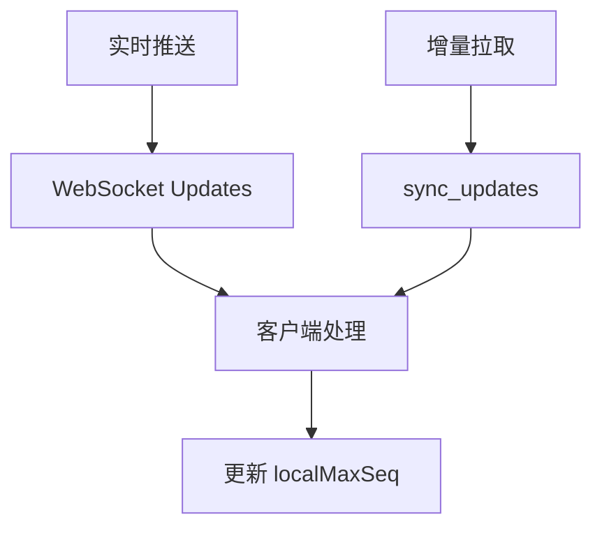

---

## 相关文档

- [断线重连](reconnection.md)
- [消息处理](message.md)
- [WebSocket 连接管理](websocket-connection.md)
- [UserUpdate 存储](../architecture/user-update.md)
