# Sync Updates 业务流程

本文档描述 `sync_updates` RPC 方法的完整业务流程，包括主流程、边缘场景和依赖关系。

---

## 目录

- [概述](#概述)
- [主流程](#主流程)
- [边缘场景](#边缘场景)
- [依赖关系](#依赖关系)
- [关键设计决策](#关键设计决策)
- [客户端实现建议](#客户端实现建议)
- [与其他流程的关系](#与其他流程的关系)

---

## 概述

`sync_updates` 是客户端增量拉取事件流的核心方法。客户端发送 `after_seq`（最后看到的序列号）和 `limit`，服务端返回 `after_seq` 之后的更新列表，包含 `has_more` 标志和 `latest_seq` 用于检测间隙。

### 触发条件

- 客户端重连后同步错过的更新
- 客户端定期轮询获取新更新
- 客户端检测到序列号间隙时补全

### 关键特性

- **Cursor-based pagination**：基于 `after_seq` 的游标分页
- **Gap filling**：自动填充缺失的序列号位置
- **Sequence detection**：返回 `latest_seq` 供客户端检测间隙
- **Limit capping**：默认 100，上限 500

---

## 主流程

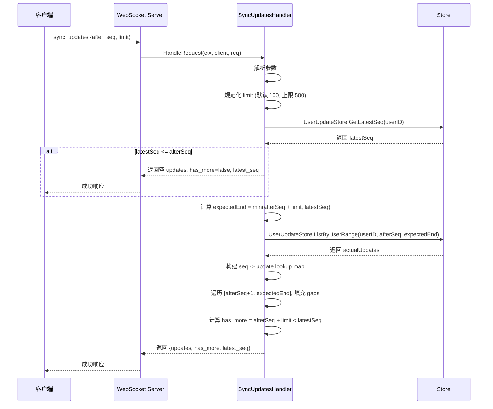

> **注意**：`has_more` 和 `expectedEnd` 使用相同的规范化后 limit 值计算（默认 100，上限 500）。

### 详细步骤

1. **解析参数**：提取 `after_seq` 和 `limit`
2. **规范化 limit**：
   - 默认值：100（`limit <= 0` 或未指定时）
   - 上限：500（`limit > 500` 时截断）
   - 无显式下限（`limit = 1` 可正常通过）
3. **获取 latestSeq**：查询用户的最新序列号
4. **早期返回**：如果没有新更新（`latestSeq <= afterSeq`），返回空结果
5. **计算范围**：`expectedEnd = min(afterSeq + limit, latestSeq)`
6. **查询实际更新**：获取 `(afterSeq, expectedEnd]` 范围内的更新
7. **构建 lookup map**：将实际更新按 seq 索引
8. **填充 gaps**：遍历 `[afterSeq+1, expectedEnd]`，缺失的位置用 `UpdateTypeGap` 填充
9. **计算 has_more**：`afterSeq + limit < latestSeq`
10. **返回结果**：返回 `{updates, has_more, latest_seq}`

---

## 边缘场景

### 1. 参数校验

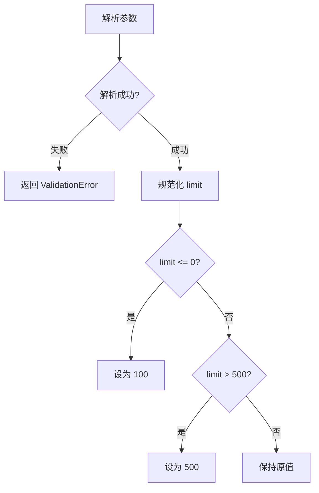

| 场景 | 处理方式 |
| ---- | ---- |
| JSON 解析失败 | 返回 `ValidationError('invalid params')` |
| `limit <= 0` | 设为默认值 100 |
| `limit > 500` | 设为上限 500 |
| `after_seq = 0` | 从头开始拉取 |

### 2. 无新更新

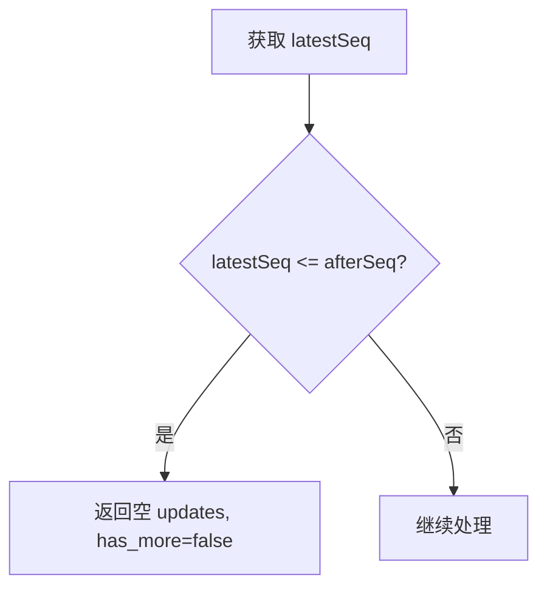

| 场景 | 处理方式 |
| ---- | ---- |
| `latestSeq = 0` | 用户没有任何更新 |
| `afterSeq >= latestSeq` | 客户端已是最新状态 |

### 3. Gap Filling

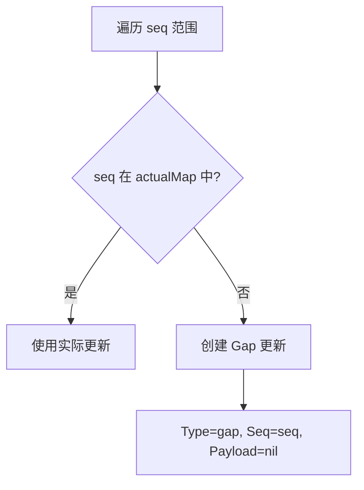

| 场景 | 处理方式 |
| ---- | ---- |
| 序列号间隙 | 自动填充 `UpdateTypeGap` 占位符 |
| 间隙原因 | 并发写入、事务回滚、数据清理、30 天过期清理（`CleanupExpiredBefore` 硬删除） |
| 客户端处理 | 收到 gap 更新后可决定是否补全 |
| Gap 的 CreatedAt | 使用 `time.Now()` 作为合成时间戳，非原始事件时间 |

### 4. 分页

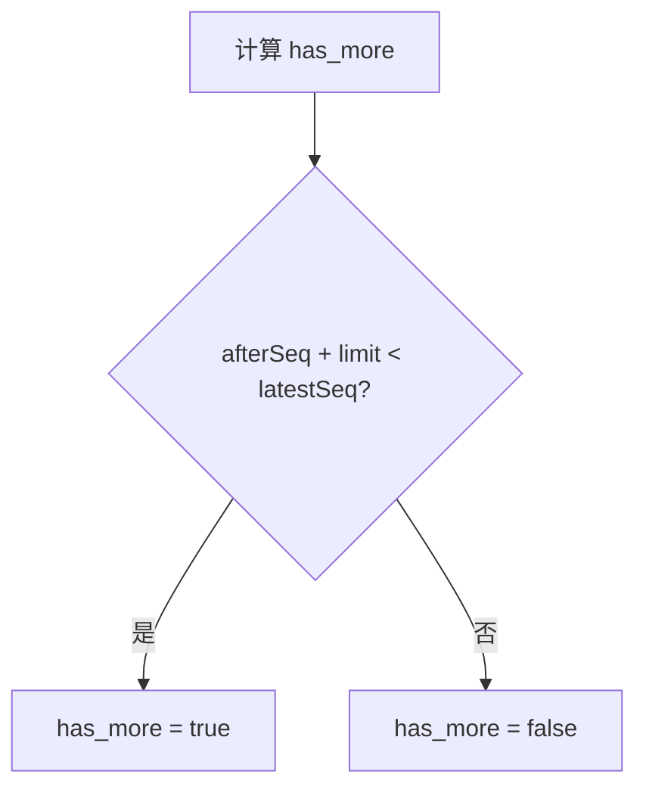

| 场景 | 处理方式 |
| ---- | ---- |
| 还有更多数据 | `has_more = true`，客户端应继续拉取 |
| 已拉取完毕 | `has_more = false` |
| 刚好拉完 | `has_more = false` |

### 5. Store 错误

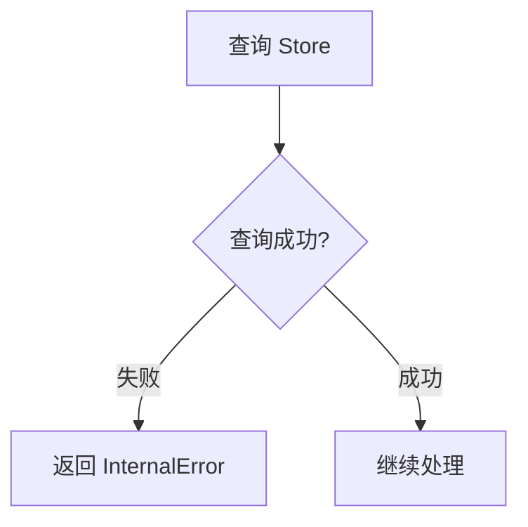

| 场景 | 处理方式 |
| ---- | ---- |
| `GetLatestSeq` 失败 | 返回 `InternalError` |
| `ListByUserRange` 失败 | 返回 `InternalError` |

### 6. uint32 溢出

| 场景 | 处理方式 |
| ---- | ---- |
| `afterSeq + limit` 溢出 uint32 上限 | `expectedEnd` 计算可能回绕，导致查询范围错误。在约 43 亿序列号后实际可能发生 |
| `latestSeq <= afterSeq` 在回绕后 | 当 `afterSeq` 接近 uint32 最大值而 `latestSeq` 已回绕时，比较结果不正确 |

### 7. has_more 与 expectedEnd 一致性

`has_more` 和 `expectedEnd` 均使用同一规范化后的 limit 值（默认 100，上限 500）：

```go
// 规范化
limit := params.Limit
if limit <= 0 { limit = 100 }
if limit > 500 { limit = 500 }

// 两者使用同一个 limit 变量
expectedEnd := params.AfterSeq + uint32(limit)
hasMore := params.AfterSeq + uint32(limit) < latestSeq
```

因此不存在不一致问题。客户端发送 `limit > 500` 时，两者都使用上限 500。

---

## 依赖关系

### 内部依赖

| 组件 | 用途 |
| ---- | ---- |
| `store.StoreAPI` | 查询 UserUpdate 数据 |

### 外部依赖

| 组件 | 用途 |
| ---- | ---- |
| Database (PostgreSQL/SQLite) | UserUpdate 表 |

### 数据库操作

| 操作 | 表 | 说明 |
| ---- | ---- | ---- |
| `SELECT COALESCE(MAX(seq), 0) WHERE user_id = ?` | user_updates | 获取用户最新序列号，无记录时返回 0 |
| `SELECT ... WHERE user_id = ? AND seq > ? AND seq <= ? ORDER BY seq ASC` | user_updates | 查询指定范围内的更新，无 LIMIT 限制 |

### 间接依赖：数据清理

`UserUpdateCleaner` 后台任务每 1 小时（`DefaultInterval`）调用 `CleanupExpired`，硬删除 30 天前的 `user_updates` 记录（`DefaultCleanupRetention`）。这会导致序列号间隙，是 gap filling 存在的主要原因之一。清理后客户端拉取到的 gap 更新数量会增加。

> **注意**：`sync_updates` 本身不执行清理操作，但清理产生的间隙会影响返回结果。

---

## 关键设计决策

### 1. Cursor-based Pagination

使用 `after_seq` 作为游标：

- **优点**：客户端只需记住最后看到的 seq
- **优点**：支持断点续传
- **优点**：避免 offset-based 分页的数据偏移问题

### 2. Gap Filling

自动填充缺失的序列号：

- **原因**：客户端需要连续的序列号来检测间隙
- **实现**：使用 `UpdateTypeGap` 占位符
- **Payload**：nil，不携带实际数据

### 3. Limit Capping

限制单次拉取数量：

- **默认值**：100（`limit <= 0` 或未指定时，平衡网络开销和响应时间）
- **上限**：500（`limit > 500` 时截断，防止过大的响应）
- **有效最小值**：1（`limit = 1` 可正常通过，无显式下限检查）

### 4. LatestSeq 返回

返回用户的最新序列号：

- **用途**：客户端可以检测是否还有未拉取的更新
- **实现**：在查询实际更新之前获取，用于早期返回判断

---

## 客户端实现建议

### FullSync（初始/重连同步）

客户端 `syncManager.FullSync` 执行阻塞式分页同步，循环拉取直到 `has_more=false`：

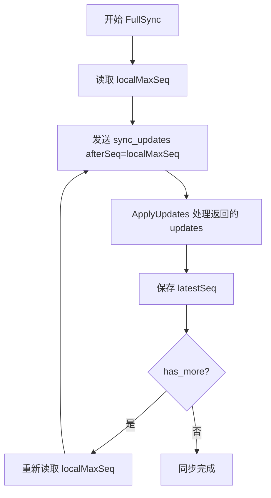

> **注意**：每页拉取后重新读取 `localMaxSeq`（而非使用 last update seq），因为 `ApplyUpdates` 会推进 `localMaxSeq`。

### 增量拉取（Debounced Pull）

间隙触发的增量拉取使用防抖合并（500ms 合并窗口）：

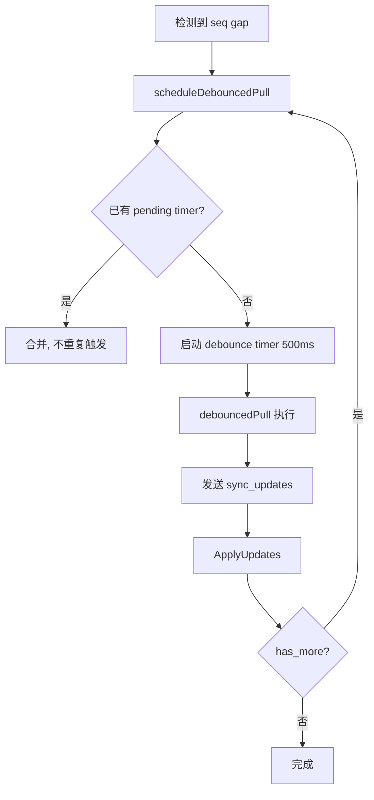

### ApplyUpdate 处理流程

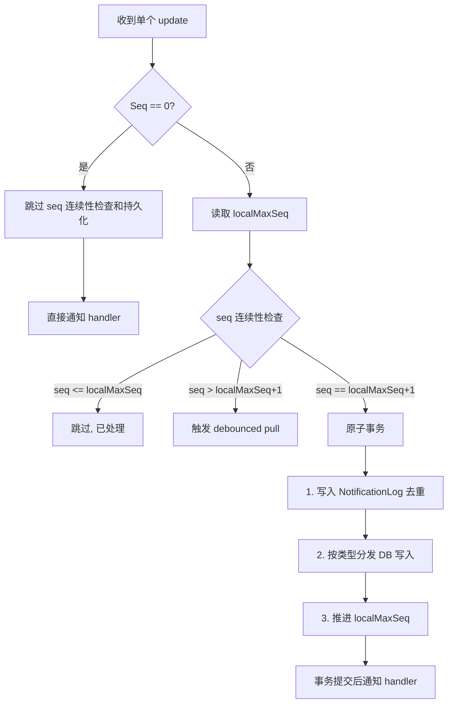

### 客户端 DB 事务保证

客户端使用 SQLite 事务保证原子性（`syncManager.ApplyUpdate`）：

| 步骤 | 操作 | 说明 |
| ---- | ---- | ---- |
| 1 | `NotificationLogs.SaveTx` | 写入去重记录（Seq uniqueIndex） |
| 2 | `dispatchUpdateTx` | 按类型执行 DB 写入（message/conversation/mark_read 等） |
| 3 | `SyncStates.SetLocalMaxSeqTx` | 推进本地序列号 |
| 去重 | `ErrDuplicateKey` 跳过 | 重复 update 跳过 dispatch，仅推进 seq，然后返回 nil 继续处理下一条 |
| 并发保护 | `applyMu` 互斥锁（Go）/ `applyChain` Promise 链（TS） | 串行化单条 update 处理，保证事务隔离 |

### 错误处理

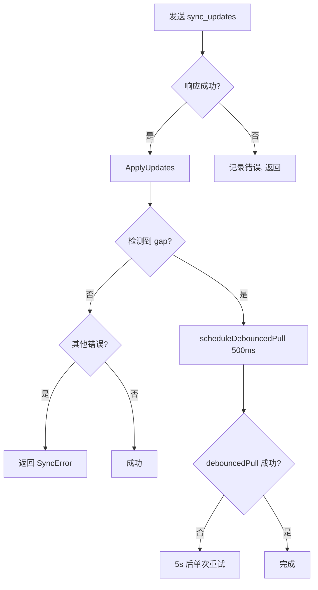

---

## 与其他流程的关系

### 初始连接 / 重连后同步

客户端连接后执行 `FullSync`（阻塞式分页同步），拉取所有错过的更新：

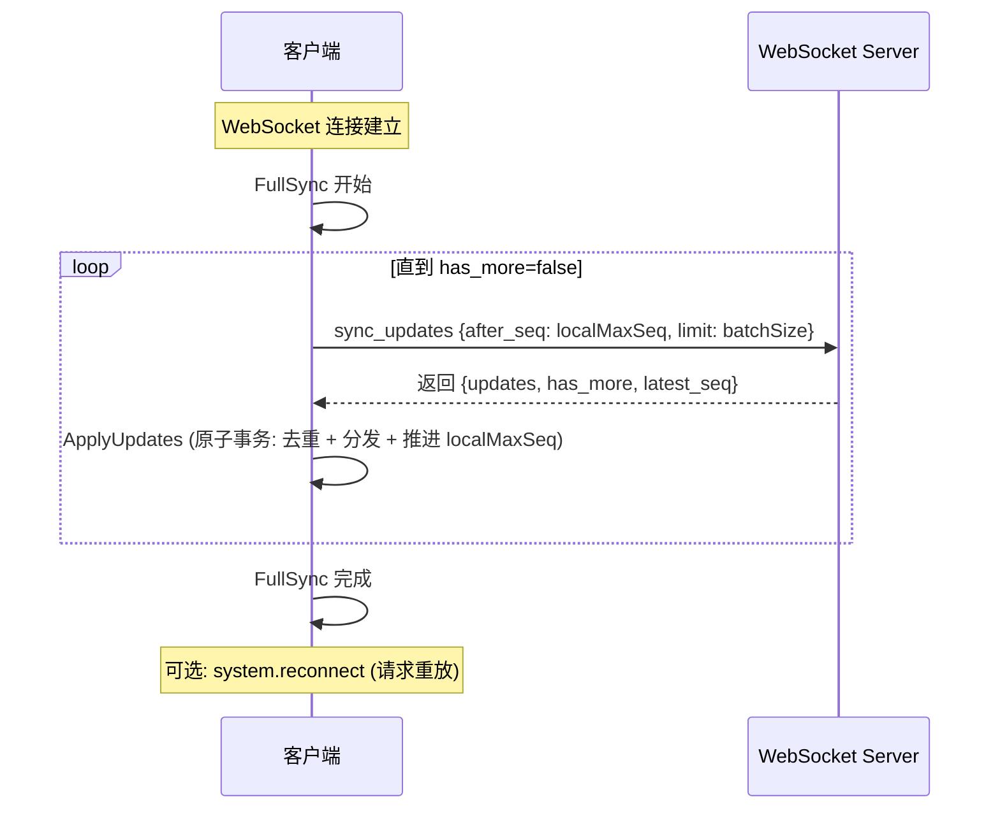

> **注意**：`system.reconnect` 是独立的请求重放机制（D-108），与 `sync_updates` 的增量同步互不依赖。详见 [断线重连](reconnection.md)。

### 实时推送 + 增量拉取

实时推送和增量拉取是互补的两条路径：

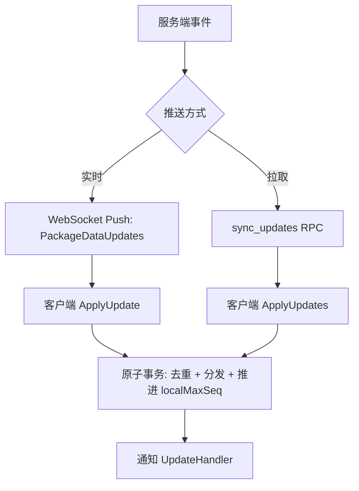

- **实时推送**：服务端通过 `BroadcastHelper` 将更新即时推送给在线客户端
- **增量拉取**：客户端通过 `sync_updates` 补全错过的更新（重连、间隙、离线期间）
- **去重保证**：客户端 `NotificationLog` 的 Seq uniqueIndex 确保同一条更新不会被重复处理

详见 [多节点广播](broadcasting.md)。

---

## 相关文档

- [断线重连](reconnection.md) — reconnect + FullSync 协调流程
- [多节点广播](broadcasting.md) — 实时推送的跨节点投递机制
- [消息处理](message.md) — send_message 流程（产生 UserUpdate）
- [WebSocket 连接管理](websocket-connection.md) — 连接生命周期
- [存储层业务流程](storage.md) — UserUpdate 存储与清理
- [业务流程索引](index.md)
