# WebSocket 连接管理 & 服务端通信

> WebSocket 连接的完整生命周期：建立、心跳、消息路由、设备替换、断开、优雅关闭。
>
> **关联文档**: `websocket.md` 提供相同流程的高层概览（flowchart 视图），本文档提供详细的 sequence diagram 和边缘场景分析。两文档内容有重叠，以本文档为权威来源。
>
> **可观测性**: 全流程使用 OpenTelemetry 追踪，关键 span 包括：
> `ws.connection`（连接生命周期）、`ws.message.receive`（消息接收）、
> `handler.invoke`（方法处理）、`handler.broadcast`（广播）、
> 以及所有 Redis 操作的 `redis.*` span。

## 场景 1: WebSocket 连接建立

### 主流程

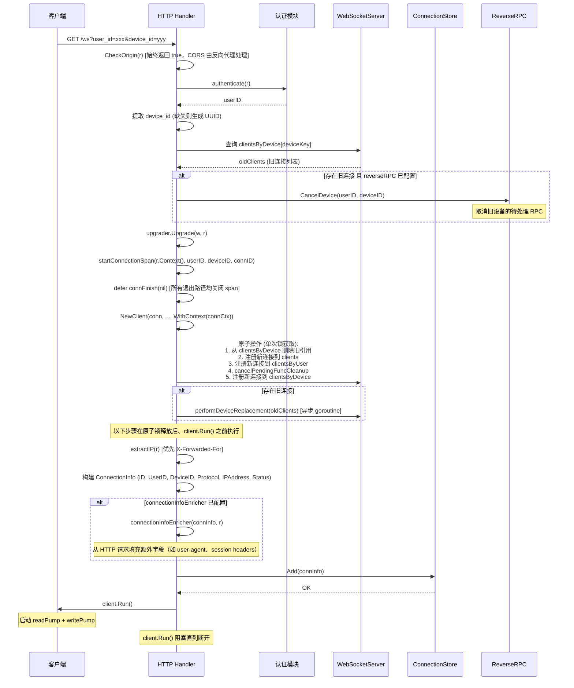
```mermaid
sequenceDiagram
    participant Client as 客户端
    participant HTTP as HTTP Handler
    participant Auth as 认证模块
    participant WS as WebSocketServer
    participant CS as ConnectionStore
    participant RR as ReverseRPC

    Client->>HTTP: GET /ws?user_id=xxx&device_id=yyy
    HTTP->>HTTP: CheckOrigin(r) [始终返回 true，CORS 由反向代理处理]
    HTTP->>Auth: authenticate(r)
    Auth-->>HTTP: userID

    HTTP->>HTTP: 提取 device_id (缺失则生成 UUID)
    HTTP->>WS: 查询 clientsByDevice[deviceKey]
    WS-->>HTTP: oldClients (旧连接列表)

    alt 存在旧连接 且 reverseRPC 已配置
        HTTP->>RR: CancelDevice(userID, deviceID)
        Note over RR: 取消旧设备的待处理 RPC
    end

    HTTP->>HTTP: upgrader.Upgrade(w, r)
    HTTP->>HTTP: startConnectionSpan(r.Context(), userID, deviceID, connID)
    HTTP->>HTTP: defer connFinish(nil) [所有退出路径均关闭 span]
    HTTP->>HTTP: NewClient(conn, ..., WithContext(connCtx))
    HTTP->>WS: 原子操作 (单次锁获取):<br/>1. 从 clientsByDevice 删除旧引用<br/>2. 注册新连接到 clients<br/>3. 注册新连接到 clientsByUser<br/>4. cancelPendingFuncCleanup<br/>5. 注册新连接到 clientsByDevice

    alt 存在旧连接
        HTTP->>WS: performDeviceReplacement(oldClients) [异步 goroutine]
    end

    Note over HTTP: 以下步骤在原子锁释放后、client.Run() 之前执行

    HTTP->>HTTP: extractIP(r) [优先 X-Forwarded-For]
    HTTP->>HTTP: 构建 ConnectionInfo (ID, UserID, DeviceID, Protocol, IPAddress, Status)
    alt connectionInfoEnricher 已配置
        HTTP->>HTTP: connectionInfoEnricher(connInfo, r)
        Note over HTTP: 从 HTTP 请求填充额外字段（如 user-agent、session headers）
    end
    HTTP->>CS: Add(connInfo)
    CS-->>HTTP: OK

    HTTP->>Client: client.Run()
    Note over Client: 启动 readPump + writePump

    Note over HTTP: client.Run() 阻塞直到断开
```

### 边缘场景

#### 1. 认证失败

- 触发条件: authenticate 函数返回错误或空 userID
- 处理逻辑: 返回 HTTP 401。默认 `defaultAuthenticate` 在 `user_id` 为空时返回 `ErrAuthenticationFailed`，统一走 `"authentication failed"` 路径。`"missing user id"` 路径仅在自定义 authenticate 函数返回 `("", nil)` 时触发
- 最终结果: 连接不建立，客户端收到 401 响应
- 备注: 默认实现 (`defaultAuthenticate`) 从 `user_id` query 参数提取用户 ID；生产环境应通过 `WSWithAuthenticate` 注入 JWT 或 cookie 认证

#### 2. device_id 过长

- 触发条件: device_id 长度超过 255 字节
- 处理逻辑: 返回 HTTP 400 "device_id too long"
- 最终结果: 连接不建立

#### 3. device_id 缺失自动分配

- 触发条件: 客户端未在 query 参数中提供 device_id
- 处理逻辑: 自动生成 UUID v4 作为 device_id
- 最终结果: 连接正常建立，日志记录自动分配事件

#### 4. ConnectionStore.Add 失败

- 触发条件: Redis 不可达或达到 MaxConnectionsPerUser 限制
- 处理逻辑: 关闭已创建的 Client，从本地索引中移除，defer connFinish(nil) 关闭连接生命周期 span，返回
- 最终结果: WebSocket 连接已升级但被关闭，客户端断开

#### 5. 超过每用户最大连接数

- 触发条件: MaxConnectionsPerUser 已配置且用户连接数已达上限
- 处理逻辑: Lua 脚本原子检查并返回 -1，Add 返回 ErrMaxConnectionsExceeded
- 最终结果: 连接不注册，Client 被关闭

#### 6. Upgrade 失败但 CancelDevice 已执行

- 触发条件: 存在旧连接，CancelDevice 已取消旧连接的待处理 RPC，但随后 Upgrade 失败
- 处理逻辑: 直接返回，旧连接仍在 clients/clientsByUser/clientsByDevice 中正常运行
- 最终结果: 旧连接的待处理 RPC 被不必要地取消（发送 "device replaced" 错误响应），但旧连接本身不受影响，客户端可重试

#### 7. CheckOrigin 始终放行

- 触发条件: 所有 WebSocket 升级请求
- 处理逻辑: upgrader.CheckOrigin 始终返回 true（D-004: CORS 由反向代理处理）
- 最终结果: 不做来源校验，依赖外部反向代理进行安全过滤

### 关键常量

| 常量 | 默认值 | 说明 |
| --- | --- | --- |
| `defaultConnectionTTL` | 30 分钟 | ConnectionInfo 未指定 TTL 时的默认值 |
| `defaultPongWait` | 60 秒 | 未收到 Pong 的断连超时 |
| `defaultPingPeriod` | 54 秒 | 服务端 Ping 发送间隔 (`pongWait * 9 / 10`) |
| `defaultWriteWait` | 10 秒 | 写入截止时间 |
| `defaultSendBufSize` | 256 | 每客户端发送缓冲区容量 |
| `defaultMaxMessageSize` | 64 KiB | 客户端发来消息的最大字节数 |

### 涉及文件

- `websocket_server.go`: handleWebSocket 主流程、设备替换、连接注册、extractIP、cancelPendingFuncCleanup
- `websocket_client.go`: NewClient、Run 启动读写协程
- `connection_store.go`: ConnectionInfo 模型定义
- `redis_connection_store.go`: Lua 原子 Add 操作
- `memory_connection_store.go`: 内存实现的 Add
- `tracing_helpers.go`: startConnectionSpan 创建连接生命周期 span

---

## 场景 2: 设备连接替换 (同设备重连)

### 主流程

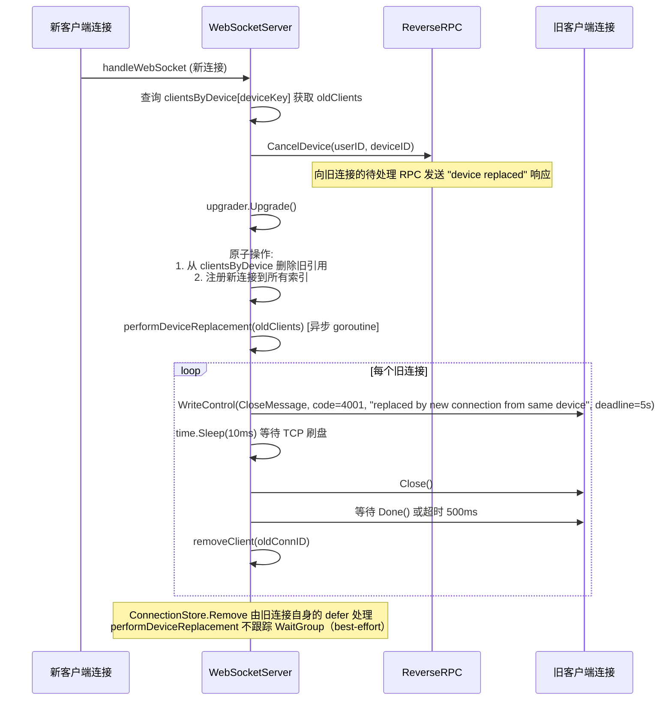
```mermaid
sequenceDiagram
    participant NewClient as 新客户端连接
    participant WS as WebSocketServer
    participant RR as ReverseRPC
    participant OldClient as 旧客户端连接

    NewClient->>WS: handleWebSocket (新连接)
    WS->>WS: 查询 clientsByDevice[deviceKey] 获取 oldClients

    WS->>RR: CancelDevice(userID, deviceID)
    Note over RR: 向旧连接的待处理 RPC 发送 "device replaced" 响应

    WS->>WS: upgrader.Upgrade()
    WS->>WS: 原子操作:<br/>1. 从 clientsByDevice 删除旧引用<br/>2. 注册新连接到所有索引

    WS->>WS: performDeviceReplacement(oldClients) [异步 goroutine]

    loop 每个旧连接
        WS->>OldClient: WriteControl(CloseMessage, code=4001, "replaced by new connection from same device", deadline=5s)
        WS->>WS: time.Sleep(10ms) 等待 TCP 刷盘
        WS->>OldClient: Close()
        WS->>OldClient: 等待 Done() 或超时 500ms
        WS->>WS: removeClient(oldConnID)
    end
    Note over WS: ConnectionStore.Remove 由旧连接自身的 defer 处理<br/>performDeviceReplacement 不跟踪 WaitGroup（best-effort）
```

### 边缘场景

#### 1. 旧连接 CloseFrame 发送失败

- 触发条件: 旧连接已断开或网络异常导致 WriteControl 失败
- 处理逻辑: 记录错误日志，继续执行 Close 和清理
- 最终结果: 旧连接被强制关闭，新连接正常运行

#### 2. 旧连接 goroutine 退出超时

- 触发条件: 旧连接的 readPump/writePump 在 500ms 内未退出
- 处理逻辑: select 超时后继续执行 removeClient
- 最终结果: 旧连接从本地索引移除（ConnectionStore 清理由旧连接自己的 defer 完成）

#### 3. CancelDevice 时序安全

- 触发条件: CancelDevice 在 Upgrade 之前调用
- 处理逻辑: 确保不会取消新连接到达后注册的待处理请求
- 最终结果: 只有属于旧连接的 pending 请求被取消

### 涉及文件

- `websocket_server.go`: handleWebSocket 中的设备替换逻辑、performDeviceReplacement
- `reverse_rpc.go`: CancelDevice
- `websocket_client.go`: Client.Close、Client.Done

---

## 场景 3: WebSocket 心跳保活

### 主流程

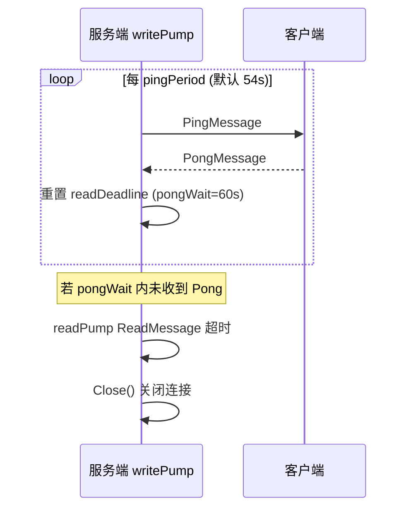
```mermaid
sequenceDiagram
    participant Server as 服务端 writePump
    participant Client as 客户端

    loop 每 pingPeriod (默认 54s)
        Server->>Client: PingMessage
        Client-->>Server: PongMessage
        Server->>Server: 重置 readDeadline (pongWait=60s)
    end

    Note over Server: 若 pongWait 内未收到 Pong
    Server->>Server: readPump ReadMessage 超时
    Server->>Server: Close() 关闭连接
```

### 边缘场景

#### 1. 客户端未响应 Pong

- 触发条件: pongWait (默认 60s) 内未收到 Pong
- 处理逻辑: readPump 的 ReadMessage 返回超时错误，触发 Close
- 最终结果: 连接断开，执行正常断开清理流程

#### 2. 写入 Ping 失败

- 触发条件: writePump 写 Ping 时网络错误
- 处理逻辑: writePump 退出循环，defer 关闭连接
- 最终结果: 连接断开

#### 3. 消息大小超限

- 触发条件: 客户端发送超过 maxMessageSize (默认 64KB) 的消息
- 处理逻辑: readPump 的 ReadMessage 返回错误（gorilla/websocket 内部检查）
- 最终结果: 连接断开

#### 4. readPump 错误分类日志

- 触发条件: ReadMessage 返回任何错误
- 处理逻辑: 使用 `websocket.IsUnexpectedCloseError` 区分意外关闭（如协议错误、异常断开）和正常关闭（CloseGoingAway、CloseNormalClosure）。意外关闭记录 Error 级别日志，正常关闭记录 Debug 级别日志
- 最终结果: 便于运维区分异常断开和正常断开

### 涉及文件

- `websocket_client.go`: readPump (PongHandler、SetReadDeadline)、writePump (Ping ticker)

---

## 场景 3b: 应用层心跳 (ConnectionStore TTL 刷新)

除 WebSocket 协议层的 Ping/Pong 外，客户端还可发送应用层心跳请求以刷新 ConnectionStore 中的连接 TTL。

### 主流程

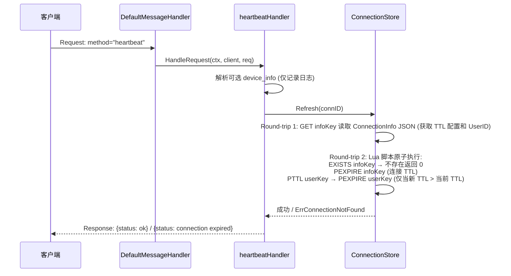
```mermaid
sequenceDiagram
    participant Client as 客户端
    participant DMH as DefaultMessageHandler
    participant HH as heartbeatHandler
    participant CS as ConnectionStore

    Client->>DMH: Request: method="heartbeat"
    DMH->>HH: HandleRequest(ctx, client, req)
    HH->>HH: 解析可选 device_info (仅记录日志)
    HH->>CS: Refresh(connID)
    CS->>CS: Round-trip 1: GET infoKey 读取 ConnectionInfo JSON (获取 TTL 配置和 UserID)
    CS->>CS: Round-trip 2: Lua 脚本原子执行:<br/>EXISTS infoKey → 不存在返回 0<br/>PEXPIRE infoKey (连接 TTL)<br/>PTTL userKey → PEXPIRE userKey (仅当新 TTL > 当前 TTL)
    CS-->>HH: 成功 / ErrConnectionNotFound
    HH-->>Client: Response: {status: ok} / {status: connection expired}
```

### 边缘场景

- 连接已过期/被 Redis 清除: `Refresh` 返回 `ErrConnectionNotFound`，客户端收到 connection expired 错误
- Redis 不可达: 返回内部错误（分类为 `ErrRedisTimeout` 或 `ErrRedisConnectionFailed`）
- `device_info` 解析失败: 忽略，不影响心跳处理（宽容解析）
- 心跳参数缺失: 有效心跳，无参数也正常处理
- `Refresh` 内部流程: 先 GET infoKey 读取连接 JSON（获取 TTL 配置和 UserID），再通过 Lua 脚本原子执行 EXISTS + PEXPIRE infoKey + PTTL/PEXPIRE userKey（MAX 语义），共 2 次 Redis round-trip

### 涉及文件

- `internal/handler/heartbeat.go`: heartbeatHandler.HandleRequest
- `redis_connection_store.go`: Refresh (luaRefresh Lua 脚本)

---

## 场景 4: 客户端消息处理 (Request/Response 分发)

### 主流程

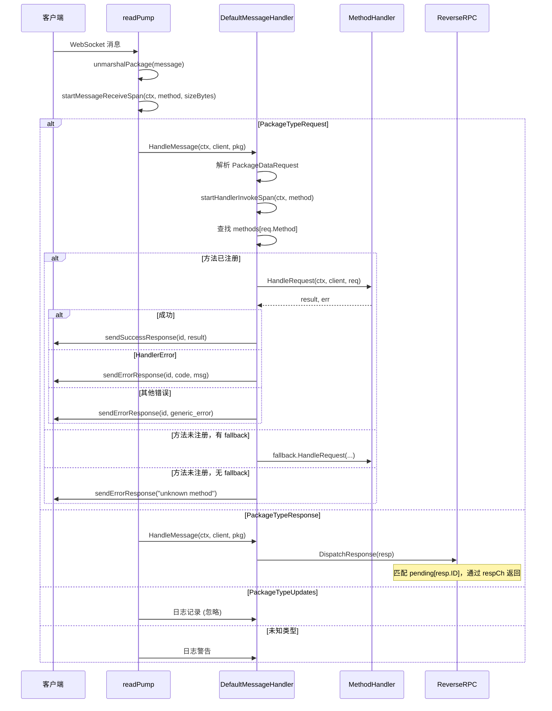
```mermaid
sequenceDiagram
    participant Client as 客户端
    participant RP as readPump
    participant DMH as DefaultMessageHandler
    participant MH as MethodHandler
    participant RR as ReverseRPC

    Client->>RP: WebSocket 消息
    RP->>RP: unmarshalPackage(message)
    RP->>RP: startMessageReceiveSpan(ctx, method, sizeBytes)

    alt PackageTypeRequest
        RP->>DMH: HandleMessage(ctx, client, pkg)
        DMH->>DMH: 解析 PackageDataRequest
        DMH->>DMH: startHandlerInvokeSpan(ctx, method)
        DMH->>DMH: 查找 methods[req.Method]
        alt 方法已注册
            DMH->>MH: HandleRequest(ctx, client, req)
            MH-->>DMH: result, err
            alt 成功
                DMH->>Client: sendSuccessResponse(id, result)
            else HandlerError
                DMH->>Client: sendErrorResponse(id, code, msg)
            else 其他错误
                DMH->>Client: sendErrorResponse(id, generic_error)
            end
        else 方法未注册，有 fallback
            DMH->>MH: fallback.HandleRequest(...)
        else 方法未注册，无 fallback
            DMH->>Client: sendErrorResponse("unknown method")
        end

    else PackageTypeResponse
        RP->>DMH: HandleMessage(ctx, client, pkg)
        DMH->>RR: DispatchResponse(resp)
        Note over RR: 匹配 pending[resp.ID]，通过 respCh 返回

    else PackageTypeUpdates
        RP->>DMH: 日志记录 (忽略)

    else 未知类型
        RP->>DMH: 日志警告
    end
```

### 边缘场景

#### 1. 请求数据解析失败

- 触发条件: PackageData 的 JSON 格式无效
- 处理逻辑: 记录错误日志，发送 ResponseCodeError "invalid request data"
- 最终结果: 客户端收到错误响应

#### 2. 未知方法且无 fallback

- 触发条件: 请求的 method 未注册且未设置 fallback handler
- 处理逻辑: 发送 "unknown method: {method}" 错误响应
- 最终结果: 客户端收到错误响应

#### 3. Response 无匹配的 pending 请求

- 触发条件: 客户端返回的 Response ID 在 pending map 中不存在（超时后的迟到响应）
- 处理逻辑: DispatchResponse 静默忽略
- 最终结果: 无副作用

### 涉及文件

- `websocket_handler.go`: DefaultMessageHandler、handleRequest、MethodHandler 接口
- `websocket_client.go`: readPump 消息循环、unmarshalPackage
- `reverse_rpc.go`: DispatchResponse

---

## 场景 5: 反向 RPC (服务端主动请求客户端)

> **前置条件**: `NewWebSocketServer` 在初始化时自动将 `ReverseRPC` 实例注入到 `DefaultMessageHandler`（通过 `dmh.SetReverseRPC(s.reverseRPC)`），使客户端返回的 `PackageTypeResponse` 能被自动路由到对应的 pending 请求（参见场景 4）。

### 主流程

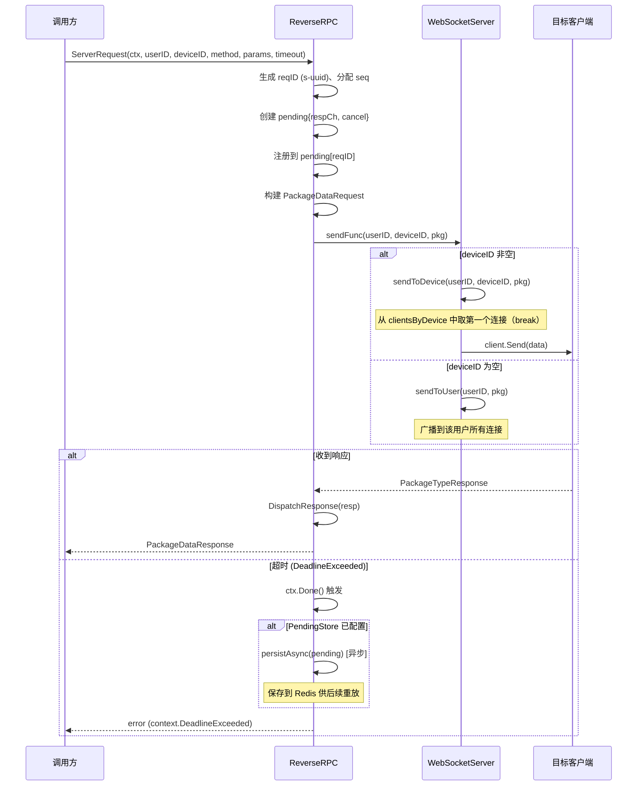
```mermaid
sequenceDiagram
    participant Caller as 调用方
    participant RR as ReverseRPC
    participant WS as WebSocketServer
    participant Client as 目标客户端

    Caller->>RR: ServerRequest(ctx, userID, deviceID, method, params, timeout)
    RR->>RR: 生成 reqID (s-uuid)、分配 seq
    RR->>RR: 创建 pending{respCh, cancel}
    RR->>RR: 注册到 pending[reqID]

    RR->>RR: 构建 PackageDataRequest
    RR->>WS: sendFunc(userID, deviceID, pkg)

    alt deviceID 非空
        WS->>WS: sendToDevice(userID, deviceID, pkg)
        Note over WS: 从 clientsByDevice 中取第一个连接（break）
        WS->>Client: client.Send(data)
    else deviceID 为空
        WS->>WS: sendToUser(userID, pkg)
        Note over WS: 广播到该用户所有连接
    end

    alt 收到响应
        Client-->>RR: PackageTypeResponse
        RR->>RR: DispatchResponse(resp)
        RR-->>Caller: PackageDataResponse
    else 超时 (DeadlineExceeded)
        RR->>RR: ctx.Done() 触发
        alt PendingStore 已配置
            RR->>RR: persistAsync(pending) [异步]
            Note over RR: 保存到 Redis 供后续重放
        end
        RR-->>Caller: error (context.DeadlineExceeded)
    end
```

### 边缘场景

#### 1. 目标设备离线

- 触发条件: sendToDevice 找不到目标设备连接
- 处理逻辑: 返回 ErrDeviceOffline
- 最终结果: ServerRequest 返回错误，请求不持久化

#### 2. 所有用户连接发送失败

- 触发条件: sendToUser 中所有连接的 Send 都失败（已关闭或缓冲区满）
- 处理逻辑: 返回 "all sends to user failed" 错误
- 最终结果: ServerRequest 返回错误

#### 3. 超时后持久化待处理请求

- 触发条件: DeadlineExceeded 且 PendingStore 已配置
- 处理逻辑: 异步调用 pendingStore.Save，失败仅记录日志（fail-open）
- 最终结果: 请求保存到 Redis 列表，设备重连后可重放

#### 4. 用户取消上下文（非超时）

- 触发条件: 父 context 被取消（非 DeadlineExceeded）
- 处理逻辑: 不持久化，直接返回 ctx.Err()
- 最终结果: 请求不保存

#### 5. 发送缓冲区满

- 触发条件: 客户端 send channel 已满（默认 256）
- 处理逻辑: Send 返回 ErrSendBufferFull，sendToDevice 包装后返回错误
- 最终结果: ServerRequest 返回错误

### 涉及文件

- `reverse_rpc.go`: ServerRequest、DispatchResponse、persistAsync、CancelDevice
- `websocket_server.go`: sendToDevice、sendToUser
- `pending_store.go`: PendingRequest 模型、PendingStore 接口
- `redis_pending_store.go`: RedisPendingStore 实现

---

## 场景 6: 待处理请求重放 (设备重连后)

> 重放通过客户端发送 `system.reconnect` RPC 请求触发，由 `reconnectHandler`（`internal/handler/reconnect.go`）编排。
> `handleWebSocket` 本身不直接编排重放——重放是客户端重连握手的一部分（详见 [reconnection.md](./reconnection.md) 第 1、3 节）。

### 主流程（system.reconnect 触发）

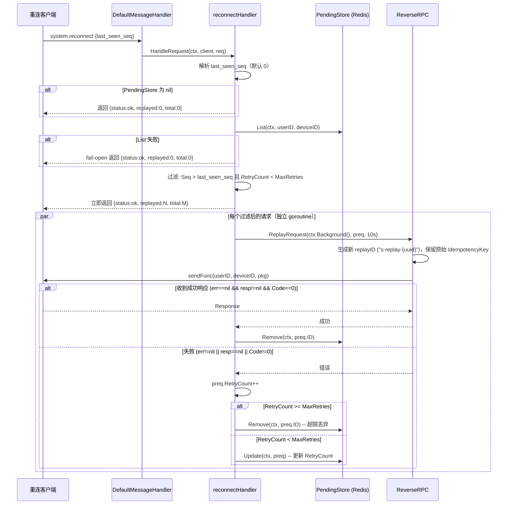
```mermaid
sequenceDiagram
    participant Client as 重连客户端
    participant DMH as DefaultMessageHandler
    participant RH as reconnectHandler
    participant PS as PendingStore (Redis)
    participant RR as ReverseRPC

    Client->>DMH: system.reconnect {last_seen_seq}
    DMH->>RH: HandleRequest(ctx, client, req)

    RH->>RH: 解析 last_seen_seq（默认 0）

    alt PendingStore 为 nil
        RH-->>Client: 返回 {status:ok, replayed:0, total:0}
    end

    RH->>PS: List(ctx, userID, deviceID)
    alt List 失败
        RH-->>Client: fail-open 返回 {status:ok, replayed:0, total:0}
    end

    RH->>RH: 过滤: Seq > last_seen_seq 且 RetryCount < MaxRetries

    RH-->>Client: 立即返回 {status:ok, replayed:N, total:M}

    par 每个过滤后的请求（独立 goroutine）
        RH->>RR: ReplayRequest(ctx.Background(), preq, 10s)
        RR->>RR: 生成新 replayID ("s-replay-{uuid}")，保留原始 IdempotencyKey
        RR->>Client: sendFunc(userID, deviceID, pkg)

        alt 收到成功响应 (err==nil && resp!=nil && Code==0)
            Client-->>RR: Response
            RR-->>RH: 成功
            RH->>PS: Remove(ctx, preq.ID)
        else 失败 (err!=nil || resp==nil || Code!=0)
            RR-->>RH: 错误
            RH->>RH: preq.RetryCount++
            alt RetryCount >= MaxRetries
                RH->>PS: Remove(ctx, preq.ID) -- 超限丢弃
            else RetryCount < MaxRetries
                RH->>PS: Update(ctx, preq) -- 更新 RetryCount
            end
        end
    end
```

### 边缘场景

#### 1. PendingStore 查询失败

- 触发条件: Redis 不可达
- 处理逻辑: fail-open，记录错误日志，返回零计数
- 最终结果: 待处理请求不重放，但连接正常使用

#### 2. 重放失败且超过最大重试次数

- 触发条件: RetryCount >= MaxRetries (默认 3)
- 处理逻辑: 从 PendingStore 中移除该请求
- 最终结果: 请求被丢弃，记录日志

#### 3. 设备重连但 PendingStore 中有损坏数据

- 触发条件: JSON 反序列化失败
- 处理逻辑: List 中跳过损坏条目，Remove/Update 中跳过
- 最终结果: 其他正常请求继续处理

#### 4. PendingStore 为 nil

- 触发条件: 未配置 PendingStore
- 处理逻辑: reconnectHandler 直接返回零计数
- 最终结果: 无重放，连接正常使用

#### 5. 重放使用 context.Background()

- 触发条件: 所有重放请求
- 处理逻辑: `replayOne` 使用 `context.Background()` 而非派生自客户端连接的 context，确保客户端断连不会取消正在进行的重放
- 最终结果: 重放在客户端断连后仍可完成（最多 10 秒超时）

#### 6. 重放失败日志标签

- 触发条件: 任何重放失败（sendFunc 错误、超时、resp==nil、非零 Code）
- 处理逻辑: 代码中日志标签为 "replay timeout"，实际涵盖所有失败类型（`err != nil || resp == nil || resp.Code != 0`）
- 最终结果: 日志标签具有误导性但不影响功能

#### 7. PendingStore 为 nil 但有待处理请求

- 触发条件: PendingStore 未配置（nil），但之前有超时的反向 RPC 请求（未持久化）
- 处理逻辑: reconnectHandler 直接返回零计数，不尝试重放
- 最终结果: 超时的反向 RPC 请求永久丢失，客户端需通过 `sync_updates` 补偿数据

### 涉及文件

- `internal/handler/reconnect.go`: reconnectHandler.HandleRequest、replayOne
- `internal/server/reverse_rpc.go`: ReplayRequest
- `internal/server/pending_store.go`: PendingRequest 模型、PendingStore 接口
- `internal/server/redis_pending_store.go`: Save、List、Remove、Update

---

## 场景 7: 跨节点广播 (Redis Pub/Sub)

> **权威来源**: 跨节点广播的完整流程（含边缘场景、设计决策、广播器生命周期）详见 [broadcasting.md](./broadcasting.md) 第 1、5 节。本节仅提供 WebSocket 连接管理视角的概览。

### 主流程

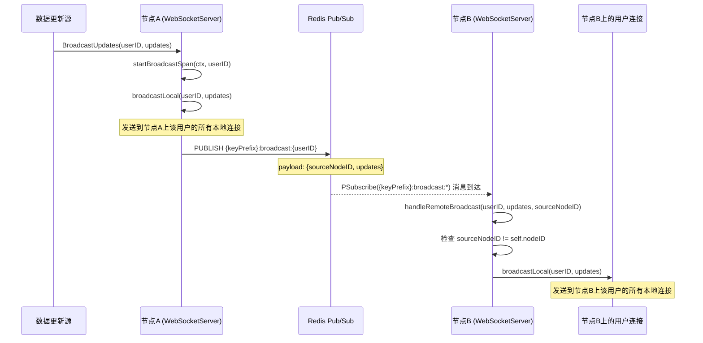
```mermaid
sequenceDiagram
    participant Caller as 数据更新源
    participant WS1 as 节点A (WebSocketServer)
    participant Redis as Redis Pub/Sub
    participant WS2 as 节点B (WebSocketServer)
    participant ClientsB as 节点B上的用户连接

    Caller->>WS1: BroadcastUpdates(userID, updates)
    WS1->>WS1: startBroadcastSpan(ctx, userID)
    WS1->>WS1: broadcastLocal(userID, updates)
    Note over WS1: 发送到节点A上该用户的所有本地连接

    WS1->>Redis: PUBLISH {keyPrefix}:broadcast:{userID}
    Note over Redis: payload: {sourceNodeID, updates}

    Redis-->>WS2: PSubscribe({keyPrefix}:broadcast:*) 消息到达
    WS2->>WS2: handleRemoteBroadcast(userID, updates, sourceNodeID)
    WS2->>WS2: 检查 sourceNodeID != self.nodeID
    WS2->>ClientsB: broadcastLocal(userID, updates)
    Note over ClientsB: 发送到节点B上该用户的所有本地连接
```

### 边缘场景

#### 1. Redis Pub/Sub 发布失败

- 触发条件: Redis 不可达或网络分区
- 处理逻辑: 记录错误日志，`BroadcastUpdates` 仍返回 nil（fire-and-forget 策略，D-007）
- 最终结果: 其他节点收不到更新，但本地节点已投递，数据已持久化，客户端可通过 `sync_updates` 补偿

#### 1b. updates 参数为 nil

- 触发条件: 调用方传入 nil updates
- 处理逻辑: `BroadcastUpdates` 开头检查 `updates == nil`，直接返回 error（`"websocket: updates is nil"`），不执行本地广播和跨节点发布
- 最终结果: 这是 `BroadcastUpdates` 唯一返回非 nil error 的路径；其他所有路径（包括 Pub/Sub 发布失败）均返回 nil（fire-and-forget）

#### 2. 收到自身节点发出的消息

- 触发条件: sourceNodeID == self.nodeID
- 处理逻辑: 直接跳过，不重复投递
- 最终结果: 避免本地消息重复投递

#### 3. PSubscribe 消息格式错误

- 触发条件: 收到无法反序列化的 Pub/Sub 消息
- 处理逻辑: 跳过该消息，继续处理下一条
- 最终结果: 其他正常消息继续处理

#### 4. 单节点部署 (NoopBroadcaster)

- 触发条件: 未配置 NodeBroadcaster（默认使用 NoopBroadcaster）
- 处理逻辑: Publish 和 Subscribe 都是 no-op
- 最终结果: 只有本地广播生效

### 涉及文件

- `node_broadcaster.go`: NodeBroadcaster 接口、NoopBroadcaster
- `redis_node_broadcaster.go`: RedisNodeBroadcaster、Publish、Subscribe
- `websocket_server.go`: BroadcastUpdates、broadcastLocal、handleRemoteBroadcast

---

## 场景 8: 客户端正常断开

### 主流程

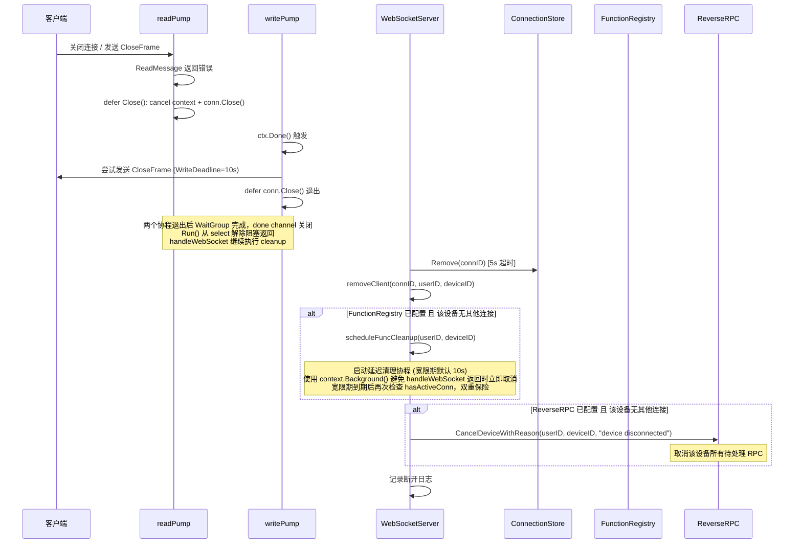
```mermaid
sequenceDiagram
    participant Client as 客户端
    participant RP as readPump
    participant WP as writePump
    participant WS as WebSocketServer
    participant CS as ConnectionStore
    participant FR as FunctionRegistry
    participant RR as ReverseRPC

    Client->>RP: 关闭连接 / 发送 CloseFrame
    RP->>RP: ReadMessage 返回错误
    RP->>RP: defer Close(): cancel context + conn.Close()
    WP->>WP: ctx.Done() 触发
    WP->>Client: 尝试发送 CloseFrame (WriteDeadline=10s)
    WP->>WP: defer conn.Close() 退出

    Note over RP,WP: 两个协程退出后 WaitGroup 完成，done channel 关闭<br/>Run() 从 select 解除阻塞返回<br/>handleWebSocket 继续执行 cleanup

    WS->>CS: Remove(connID) [5s 超时]
    WS->>WS: removeClient(connID, userID, deviceID)

    alt FunctionRegistry 已配置 且 该设备无其他连接
        WS->>WS: scheduleFuncCleanup(userID, deviceID)
        Note over WS: 启动延迟清理协程 (宽限期默认 10s)<br/>使用 context.Background() 避免 handleWebSocket 返回时立即取消<br/>宽限期到期后再次检查 hasActiveConn，双重保险
    end

    alt ReverseRPC 已配置 且 该设备无其他连接
        WS->>RR: CancelDeviceWithReason(userID, deviceID, "device disconnected")
        Note over RR: 取消该设备所有待处理 RPC
    end

    WS->>WS: 记录断开日志
```

### 边缘场景

#### 1. ConnectionStore.Remove 失败 (Redis 不可达)

- 触发条件: Redis 连接超时或不可达
- 处理逻辑: 使用 5s 有界 context，记录错误日志
- 最终结果: 本地索引已清理，Redis 中的连接信息等待 TTL 自动过期

#### 2. 设备已被新连接替换后旧连接断开

- 触发条件: 旧连接的 defer cleanup 运行时，新连接已注册
- 处理逻辑: hasActiveConn 检查为 true，跳过 scheduleFuncCleanup 和 CancelDeviceWithReason
- 最终结果: 新连接的功能注册和 pending 请求不受影响

#### 3. FunctionRegistry 延迟清理与重连竞态

- 触发条件: 设备断开后在宽限期 (默认 10s) 内重连
- 处理逻辑: 新连接注册时调用 `cancelPendingFuncCleanup` 取消待执行的清理协程；若取消失败（宽限期已过），清理协程在执行前再次检查 `hasActiveConn`，发现新连接已注册则跳过清理（双重保险）
- 最终结果: 功能注册不会被误删，新连接可正常注册函数

#### 4. FunctionRegistry 清理失败

- 触发条件: OnDeviceDisconnect 内部错误（宽限期到期后执行）
- 处理逻辑: 记录错误日志
- 最终结果: 功能注册可能残留，但不影响核心通信

### 涉及文件

- `websocket_server.go`: handleWebSocket 断开清理逻辑、scheduleFuncCleanup、cancelPendingFuncCleanup
- `websocket_client.go`: readPump、writePump、Close
- `redis_connection_store.go`: Remove (Get + luaRemove + luaCleanupEmptySet)
- `function_registry.go`: OnDeviceDisconnect
- `reverse_rpc.go`: CancelDeviceWithReason

---

## 场景 9: 服务端优雅关闭

### 主流程

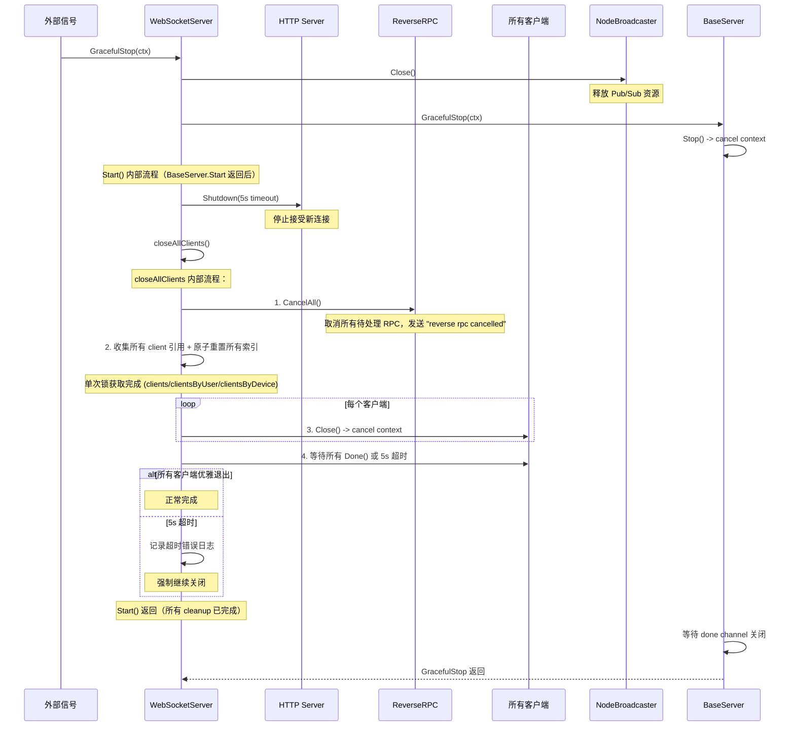
```mermaid
sequenceDiagram
    participant External as 外部信号
    participant WS as WebSocketServer
    participant HTTP as HTTP Server
    participant RR as ReverseRPC
    participant Clients as 所有客户端
    participant NB as NodeBroadcaster
    participant BS as BaseServer

    External->>WS: GracefulStop(ctx)
    WS->>NB: Close()
    Note over NB: 释放 Pub/Sub 资源

    WS->>BS: GracefulStop(ctx)
    BS->>BS: Stop() -> cancel context

    Note over WS: Start() 内部流程（BaseServer.Start 返回后）

    WS->>HTTP: Shutdown(5s timeout)
    Note over HTTP: 停止接受新连接

    WS->>WS: closeAllClients()
    Note over WS: closeAllClients 内部流程：
    WS->>RR: 1. CancelAll()
    Note over RR: 取消所有待处理 RPC，发送 "reverse rpc cancelled"
    WS->>WS: 2. 收集所有 client 引用 + 原子重置所有索引
    Note over WS: 单次锁获取完成 (clients/clientsByUser/clientsByDevice)

    loop 每个客户端
        WS->>Clients: 3. Close() -> cancel context
    end

    WS->>Clients: 4. 等待所有 Done() 或 5s 超时

    alt 所有客户端优雅退出
        Note over WS: 正常完成
    else 5s 超时
        WS->>WS: 记录超时错误日志
        Note over WS: 强制继续关闭
    end

    Note over WS: Start() 返回（所有 cleanup 已完成）

    BS->>BS: 等待 done channel 关闭
    BS-->>WS: GracefulStop 返回
```

### 边缘场景

#### 1. 客户端 writePump 排空超时

- 触发条件: 5s 内有客户端的 writePump 未退出
- 处理逻辑: 记录超时错误日志，继续关闭流程
- 最终结果: 服务强制关闭，未排空的消息丢失

#### 2. HTTP Server Shutdown 超时

- 触发条件: 5s 内 HTTP Server 未完全关闭
- 处理逻辑: 记录错误日志
- 最终结果: 强制关闭

#### 3. NodeBroadcaster Close 失败

- 触发条件: Redis Pub/Sub 关闭错误
- 处理逻辑: 记录错误日志，继续关闭流程
- 最终结果: Pub/Sub 资源可能泄露，但服务正常关闭

#### 4. GracefulStop 整体超时

- 触发条件: 传入的 ctx 在 Start() 返回前过期
- 处理逻辑: BaseServer.GracefulStop 的 select 检测到 ctx.Done()，返回超时错误
- 最终结果: GracefulStop 提前返回，但 Start() 内部的关闭流程（httpServer.Shutdown、closeAllClients）仍在后台继续执行直到完成

### 涉及文件

- `websocket_server.go`: GracefulStop、Start (shutdown 部分)、closeAllClients
- `server.go`: BaseServer.GracefulStop、BaseServer.Stop
- `reverse_rpc.go`: CancelAll
- `redis_node_broadcaster.go`: Close

---

## 场景 10: 函数注册管理

### 主流程

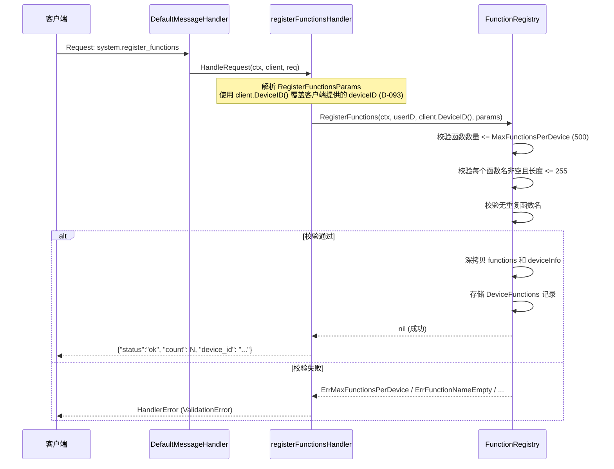
```mermaid
sequenceDiagram
    participant Client as 客户端
    participant DMH as DefaultMessageHandler
    participant RFH as registerFunctionsHandler
    participant FR as FunctionRegistry

    Client->>DMH: Request: system.register_functions
    DMH->>RFH: HandleRequest(ctx, client, req)
    Note over RFH: 解析 RegisterFunctionsParams<br/>使用 client.DeviceID() 覆盖客户端提供的 deviceID (D-093)

    RFH->>FR: RegisterFunctions(ctx, userID, client.DeviceID(), params)

    FR->>FR: 校验函数数量 <= MaxFunctionsPerDevice (500)
    FR->>FR: 校验每个函数名非空且长度 <= 255
    FR->>FR: 校验无重复函数名

    alt 校验通过
        FR->>FR: 深拷贝 functions 和 deviceInfo
        FR->>FR: 存储 DeviceFunctions 记录
        FR-->>RFH: nil (成功)
        RFH-->>Client: {"status":"ok", "count": N, "device_id": "..."}
    else 校验失败
        FR-->>RFH: ErrMaxFunctionsPerDevice / ErrFunctionNameEmpty / ...
        RFH-->>Client: HandlerError (ValidationError)
    end
```

### 边缘场景

#### 1. 设备断开时自动清理函数注册

- 触发条件: 客户端断开且该设备无其他活跃连接
- 处理逻辑: OnDeviceDisconnect 删除该设备的函数注册
- 最终结果: 函数注册被清理，返回被删除的 DeviceFunctions 用于日志

#### 2. 设备替换时不清理函数注册

- 触发条件: 旧连接断开但新连接已注册（hasActiveConn = true）
- 处理逻辑: 跳过 OnDeviceDisconnect 调用
- 最终结果: 新连接的函数注册不受影响

#### 3. FunctionRegistry 未配置

- 触发条件: 未传入 WSWithFunctionRegistry 选项
- 处理逻辑: functionRegistry 为 nil，所有方法调用安全跳过（nil-safe）
- 最终结果: 函数注册功能完全禁用

#### 4. 客户端提供的 deviceID 被覆盖

- 触发条件: 客户端在 params 中提供了 device_id 字段
- 处理逻辑: registerFunctionsHandler 使用连接的 `client.DeviceID()` 覆盖客户端提供的 deviceID（D-093：连接的 deviceID 是权威来源）
- 最终结果: 注册始终使用连接建立时的 deviceID，忽略客户端 params 中的值

### 涉及文件

- `function_registry.go`: FunctionRegistry 接口、MemoryFunctionRegistry、RegisterFunctions、OnDeviceDisconnect
- `handler/register_functions.go`: registerFunctionsHandler.HandleRequest（解析参数、覆盖 deviceID、调用 Registry）
- `websocket_server.go`: handleWebSocket 中的断开清理

---

## 场景 11: 健康检查

### 主流程

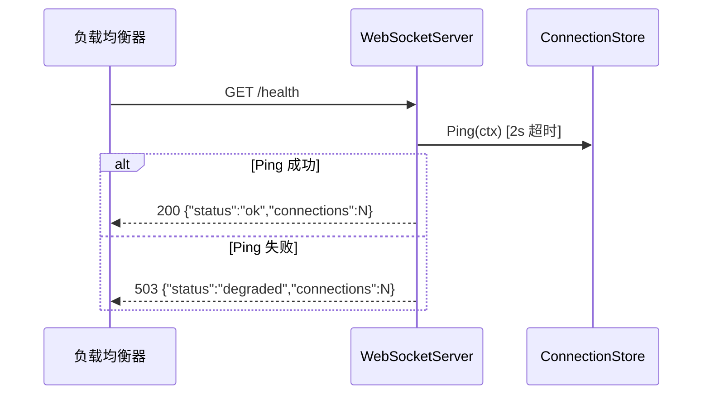
```mermaid
sequenceDiagram
    participant LB as 负载均衡器
    participant WS as WebSocketServer
    participant CS as ConnectionStore

    LB->>WS: GET /health
    WS->>CS: Ping(ctx) [2s 超时]

    alt Ping 成功
        WS-->>LB: 200 {"status":"ok","connections":N}
    else Ping 失败
        WS-->>LB: 503 {"status":"degraded","connections":N}
    end
```

### 边缘场景

#### 1. ConnectionStore Ping 超时

- 触发条件: Redis 响应超过 2s
- 处理逻辑: 返回 503 "degraded"
- 最终结果: 负载均衡器可据此判断节点不健康

### 涉及文件

- `websocket_server.go`: handleHealth
- `redis_connection_store.go`: Ping

---

## 场景 12: 发送消息到用户 (sendToUser 部分失败)

### 主流程

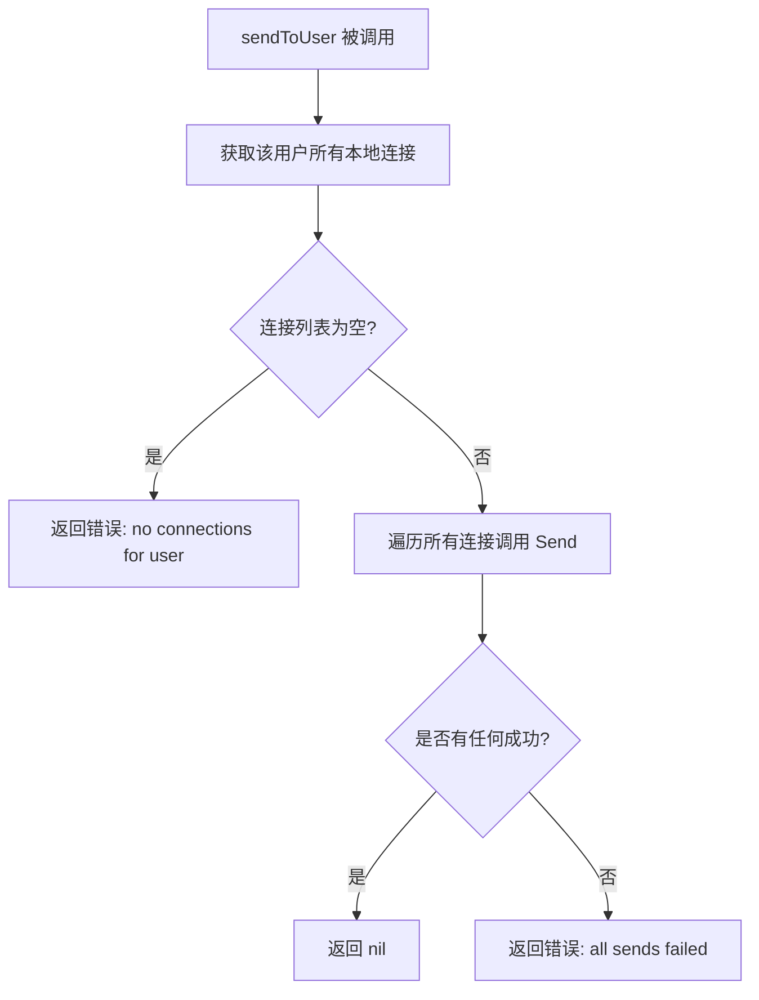
```mermaid
flowchart TD
    A[sendToUser 被调用] --> B[获取该用户所有本地连接]
    B --> C{连接列表为空?}
    C -->|是| D[返回错误: no connections for user]
    C -->|否| E[遍历所有连接调用 Send]
    E --> F{是否有任何成功?}
    F -->|是| G[返回 nil]
    F -->|否| H[返回错误: all sends failed]
```

### 边缘场景

#### 1. 部分连接发送失败

- 触发条件: 某些连接已关闭或缓冲区满，但至少一个成功
- 处理逻辑: 记录每个失败的错误日志，只要有一个成功就返回 nil
- 最终结果: 部分设备可能收不到消息，但调用方认为成功

#### 2. 所有连接发送失败

- 触发条件: 该用户所有连接都已关闭或缓冲区满
- 处理逻辑: 返回最后一个错误，包装 "all sends to user {userID} failed"
- 最终结果: 调用方收到错误

#### 3. sendToDevice 只取第一个连接

- 触发条件: 同一设备有多个连接（理论上不应发生，因为设备替换会关闭旧连接）
- 处理逻辑: 从 clientsByDevice map 中遍历取第一个连接后 break
- 最终结果: 只有一个连接收到消息

### 涉及文件

- `websocket_server.go`: sendToUser、sendToDevice
- `websocket_client.go`: Send (ErrClientClosed、ErrSendBufferFull)

---

## 场景 13: Redis 连接存储的 TTL 与自动过期

### Redis 存储常量

| 常量 | 默认值 | 说明 |
| --- | --- | --- |
| `defaultConnectionTTL` | 30 分钟 | ConnectionInfo 未指定 TTL 时的默认值 |
| `maxListByUserLimit` | 1000 | ListByUser 单次返回的最大连接数 |
| `removeByUserBatchSize` | 100 | RemoveByUser 每批 UNLINK 的 key 数量 |

### 主流程

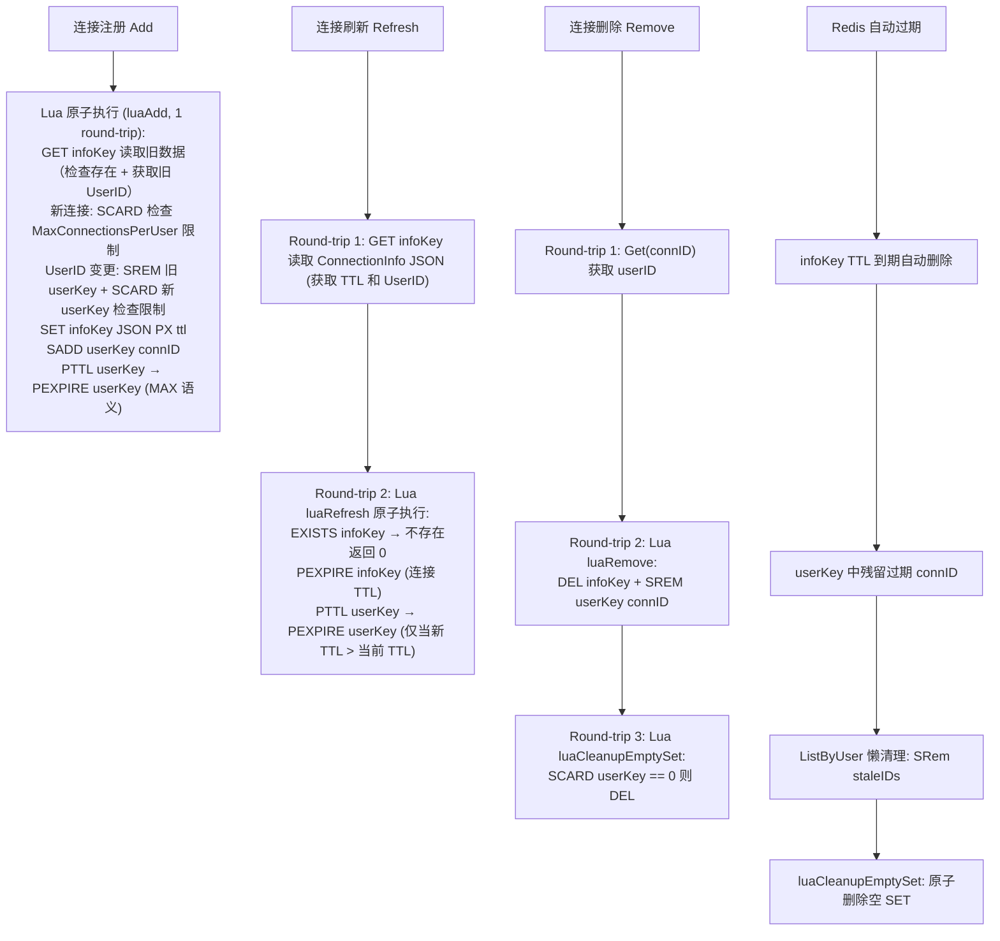
```mermaid
flowchart TD
    A[连接注册 Add] --> B["Lua 原子执行 (luaAdd, 1 round-trip):<br/>GET infoKey 读取旧数据（检查存在 + 获取旧 UserID）<br/>新连接: SCARD 检查 MaxConnectionsPerUser 限制<br/>UserID 变更: SREM 旧 userKey + SCARD 新 userKey 检查限制<br/>SET infoKey JSON PX ttl<br/>SADD userKey connID<br/>PTTL userKey → PEXPIRE userKey (MAX 语义)"]

    E[连接刷新 Refresh] --> F["Round-trip 1: GET infoKey 读取 ConnectionInfo JSON (获取 TTL 和 UserID)"]
    F --> G["Round-trip 2: Lua luaRefresh 原子执行:<br/>EXISTS infoKey → 不存在返回 0<br/>PEXPIRE infoKey (连接 TTL)<br/>PTTL userKey → PEXPIRE userKey (仅当新 TTL > 当前 TTL)"]

    R[连接删除 Remove] --> S["Round-trip 1: Get(connID) 获取 userID"]
    S --> T["Round-trip 2: Lua luaRemove:<br/>DEL infoKey + SREM userKey connID"]
    T --> U["Round-trip 3: Lua luaCleanupEmptySet:<br/>SCARD userKey == 0 则 DEL"]

    I[Redis 自动过期] --> J[infoKey TTL 到期自动删除]
    J --> K[userKey 中残留过期 connID]
    K --> L[ListByUser 懒清理: SRem staleIDs]
    L --> M[luaCleanupEmptySet: 原子删除空 SET]
```

### 边缘场景

#### 1. infoKey 过期但 userKey 未清理

- 触发条件: infoKey 的 TTL 到期被 Redis 自动删除，但 userKey 中仍有该 connID
- 处理逻辑: ListByUser 中 MGET 返回 nil，加入 staleIDs 列表，SRem 清理
- 最终结果: 懒清理保证最终一致性

#### 2. userKey 中所有 connID 都过期

- 触发条件: userKey 中的 connID 对应的 infoKey 全部过期
- 处理逻辑: SRem 清理所有 staleIDs 后，luaCleanupEmptySet 原子删除空 SET
- 最终结果: 避免 orphan SET key 残留

#### 3. 用户 ID 变更时的索引清理

- 触发条件: 用相同 connID 覆盖写入但 UserID 不同
- 处理逻辑: luaAdd 脚本中先 GET infoKey 读取旧数据解析 oldUserID，若 `oldUserID != newUserID` 则原子 SREM 旧 userKey，并对新 userKey 执行 SCARD 检查 MaxConnectionsPerUser 限制（连接尚未加入新 userKey，所以用 `>= maxConns` 判断）
- 最终结果: 旧用户的连接集被正确清理，新用户的连接限制被正确检查

#### 4. Remove 操作的非原子性

- 触发条件: 所有 Remove 调用
- 处理逻辑: Remove 执行 3 步操作：(1) Get(connID) 获取 userID，(2) luaRemove 删除 infoKey 和 userKey 中的 connID，(3) luaCleanupEmptySet 清理空 SET。步骤 1 和 2 之间存在窗口：若 infoKey 在此期间过期，Get 返回 ErrConnectionNotFound，Remove 直接返回 nil（no-op）。若 infoKey 在 Get 和 luaRemove 之间过期，SREM 仍会对 userKey 执行（移除已过期的条目，无害）
- 最终结果: 三步操作非完全原子，但对正确性无影响（SREM 幂等，luaCleanupEmptySet 原子）

#### 5. Remove 后清理空 SET

- 触发条件: Remove 执行后 userKey 可能变为空 SET
- 处理逻辑: Remove 在 luaRemove 之后调用 luaCleanupEmptySet，原子检查 SCARD 并 DEL
- 最终结果: 避免 orphan SET key 残留

### 涉及文件

- `redis_connection_store.go`: Add (luaAdd, 1 round-trip)、Remove (Get + luaRemove + luaCleanupEmptySet, 3 round-trips)、Refresh (Get + luaRefresh, 2 round-trips)、ListByUser (SScan + MGet + 懒清理)、RemoveByUser (SMembers + UNLINK 批量删除)
- `connection_store.go`: ConnectionInfo.TTL、IsExpired、ConnectionStore 接口定义
