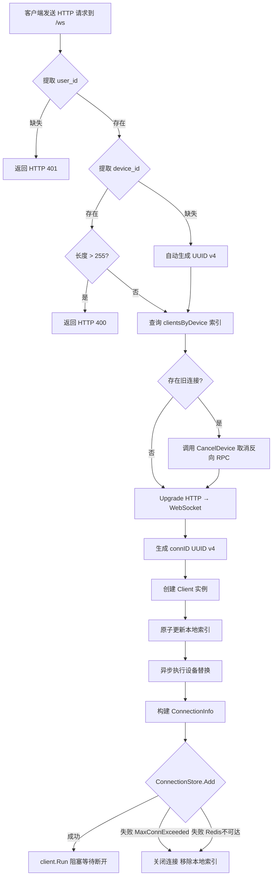
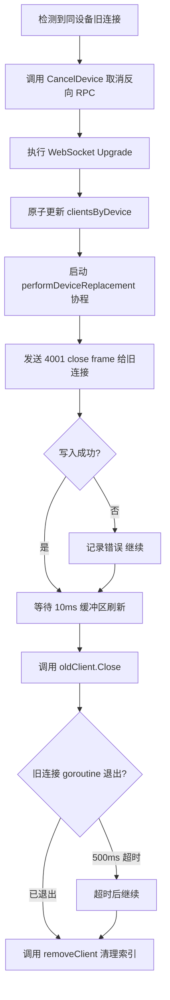
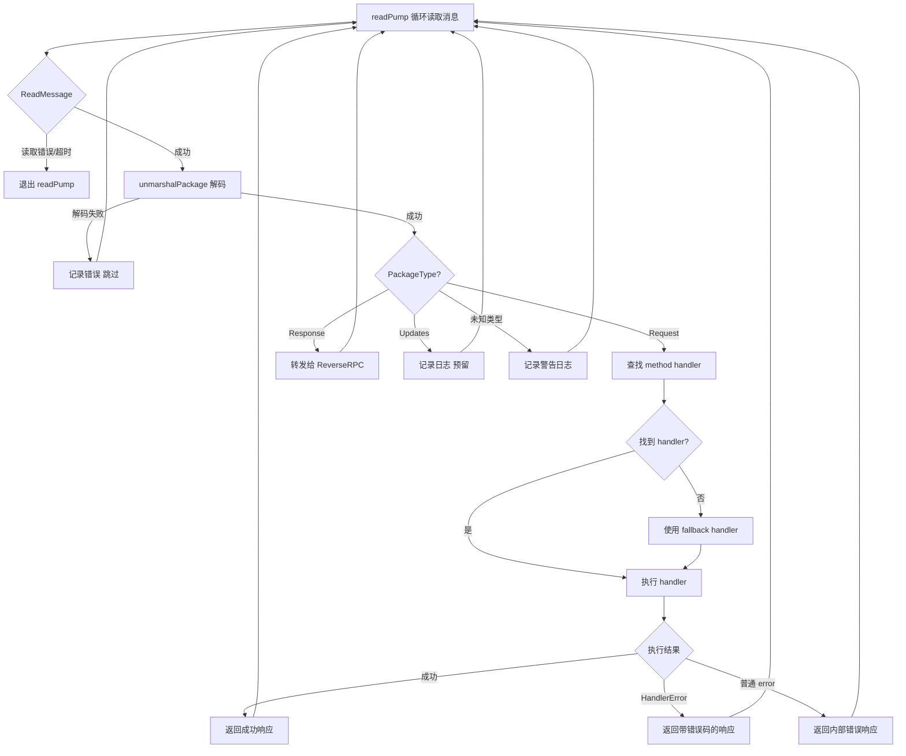
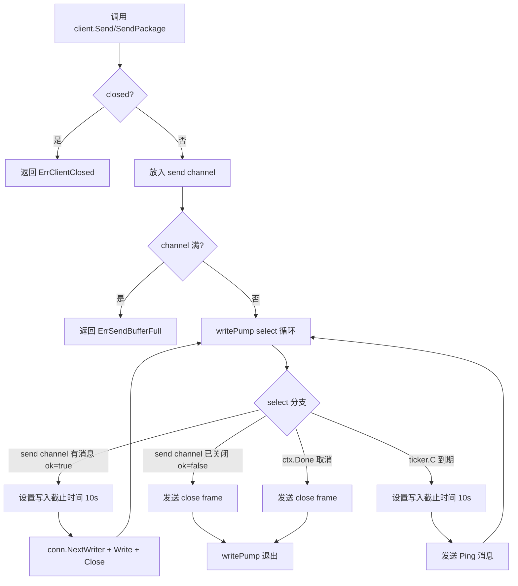
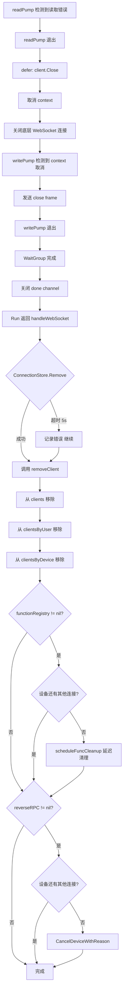
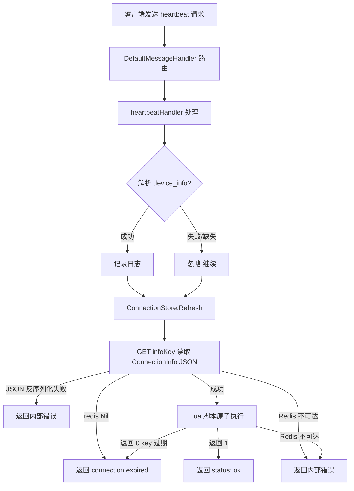
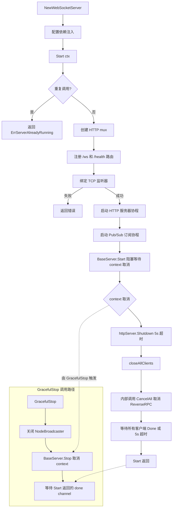
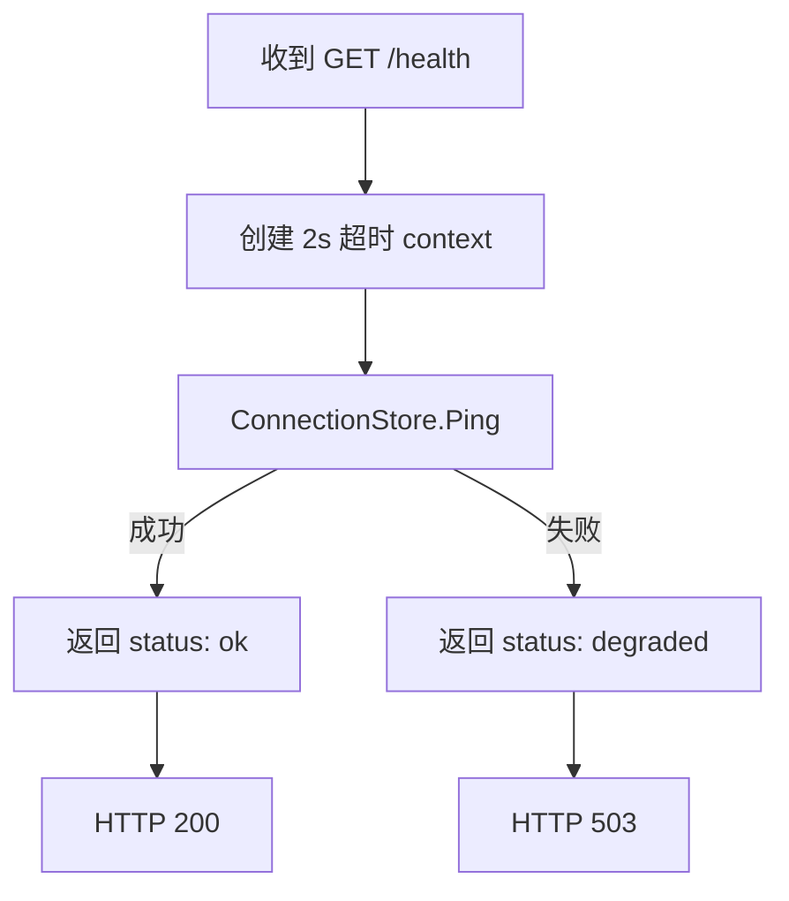

# WebSocket 连接管理业务流程

本文档描述 Xyncra WebSocket 服务的完整连接生命周期，包括连接建立、消息收发、心跳保活、广播分发及优雅关闭等核心流程。

> **注意**: `websocket-connection.md` 提供相同流程的详细 sequence diagram 和更全面的边缘场景分析。两文档内容有重叠，以 `websocket-connection.md` 为权威来源。本文档提供 flowchart 视图的高层概览。心跳（第 6 节）和广播（第 7 节）的完整流程分别见 `heartbeat.md` 和 `broadcasting.md`。

---

## 目录

1. [连接建立](#1-连接建立)
2. [设备替换](#2-设备替换)
3. [消息接收与分发](#3-消息接收与分发)
4. [消息发送](#4-消息发送)
5. [连接断开与清理](#5-连接断开与清理)
6. [心跳保活](#6-心跳保活)
7. [广播更新](#7-广播更新)
8. [服务器生命周期](#8-服务器生命周期)
9. [健康检查](#9-健康检查)

---

## 1. 连接建立

客户端通过 HTTP 升级握手建立 WebSocket 连接，服务端验证身份、注册连接到内存索引和 Redis 存储。

### 流程图

### 详细步骤

1. 客户端发送 HTTP 请求到 `/ws` 路径，携带 `user_id` 和 `device_id` 查询参数
2. `handleWebSocket` 调用 `authenticate` 函数提取并验证 `user_id`（默认从 query 参数提取），失败返回 HTTP 401
3. 提取 `device_id`，若缺失则自动生成 UUID v4
4. 检查 `device_id` 长度是否超过 255 字符，过长返回 HTTP 400
5. 查询 `clientsByDevice` 索引，捕获同设备的旧连接
6. 若存在旧连接且 ReverseRPC 已配置，调用 `CancelDevice` 取消待处理的反向 RPC 请求（在 Upgrade 之前执行，避免取消新连接的请求）
7. 调用 `upgrader.Upgrade` 将 HTTP 连接升级为 WebSocket（`CheckOrigin` 始终返回 true，CORS 由反向代理处理）
8. 创建 `ws.connection` 追踪 span（覆盖整个连接生命周期）
9. 生成唯一 `connID`（UUID v4），创建 `Client` 实例，注入连接上下文（`WithContext(connCtx)`）
10. 原子性更新三个本地索引：`clients`、`clientsByUser`、`clientsByDevice`，同时从 `clientsByDevice` 移除旧连接引用并调用 `cancelPendingFuncCleanup` 取消待执行的函数清理
11. 若存在旧连接，异步启动 `performDeviceReplacement` 协程（发送 4001 close frame 给旧连接）
12. 调用 `extractIP` 提取客户端 IP（优先 `X-Forwarded-For`），构建 `ConnectionInfo`
13. 若配置了 `connectionInfoEnricher`，调用它从 HTTP 请求填充额外字段
14. 调用 `ConnectionStore.Add` 注册到 Redis（`luaAdd` Lua 脚本原子操作：GET infoKey 读取旧数据检查存在 + 获取旧 UserID，新连接检查 `MaxConnectionsPerUser` 限制，UserID 变更时 SREM 旧 userKey + 检查新用户限制，SET infoKey JSON PX ttl，SADD userKey connID，PTTL userKey 对齐 TTL）。若失败，关闭连接、移除本地索引并返回
15. 调用 `client.Run()` 阻塞等待客户端断开

### 边缘场景

| 场景 | 处理方式 |
|------|----------|
| `device_id` 缺失 | 自动生成 UUID，记录日志 |
| `device_id` 过长（>255 字符） | 返回 HTTP 400 |
| 认证失败（`user_id` 缺失或 authenticate 返回错误） | 返回 HTTP 401 |
| 同设备重复连接 | 触发设备替换流程，旧连接收到 4001 close frame |
| `ConnectionStore.Add` 失败（如 MaxConnectionsExceeded） | 关闭连接，移除本地索引，连接不建立 |
| Redis 不可达导致 `ConnectionStore.Add` 失败 | 同上：关闭连接，移除本地索引，连接不建立 |
| MaxConnectionsPerUser 超限 | Lua 脚本原子检查（避免 TOCTOU 竞争），返回 -1，`Add` 返回 `ErrMaxConnectionsExceeded` |
| Upgrade 失败但 `CancelDevice` 已执行 | 直接返回，旧连接的待处理 RPC 被不必要取消但旧连接本身不受影响 |

---

## 2. 设备替换

当同一设备建立新连接时，旧连接被优雅关闭并清理。

### 流程图

### 详细步骤

1. 在 Upgrade 前捕获 `clientsByDevice[deviceKey]` 中的所有旧连接
2. 调用 `reverseRPC.CancelDevice` 取消旧设备的待处理请求（在 Upgrade 之前执行，避免取消新连接到达后注册的请求）
3. 执行 WebSocket Upgrade
4. 原子性地从 `clientsByDevice` 中移除旧连接 ID，添加新连接 ID；同时调用 `cancelPendingFuncCleanup` 取消待执行的函数清理
5. 异步启动 `performDeviceReplacement` 协程（不跟踪 WaitGroup，best-effort）：发送 4001 close frame 给旧连接（WriteControl 超时 5s）
6. 等待 10ms 确保 TCP 发送缓冲区刷新（防止 FIN 先于 close frame 到达客户端）
7. 调用 `oldClient.Close()` 关闭旧连接
8. 等待旧连接的 goroutine 退出（超时 500ms）
9. 调用 `removeClient` 清理旧连接的本地索引
10. `ConnectionStore.Remove` 由旧连接自身的 `handleWebSocket` defer 完成，`performDeviceReplacement` 中不重复调用

### 边缘场景

| 场景 | 处理方式 |
|------|----------|
| 旧连接写入 4001 close frame 失败 | 记录错误，继续关闭 |
| 旧连接 goroutine 未在 500ms 内退出 | 超时后继续 |
| 旧连接的 `handleWebSocket` defer 中的 `ConnectionStore.Remove` 仍会执行 | 最终一致性保证 |
| 新旧连接的 `connID` 不同 | `removeClient` 不会误删新连接 |
| `performDeviceReplacement` 协程未在优雅关闭期间完成 | 设计决策：best-effort，本地 map 是路由的 source of truth |

---

## 3. 消息接收与分发

服务端读取客户端消息，解码后按类型分发到对应处理器。

### 流程图

### 详细步骤

1. `readPump` 循环调用 `conn.ReadMessage()` 读取消息
2. 设置读取限制（默认 64KiB）和读取截止时间（`pongWait` 默认 60s），注册 Pong handler 刷新截止时间
3. 调用 `unmarshalPackage` 解码为 `protocol.Package`，解码失败则记录错误并跳过
4. 从 PackageData 中提取 method 名称（best-effort，用于 span 属性）
5. 启动 `ws.message.receive` 追踪 span
6. 调用 `MessageHandler.HandleMessage` 分发：
   - `PackageTypeRequest`：解析 `PackageDataRequest`，启动 `handler.invoke` span，查找注册的 `MethodHandler`，执行并返回响应
   - `PackageTypeResponse`：解码后转发给 `ReverseRPC.DispatchResponse`
   - `PackageTypeUpdates`：记录日志（预留）
   - 未知类型：记录警告日志
7. 对于 Request 类型，执行 `handleRequest`：查找 method 对应的 handler，未找到则使用 fallback handler；若均未配置，返回 unknown method 错误
8. 执行 handler，根据返回类型构建响应：
   - 成功：返回 `ResponseCodeOK` 响应
   - `HandlerError`：返回带自定义错误码的响应
   - 普通 `error`：返回 `ResponseCodeError` 通用错误响应

### 边缘场景

| 场景 | 处理方式 |
|------|----------|
| 消息超过 maxMessageSize | WebSocket 库返回错误，连接关闭 |
| 消息解码失败 | 记录错误，跳过该消息继续读取 |
| Request 数据解析失败（无效 JSON） | 发送 `ResponseCodeError` "invalid request data" 响应 |
| 未知 method 且无 fallback handler | 返回 unknown method 错误响应 |
| Handler 执行错误 | 区分 `HandlerError`（带自定义错误码）和普通 `error`（通用错误码） |
| Pong 超时（默认 60s） | 读取截止时间到期，ReadMessage 返回错误，readPump 退出 |
| 意外关闭（非正常断开） | 记录 Error 级别日志；正常断开记录 Debug 级别 |
| Response 数据解码失败（Response 内层 JSON 无效） | 记录错误，跳过（不转发给 ReverseRPC） |
| Response 无匹配的 pending 请求 | `DispatchResponse` 静默忽略（超时后的迟到响应） |

---

## 4. 消息发送

服务端通过写协程将消息异步发送到客户端。

### 流程图

### 详细步骤

1. 调用 `client.Send(msg)` 或 `client.SendPackage(pkg)`
2. 检查 `closed` 状态（`mu.Lock` 保护），若已关闭返回 `ErrClientClosed`
3. 将消息放入带缓冲的 send channel（默认容量 256，`defaultSendBufSize = 256`），channel 满时返回 `ErrSendBufferFull`
4. `writePump` 运行 select 循环，四路分支：
   - **send channel（消息到达）**：读取消息，设置写入截止时间（默认 10s），调用 `conn.NextWriter` 获取写入器，写入内容并关闭写入器
   - **send channel（已关闭）**：`ok` 为 false 时发送 close frame 后退出（防御性路径，正常流程中 channel 不会关闭）
   - **ticker.C**：发送 Ping 消息（默认 54s 间隔 = `pongWait * 9 / 10`）
   - **ctx.Done**：发送 close frame 后退出
5. send channel 设计为不关闭：避免与并发 `Send` 产生 send-on-closed-channel panic

### 边缘场景

| 场景 | 处理方式 |
|------|----------|
| send channel 满 | 返回 `ErrSendBufferFull`，消息丢弃 |
| 写入超时（NextWriter/Write 失败） | `writePump` 退出，defer 关闭底层连接 |
| 连接已关闭但 channel 未清空 | `writePump` 通过 ctx 取消退出，不读取残留消息 |
| `Close()` 和 `writePump` 并发写入 | 通过 context 取消协调，`writePump` 在 ctx.Done 分支发送 close frame 后退出 |
| send channel 关闭 | 设计决策：send channel 永不关闭，`writePump` 仅通过 ctx 退出 |

---

## 5. 连接断开与清理

客户端断开后，清理内存索引和 Redis 存储。

### 流程图

### 详细步骤

1. `readPump` 检测到读取错误后退出
2. `readPump` 的 defer 调用 `client.Close()`
3. `client.Close()` 取消 context，关闭底层 WebSocket 连接
4. `writePump` 检测到 context 取消，发送 close frame 后退出
5. `Run()` 中的 WaitGroup 等待两个 pump 退出，关闭 done channel
6. `handleWebSocket` 从 `client.Run()` 返回
7. 使用 5s 超时 context 调用 `ConnectionStore.Remove` 清理 Redis（`luaRemove` Lua 脚本原子删除 infoKey + SREM userKey connID，随后 `luaCleanupEmptySet` 原子清理空 SET 防止孤儿 key）
8. 调用 `removeClient` 从 `clients`、`clientsByUser`、`clientsByDevice` 中移除
9. 检查设备是否还有其他连接，若无则调用 `scheduleFuncCleanup` 延迟清理 `FunctionRegistry`（宽限期默认 10s，期间重连则取消清理）
10. 检查设备是否还有其他连接，若无则调用 `reverseRPC.CancelDeviceWithReason`

### 边缘场景

| 场景 | 处理方式 |
|------|----------|
| Redis 不可达 | `ConnectionStore.Remove` 超时（5s），记录错误 |
| 旧连接的 `performDeviceReplacement` 协程仍在运行 | 通过 `connID` 隔离，不影响新连接 |
| `Close()` 被多次调用 | 幂等，`closed` 标志防止重复操作 |
| send channel 不被关闭 | 设计决策：避免与并发 `Send` 产生 panic |
| 设备断开后 10s 内重连 | `cancelPendingFuncCleanup` 取消待执行的清理，避免误删函数注册 |
| 设备替换后旧连接断开 | `hasActiveConn` 为 true，跳过 `scheduleFuncCleanup` 和 `CancelDeviceWithReason` |

---

## 6. 心跳保活

客户端定期发送心跳，服务端刷新连接 TTL 保活。

### 流程图

### 详细步骤

1. 客户端发送 `PackageTypeRequest`，method 为 `heartbeat`
2. `DefaultMessageHandler` 路由到 `heartbeatHandler`
3. 解析可选的 `device_info` 参数（仅记录日志）
4. 调用 `ConnectionStore.Refresh(connID)` 重置 TTL
5. `Refresh` 内部执行两步操作（共 2 次 Redis round-trip）：
   - **GET infoKey**：读取连接 info key 的 JSON 数据，获取 TTL 配置和 UserID
     - 若 key 不存在（`redis.Nil`），立即返回 `ErrConnectionNotFound`
     - 若 JSON 反序列化失败（数据损坏），立即返回错误
   - **Lua 脚本**（`luaRefresh`，原子执行，1 次 round-trip）：
     - `EXISTS infoKey`：再次检查连接是否存在（防止 GET 与 Lua 之间 key 被淘汰），不存在则返回 0
     - `PEXPIRE infoKey`：重置连接 info key 的 TTL（毫秒精度）
     - `PTTL userKey`：读取 user SET key 的当前剩余 TTL
     - `PEXPIRE userKey`：仅当新 TTL 大于当前 TTL 时才更新（MAX 语义）
   - 若 Lua 返回 0：连接在 GET 与 Lua 之间过期，返回 `ErrConnectionNotFound`
6. 返回 `PackageDataResponse{ID, Code: ResponseCodeOK, Msg: "ok", Data: {"status": "ok"}}` 响应

### OpenTelemetry

| Span                    | 属性   | 说明                                                              |
| ----------------------- | ------ | ----------------------------------------------------------------- |
| `redis.connection.refresh` | `connID` | Redis 实现的 Refresh 操作会创建 OpenTelemetry span，记录连接 ID 和操作结果 |

### 边缘场景

| 场景 | 处理方式 |
|------|----------|
| 连接已过期/被清除（GET 时 info key 不存在，`redis.Nil`） | 返回 `NotFoundError("connection expired")`，客户端应重新连接 |
| 连接在 GET 与 Lua 之间过期（Lua `EXISTS` 返回 0） | 返回 `NotFoundError("connection expired")` |
| info key 数据损坏（JSON 反序列化失败） | 返回 `InternalError` |
| Redis 不可达（连接失败或超时） | 返回 `InternalError`，由 `classifyRedisError` 分类（`ErrRedisConnectionFailed` 或 `ErrRedisTimeout`） |
| `device_info` 解析失败 | 忽略，不影响心跳处理（宽容解析） |
| 心跳参数缺失 | 有效心跳，无参数也正常处理 |

---

## 7. 广播更新

服务端向用户的所有连接广播更新消息，支持跨节点分发。

### 流程图

### 详细步骤

1. 调用 `BroadcastUpdates(userID, updates)`
2. 创建 `handler.broadcast` 追踪 span
3. 本地广播：`broadcastLocal` 在 `mu.RLock` 下从 `clientsByUser[userID]` 复制一份 Client 引用切片后立即释放读锁，然后在锁外遍历逐个调用 `client.SendPackage` 发送（避免持锁期间 Send 阻塞影响其他并发操作）
4. 遍历调用 `client.SendPackage` 发送
5. 跨节点广播：`nodeBroadcaster.Publish` 发布到 Redis Pub/Sub，携带 `sourceNodeID`
6. 远程消息接收：`handleRemoteBroadcast` 被 `NodeBroadcaster.Subscribe` 回调调用，检查 `sourceNodeID == s.nodeID` 则跳过（避免本地重复投递），否则以 `context.Background()` 调用 `broadcastLocal` 将更新推送给本节点上该用户的所有连接

### 边缘场景

| 场景 | 处理方式 |
|------|----------|
| `updates` 为 nil | 返回错误 |
| 用户无本地连接 | 跳过本地广播 |
| 本地发送部分失败 | 记录错误，继续发送其他连接 |
| Pub/Sub 发布失败 | 记录错误，不返回错误（fire-and-forget 策略） |
| 远程消息来源是本机 | 跳过（避免重复投递） |
| `sendToUser` 部分连接发送失败 | 只要至少一个连接发送成功即返回 nil（用于 ReverseRPC 路由） |
| `sendToDevice` 目标设备离线 | 返回 `ErrDeviceOffline`，不进入 pending 持久化逻辑 |

---

## 8. 服务器生命周期

WebSocket 服务器的启动、运行和关闭流程。

### 流程图

### 详细步骤

#### 启动流程 (Start)

1. `NewWebSocketServer` 创建服务器实例，配置依赖注入（连接存储、认证函数、消息处理器、NodeBroadcaster、FunctionRegistry 等）
2. `Start(ctx)` 启动服务器：创建 HTTP mux，注册 `/ws`、`/health` 路由及额外路由（`extraRoutes`，如 `/metrics`）
3. 绑定 TCP 监听器
4. 启动 HTTP 服务器协程（`httpServer.Serve`），错误通过 channel 传递
5. 启动 Pub/Sub 订阅协程（`nodeBroadcaster.Subscribe`，阻塞直到 ctx 取消）
6. 调用 `BaseServer.Start` 阻塞等待 context 取消

#### 关闭流程 (Start 内部)

1. context 取消后，`httpServer.Shutdown`（5s 超时）停止接受新连接
2. 调用 `closeAllClients`：内部先调用 `reverseRPC.CancelAll()`，收集所有 client 引用，在单次锁获取中原子重置所有索引（`clients`、`clientsByUser`、`clientsByDevice`），再逐个 `Close()` 所有客户端并等待 5s
3. 检查 HTTP 服务器的意外错误（非 `http.ErrServerClosed`），若存在则返回
4. `Start()` 返回

#### 关闭流程 (GracefulStop)

1. 关闭 `NodeBroadcaster` 释放 Pub/Sub 资源
2. 调用 `BaseServer.GracefulStop`：`Stop()` 取消 context，等待 `Start()` 返回的 done channel

### 边缘场景

| 场景 | 处理方式 |
|------|----------|
| 重复调用 Start | 返回 `ErrServerAlreadyRunning` |
| Context 已取消 | 返回 context 错误 |
| 监听器绑定失败 | 返回错误 |
| GracefulStop 超时 | 返回超时错误 |
| `closeAllClients` 等待超时（5s） | 记录错误，强制继续 |

---

## 9. 健康检查

服务端响应 `/health` 请求，检查依赖状态。

### 流程图

### 详细步骤

1. 收到 `GET /health` 请求
2. 使用 2s 超时 context 调用 `ConnectionStore.Ping`
3. 若 Ping 成功：返回 `{"status": "ok", "connections": N}`
4. 若 Ping 失败：返回 `{"status": "degraded", "connections": N}`，HTTP 503

### 边缘场景

| 场景 | 处理方式 |
|------|----------|
| Redis 不可达 | 返回 degraded 状态 |
| 超时 | 2s 后返回 degraded 状态 |

---

## 附录：关键关闭码

| Close Code | 含义 | 使用场景 |
|------------|------|----------|
| 4001 | 设备替换 | 同设备新连接建立时，旧连接收到此码 |
| 1000 | 正常关闭 | 服务端主动关闭连接 |
| 1001 | Going Away | 服务器关闭 |
