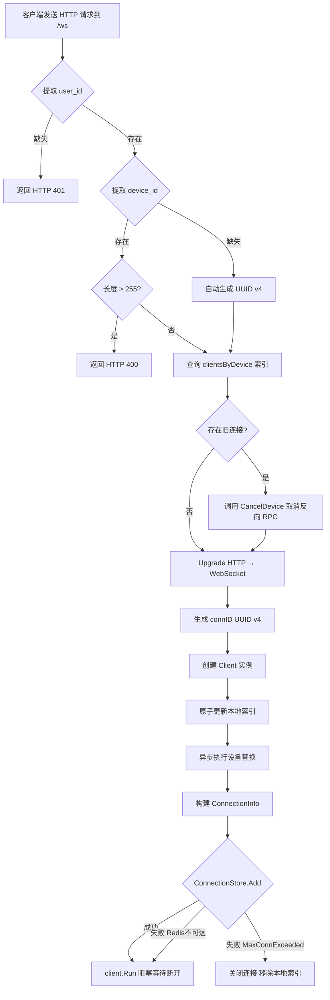
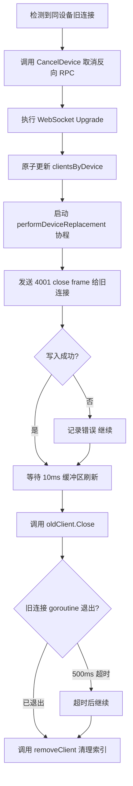
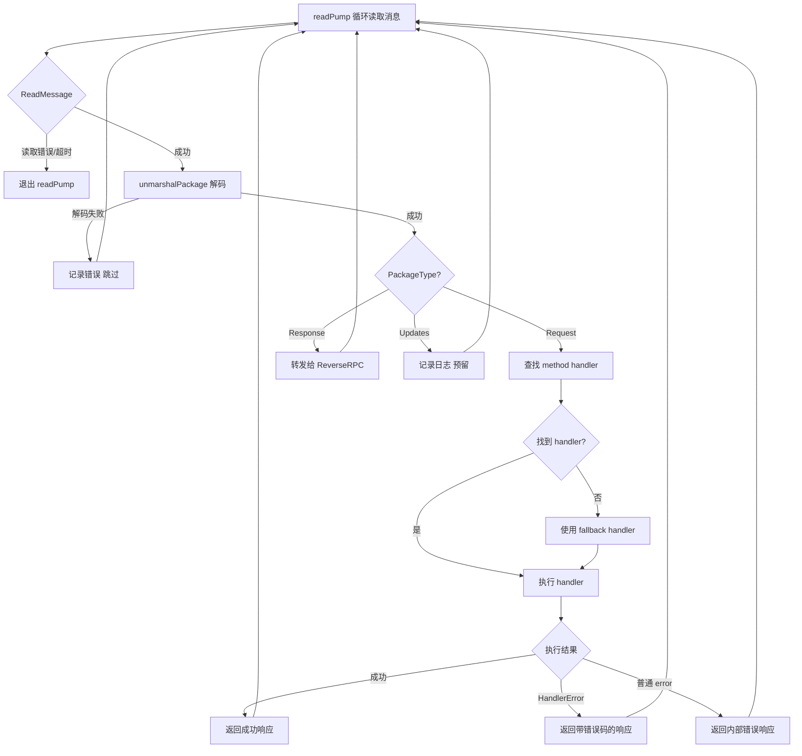
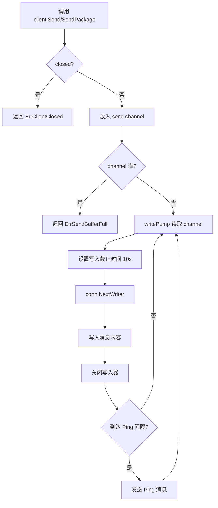
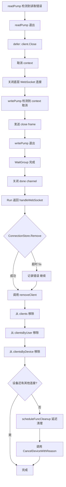
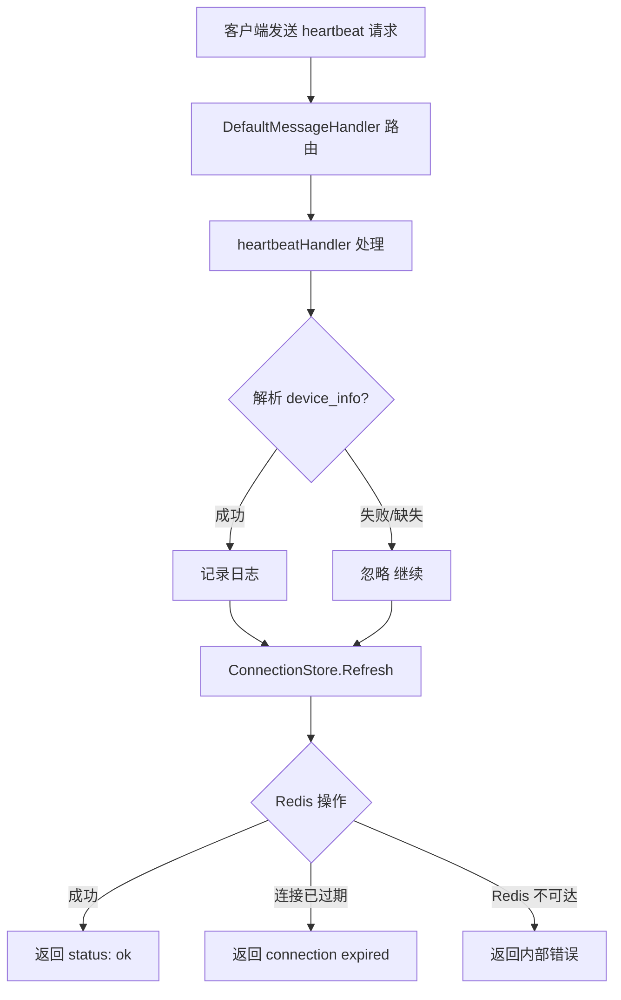
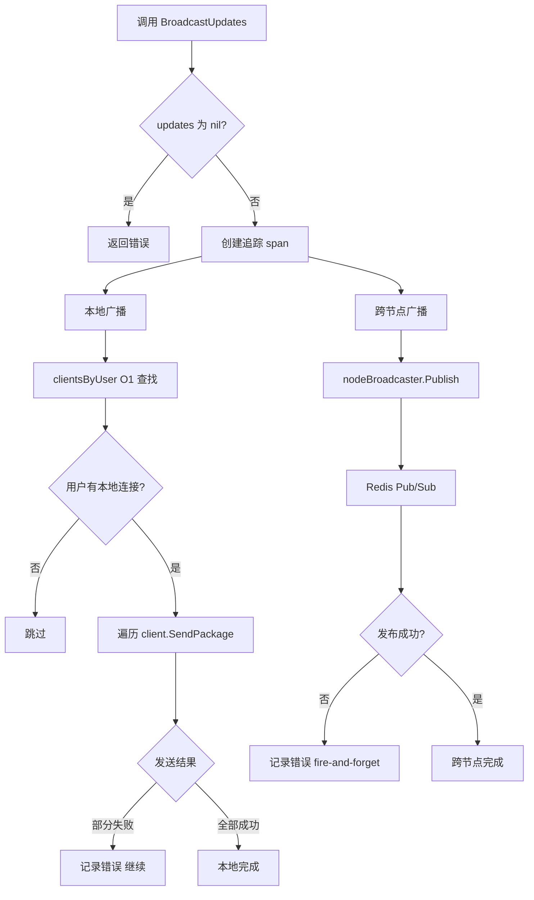
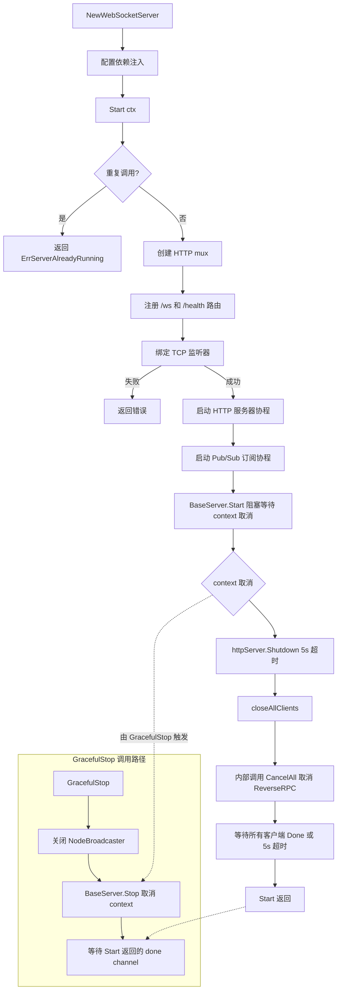
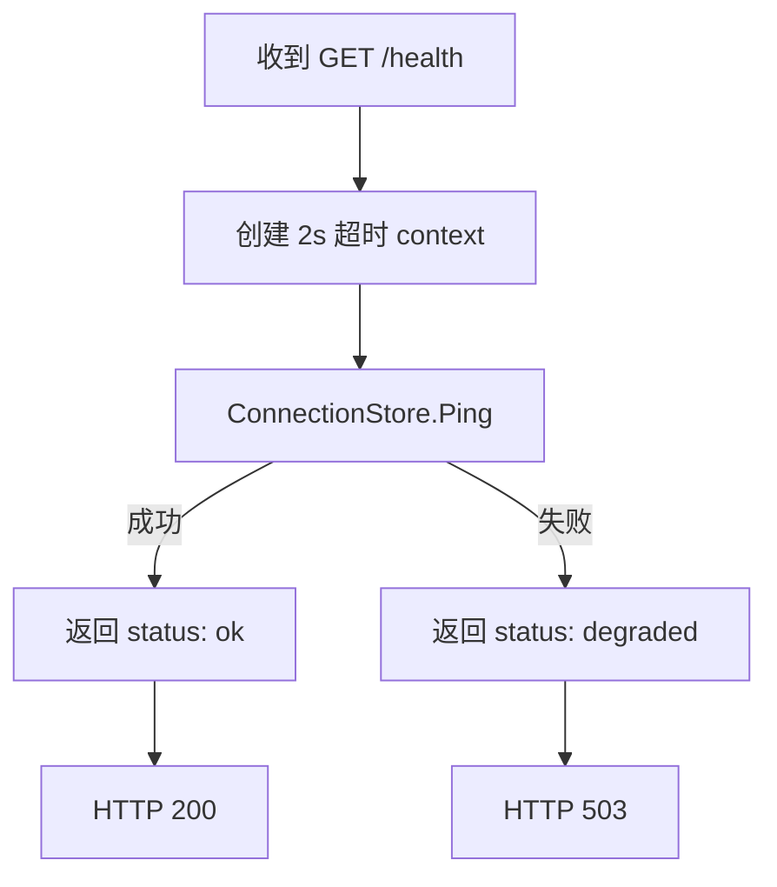

# WebSocket 连接管理业务流程

本文档描述 Xyncra WebSocket 服务的完整连接生命周期，包括连接建立、消息收发、心跳保活、广播分发及优雅关闭等核心流程。

---

## 目录

1. [连接建立](#1-连接建立)
2. [设备替换](#2-设备替换)
3. [消息接收与分发](#3-消息接收与分发)
4. [消息发送](#4-消息发送)
5. [连接断开与清理](#5-连接断开与清理)
6. [心跳保活](#6-心跳保活)
7. [广播更新](#7-广播更新)
8. [服务器生命周期](#8-服务器生命周期)
9. [健康检查](#9-健康检查)

---

## 1. 连接建立

客户端通过 HTTP 升级握手建立 WebSocket 连接，服务端验证身份、注册连接到内存索引和 Redis 存储。

### 流程图

### 详细步骤

1. 客户端发送 HTTP 请求到 `/ws` 路径，携带 `user_id` 和 `device_id` 查询参数
2. `handleWebSocket` 调用 `authenticate` 函数提取并验证 `user_id`（默认从 query 参数提取）
3. 提取 `device_id`，若缺失则自动生成 UUID v4
4. 检查 `device_id` 长度是否超过 255 字符
5. 查询 `clientsByDevice` 索引，捕获同设备的旧连接
6. 若存在旧连接且 ReverseRPC 已配置，调用 `CancelDevice` 取消待处理的反向 RPC 请求
7. 调用 `upgrader.Upgrade` 将 HTTP 连接升级为 WebSocket
8. 生成唯一 `connID`（UUID v4）
9. 创建 `Client` 实例，注入连接上下文和配置选项
10. 原子性更新三个本地索引：`clients`、`clientsByUser`、`clientsByDevice`
11. 异步执行设备替换（发送 4001 close frame 给旧连接）
12. 构建 `ConnectionInfo` 并调用 `ConnectionStore.Add` 注册到 Redis
13. 调用 `client.Run()` 阻塞等待客户端断开

### 边缘场景

| 场景 | 处理方式 |
|------|----------|
| `device_id` 缺失 | 自动生成 UUID，记录日志 |
| `device_id` 过长（>255 字符） | 返回 HTTP 400 |
| 认证失败（`user_id` 缺失） | 返回 HTTP 401 |
| 同设备重复连接 | 触发设备替换流程，旧连接收到 4001 close frame |
| `ConnectionStore.Add` 失败（如 MaxConnectionsExceeded） | 关闭连接，移除本地索引 |
| Redis 不可达 | 连接仍可建立但仅限本地使用 |
| MaxConnectionsPerUser 超限 | Lua 脚本原子检查，返回 -1 |

---

## 2. 设备替换

当同一设备建立新连接时，旧连接被优雅关闭并清理。

### 流程图

### 详细步骤

1. 在 Upgrade 前捕获 `clientsByDevice[deviceKey]` 中的所有旧连接
2. 调用 `reverseRPC.CancelDevice` 取消旧设备的待处理请求
3. 执行 WebSocket Upgrade
4. 原子性地从 `clientsByDevice` 中移除旧连接 ID，添加新连接 ID
5. 异步启动 `performDeviceReplacement` 协程：发送 4001 close frame 给旧连接
6. 等待 10ms 确保 TCP 发送缓冲区刷新
7. 调用 `oldClient.Close()` 关闭旧连接
8. 等待旧连接的 goroutine 退出（超时 500ms）
9. 调用 `removeClient` 清理旧连接的本地索引

### 边缘场景

| 场景 | 处理方式 |
|------|----------|
| 旧连接写入 4001 close frame 失败 | 记录错误，继续关闭 |
| 旧连接 goroutine 未在 500ms 内退出 | 超时后继续 |
| 旧连接的 `handleWebSocket` defer 中的 `ConnectionStore.Remove` 仍会执行 | 最终一致性保证 |
| 新旧连接的 `connID` 不同 | `removeClient` 不会误删新连接 |

---

## 3. 消息接收与分发

服务端读取客户端消息，解码后按类型分发到对应处理器。

### 流程图

### 详细步骤

1. `readPump` 循环调用 `conn.ReadMessage()` 读取消息
2. 设置读取限制（默认 64KiB）和读取截止时间
3. 调用 `unmarshalPackage` 解码为 `protocol.Package`
4. 启动 `ws.message.receive` 追踪 span
5. 调用 `MessageHandler.HandleMessage` 分发：
   - `PackageTypeRequest`：解析 `PackageDataRequest`，查找注册的 `MethodHandler`，执行并返回响应
   - `PackageTypeResponse`：转发给 `ReverseRPC.DispatchResponse`
   - `PackageTypeUpdates`：记录日志（预留）
6. 对于 Request 类型，执行 `handleRequest`：查找 method 对应的 handler，未找到则使用 fallback handler
7. 执行 handler，返回成功或错误响应

### 边缘场景

| 场景 | 处理方式 |
|------|----------|
| 消息超过 maxMessageSize | WebSocket 库返回错误，连接关闭 |
| 消息解码失败 | 记录错误，跳过该消息继续读取 |
| 未知 method | 返回 unknown method 错误响应 |
| Handler 执行错误 | 区分 `HandlerError`（带错误码）和普通 `error` |
| Pong 超时（默认 60s） | 读取截止时间到期，连接关闭 |

---

## 4. 消息发送

服务端通过写协程将消息异步发送到客户端。

### 流程图

### 详细步骤

1. 调用 `client.Send(msg)` 或 `client.SendPackage(pkg)`
2. 检查 `closed` 状态，若已关闭返回 `ErrClientClosed`
3. 将消息放入带缓冲的 send channel（默认 256）
4. `writePump` 从 channel 读取消息
5. 设置写入截止时间（默认 10s）
6. 调用 `conn.NextWriter` 获取写入器
7. 写入消息内容并关闭写入器
8. 定期发送 Ping 消息（默认 54s 间隔）

### 边缘场景

| 场景 | 处理方式 |
|------|----------|
| send channel 满 | 返回 `ErrSendBufferFull`，消息丢弃 |
| 写入超时 | `writePump` 退出，触发连接关闭 |
| 连接已关闭但 channel 未清空 | 消息被 `writePump` 丢弃 |
| `Close()` 和 `writePump` 并发写入 | 通过 context 取消协调，`writePump` 发送 close frame 后退出 |

---

## 5. 连接断开与清理

客户端断开后，清理内存索引和 Redis 存储。

### 流程图

### 详细步骤

1. `readPump` 检测到读取错误后退出
2. `readPump` 的 defer 调用 `client.Close()`
3. `client.Close()` 取消 context，关闭底层 WebSocket 连接
4. `writePump` 检测到 context 取消，发送 close frame 后退出
5. `Run()` 中的 WaitGroup 等待两个 pump 退出，关闭 done channel
6. `handleWebSocket` 从 `client.Run()` 返回
7. 使用 5s 超时 context 调用 `ConnectionStore.Remove` 清理 Redis
8. 调用 `removeClient` 从 `clients`、`clientsByUser`、`clientsByDevice` 中移除
9. 检查设备是否还有其他连接，若无则调用 `scheduleFuncCleanup` 延迟清理 `FunctionRegistry`（宽限期默认 10s，期间重连则取消清理）
10. 检查设备是否还有其他连接，若无则调用 `reverseRPC.CancelDeviceWithReason`

### 边缘场景

| 场景 | 处理方式 |
|------|----------|
| Redis 不可达 | `ConnectionStore.Remove` 超时（5s），记录错误 |
| 旧连接的 `performDeviceReplacement` 协程仍在运行 | 通过 `connID` 隔离，不影响新连接 |
| `Close()` 被多次调用 | 幂等，`closed` 标志防止重复操作 |
| send channel 不被关闭 | 设计决策：避免与并发 `Send` 产生 panic |
| 设备断开后 10s 内重连 | `cancelPendingFuncCleanup` 取消待执行的清理，避免误删函数注册 |
| 设备替换后旧连接断开 | `hasActiveConn` 为 true，跳过 `scheduleFuncCleanup` 和 `CancelDeviceWithReason` |

---

## 6. 心跳保活

客户端定期发送心跳，服务端刷新连接 TTL 保活。

### 流程图

### 详细步骤

1. 客户端发送 `PackageTypeRequest`，method 为 `heartbeat`
2. `DefaultMessageHandler` 路由到 `heartbeatHandler`
3. 解析可选的 `device_info` 参数（仅记录日志）
4. 调用 `ConnectionStore.Refresh(connID)` 重置 TTL
5. `Refresh` 使用 Lua 脚本原子操作：
   - 检查 info key 是否存在
   - 重置 info key 的 TTL
   - 重置 user SET 的 TTL（MAX 语义）
6. 返回 `{"status": "ok"}` 响应

### 边缘场景

| 场景 | 处理方式 |
|------|----------|
| 连接已过期/被清除 | 返回 connection expired 错误，客户端应重新连接 |
| Redis 不可达 | 返回内部错误 |
| `device_info` 解析失败 | 忽略，不影响心跳处理（宽容解析） |
| 心跳参数缺失 | 有效心跳，无参数也正常处理 |

---

## 7. 广播更新

服务端向用户的所有连接广播更新消息，支持跨节点分发。

### 流程图

### 详细步骤

1. 调用 `BroadcastUpdates(userID, updates)`
2. 创建 `handler.broadcast` 追踪 span
3. 本地广播：`broadcastLocal` 通过 `clientsByUser[userID]` O(1) 查找用户所有连接
4. 遍历调用 `client.SendPackage` 发送
5. 跨节点广播：`nodeBroadcaster.Publish` 发布到 Redis Pub/Sub，携带 `sourceNodeID`

### 边缘场景

| 场景 | 处理方式 |
|------|----------|
| `updates` 为 nil | 返回错误 |
| 用户无本地连接 | 跳过本地广播 |
| 本地发送部分失败 | 记录错误，继续发送其他连接 |
| Pub/Sub 发布失败 | 记录错误，不返回错误（fire-and-forget 策略） |
| 远程消息来源是本机 | 跳过（避免重复投递） |

---

## 8. 服务器生命周期

WebSocket 服务器的启动、运行和关闭流程。

### 流程图

### 详细步骤

#### 启动流程 (Start)

1. `NewWebSocketServer` 创建服务器实例，配置依赖注入
2. `Start(ctx)` 启动服务器：创建 HTTP mux，注册 `/ws` 和 `/health` 路由
3. 绑定 TCP 监听器
4. 启动 HTTP 服务器协程
5. 启动 Pub/Sub 订阅协程
6. 调用 `BaseServer.Start` 阻塞等待 context 取消

#### 关闭流程 (Start 内部)

1. context 取消后，`httpServer.Shutdown`（5s 超时）停止接受新连接
2. 调用 `closeAllClients`：内部先调用 `reverseRPC.CancelAll()`，再关闭所有客户端并等待 5s
3. `Start()` 返回

#### 关闭流程 (GracefulStop)

1. 关闭 `NodeBroadcaster` 释放 Pub/Sub 资源
2. 调用 `BaseServer.GracefulStop`：`Stop()` 取消 context，等待 `Start()` 返回的 done channel

### 边缘场景

| 场景 | 处理方式 |
|------|----------|
| 重复调用 Start | 返回 `ErrServerAlreadyRunning` |
| Context 已取消 | 返回 context 错误 |
| 监听器绑定失败 | 返回错误 |
| GracefulStop 超时 | 返回超时错误 |
| `closeAllClients` 等待超时（5s） | 记录错误，强制继续 |

---

## 9. 健康检查

服务端响应 `/health` 请求，检查依赖状态。

### 流程图

### 详细步骤

1. 收到 `GET /health` 请求
2. 使用 2s 超时 context 调用 `ConnectionStore.Ping`
3. 若 Ping 成功：返回 `{"status": "ok", "connections": N}`
4. 若 Ping 失败：返回 `{"status": "degraded", "connections": N}`，HTTP 503

### 边缘场景

| 场景 | 处理方式 |
|------|----------|
| Redis 不可达 | 返回 degraded 状态 |
| 超时 | 2s 后返回 degraded 状态 |

---

## 附录：关键关闭码

| Close Code | 含义 | 使用场景 |
|------------|------|----------|
| 4001 | 设备替换 | 同设备新连接建立时，旧连接收到此码 |
| 1000 | 正常关闭 | 服务端主动关闭连接 |
| 1001 | Going Away | 服务器关闭 |
