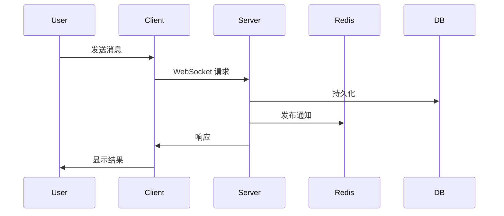
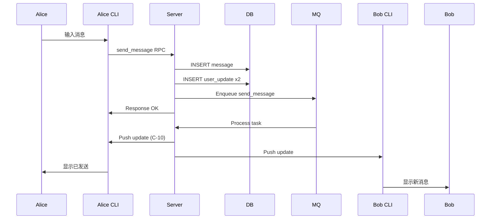

# 手动测试

## 何时使用手动测试

手动测试用于自动化测试难以覆盖的场景：

| 场景 | 自动化难点 | 手动测试价值 |
|------|-----------|-------------|
| 多设备真实网络交互 | 需要多个物理/虚拟设备 | 验证真实网络延迟、弱网表现 |
| CLI 交互体验 | 终端渲染、颜色、光标控制难以自动化 | 验证 CLI 用户体验 |
| Agent 真实 LLM 响应 | 响应不确定，无法精确断言 | 验证 Agent 回复质量 |
| 长时间运行稳定性 | 测试时间成本高 | 暴露内存泄漏、连接泄漏 |
| 安全审计 | 需要人工判断 | 发现授权绕过、信息泄露 |
| 复杂业务流程 | 多步骤组合爆炸 | 验证端到端业务正确性 |

### 决策流程

```
是否有自动化测试覆盖此场景？
  ├── 是 → 运行自动化测试，不需要手动
  └── 否 → 场景是否可自动化？
        ├── 是 → 优先编写自动化测试
        ├── 否 → 是否核心关键路径？
        │     ├── 是 → 编写手动测试用例
        │     └── 否 → 低优先级，暂不测试
        └── 不确定 → 先编写手动测试，后续迭代自动化
```

## 测试用例格式

每个手动测试用例遵循统一模板：

```markdown
# TC-{NNN}_{short_description}

## 测试信息
- **测试ID**: TC-{NNN}
- **测试名称**: {测试名称}
- **创建日期**: {YYYY-MM-DD}
- **测试人员**: {姓名}
- **优先级**: P0/P1/P2

## 测试目标
{简要描述测试验证的目标}

## 前置条件
1. {条件 1}
2. {条件 2}

## 测试环境
| 组件 | 版本 | 配置 |
|------|------|------|
| Xyncra Server | {版本} | {配置} |
| Xyncra Client | {版本} | {配置} |
| Redis | {版本} | {配置} |

## 测试步骤

### Step 1: {步骤名称}
1. {操作 1}
2. {操作 2}

**预期结果**：
- {预期结果 1}
- {预期结果 2}

**验证命令**：
```bash
{验证命令}
```

### Step 2: {步骤名称}
...

## 数据库验证

```sql
-- SQLite / PostgreSQL 验证查询
SELECT * FROM messages WHERE conversation_id = '...';
```

## 通过标准
- [ ] {标准 1}
- [ ] {标准 2}
- 所有标准满足 → **PASS**
- 任一标准不满足 → **FAIL**

## 失败记录
- **失败日期**: {YYYY-MM-DD}
- **失败原因**: {描述}
- **修复 Commit**: {hash}

## 流程图


```

## 现有测试用例目录

### TC-000: 全链路消息投递

**ID**: TC-000
**优先级**: P0
**状态**: 已执行

**场景描述**：多个用户通过 CLI 连接到同一台 Xyncra Server，模拟完整消息收发流程。验证消息从发送到接收的端到端正确性，包括实时推送和离线同步。

**关键步骤**：
1. 启动 Redis + Server
2. 用户 A（Alice）连接，发送消息到用户 B（Bob）
3. 使用第二个终端连接 Bob，验证收到实时推送
4. Bob 断连，Alice 再发消息
5. Bob 重连，使用 `sync_updates` 拉取离线消息

**流程图**：



---

### TC-001: 重传与幂等性

**ID**: TC-001
**优先级**: P1
**状态**: 已执行

**场景描述**：客户端使用相同的 `client_message_id` 重发消息，验证服务器正确识别重复消息并返回 `duplicate=true`，不创建重复记录。

**关键步骤**：
1. Alice 发送消息 `client_message_id: "msg-001"`
2. 记录服务器返回的 `message.id`
3. 使用相同 `client_message_id` 重发
4. 验证返回 `duplicate: true`，message.id 相同
5. 验证 DB 中只有一条记录

---

### TC-002: HITL 审批流程

**ID**: TC-002
**优先级**: P0
**状态**: 已执行

**场景描述**：Agent 在需要用户确认时发送 HITL 请求给连接中的客户端，用户选择批准或拒绝，Agent 根据选择继续或终止处理。

**关键步骤**：
1. 创建 Agent 会话
2. 用户发送触发 HITL 的消息（如"发送邮件"）
3. 客户端收到 `hitl.request_approval` 请求
4. 用户选择批准（`{approved: true}`）
5. Agent 收到确认后继续处理，完成回复
6. 验证回复内容包含用户确认的信息

---

### TC-003: 上下文管理

**ID**: TC-003
**优先级**: P1
**状态**: 已执行

**场景描述**：验证 Agent 在多轮对话中正确维护上下文历史，包括长上下文裁剪、消息顺序保持、以及上下文在服务重启后的恢复。

**关键步骤**：
1. 与 Agent 进行 5 轮对话
2. 验证 Agent 在后续轮次中引用历史信息
3. 验证 sync_updates 包含所有历史消息
4. 重启 Server，重连后验证上下文仍在

---

### TC-004: 子 Agent 委派

**ID**: TC-004
**优先级**: P1
**状态**: 已执行

**场景描述**：验证父 Agent 可以委派任务给子 Agent，子 Agent 执行后返回结果，父 Agent 整合输出给用户。

**关键步骤**：
1. 注册父 Agent（含子 Agent 引用）和子 Agent
2. 用户发送需要子 Agent 协助的消息
3. 父 Agent 调用子 Agent
4. 子 Agent 返回结果
5. 父 Agent 整合结果回复用户

---

### TC-005: 错误持久化

**ID**: TC-005
**优先级**: P1
**状态**: 已执行

**场景描述**：验证 Agent 在处理过程中遇到错误时，错误消息被正确持久化到数据库，用户可以通过 sync_updates 获取错误通知。

**关键步骤**：
1. 配置 Agent 使用无效的 API Key
2. 发送消息触发 Agent 处理
3. Agent 处理失败，生成错误消息
4. 验证 DB 中存在错误消息
5. 断连重连后 sync_updates 拉取到错误消息

---

### TC-006: 动态工具注册

**ID**: TC-006
**优先级**: P2
**状态**: 已执行

**场景描述**：验证在运行时向服务器注册新的客户端工具函数后，Agent 可以动态发现并使用这些工具。

**关键步骤**：
1. Agent 启动，加载初始工具集
2. 通过 `register_function` RPC 注册新函数
3. 发送触发新工具调用的消息
4. 验证 Agent 成功调用新工具
5. 验证工具结果被正确传递回 Agent

---

### TC-007: 多设备消息同步

**ID**: TC-007
**优先级**: P0
**状态**: 已规划

**场景描述**：同一用户在多台设备上登录，一台设备发送消息后，所有在线设备都收到实时推送，断连设备重连后通过 sync_updates 同步。

**关键步骤**：
1. 同一用户在设备 A、设备 B 上登录
2. 设备 A 发送消息
3. 设备 B 验证收到实时推送
4. 设备 C 离线后登录，验证 sync_updates 拉取到消息
5. 验证 unread_count 在所有设备上一致

## 如何添加新的手动测试用例

### 步骤

1. **确认必要性**：检查该场景是否已被自动化测试覆盖。如果是，直接运行自动化测试。

2. **分配 ID**：按顺序分配下一个可用的 TC 编号（当前最大 TC-007，下一个为 TC-008）。

3. **编写用例**：使用上述模板，包含：
   - 清晰的测试目标和通过标准
   - 精确的可执行步骤
   - 数据库验证查询（SQL）
   - Shell 命令验证（redis-cli、curl、xyncra-client）
   - Mermaid 流程图（可选但推荐）

4. **存储位置**：
   ```
   docs/testing/manual/tc-{NNN}_{short_description}.md
   ```
    > 注意：手动测试用例存储在 `docs/testing/manual/` 目录下，命名格式为 `tc-{NNN}_{short_description}.md`。该目录当前仅包含 `.gitkeep`，尚未填充正式的测试用例文件。
    >
    > 当前 `docs/testing/manual/` 目录仅包含 `.gitkeep` 占位文件，尚未填充实际的手动测试文档。新增用例时请按命名规范添加到此目录。

5. **执行与记录**：
   - 执行测试，记录结果
   - 失败时记录失败原因和修复 Commit
   - 成功时标记为 PASS

### 用例模板文件

```bash
# 创建新用例
cat > docs/testing/manual/tc-008_my_new_scenario.md << 'TEMPLATE'
# TC-008: 新场景名称

## 测试信息
- **测试ID**: TC-008
...

TEMPLATE
```

### 验证标准

所有手动测试用例必须满足：

1. **可复现性**：任何测试人员按照步骤能得到相同结果
2. **独立性**：不依赖其他测试用例的执行结果
3. **明确性**：通过/失败标准不含糊
4. **安全性**：不包含真实凭据、密钥或敏感数据
5. **可回溯**：关联到具体的产品决策（D-NNN）或需求

## 测试报告

每次手动测试执行后，结果记录在 `docs/testing/reports/`：

```bash
# 报告格式
docs/testing/reports/
├── e2e-manual-test-report-{YYYY-MM-DD}.md
└── e2e-manual-test-report-round2-{YYYY-MM-DD}.md
```

报告包含：
- 测试摘要（通过/失败/警告计数）
- 每个场景的详细结果
- 发现的 Bug 列表（含严重度、位置、复现步骤）
- 修复验证状态
